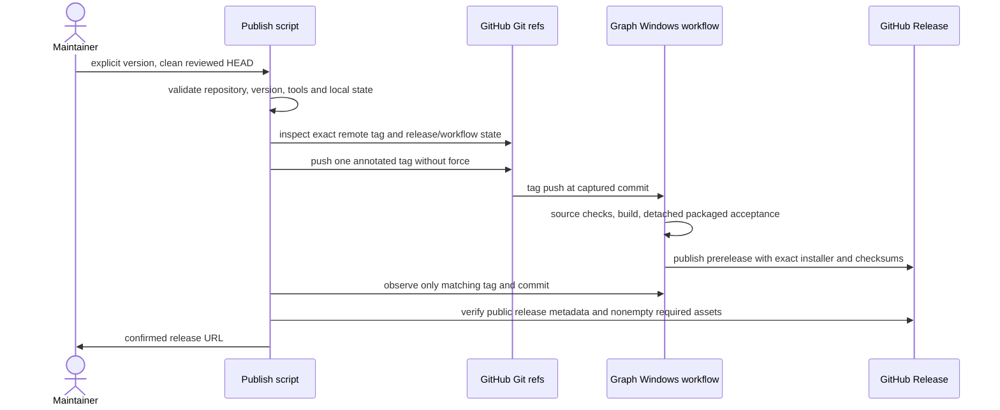

# Graph Windows publishing contract

This follow-up adds release automation for the existing native Z2 implementation. It does not publish a release during implementation or change Graph/Chat execution, installed settings, product identity or the updater. The original Z1 distribution contract continues to govern isolation and packaging; its Z1-only version/publication scope is extended here to Z2.

## Command and ownership

`pnpm graph:release --version 3.14.0-z2.1` publishes a prerelease from the current committed HEAD to `dumpfordummy/ZCode`. Git owns immutable tags; the existing `graph-windows-release.yml` workflow exclusively owns building, acceptance and publication. The local script owns only command admission and observing that exact tag/commit's workflow. It never stages, commits, merges, force-pushes, changes repository configuration or accesses application credentials.

Before a write, validate an explicit canonical `major.minor.patch-z1.number` or `major.minor.patch-z2.number`, require a clean worktree including untracked files, and check both origin fetch/push destinations against the fork. Check GitHub CLI availability, repository access and active workflow, remote/local tag collisions and release collisions. Authentication uses the user's existing Git/GitHub CLI setup when they run the publisher; tests use injected command results and synthetic repositories without installed credentials.

`--dry-run` performs local checks only, prints the exact proposed tag/commit/repository, and never invokes GitHub, the network, tag creation or push. It also refuses an uncommitted worktree. `--resume` checks an existing tag against HEAD and continues a previously interrupted invocation without retagging, deleting releases or restarting failed CI automatically. A local-only same-commit tag can be pushed with resume; a remotely existing tag is observed without another push. A different commit is always refused.

## Sequence and failure semantics

Bounded polling tolerates workflow queue latency but never treats time as success. CI failure/cancellation/timeout, unavailable authentication, ambiguous runs or missing assets exits nonzero with actionable recovery information. A timed-out local wait does not cancel the remote job. Remote success requires a successful matching workflow plus a non-draft prerelease of the exact tag and expected installer/checksum assets. Interrupted writes are not rolled back; resume explicitly reinspects them. The local script cannot silently publish from uncommitted source or accept another tag's green run.

The workflow retains manual artifact-only builds. Tag builds publish prereleases only after all required gates pass; concurrency serializes the same ref without cancelling an active release. Supplemental CLI lint and whole-repository formatting have existing failures: collect their actual diagnostics as visible baseline exceptions rather than silently claiming success or suppressing rules. Root lint/typecheck, architecture and release/Graph tests remain blocking. Release notes name user-operated checks that remain NOT RUN.

## Packaged verification

Use the existing detached executable launcher and controlled loopback provider. Z2 cases cover completion with multiple sessions/bindings, native questions, cancellation, interrupted restarts and conservative inactive release; retain literal Z1 and ordinary Chat/no-provider regression cases. Read Graph records/native ledger from the isolated packaged profile when present and the development profile otherwise. Never inspect an installed profile. Keep the packaged entry unmodified. Fault-injection acceptance remains explicitly labelled and does not establish uninstrumented recovery in every environment.

## Acceptance

- Unit tests cover invalid versions/arguments, wrong or multiple remotes, dirty worktrees, no-write dry-run, tag collisions, resume and push failure, workflow correlation/failure/timeout, release collision, missing assets and success.
- A real temporary Git repository verifies local admission without reading global configuration, installing hooks, contacting GitHub or modifying this checkout's Git state.
- Distribution tests preserve Z1 and ordinary identities, accept Z2 and reject future/invalid milestone versions. Isolated path tests cover source and packaged layouts.
- Run pinned-toolchain root typecheck/lint, architecture, focused tests and formatting for changed files. Preserve baseline exceptions. Actual GitHub publication, a Z2 installer build/launch and second-PC upgrade remain NOT RUN until executed and evidenced separately.
