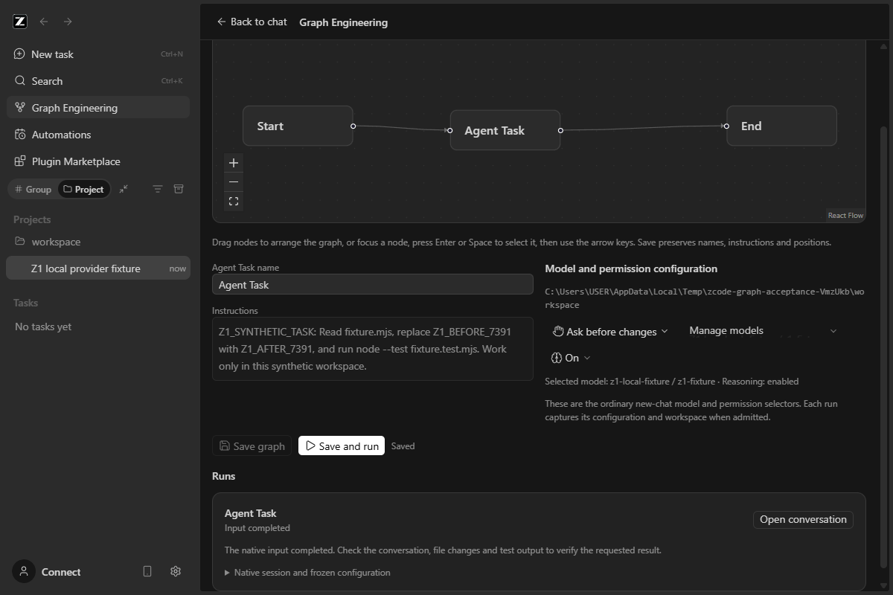
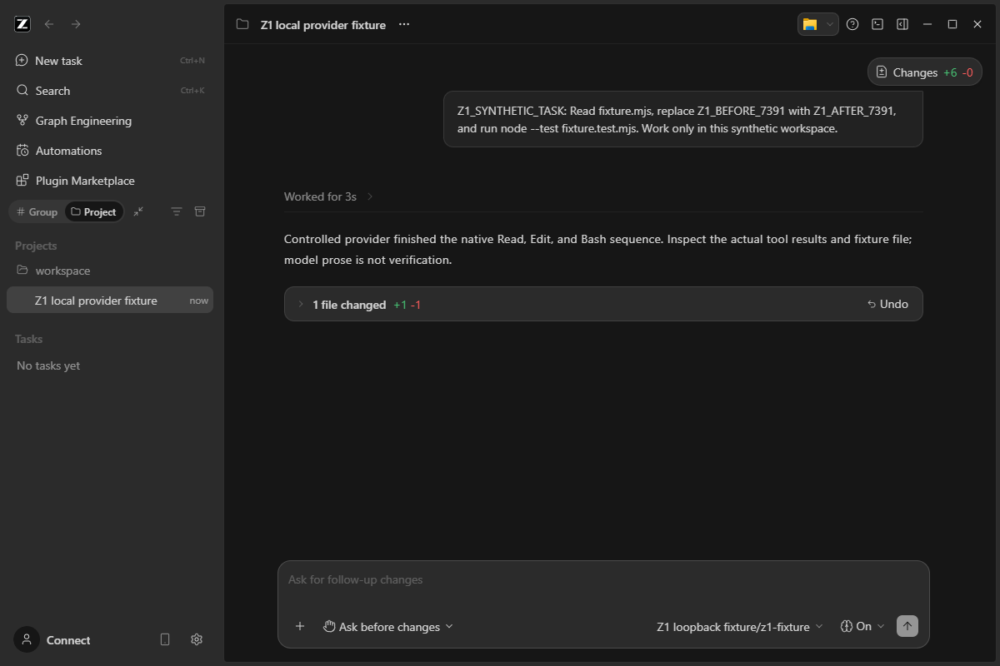
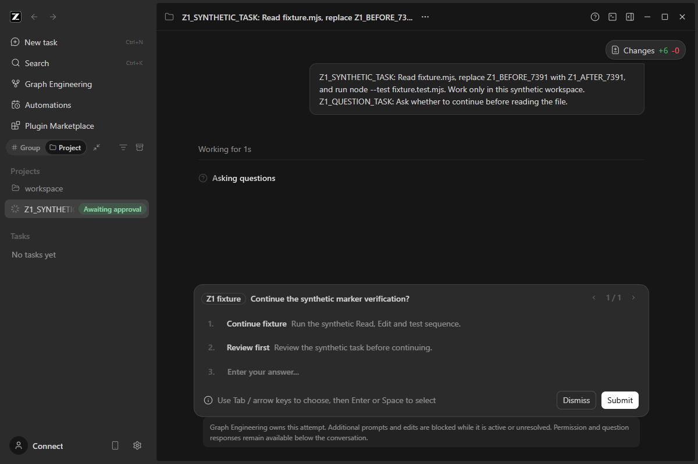

# ZCode Graph Windows distribution report

Date: 2026-09-24. Scope: native Z1 plus a Windows x64 distribution; no Z2. The user subsequently authorized commit, push and distribution, superseding the original task pack's Git restriction. The separate Vue/C# prototype and unrelated legacy planning documents remain untouched.

## Result and setup

**Published: [ZCode Graph 3.14.0-z1.2 for Windows x64](https://github.com/dumpfordummy/ZCode/releases/tag/graph-v3.14.0-z1.2). Source checks, clean-runner installer build and all five detached packaged scenarios: PASS.** This unsigned NSIS prerelease bundles the existing Electron/Agent runtime. The public download was independently hashed and verified. Release provenance and remaining NOT RUN checks are recorded below.

The final local **1.2** installer was rebuilt from commit `81761ee3798eb253c781d2bf84266b22f787a559`: `ZCode Graph-3.14.0-z1.2-win-x64.exe`, 149,634,695 bytes, Authenticode `NotSigned`. All five packaged scenarios passed again on that final executable. [Build metadata](evidence/windows/release-1.2/build-meta.json), [local checksum](evidence/windows/release-1.2/local-SHA256SUMS.txt), and [final local acceptance](evidence/windows/release-1.2/packaged-smoke.json) are preserved separately from the earlier 1.1 evidence.

The reproducible source entry is `node scripts/graph-engineering/build-windows.mjs 3.14.0-z1.2`. Output: `packages/desktop/dist-graph/`. The GitHub workflow `.github/workflows/graph-windows-release.yml` builds tagged source and gates publication on source checks and detached native acceptance. It uses GitHub's ephemeral token, not extracted local credentials. The earlier local 1.1 preflight artifact (149,655,924 bytes) and its [verification record](evidence/windows/package-verification.json) remain historical evidence. Use the checksum belonging to the actual downloaded build; timestamps/commit metadata change the bytes between builds.

Follow [WINDOWS_SETUP.md](WINDOWS_SETUP.md) for exact download, checksum, install, source-build and manual-test instructions. No source clone is necessary for installation. A clone/pull requires a build before it becomes an executable. Users configure their own provider and install any tools their projects invoke. The app's Agent Node runtime is bundled; project SDKs and Git are not promised by this installer.

## Isolation and integration

The opt-in `graph` flavor has app ID `dev.dumpfordummy.zcode.graph`, product name **ZCode Graph**, explicit Z1 prerelease version and a packaged ESM entry. That entry sets the private home/data environment before importing ordinary Main. Default storage root is `<original Windows home>/.zcode-graph-engineering`; business state is inside `home/.zcode`, Electron state inside `electron`. HOME/USERPROFILE and APPDATA/LOCALAPPDATA are private for the app and child tools. No installed profile is read, copied or migrated. Explicit workspace paths and PATH are retained.

The existing updater's non-production-flavor gate disables automatic and manual updates. Packaged logs confirm `[auto-update] disabled for this desktop product flavor`. The Graph flavor skips shared URI registration, Explorer menu registration and recent-document clearing. NSIS metadata has its own identity and no `zcode:` protocol. Production and Preview defaults retain their existing behavior. Account OAuth callbacks depending on upstream URL registration are excluded from this prerelease; personal-provider configuration uses ordinary ZCode settings.

Graph still uses the original Host/session/Agent services and provider settings. The distribution introduces no model engine, service daemon, C# sidecar, Vue embed, fake execution path or second provider store. The model test fixture is outside the packaged application. The original [Z1 report](Z1_REPORT.md) details integration tracing, owner/lease protections and live completion correlation.

## Verification

| Check                                                          | Actual result                                                                                                                                    |
| -------------------------------------------------------------- | ------------------------------------------------------------------------------------------------------------------------------------------------ |
| Freshness check with permitted fetch                           | PASS; origin/main matched starting HEAD before edits/publication.                                                                                |
| Node/pnpm                                                      | Pinned local Node 24.14.0 and pnpm 10.33.2; no global tool/settings change.                                                                      |
| `pnpm typecheck`                                               | PASS. Run before desktop build because both emit Host output.                                                                                    |
| `pnpm lint`                                                    | PASS; 70 existing warnings, 0 errors.                                                                                                            |
| `pnpm architecture:check --changed`                            | PASS; 0 violations. Desktop/services/shared controlled context read.                                                                             |
| Distribution identity/profile/version tests                    | PASS, 3/3.                                                                                                                                       |
| Graph service/repository/native observer/runtime binding tests | PASS, 28/28.                                                                                                                                     |
| Existing services and native interaction registry tests        | PASS, 14/14.                                                                                                                                     |
| UI tests                                                       | PASS, 10/10.                                                                                                                                     |
| Runtime preparation and Windows build                          | PASS; real CLI/plugins/native search, desktop bundles and NSIS installer.                                                                        |
| Package runtime closure/native resource/size gates             | PASS; existing packager injects required hoisted dependencies and verifies them.                                                                 |
| Packaged entry/version/flavor and test/profile exclusion       | PASS; ASAR inspected, evidence linked below.                                                                                                     |
| Authenticode                                                   | `NotSigned`, checked on the installer. No signing identity used.                                                                                 |
| Detached packaged acceptance                                   | PASS, 5/5 scenarios below.                                                                                                                       |
| Diff review                                                    | Scope, profile bootstrap ordering, existing flavor behavior, shared-session path and excluded local artifacts reviewed; `git diff --check` PASS. |
| Supplemental CLI lint / full-workspace formatting              | Preexisting FAIL results remain documented in Z1_REPORT; no claim of a globally clean baseline.                                                  |
| Second physical PC / clean Windows VM                          | **NOT RUN**; unavailable here.                                                                                                                   |
| Installer install/uninstall/upgrade, signed reputation         | **NOT RUN**; app was run unpacked, without installing it into the developer's Windows profile.                                                   |
| Real provider / paid task / company workspace                  | **NOT RUN**; prohibited by the task.                                                                                                             |
| macOS/Linux, remote/mobile/CUA acceptance                      | **NOT RUN** for this Windows distribution.                                                                                                       |

The installer build emitted existing pnpm hoist/dependency warnings and the existing Windows shell-spawn deprecation warning. Final package dependency gates and actual startup passed. No global dependency or formatting cleanup was performed.

Additional launch check: **PASS** with only Windows system directories on the packaged app's PATH (no Node, pnpm or Git). The Graph editor opened and retained its no-provider guard. This demonstrates launch without these tools on PATH, not execution of arbitrary project commands or their complete absence from the machine. See [minimal-path.json](evidence/windows/minimal-path.json).

## Packaged native evidence

The complete `win-unpacked` folder was copied into a new OS temporary directory outside the checkout. Playwright launched **ZCode Graph.exe** directly, using its packaged entry rather than the development bootstrap. Each scenario used a new synthetic Git workspace, empty inherited account environment, private profile and loopback provider. The app reported `isPackaged: true`, `name: ZCode Graph`, version `3.14.0-z1.1`, and home/userData under the expected private root. No repository `node_modules` fallback was available through the app's parent directory.

1. **Complete:** editor save/layout persistence; effective model; exact session/input IDs; native one-time permissions; actual Read/Edit/Bash; independent test of the modified file; completed restart with same IDs and no model replay.
2. **No provider:** native launch/onboarding and graph editor; Run unavailable; zero model requests.
3. **Question:** native AskUserQuestion remains pending until an explicit answer, followed by the real tool sequence and completion.
4. **Cancel:** cancel the graph attempt at its native permission boundary; a distinct ordinary Chat still waits for its own question, accepts its explicit answer and completes. The graph remains Cancelled.
5. **Interrupted restart:** pending work becomes Interrupted; no resubmission or edit; Run remains blocked; Open conversation opens that same interrupted session.

[Combined packaged summaries](evidence/windows/packaged-smoke.json) · [Package/profile/update verification](evidence/windows/package-verification.json). Runtime PID continuity in the packaged cancel case is not asserted by UI evidence; original native development evidence includes the separate PID check.

These are synthetic-fixture results, not real-provider acceptance or a clean-PC install certification. Detailed summaries contain the actual session/input IDs and assertions. Raw synthetic runtime logs remain in their temporary profiles; no account logs are published.

## Remote publication

The implementation commit `80f1692b4561c0b6578402c81354187d04a82062` and tag `graph-v3.14.0-z1.1` were pushed to the user's fork. [The first clean-runner workflow](https://github.com/dumpfordummy/ZCode/actions/runs/35964313014) passed installation, 55 source tests, typecheck/lint/architecture and packaging. Complete and no-provider native scenarios passed. The question scenario failed during the earlier editor keyboard-layout check: the test clicked Save while it stayed disabled. Publication was correctly skipped; no 1.1 Release was published.

The harness incorrectly used disabled Save as acknowledgement, although it is also disabled during the pending Host request. Keyboard events could therefore arrive while the canvas was disabled. The corrected test awaits Saved plus re-enabled inputs and selected-node state, without adding delays or loosening assertions. Failed packaged scenarios now retain summaries, screenshots and synthetic logs before CI cleanup. The app's production code did not change for this correction.

**Published and verified:** [ZCode Graph 3.14.0-z1.2](https://github.com/dumpfordummy/ZCode/releases/tag/graph-v3.14.0-z1.2), tag `graph-v3.14.0-z1.2`, source commit `81761ee3798eb253c781d2bf84266b22f787a559`. [The clean Windows workflow](https://github.com/dumpfordummy/ZCode/actions/runs/35965696884) completed successfully: 55 source tests, typecheck, lint, architecture, installer build, all five detached packaged cases, evidence upload and prerelease publication. [CI case summaries](evidence/windows/release-1.2/ci-verification.json) preserve the actual session/input IDs and checks.

The public installer is [`ZCode.Graph-3.14.0-z1.2-win-x64.exe`](https://github.com/dumpfordummy/ZCode/releases/download/graph-v3.14.0-z1.2/ZCode.Graph-3.14.0-z1.2-win-x64.exe), **149,635,660 bytes**, with SHA256 `1a5f029bc8d19ccc9a7879d9e1eb4c0480dde16e68cb757d9b8af748e72dde81`. [Release metadata](evidence/windows/release-1.2/github-release.json) and [published checksum](evidence/windows/release-1.2/published-SHA256SUMS.txt) are saved. GitHub replaces the build filename's space with a dot; compare the hash when using the checksum line with its original filename. The published binary has different build metadata/timestamps from the separate local build, so its hash differs.

The public download was retrieved into ignored `packages/desktop/dist-graph/release/` and its independently computed SHA256 matched both the published checksum and GitHub's asset digest. This is a prerelease, not a draft. The fresh hosted Windows runner includes development tools and does not replace the **NOT RUN** manual installer/upgrade/uninstall test on a consumer PC or clean consumer VM. No real-provider acceptance, installed-profile migration, or Z2 work was performed.
