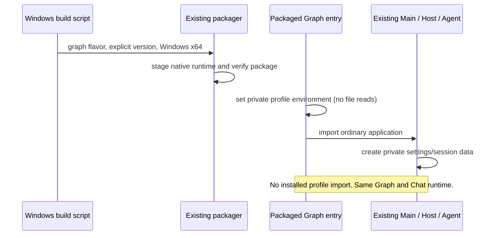

# Z1 Windows distribution

The user authorized packaging, Git commit/push and distribution of the native Z1 feature. This does not authorize Z2, paid agent execution, importing credentials or accessing company workspaces. Preserve the supplied legacy planning pack without committing unrelated prototype documents.

## Product contract

- Publish a Windows x64 NSIS installer named **ZCode Graph**, with a distinct app ID. Reuse the existing Electron builder and native Agent bundle; no second runtime or provider store.
- Add a `graph` product flavor selected only by `ZCODE_GRAPH_DISTRIBUTION=1`. Ordinary production/preview builds retain their current behavior. Graph keeps the existing non-production-flavor automatic/manual update gate; updates are explicit downloads from this fork's GitHub Releases.
- The packaged Graph entry must establish a private profile before importing any application modules, since early settings, CLI storage and auxiliary paths currently resolve the process home directly. Its default root is `<original home>/.zcode-graph-engineering`. Set HOME/USERPROFILE, APPDATA/LOCALAPPDATA and existing app/CLI data environment overrides to directories under that root. Do not import/migrate/copy settings or credentials. Consequently app and tool processes use the private home for per-user configuration; project files remain at the explicitly selected workspace paths and PATH/system tools remain available. Document this behavior.
- The Graph build must not register or take over the upstream `zcode` URI scheme or Explorer context menu. Use personal providers configured in the native settings UI; account OAuth callbacks that rely on that shared URI are not an acceptance target for this prerelease.
- Package licenses, native search, the real Agent runtime and its supported plugin assets. Do not include profiles, fixtures, test provider keys, source `.env` files or developer workspace data.
- No external auto-update feed is enabled. Keep the existing native non-production-flavor UI/update guards, including manual checks. Installer updates must retain this fork's private profile.
- Build artifacts live under ignored `packages/desktop/dist-graph`; source goes to the user-owned fork only. Release assets are distributed by GitHub Releases, not ordinary Git history. Add a Windows release workflow using its ephemeral repository token; do not extract local credentials.

## Owners and event order

## Acceptance

Write tests before implementation for graph identity versus existing flavors, private profile paths/override prevention, explicit version metadata and packaged entry selection. Run root typecheck/lint, architecture checks, focused Z1 tests and packaging checks. Run the actual packaged executable outside the source output with a fresh synthetic home and loopback provider; verify native graph tools, same session, permission/question handling and restart. Assert default profile isolation and disabled upstream integration in the packaged runtime. A clean second physical PC/VM and signed-installer reputation check are NOT RUN when unavailable. Preserve unsigned status in release notes.

Commit only native Graph/Z1/distribution sources and relevant documentation/evidence after review; push without force. Build release artifacts from the committed source and make the source tag, artifact version and SHA256 available. Publish a prerelease only after automated packaged validation succeeds. No automatic upstream publication or Z2.
