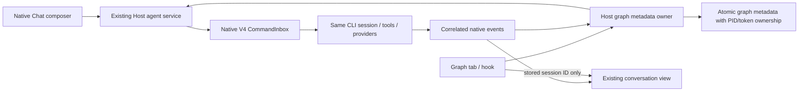

# Z1 verified native integration map

Source baseline: `328c1a0c0ffaa5a4f65e8fa199af5e4c20706e5f`, `main`, fork `https://github.com/dumpfordummy/ZCode.git`. This map describes the checked-out source, not an installed application's capabilities. Initial dirty files were the supplied `README_Z1_HANDOFF.md` and `docs/` pack. No upstream revision changes were made.

## Chat to runtime

| Boundary                             | Actual source / symbols                                                                                                                                                                                                                                              | Z1 consequence                                                                                                                                                                                                                                                                                                                                                                                                                                                                                 |
| ------------------------------------ | -------------------------------------------------------------------------------------------------------------------------------------------------------------------------------------------------------------------------------------------------------------------- | ---------------------------------------------------------------------------------------------------------------------------------------------------------------------------------------------------------------------------------------------------------------------------------------------------------------------------------------------------------------------------------------------------------------------------------------------------------------------------------------------- |
| Workspace identity and attachment    | `packages/ui/src/app-shell/WorkspaceShellLayout.tsx`; `packages/ui/src/hooks/useWorkspaceServices.tsx` (`useWorkspaceServicesResolution`); `packages/desktop/src/host/index.ts` local service collection / attachment setup                                          | Capture path, identity and host at admission. Key is trimmed identity or path. Z1 explicitly supports local workspaces only; never fall back from disconnected remote scope to local.                                                                                                                                                                                                                                                                                                          |
| Effective model/mode                 | `packages/ui/src/v4/composer/useDraftConfigControl.ts`; `newTaskDraft.ts`; `packages/services/src/model-provider/providerFacadeServices.ts` (`IModelSelectionService.getView`)                                                                                       | Existing Registry projection owns eligibility; reuse native model selector and permission modes, freeze chosen configuration. No copied key store or endpoint probes.                                                                                                                                                                                                                                                                                                                          |
| Session creation and list visibility | `packages/services/src/zcode-session/zcodeSessionService.ts` (`createSession`); `apps/zcode-cli/packages/bootstrap/src/zcode-protocol/server-operations.ts` (`createSessionWithProjection`); `v4-bridge.ts` (`admitInputCommand`); existing task-index syncer        | Create one ordinary `deferred` native draft without a caller-supplied session ID. Save its returned session ID and runtime identity in Graph metadata before observation/submission. Native V4 admission persists/promotes the draft before writing its input ledger; native indexing then makes the task visible.                                                                                                                                                                             |
| Prompt command                       | `SessionPane.tsx` (`dispatchSubmissionCommand`); `packages/ui/src/v4/agentConversationTransport.ts` (`createAgentConversationTransport`); `packages/services/src/zcode-agent/zcodeAgentService.ts` (`sendConversationCommandV4`)                                     | Same V4 `sendText`, model/tool execution and provider preparation as Chat. Admission ACK is not completion.                                                                                                                                                                                                                                                                                                                                                                                    |
| Admission and IDs                    | `packages/shared/src/zcode-protocol-v4/command.ts`; `apps/zcode-cli/packages/bootstrap/src/zcode-protocol-v4/command-inbox.ts`; `commands/handlers/session-flow.ts`; `commands/prompt-turn.ts` (`startPromptTurn`)                                                   | Native `inputId` / `queryId` use the stable command ID. Persist Graph run/attempt/input/command IDs before creation, then persist the returned native session ID before submission. CLI/runtime owns accepted queue and deduplication. Lost creation or submission replies remain Unknown; never recreate or resend automatically.                                                                                                                                                             |
| Event subscription                   | `packages/services/src/zcode-agent/zcodeAgentConnectionScope.ts` (`createZCodeAgentConnectionScope`); `packages/shared/src/zcode-protocol-v4` (`TopicWireFrameAssembler`, `applyConversationDeltas`); `packages/services/src/graph-engineering/adapters/observer.ts` | Graph has its own trusted connection and handshake and awaits the initial snapshot of the known warm session. Validate topic/subscription/epoch/sequence. Z1 fails closed on gaps, recovery frames, epoch changes or unexpected replacement snapshots; it does not automatically resync or replay. Renderer/mobile subscriptions remain independent.                                                                                                                                           |
| Original runtime binding             | `packages/services/src/zcode-agent/zcodeAgent.ts` (`expectedRuntimeIdentity` on subscription/command requests); `expectedRuntimeClient.ts`; `zcodeAgentService.ts`                                                                                                   | Bind Graph subscribe/send/stop to the existing client with the captured runtime identity. Recheck client identity across the asynchronous lookup and retain that client reference. A disappeared or replaced runtime fails without starting or dispatching into another process.                                                                                                                                                                                                               |
| Permissions/questions                | `packages/ui/src/v4/V4InteractionDialogs.tsx`; native `pendingInteractions` / `resolveInteraction`; `packages/shared/src/zcode-protocol/index.ts` (`protectedSessionIds`); CLI `interaction-preferences.ts` / `interaction-registry.ts`                              | Require the existing question auto-resolution setting to be false at admission. Host preference synchronization, including a pre-input barrier, supplies unresolved Graph session IDs as `protectedSessionIds`. Native registry protection covers pending/future/restored questions and descendants even if the global setting changes. Ordinary sessions retain their preference behavior. Open the same conversation for human responses; Graph never answers questions or changes settings. |
| Exact terminal result                | `packages/shared/src/zcode-protocol/index.ts` turn payload schemas (`inputId`, `foregroundExecutionId`, `resultType`); V4 `rows.ts` (`TurnHeaderRow.sourceCommandId`); CLI `projection-rows.ts` (`mapTurnResultToHeaderState`)                                       | Match the exact session and input/command. Live success maps to completedSuccess, cancelled to completedInterrupted, other terminal result types to failed. Persist proof. Ignore idle/readiness, assistant prose and old terminal state.                                                                                                                                                                                                                                                      |
| Cancellation                         | V4 `commandPayloadSchemas.stop.expectedForegroundExecutionId`; CLI `session-flow.ts` / `stopActiveForegroundExecution`                                                                                                                                               | Stop only the captured foreground execution. Stale targets produce `guard.stopTargetChanged`. Do not stop a shared Agent process.                                                                                                                                                                                                                                                                                                                                                              |
| Same conversation                    | `WorkspaceShellLayout.tsx` (`handleSelectTaskInChat`); `packages/ui/src/app-shell/useWorkspaceTaskNavigation.ts` (`handleSelectTask`); `selectWorkbenchSession`                                                                                                      | Select the stored workspace and native session/task ID. This callback navigates without session creation or submission. Native conversation history remains the only transcript.                                                                                                                                                                                                                                                                                                               |
| Persistence and restart              | Native session transcript; `transcript-hydration.ts` (`collectTurnOutput`, `finishTurn`); graph metadata adapter                                                                                                                                                     | Native cold hydration can synthesize a successful turn from a persisted user input without live completion proof. Graph must preserve its observed terminal evidence and conservatively mark unconfirmed cold work Interrupted/Unknown. Never replay automatically.                                                                                                                                                                                                                            |
| Metadata ownership across Hosts      | `packages/services/src/graph-engineering/adapters/repository.ts`; `@zcode/shared/node` (`acquireFileLock`); Graph service `getWorkspace` / `disposeAndWait`                                                                                                          | Hold the existing PID/token lock for each workspace's Graph metadata during the Host lifetime. Another Host reads an uncached projection with `readOnly: true` and cannot write, reconcile or dispatch. Release after in-flight work settles; reuse existing abandoned-owner recovery. This is metadata exclusion, not a workspace-files lock.                                                                                                                                                 |

The legacy `IZCodeTaskService.onDynamicTaskTerminalOutcome` is insufficient as the sole terminal proof: its adapter associates a session-phase change with an in-memory current-input map. Likewise raw legacy session events are in memory by default, and their read API returns a latest tail rather than forward pagination. Detailed investigation is retained in [research-session.md](research-session.md).

## Native integration boundaries

`packages/services/src/node.ts:createLocalServices` is the window Host composition root. Public descriptors in `packages/services/src/index.ts`, `IServiceAccessor`, `packages/shared/src/channels.ts` and `packages/client/src/remoteServiceAccess.ts` provide the existing typed RPC path. `ServiceCollection.exposeOnChannelServer` exposes registered services. Graph metadata belongs in this Host scope, independently of mounted React views. Window/app closure follows the existing Host lifecycle; this is not an always-on background service.

The native main-view union is in `packages/ui/src/app-shell/types.ts`; `WorkspaceSidebar.tsx` supplies existing Chat/Automations/Plugin Store navigation. Graph Engineering extends that shell without replacing it. Existing `@xyflow/react` is declared in `packages/ui/package.json` (`^12.10.1`). English and Chinese locale modules and `DESIGN.md` govern the new controls.

The narrow input guard is at the Host agent service before V4 commands and legacy input methods are forwarded. It rejects extra input-producing commands and session model/reasoning/mode mutations while Graph owns the input, and permits native interaction responses, reads and cancellation. The separate PID/token Graph metadata lock prevents concurrent Host state overwrites. Neither mechanism controls ordinary sessions editing the same files or arbitrary external CLIs/editors.

Native execution exposed two creation constraints that the initial source-only map did not establish. Ordinary native creation rejects supplied session IDs because those are reserved for imported-history creation. Also, this checkout's `persistence: "immediate"` creation can mark the live record immediate without inserting its parent session row; the V4 ledger then fails its foreign-key constraint. Z1 uses the existing working deferred draft path and native admission promotion, without enabling imported history or patching that unrelated immediate-creation behavior. A known warm draft is observed before submission; a missing or cold original runtime is not treated as completion evidence.

## Baseline observations and verification order

Pinned Node 24.14.0 and pnpm 10.33.2 were installed under ignored `.tmp/z1-toolchain`, without global changes. Locked dependencies were installed with lifecycle scripts disabled; Electron's locked runtime was then installed explicitly into the checkout. Native search tools were extracted from the repository archives. Root architecture check reports zero violations; typecheck passes; lint exits zero with 70 preexisting warnings. The existing services tests pass (10); UI tests pass (6) with `TSX_TSCONFIG_PATH=packages/ui/tsconfig.json`.

Root typecheck emits JavaScript into `packages/desktop/out/host`, also used by tsup. Running it concurrently with a desktop build overwrote the Host bundle during the first smoke attempt, causing a missing `startup.js` error. A sequential rebuild fixed it without product changes. **Run typecheck before the desktop build, and rebuild after any later emitting typecheck before launching.** The `<not found>` native GLM binary log is not a blocker: current development command resolution uses the built `zcode.cjs` via Electron's Node mode.

Unmodified desktop/Agent builds pass. The isolated instrumented Electron smoke completes real database preparation and displays Welcome to ZCode. No account was connected and no task was submitted in the baseline. A fully uninstrumented Windows native launch is NOT RUN because startup registers shared OS integrations.

## Isolation and startup network facts

- `desktopDataBaseDirBootstrap.ts` and hardware-acceleration bootstrap read the normal home before later path overrides. Use empty child `HOME`/`USERPROFILE`, not only `ZCODE_DATA_BASE_DIR`.
- `desktopRuntimeEnv.ts` supplies separate Electron home/userData/sessionData overrides. Use isolated `APPDATA`, `LOCALAPPDATA` and temporary directories as well. CLI config/session storage also uses `homedir()` independently.
- `desktopOAuthDeepLink.ts:registerDeepLinkProtocol` and `desktopWindowsOpenFolderContextMenu.ts:installWindowsOpenFolderContextMenu` write OS registration on startup with no existing test opt-out; Main clears recent documents. The smoke bootstrap blocks those exact operations and records suppression. Product output remains unmodified.
- Provider/client configuration refresh is real network behavior; `ZCODE_ENV=test` alone is not offline. The fixture directs application origins to loopback, omits telemetry/auth environment variables, blocks non-loopback renderer requests, and supplies no real provider key. Unpackaged update checks are disabled by the existing runtime path.
- Empty `.env` files in synthetic workspaces stop upward development dotenv discovery. No company workspace, installed auth store, user MCP/hooks/skills configuration, browser import or old prototype repository was accessed.
- These filesystem roots are isolation for development data, not an OS sandbox promise. Ordinary native tool/permission behavior remains authoritative.
