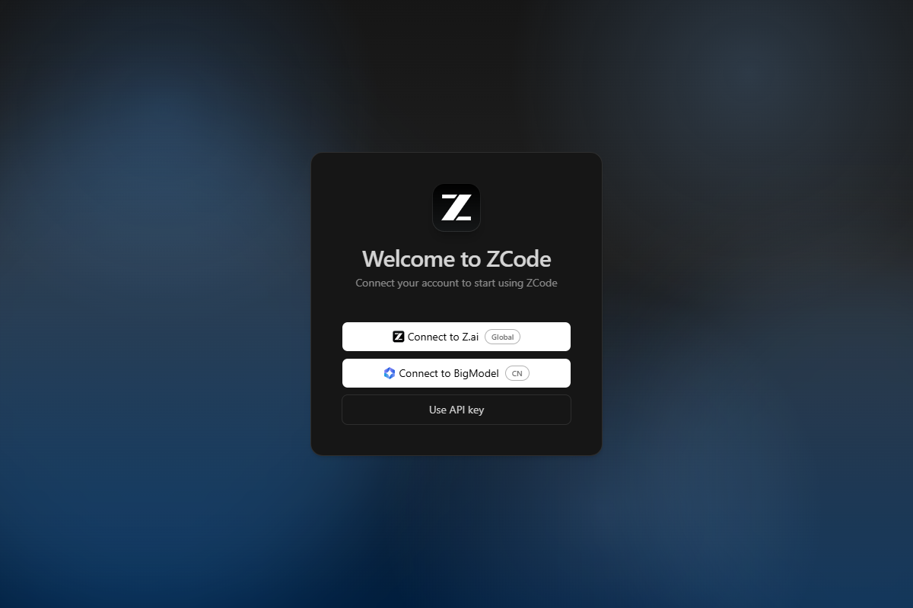
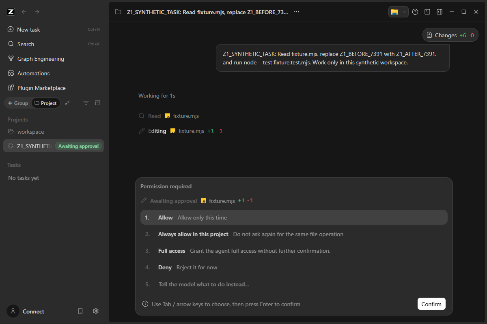
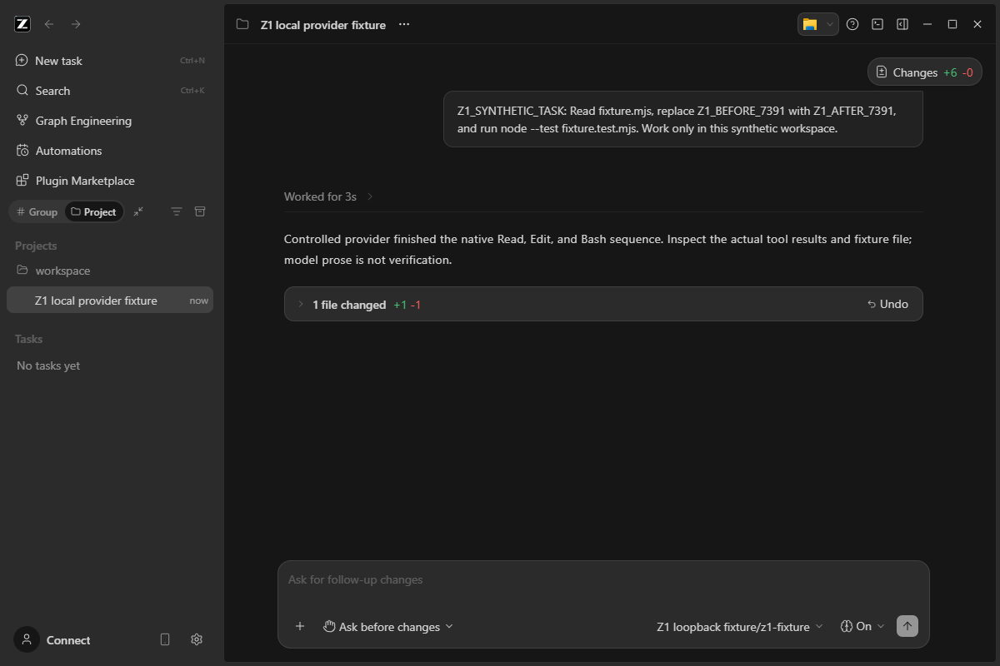
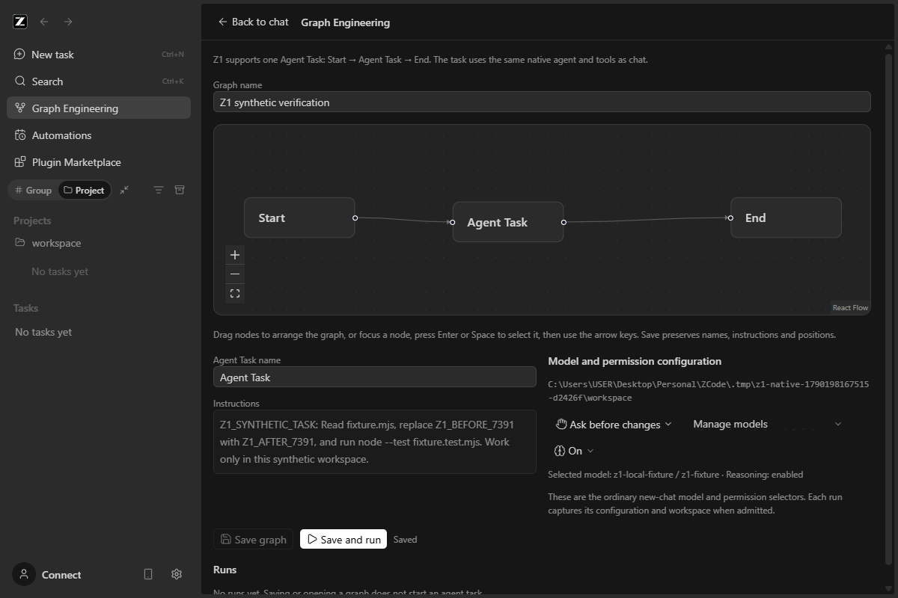
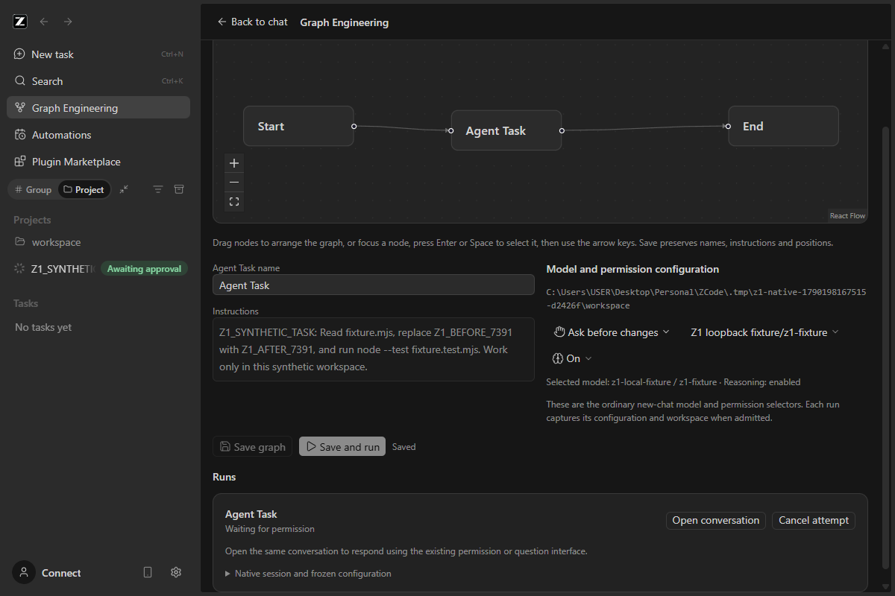
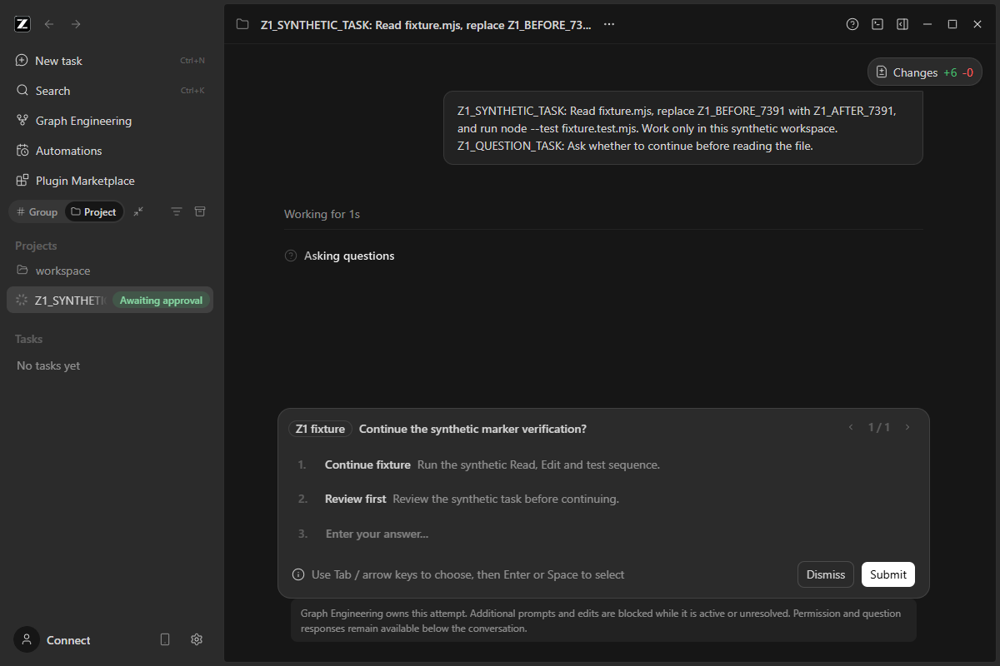
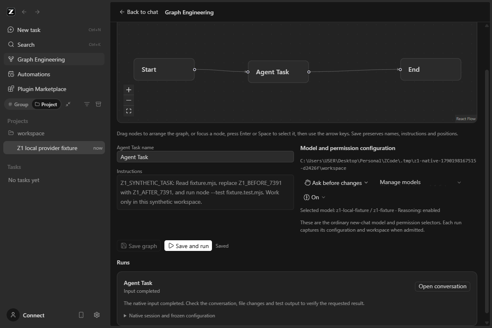
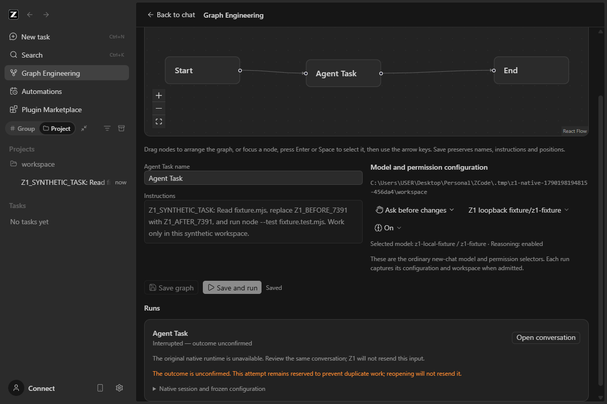

# Z1 native Graph Engineering report

Date/timezone: 2026-09-24, Asia/Kuala_Lumpur. Checkout: `C:\Users\USER\Desktop\Personal\ZCode`. Repository: `https://github.com/dumpfordummy/ZCode.git`. Branch: `main`. Starting HEAD: `328c1a0c0ffaa5a4f65e8fa199af5e4c20706e5f` (commit subject `feat: update v3.14.3`; package version is 3.14.0). This report records the native implementation phase. Subsequent Windows packaging, detached executable checks and user-authorized Git publication are recorded in [WINDOWS_DISTRIBUTION_REPORT.md](WINDOWS_DISTRIBUTION_REPORT.md).

Status at Z1 handoff: **IMPLEMENTED — READY FOR USER AGENT CHECK**, with the verification failures and unavailable checks qualified below. User-operated real-provider acceptance was **NOT RUN**. See the subsequent user-evidence/progression addendum below; historical automated results are unchanged.

## Subsequent user evidence and Z2 progression

The lead's 2026-09-24 review accepts native Z1 integration for development progression and authorizes Z2. The user-supplied screenshots establish a greeting and native Chat navigation. They do not independently establish matching Chat session IDs, real project Read/Edit/test, permission behavior, cancellation or completed-history restart. Those live user-operated checks remain **NOT RUN / unconfirmed** and are carried into [Z2_MANUAL_CHECK.md](Z2_MANUAL_CHECK.md). Current native development status is tracked in [PROGRESS.md](PROGRESS.md) and [Z2_REPORT.md](Z2_REPORT.md). Z1's subsequent authorized Windows publication is preserved.

The initial worktree contained untracked `README_Z1_HANDOFF.md` and `docs/`, including the supplied assignment documents. They were preserved. The old standalone prototype was not accessed. No M4 work was started or cancelled. At the end of this implementation phase, no migration, staging, commit, push, merge or Z2 work had been performed. The user's later distribution request explicitly authorized Git publication; Z2 was excluded from that distribution assignment and is now separately authorized by the new Z2 assignment.

## Baseline and isolation

Installed Node was 24.11.1 and the available pnpm shim reported 11.19.0. `mise` was unavailable. The checkout pins Node **24.14.0** and pnpm **10.33.2**. Exact versions were downloaded from official Node/npm distribution endpoints into ignored `.tmp/z1-toolchain`; no global tool installation changed. The locked workspace install used `--frozen-lockfile --ignore-scripts`, a checkout-local store/cache, and `HUSKY=0`. Electron 41.0.3 was installed explicitly from its locked package; repository native-search archives were prepared with the existing script.

| Baseline command/check                                               | Result and scope                                                                                                                            |
| -------------------------------------------------------------------- | ------------------------------------------------------------------------------------------------------------------------------------------- |
| `node scripts/check-workspace-freshness.mjs`                         | Fetch could not write `.git/FETCH_HEAD` under the filesystem policy. No upstream revision was changed.                                      |
| `node scripts/check-workspace-freshness.mjs --no-fetch`              | PASS, exit 0 against cached `origin/main`, ahead 0 / behind 0. This does not certify fresh remote state.                                    |
| `pnpm architecture:check --changed`                                  | PASS, exit 0; 0 violations / 0 baseline / 0 new.                                                                                            |
| `pnpm architecture:context services`, `ui`, `desktop`, `session`     | PASS after dependency installation; controlled contexts inspected. `session` has a preexisting absent declared contract file.               |
| `pnpm typecheck`                                                     | PASS, exit 0 before product edits.                                                                                                          |
| `pnpm lint`                                                          | PASS, exit 0; 70 existing warnings, 0 errors.                                                                                               |
| Existing services `node:test` tests                                  | PASS, 10 tests. See `.tmp/z1-baseline-tests.log`.                                                                                           |
| Existing UI tests with `TSX_TSCONFIG_PATH=packages/ui/tsconfig.json` | PASS, 6 tests. Initial run without this alias configuration failed module resolution; corrected invocation passed.                          |
| `pnpm --filter @zcode/desktop build:no-runtime-assets`               | PASS, exit 0; existing large-chunk warnings.                                                                                                |
| `$env:ZCODE_ENV='test'; node scripts/build-desktop-agent-cli.mjs`    | PASS, exit 0; actual repository CLI and its dependencies built and staged.                                                                  |
| Native Electron baseline                                             | PASS, instrumented launch of unchanged product bundles through real Main, Host, database setup and renderer; Welcome screen captured below. |
| Fully uninstrumented Windows launch                                  | **NOT RUN**: startup would modify shared protocol/Explorer registration and recent documents.                                               |



Source-derived isolation findings: `ZCODE_DATA_BASE_DIR` alone is insufficient. Early startup reads the home settings path before later Electron overrides; CLI also resolves its own home. The harness whitelists child environment variables and supplies fresh HOME/USERPROFILE, APPDATA/LOCALAPPDATA, temporary, data, userData and sessionData directories. No installed credential or settings store was read or copied. Synthetic workspaces contain empty `.env` files, fresh empty Git boundaries and no inherited hooks. No company source was opened or transmitted.

Observed startup: the app initializes its real isolated databases and session runtime, requests public client/provider configuration and scenes, and uses the configured loopback provider. The bootstrap suppresses protocol registration, `reg.exe` startup mutations and recent-document mutation. It blocks non-loopback renderer network traffic for automated runs. Application API origins and proxy variables point to the loopback fixture; model telemetry is disabled. Source inspection shows unpackaged updater checks skip installation. Optional CUA runtime assets were not prepared and were not exercised.

This is development-data isolation, not an OS sandbox or proof of a system-wide packet firewall. The manual launcher deliberately permits external model traffic after the user configures a provider, still using a fresh isolated home. Raw fixture logs remain under ignored `.tmp` and no real account is involved. Manual mode does not collect provider logs.

## Integration map and ownership

The detailed source trace is [Z1_INTEGRATION_MAP.md](Z1_INTEGRATION_MAP.md), with the product/state contract in [Z1_SPEC.md](Z1_SPEC.md). Important boundaries are:

| Concern                            | Owner and current path/symbol                                                                                                                                          |
| ---------------------------------- | ---------------------------------------------------------------------------------------------------------------------------------------------------------------------- |
| Selected workspace/Host            | `WorkspaceShellLayout` and `useWorkspaceServicesResolution` in `packages/ui/src`; workspace identity falls back to path.                                               |
| Model and permission configuration | Existing `useDraftConfigControl`, V4 composer selectors and `IModelSelectionService.getView`; no graph provider store.                                                 |
| Native session                     | `IZCodeSessionService.createSession`, ordinary deferred Chat draft, native persistence/task-index promotion at input admission.                                        |
| Submission                         | `IZCodeAgentService.sendConversationCommandV4` → native V4 `CommandInbox` → `session-flow` → `startPromptTurn` → existing agent application. Chat uses that same path. |
| Correlation                        | Persisted graph run/attempt/request/session/command IDs; V4 input ID equals command ID.                                                                                |
| Observation                        | A separate trusted native connection, `TopicWireFrameAssembler`, `applyConversationDeltas` and exact `TurnHeaderRow.sourceCommandId`.                                  |
| Permissions and questions          | Native `pendingInteractions` and existing `V4InteractionDialogs`; responses remain in the same conversation.                                                           |
| Terminal proof                     | Matched live native turn state, epoch and sequence. Idle state and assistant prose cannot complete an attempt.                                                         |
| Cancellation                       | Native V4 `stop` with the exact foreground execution ID and original-runtime binding.                                                                                  |
| Open conversation                  | Existing `handleSelectTaskInChat`, passing stored session/path/identity, with no create/send call.                                                                     |
| Graph persistence                  | Managed `graph-engineering` Host module, asynchronous atomic schema-validated metadata under the isolated app config directory.                                        |

React edits a definition and renders Host projections. The window Host owns orchestration and metadata; the existing CLI/runtime owns sessions, tools and admission. Main contains no graph business state. Leaving the graph tab does not stop observation. Closing its owning window follows the existing Host lifecycle; there is no new background daemon.

## Implemented behavior

The native workspace sidebar opens a lazy-loaded Graph Engineering panel with Start → Agent Task → End. Graph name, task name, instructions and node positions are saved separately from frozen attempt data. Unsupported topology is rejected. English and Chinese copy, theme tokens and existing components are reused. No dependency, lockfile or license change is required; React Flow already existed in the repository and its attribution remains visible.

Run captures the selected local workspace, saved revision, model selection, permission mode and plan preference. A fresh native session and stable command/input identity belong to one attempt. Duplicate request IDs return that attempt. Ambiguous replies retain Unknown and never cause automatic retry. Only matched live native evidence completes the attempt. Later turns in the conversation cannot rewrite the frozen graph result.

While the graph owns an unresolved attempt, extra manual input, edit/retry, model/reasoning/mode changes and alternate input-producing Host entry points are blocked. Existing selectors and their callbacks are disabled in the owned conversation. Viewing, question/permission responses and exact cancellation remain available. Native execution still has the ordinary configured tools, instructions and permissions; Z1 adds no special executor or tool allowlist.

Admission requires the existing automatic-question setting to be off. A narrow typed extension to the existing workspace preference update carries protected native session IDs. The native interaction registry excludes those sessions and their descendants from automatic question answers, including queued timeout races if the shared setting later changes. Ordinary sessions retain their preference behavior; Graph does not modify the saved global setting or answer questions.

Cold transcript hydration in this checkout can synthesize a success header. Accordingly, restart preserves persisted terminal evidence but treats unproven work as Interrupted/Unknown. Such attempts retain their guard and prevent another graph run in that workspace; Z1 does not include an abandonment/reset UI that could accidentally replay uncertain work. Completed/failed/cancelled attempts permit a later explicit Run.

Completion means the native input ended successfully. It is separate from proving that requested files or tests are correct; the UI explicitly asks the user to inspect the conversation and work product.

## Verification

Scenarios in [Z1_UI_TEST_SCENARIOS.md](Z1_UI_TEST_SCENARIOS.md) are a test plan, not evidence by themselves. Results below distinguish service fixtures, actual native execution with a controlled provider, and user live-model proof.

| Check                                                                                                       | Actual result / layer / artifact                                                                                                                                                                                                          |
| ----------------------------------------------------------------------------------------------------------- | ----------------------------------------------------------------------------------------------------------------------------------------------------------------------------------------------------------------------------------------- |
| Root `pnpm typecheck`                                                                                       | PASS, exit 0; `.tmp/z1-final-typecheck.log`.                                                                                                                                                                                              |
| CLI `pnpm --dir apps/zcode-cli typecheck`                                                                   | PASS, exit 0, 27 Turbo tasks successful; `.tmp/z1-cli-typecheck.log`. Add root `node_modules/.bin` to PATH so the CLI workspace finds Turbo.                                                                                              |
| Root `pnpm lint`                                                                                            | PASS, exit 0, 70 existing warnings / 0 errors; `.tmp/z1-final-lint.log`.                                                                                                                                                                  |
| CLI `pnpm --dir apps/zcode-cli lint`                                                                        | **FAIL**. Supplemental `turbo run lint --continue --output-logs=errors-only` exposes 85 existing max-lines errors in untouched files and 53 observed warnings; `.tmp/z1-cli-lint.log`. Changed native interaction files pass scoped lint. |
| `pnpm fmt:check`                                                                                            | **FAIL**, exit 1; reports 2,858 files across the checkout. Unrelated files were not reformatted. Changed source/spec files were formatted separately; `.tmp/z1-final-fmt.log`.                                                            |
| `pnpm architecture:check --changed`                                                                         | PASS, exit 0, 0 violations / baseline / new; managed Graph context also generated.                                                                                                                                                        |
| Focused Graph/backend tests                                                                                 | PASS, 28/28: service orchestration, real temporary metadata/ownership, fake native adapter, wire observer and existing-runtime binding. `.tmp/z1-final-graph-tests.log`.                                                                  |
| Existing services `node --import tsx --test packages/services/test/*.test.ts`                               | PASS, 10/10; `.tmp/z1-final-services-tests.log`.                                                                                                                                                                                          |
| UI `node --import tsx --test packages/ui/test/*.test.ts` with `TSX_TSCONFIG_PATH=packages/ui/tsconfig.json` | PASS, 10/10 (6 existing + 4 new pure UI logic tests); `.tmp/z1-final-ui-tests.log`.                                                                                                                                                       |
| Native question registry regression tests                                                                   | PASS, 4/4; direct native registry fixtures with fake timers, not Electron execution. Tests failed before protection was implemented; `.tmp/z1-final-interaction-tests.log`.                                                               |
| Agent build `node scripts/build-desktop-agent-cli.mjs` with `ZCODE_ENV=test`                                | PASS, exit 0; real 16 MB CLI bundle staged by existing script; `.tmp/z1-final-agent-build.log`. Existing script emits a shell-child deprecation warning.                                                                                  |
| Desktop `pnpm --filter @zcode/desktop build:no-runtime-assets`                                              | PASS, exit 0, existing large-chunk warnings; `.tmp/z1-final-desktop-build.log`.                                                                                                                                                           |
| Manual launcher setup/reopen                                                                                | PASS: fresh API-key setup UI opens; `--profile` reopens the same isolated profile without rewriting a sentinel sample file. No provider configured and no task run.                                                                       |
| User-operated real provider, paid execution, external MCP/skills, mobile replay and production packaging    | **NOT RUN**.                                                                                                                                                                                                                              |

### Real native runtime with a controlled provider

`node scripts/graph-engineering/native-smoke.mjs --chat` passed against both the baseline product build and the final ordinary-Chat regression build. It launches actual Electron/Host/CLI, sends an ordinary Chat input through the V4 path and uses a loopback OpenAI-compatible provider fixture. The fixture supplies model responses only. Actual native Read, Edit and Bash tools run; Edit and Bash wait for separate one-time approvals through the normal UI. The synthetic file changes from `Z1_BEFORE_7391` to `Z1_AFTER_7391`; an independent `node --test fixture.test.mjs` passes 1/1.

This is not a fake graph adapter and not live-model quality evidence. The native runtime executed the tools and emitted real permission/tool/terminal events. [Chat smoke summary](evidence/chat-summary.json) records the exact synthetic paths and assertions.




The Graph path was then exercised through the same native services. The complete scenario saves and reopens graph instructions/layout, submits once, observes a real Edit permission wait before any file change, and opens the native conversation. The test reads the real `SessionPane` session ID and compares it to the graph record; the additional-input ownership banner is present. Native Read/Edit/Bash results and an independent test verify the synthetic file change. On returning to Graph and restarting the app, the same run/session/input remains completed, with no new model request.

The question scenario adds the actual native `AskUserQuestion` tool. Graph displays its user-response wait, the existing native dialog has no automatic-answer countdown, and the explicit selected response is returned as the tool result before Read/Edit/Bash continue. The interruption scenario quits only the fixture-owned app while Edit permission is pending. On restart, Graph shows Interrupted — outcome unconfirmed, leaves the file unchanged, blocks another Run and opens the same session with ownership retained; no new model request is made.

The final complete scenario retained native session `sess_f0e70439-afd8-4d29-9fdc-3cbc063c993b` and input/command `645499c5-f9e8-4a52-a663-442944566b7c` across navigation and restart. The native tool outputs in the summary show the file contents before Read, the successful actual Edit and a native Bash test result of 1 pass / 0 failures. The separate verification process also returned 1 pass / 0 failures.

Cancellation additionally exercises another ordinary Chat session in the same synthetic workspace. Its original question remains pending after Graph is cancelled, receives one explicit answer and completes; the cancelled Graph result stays unchanged and the synthetic file remains unedited. The summary records both native session IDs and the correlated companion question result. Native log and stored runtime evidence are retained separately in [cancel-runtime-evidence.json](evidence/cancel-runtime-evidence.json); the UI itself does not expose a PID.

| Native scenario                                                     | Result / reproducible command                                                                               | Durable evidence                                         |
| ------------------------------------------------------------------- | ----------------------------------------------------------------------------------------------------------- | -------------------------------------------------------- |
| Ordinary Chat regression                                            | PASS, `node scripts/graph-engineering/native-smoke.mjs --chat`                                              | [Chat summary](evidence/chat-summary.json)               |
| Native graph tab, save and keyboard layout, no provider             | PASS, `node scripts/graph-engineering/native-smoke.mjs --no-provider`; Run disabled and zero model requests | [No-provider summary](evidence/no-provider-summary.json) |
| Shared native execution, identity, permission and completed restart | PASS, `node scripts/graph-engineering/native-smoke.mjs`                                                     | [Complete summary](evidence/graph-summary.json)          |
| Native user question and correlated response                        | PASS, `node scripts/graph-engineering/native-smoke.mjs --question`                                          | [Question summary](evidence/question-summary.json)       |
| Native exact cancellation while permission pending                  | PASS, `node scripts/graph-engineering/native-smoke.mjs --cancel`                                            | [Cancellation summary](evidence/cancel-summary.json)     |
| Pending execution after app restart                                 | PASS, `node scripts/graph-engineering/native-smoke.mjs --restart-interrupted`                               | [Interrupted summary](evidence/interrupted-summary.json) |







Additional captures: [completed run after reopen](evidence/graph-reopened.png), [cancelled graph](evidence/graph-cancelled.png), [unrelated Chat still waiting](evidence/companion-still-waiting-after-cancel.png), [unrelated Chat completed](evidence/companion-completed-after-cancel.png), [no-provider state](evidence/graph-no-provider.png), and [manual provider setup](evidence/manual-provider-setup.png). Every final native scenario above passed against the reviewed build. [Native evidence index](evidence/native-evidence-index.json) maps the copied screenshots and summaries.

Duplicate request IDs, a lost creation/dispatch reply, stale/duplicate/out-of-order events, disk-write ordering and cross-Host metadata ownership are tested at the service/adapter/repository layer. Network fault injection and simultaneous desktop windows are **NOT RUN** as native end-to-end scenarios. Persisted proof validation is exercised with real temporary metadata files; protocol fixtures are not described as live native events.

### Intermediate failures and corrections

- Running emitting typecheck concurrently with the desktop bundle build overwrote `out/host/index.js`, causing a missing `startup.js` import. A sequential rebuild fixed the launch without product edits. Always finish typecheck before the final desktop build.
- Initial harness selectors raced onboarding or searched for a tool description not actually shown by the UI. They were corrected against observed native UI. These failures did not establish feature failures.
- The test server initially returned the wrong shape for `/client/scenes`, causing a baseline scene-list error. The fixture now returns an array for scenes and the actual object shape for configs.
- Initial implementation typecheck found two React Flow/declaration type errors; the UI agent corrected the change-type narrowing and exported hook return annotation.
- Source review identified an original-runtime dispatch race and question-preference propagation risk; final validation includes the narrow Host/protocol guards rather than hiding these with timeouts.
- Real Graph creation exposed the native restriction that caller-supplied session IDs are for history import only. Graph now persists precreation run/input IDs, lets native creation allocate the session ID, and persists the returned ID before observation/submission. A lost creation reply remains Unknown with no recreation.
- The next native attempt exposed an upstream immediate-persistence path that returned a live session without the database row required for admission, causing `FOREIGN KEY constraint failed`. Graph follows ordinary Chat's deferred draft and first-input promotion path; it does not write private runtime databases or repair the unrelated immediate path.
- Concurrent native harnesses initially collided with the application's fixed development debug port. The harness now uses the existing `ZCODE_DISABLE_FIXED_REMOTE_DEBUGGING_PORT=1` switch and the documented commands run sequentially.
- The question harness initially pressed Enter on a single-choice option and then tried to click Submit. Native Enter had already submitted the response and progressed to Edit permission. Removing that redundant click made the scenario pass; no product change was needed.
- Final diff review found that failure of the first metadata write could leave a cached Starting attempt even though no native call occurred. The service now persists the candidate record before exposing it in memory. The regression test failed before the fix and verifies that the same request can retry after storage recovers, with exactly one native creation/submission.
- Native visual review found the shared model picker could temporarily display Manage models while a valid draft selection existed. Graph now also displays provider/model/reasoning from that same submission draft; the native smoke asserts the displayed IDs before Run. The duplicate completion explanation was reduced to one localized message.
- One cancellation harness launch under the restricted process token failed to load Electron GPU/renderer subprocesses before any task ran. The same isolated command passed with the authorized native-process execution context, without changing product flags or rendering policy.

## User-operated real-agent check

**NOT RUN.** No user model, paid task, real credential, private provider URL or company repository was used. The user must perform this final proof through the isolated manual app after reviewing the implementation.

1. Use the startup instructions below. The isolated app opens its existing API-key/provider setup screen. Configure an approved provider there, or choose **Skip for now** and then use Settings → model providers. Use the prepared synthetic `workspace` folder only.
2. Keep General → Automatically continue questions off. Select the same model and **Ask before changes** mode in ordinary Chat and Graph Engineering. Check plan/reasoning selections too.
3. In Graph Engineering, use the exact task printed by the launcher. Expected source change is `Z1_BEFORE_7391` → `Z1_AFTER_7391` in `fixture.mjs`. The available command is `node --test fixture.test.mjs`.
4. Run once. Inspect graph waiting state, then Open conversation. Confirm the graph's native session/input IDs and task history match; extra manual prompt submission stays disabled while owned. Read each permission/question and respond in the normal UI.
5. Confirm actual Read/Edit/shell results, inspect the source file and run the focused test independently. A final answer claiming success is insufficient.
6. Return to Graph, open the completed session again, switch tabs and reopen the same profile using the printed `--profile` command. Confirm the attempt and terminal proof remain unchanged and no new input is submitted. Use a fresh isolated profile/sample for cancellation, since the completed sample is already modified. Cancel while a confirmed native execution is waiting and confirm only that attempt is stopped.
7. Record only sanitized model alias, run/session/input IDs, observed permissions and file/test evidence. Do not add keys or private endpoints to this report.

## Changes and limitations

The new module lives under `packages/services/src/graph-engineering` with domain validation, injected ports, Host orchestration, native observation, persistence and tests. Small service composition/accessor/channel and agent-admission changes expose it through existing RPC. UI changes are scoped to shell/sidebar integration, the graph panel/hook, composer ownership and locales. Reproducible native harness files are under `scripts/graph-engineering`. Specs, integration research, manual scenarios and evidence are in this documentation directory.

| Changed paths                                                                                                                                                                                                                                                                     | Purpose                                                                                                                                |
| --------------------------------------------------------------------------------------------------------------------------------------------------------------------------------------------------------------------------------------------------------------------------------- | -------------------------------------------------------------------------------------------------------------------------------------- |
| `architecture-policy.yaml`; `packages/services/src/graph-engineering/{module.ts,contract.ts,contract.example.ts,CONTRACT.md,node.ts}`                                                                                                                                             | Register the managed module, typed public service and Host composition.                                                                |
| `packages/services/src/graph-engineering/domain/definition.ts`; `app/{ports.ts,service.ts}`; `adapters/{native.ts,observer.ts,repository.ts}` and adjacent tests                                                                                                                  | Definition invariants, serialized metadata/admission, existing-runtime adaptation, exact live-event correlation and durable ownership. |
| `packages/services/src/{node.ts,index.ts,accessor.ts}`; `packages/shared/src/channels.ts`; `packages/client/src/remoteServiceAccess.ts`                                                                                                                                           | Existing service registry and typed RPC exposure.                                                                                      |
| `packages/services/src/zcode-agent/{zcodeAgent.ts,zcodeAgentService.ts,expectedRuntimeClient.ts,expectedRuntimeClient.test.ts}`                                                                                                                                                   | Input/configuration ownership guard and original-runtime dispatch binding.                                                             |
| `packages/shared/src/zcode-protocol/index.ts`; `apps/zcode-cli/packages/bootstrap/src/zcode-protocol/{interaction-preferences.ts,interaction-response-race.ts}`; `zcode-protocol-v4/{interaction-registry.ts,interaction-auto-resolution-policy.ts,interaction-registry.test.ts}` | Optional validated protected-session preference, native ancestry and automatic-question race handling.                                 |
| `packages/ui/src/{WorkspaceSidebar.tsx,app-shell/WorkspaceShellLayout.tsx,app-shell/types.ts,v4/SessionPane.tsx}`                                                                                                                                                                 | Native entry, same-session navigation and owned-conversation controls.                                                                 |
| `packages/ui/src/graph-engineering/*`; `packages/ui/src/hooks/useGraphEngineering.ts`; `packages/ui/test/graphEngineeringView.test.ts`; both `packages/ui/src/i18n/locales/{en-US,zh-CN}.ts`                                                                                      | Native graph editor/projection, workspace-safe hooks, shared config UI, localization and UI logic regression coverage.                 |
| `scripts/graph-engineering/{isolation.mjs,native-bootstrap.cjs,provider-fixture.mjs,native-smoke.mjs,launch-manual.mjs}`                                                                                                                                                          | Reproducible isolated native evidence and user-operated setup.                                                                         |
| `docs/graph-engineering/{Z1_SPEC.md,Z1_INTEGRATION_MAP.md,Z1_UI_TEST_SCENARIOS.md,Z1_SETUP.md,Z1_REPORT.md,research-session.md}` and `evidence/`                                                                                                                                  | Contract, trace, test/manual instructions and actual results. Supplied assignment documents are preserved.                             |

Final diff review covered the new files as well as tracked diffs, with independent backend/UI review. It found and corrected the first-write ordering and configuration-visibility issues above. Root architecture reports 0 violations / 0 baseline / 0 new; `git diff --check` and scoped formatting pass. The 18 tracked changed files contain +391 / -60 lines. The 32 new module/UI/test/harness files contain 4,421 lines, including tests and the isolated runtime harness; this excludes the report/evidence and supplied documentation. Build-produced declaration files and a content-identical formatting touch were restored to their original checkout line endings after verifying equality to HEAD. No generated build output is left as a substantive source diff.

Z1 supports one task in a local workspace. Remote Graph execution, multi-node scheduling, loops, parallel agents, migration, production packaging, CUA assets and external account/skill/MCP integration tests are outside this evidence. Native tools are not artificially limited, but optional capabilities remain subject to what this checkout and its installed assets support.

Admission serialization belongs to the window Host. A workspace-keyed metadata lock, using the repository's existing PID/token file-lock helper, prevents another live Host from overwriting graph records or admitting competing graph work. Another window gets an uncached read-only projection; edits, Run and Cancel are disabled. Shutdown releases ownership after in-flight writes. This protects Graph metadata, not workspace file contents: it does not exclude unrelated Chat sessions or external editors. There is no promise of always-on execution after that Host exits. Unproven interrupted attempts require inspection; automatic replay is intentionally unavailable. Safe cancellation requires the exact original foreground execution identity; none is guessed for Starting/Unknown/Interrupted work.

Data migration: not performed. Company repository access: not performed. The Vue/C# prototype: untouched. No global settings/toolchain or installed ZCode/Codex configuration changes. Git mutations: none to the index, branch, commits or remote; only working-tree source/spec/test edits and an empty Git initialization inside each synthetic fixture workspace.

## Exact Windows operator steps

Run from the repository root in PowerShell. For this workspace, the pinned local tools already exist:

```powershell
Set-Location C:\Users\USER\Desktop\Personal\ZCode
. .\.tmp\z1-env.ps1
node --version                 # v24.14.0
pnpm --version                 # 10.33.2
```

For a fresh checkout without those ignored tools, install the versions in `mise.toml` through your project version manager, or recreate the same project-local tools using the instructions in [Z1_SETUP.md](Z1_SETUP.md). Do not use the installed application as a source of binaries or credentials.

The verified build order is sequential:

```powershell
pnpm install --frozen-lockfile --ignore-scripts --store-dir .pnpm-store --reporter append-only
node node_modules/electron/install.js
node scripts/prepare-native-search-tools.mjs
pnpm typecheck
pnpm lint
pnpm architecture:check --changed
$env:ZCODE_ENV = 'test'
node scripts/build-desktop-agent-cli.mjs
pnpm --filter @zcode/desktop build:no-runtime-assets
```

Installation downloads dependencies and the locked Electron runtime. The application build does not require a paid model. Rebuild desktop after any later root typecheck, because both write `out/host`.

Focused verification commands (exit 0 is required for a pass):

```powershell
node node_modules/tsx/dist/cli.mjs --test packages/services/src/graph-engineering/app/service.test.ts packages/services/src/graph-engineering/adapters/repository.test.ts packages/services/src/graph-engineering/adapters/native.test.ts packages/services/src/graph-engineering/adapters/observer.test.ts packages/services/src/zcode-agent/expectedRuntimeClient.test.ts
node --import tsx --test packages/services/test/*.test.ts
$env:TSX_TSCONFIG_PATH = 'packages/ui/tsconfig.json'
node --import tsx --test packages/ui/test/*.test.ts
Remove-Item Env:TSX_TSCONFIG_PATH
node --import tsx --test apps/zcode-cli/packages/bootstrap/src/zcode-protocol-v4/interaction-registry.test.ts
$env:PATH = "$PWD\node_modules\.bin;$env:PATH"
pnpm --dir apps/zcode-cli typecheck
pnpm --dir apps/zcode-cli lint  # Existing failures recorded above.
pnpm fmt:check                # Checkout-wide failures recorded above.
```

Automated controlled native smoke:

```powershell
node scripts/graph-engineering/native-smoke.mjs --chat
node scripts/graph-engineering/native-smoke.mjs --no-provider
node scripts/graph-engineering/native-smoke.mjs
node scripts/graph-engineering/native-smoke.mjs --question
node scripts/graph-engineering/native-smoke.mjs --cancel
node scripts/graph-engineering/native-smoke.mjs --restart-interrupted
```

Each invocation creates a fresh `.tmp/z1-native-<timestamp>-<id>` profile and synthetic Git workspace. It prints exact paths, assertions and PASS/FAIL; screenshots, logs and summaries are written in that directory. Existing user profiles are never reused. The test bootstrap blocks OS registration changes and the automated mode uses only the local fixture provider.

User-operated isolated app, with no task automatically submitted:

```powershell
node scripts/graph-engineering/launch-manual.mjs
```

This prints a fresh profile path, workspace and exact task. It permits external model traffic for the provider the user configures. Ordinary application API origins still point to the local config fixture; account-login flows are not part of this check. Configure an approved personal provider through the existing setup/settings UI. Quit this isolated app normally to end the launcher; do not kill processes by name. By default a manual invocation creates a fresh profile. Retain its printed path and reopen it without rewriting the sample or settings:

```powershell
node scripts/graph-engineering/launch-manual.mjs --profile "C:\Users\USER\Desktop\Personal\ZCode\.tmp\z1-manual-<printed-timestamp>-<printed-id>"
```

Only profiles created by this launcher below this checkout's `.tmp` are accepted. Installed application profiles are never accepted.

## Gate

Native controlled-provider execution, ordinary Chat regression, same-session identity, permission/question handling, cancellation with a surviving unrelated session, completed restart and interrupted restart are evidenced. User real-provider proof and final acceptance remain **NOT RUN** / the lead's decision. Z2 was unauthorized at this historical handoff; the subsequent lead/user assignment now authorizes Z2 development only.
