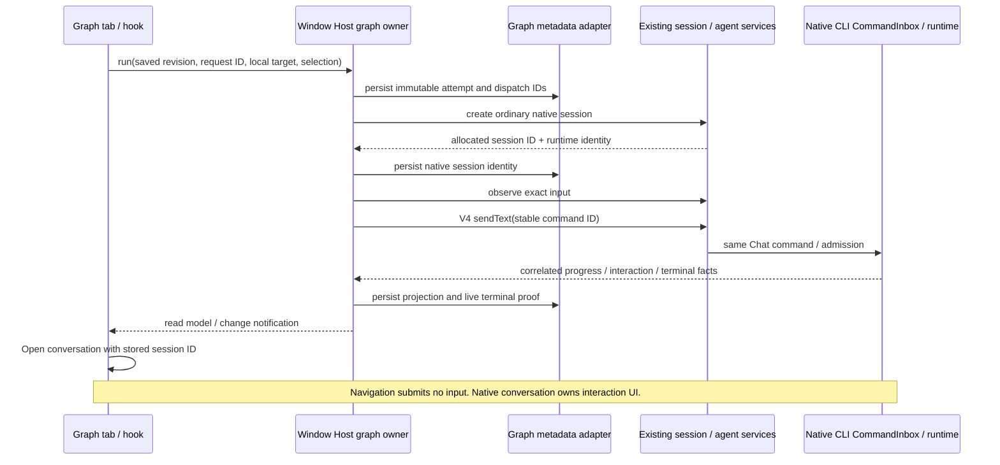

# Z1 implementation specification

Status: implementation contract, 2026-09-24. Applies only to the native ZCode feature. The standalone application remains untouched. No M4 work exists to pause.

## Product boundary

Add Graph Engineering to the existing local workspace shell. A saved graph has exactly Start -> Agent Task -> End, editable graph/task name, instructions and node positions. Reject unsupported topology rather than silently executing it. Definitions and immutable run snapshots are separate. React Flow is already installed; reuse it and existing semantic components, typography and English/Chinese localization.

Canvas keyboard movement follows React Flow: focus a node, press Enter or Space to select it, then use arrow keys. Focusing a node alone does not move it. Product help and manual tests must describe that complete sequence.

React Flow controls and visible attribution must use the existing semantic theme colors in light/dark layouts. Use the package's CSS variables and explicitly scoped attribution text styles. General-setting guidance is shown only while the existing settings projection reports automatic question continuation enabled; other runtime/provider prerequisites retain their own explanation.

The graph uses the selected local workspace and existing model selection/permission mode. No new provider configuration, credentials, engine, tools allowlist or application shell. Remote execution is unavailable in Z1 and must be explicitly diagnosed. Effective model/mode/instructions are frozen at admission. A runtime completion means the submitted input ended successfully, not that the requested business work or tests are correct.

Before Run, show the current provider/model identifiers and any explicit reasoning selection from the same existing draft projection used for submission, even if the shared model picker displays a management placeholder. Completed attempts show one localized explanation that native completion does not establish correctness, rather than repeating the Host's equivalent message.

## State owners and interfaces

- A managed `graph-engineering` module in `packages/services/src/graph-engineering` owns definitions, run/attempt IDs, captured workspace, native session/command/input IDs, dispatch uncertainty, and terminal evidence. Register through the existing window Host service collection and RPC accessor.
- Existing native session/runtime owns conversation, model/tool execution, input admission, interactions and cancellation. Graph reads public agent/session contracts. Electron Main owns no graph state.
- UI hooks resolve the selected workspace Host and invoke graph commands. React renders projections and edits drafts; mounting, tab changes and effects never dispatch work.
- Persistence uses asynchronous, atomic, schema-validated app-data files through a module adapter, outside project files. No transcript/provider copying. Serialize graph writes and admission in the Host; reject stale definition revisions and duplicate active admissions.
- One active graph attempt per local workspace key (`workspaceIdentity?.trim() || workspacePath`). Native session ownership guards input-producing Host commands while the attempt is active, permitting reads, interaction responses and exact cancellation. This is not a lock on workspace file contents or exclusion of unrelated native chat tasks/external editors.

## Admission and lifecycle

1. Validate local workspace, graph revision/topology, nonempty instructions, model eligibility and mode through existing service projections without paid probes.
2. Require native question auto-resolution to be disabled for graph admission, with an actionable explanation using the existing app setting. Do not silently modify shared settings. Reuse native permission handling; do not elevate permission mode.
3. Allocate stable run/attempt/input/command identity and persist the immutable attempt before native creation/submission. The native input ID equals the V4 sendText command ID. A duplicate run request returns the existing attempt; ambiguous native acceptance must never trigger a new session or resend.
4. Create a fresh deferred native session through ordinary draft session creation, which allocates its own session ID. Persist the returned native session ID and runtime identity before establishing observation and submitting input. A lost creation reply remains Unknown with no recreation or dispatch. Do not supply a session ID or use imported-history creation. Send through the same V4 command path as chat: native admission persists/promotes the draft before writing its input ledger, and native task indexing then makes it visible. This checkout's ordinary `persistence: immediate` creation marks the runtime immediate without inserting its session row, which makes subsequent V4 input admission fail a foreign-key check; Z1 uses the working deferred path and does not patch that unrelated native behavior. The graph observer uses its own native connection and observes the known warm draft before submission, leaving renderer/mobile subscriptions intact.
5. Project only correlated events for that session and command/input. Ignore old/duplicate/out-of-order facts. Runtime idle, prose, UI unmount and an old completed session do not finish an attempt. WaitingForPermission and WaitingForUser lead to Open conversation; no graph code answers interactions.
6. Persist confirmed live terminal evidence and freeze the result. Opening/continuing the completed session does not mutate it.
7. Cancel uses the existing native stop command with the captured foreground execution identity; never kill the shared Agent. CancelRequested remains nonterminal until confirmed. Reject stale cancellation targets.
8. On reopening records, retain persisted terminal proof. Reconcile an unfinished known session/input against the same active runtime when provable. Cold hydration is not terminal proof: this checkout can synthesize successful turn headers from messages. Missing proof or a changed runtime becomes Interrupted/Unknown, with no automatic resend. Unknown acceptance must continue to prevent accidental duplicate execution.

Desktop continuous delivery and mobile replayable delivery remain native runtime responsibilities. Z1 executes only on a local Host. Additional input through either attachment is subject to the same Host guard; interaction responses remain available. No stream/protocol downgrade or independent queue is introduced.

## Acceptance and validation

Write behavior tests before implementation. Exercise topology validation, persisted definition/layout/revision, duplicate admission, uncertain acceptance, exact correlation, terminal freeze, waiting states, cancellation identity, stale events, and restart without replay. Use synthetic workspaces and controlled native/provider fixtures where feasible. Label fake-adapter tests separately from actual-runtime tests.

Native UI scenarios: open tab; edit/save/reopen graph; inspect no-provider state; run controlled task; switch tab and open the same conversation with identical session ID and no new input; answer native interaction; return to graph; cancel; restart/reopen. Real paid-provider proof is user-operated and NOT RUN until supplied.

The owned native conversation disables model, reasoning and permission/plan selectors as well as prompt edits; callbacks must also reject a selection from an already-open picker. Native interaction responses remain enabled. Graph hooks preserve a supplied workspace identity in requests and event matching. The current workspace service resolver treats any explicit identity as remote metadata, so Z1 follows its explicit unavailable result rather than dropping the identity or inventing a local route.

Pending editor actions belong to their workspace generation. Switching workspaces during a delayed save/run must leave the newly selected editor usable, and a late reply must neither clear its current pending action nor replace its retained duplicate-protection request ID.

When another ZCode window owns the workspace graph metadata, the Host view explicitly reports `readOnly: true`. The graph remains inspectable with same-session navigation, while editor fields, layout, configuration and Save/Run are disabled. Provider or question-setting prerequisites alone do not disable graph editing.

Run root typecheck and lint, architecture check/context, relevant node:test suites, desktop and Agent builds, and instrumented native smoke. Typecheck emits to `packages/desktop/out/host`; finish it **before** rebuilding desktop output for launch. Review diff and report real counts/exits, warnings, screenshots and unavailable checks.

## Baseline/isolation boundary

Use pinned local Node 24.14.0 / pnpm 10.33.2. Clean home, app data, Electron userData/sessionData, temporary directories and a whitelisted child environment. Never copy installed credentials or open real repositories. Empty `.env` at synthetic workspace roots prevents parent dotenv discovery.

Unmodified Windows startup registers the `zcode` URI handler, Explorer menus and clears recent documents. Native evidence therefore uses a documented test bootstrap that suppresses those OS mutations without changing product bundles. A fully uninstrumented launch is NOT RUN. Public config requests are pointed at loopback; model endpoints are never probed automatically. Tools/providers remain subject to the native runtime's existing policies.

The reproducible native fixture launcher lives in `scripts/graph-engineering`. It creates fresh, uniquely named data and synthetic workspace directories below ignored `.tmp`, seeds only a synthetic loopback provider in that fresh app profile, and blocks non-loopback renderer traffic. Its provider returns controlled OpenAI-compatible responses; all session admission, permission requests, file edits, shell commands and terminal events still execute in ZCode's real CLI/runtime. Test code may explicitly choose a one-time approval for a displayed synthetic operation. It must not change the permission mode or answer interactions from the graph service. Screenshots and a sanitized summary are report evidence; raw logs stay in ignored test output. A separate manual launch creates an isolated profile without fixture credentials and leaves provider configuration and any paid execution to the user.
