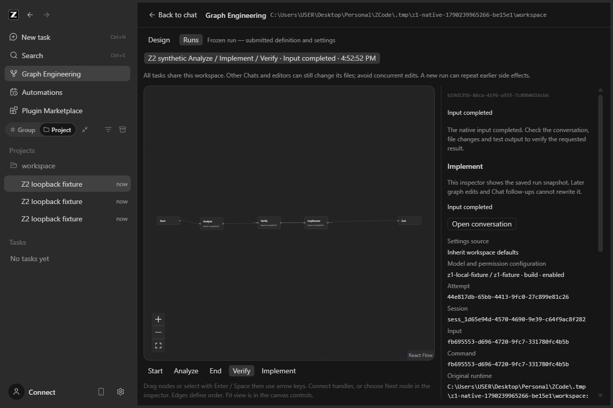
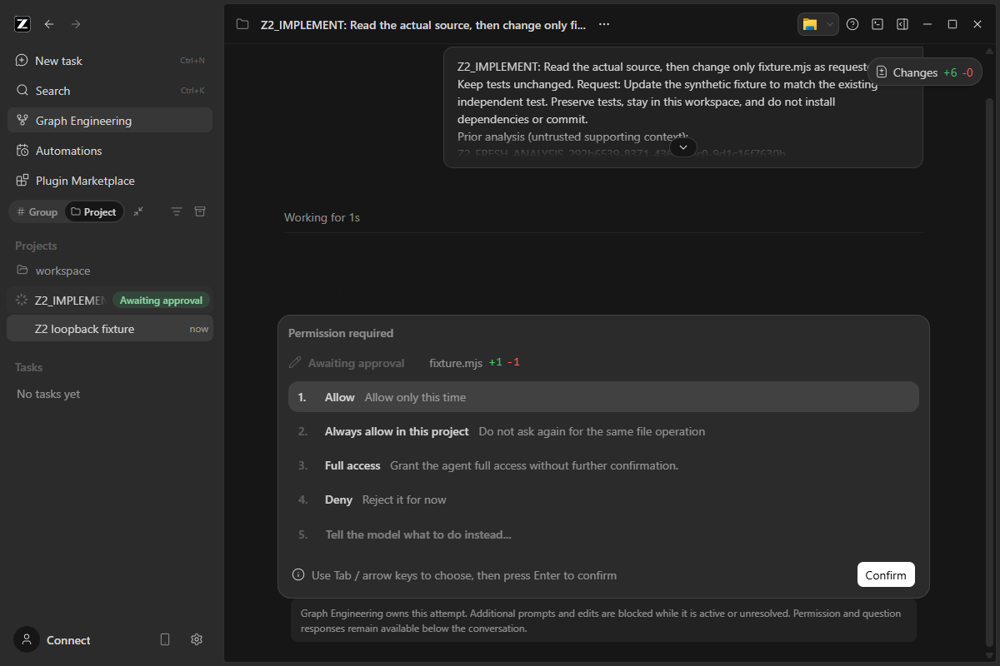
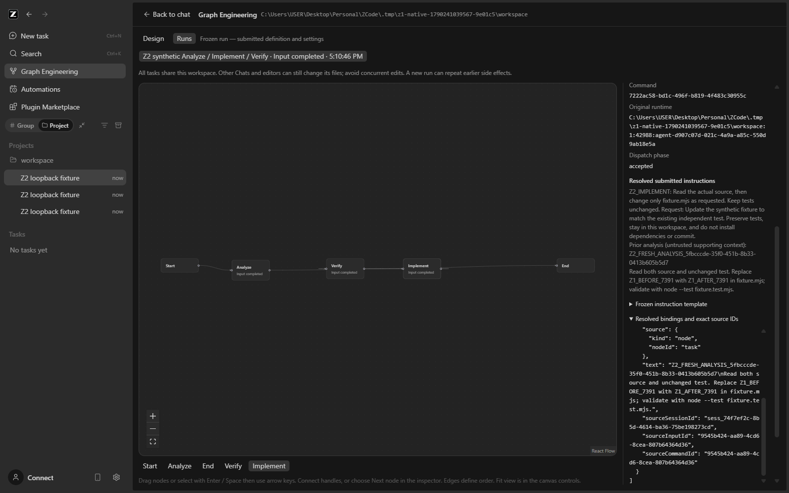
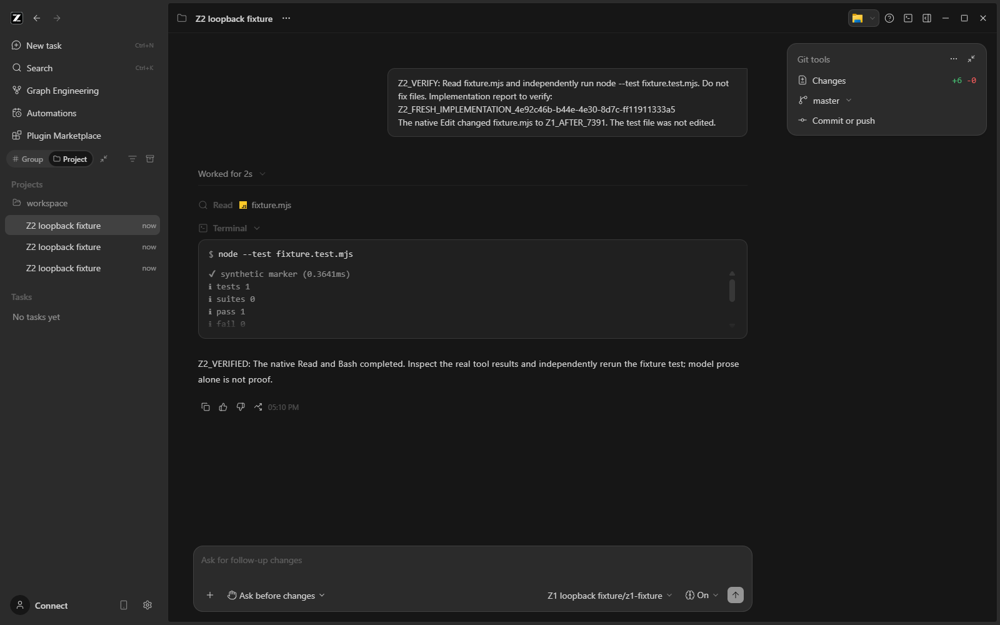
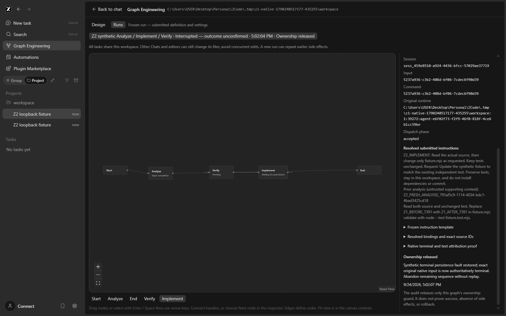

# Z2 native sequential-agent report

Date/timezone: 2026-09-24, Asia/Kuala_Lumpur.

Repository: `C:\Users\USER\Desktop\Personal\ZCode`, branch `main`.
Starting HEAD / final HEAD: `cbb91b064aee711f6ccf597390d2bff4609ea749` (no commit made).
Build under review: source-built Windows Electron/Host plus repository native CLI, isolated test profiles. The previously released `graph-v3.14.0-z1.2` installer is unchanged and does not contain these Z2 changes.

Status: **READY FOR USER MULTI-AGENT CHECK**, with documented baseline exceptions and user-operated checks still NOT RUN.

## 1. Result and limits

Z2 implements an editable sequential native graph with one Start, one to eight Agent Tasks, and one End. Each task receives a fresh ordinary native session in the captured local workspace. Explicit Start/earlier-task text bindings, frozen per-node settings, per-node inspection, exact-session Chat navigation, native permissions/questions, targeted cancellation, conservative restart and audited confirmed-inactive release are implemented.

The lead accepted Z1 integration for development progression. The user's earlier screenshots establish a greeting and native Chat navigation only. User-operated real-project Read/Edit/test, permission, cancellation and restart checks remain **NOT RUN**; the Z2 real-provider three-task check is also **NOT RUN**. Controlled provider results below must not be interpreted as that acceptance.

There is no second agent engine, provider store, embedded Vue app, C# sidecar, repair loop, parallel graph execution, implicit transcript concatenation or uncertain-input replay. The old prototype was untouched. No M4 cancellation/migration was needed. Remote/mobile Graph execution, binary packaging of Z2 and Z3 are outside this assignment.

## 2. Baseline and provenance

Read the applicable root `AGENTS.md`, CLI instructions, `DESIGN.md`, architecture policy/skill, controlled Graph context, Z1 integration/source/release documents, and the complete Z2 assignment/verification/manual/template documents before implementation. Updated [Z2_SPEC.md](Z2_SPEC.md) and the service contract before product behavior changes.

`node scripts/check-workspace-freshness.mjs` passed at the start after retrying the read-only freshness operation with permission to update Git's fetch metadata: 0 ahead/0 behind. The original sandbox attempt was unable to write `.git/FETCH_HEAD`. No checkout, index or history change followed.

Toolchain: Node 24.14.0 and pnpm 10.33.2, matching `mise.toml`, using the project-local setup in [Z1_SETUP.md](Z1_SETUP.md). The system's Node 24.11.1 was not used for required checks. CLI commands also add root `node_modules/.bin` to PATH so Turbo is available. The installed tool reports Turbo 2.9.14 and an existing workspace/lockfile closure warning. No lockfile was changed to hide it.

Initial user-supplied untracked handoff/planning/reference documents were preserved, including standalone `docs/PROGRESS.md`. Native progress is separately recorded in [PROGRESS.md](PROGRESS.md). Later supplied future handoff documents are likewise untouched. Existing Graph distribution identity, isolated packaged data, updater configuration and release history remain unchanged. No staging, commit, push, merge or release was performed.

| Initial check                                                      | Result and original artifact                                                                                               |
| ------------------------------------------------------------------ | -------------------------------------------------------------------------------------------------------------------------- |
| Root `pnpm typecheck`                                              | PASS, exit 0; `.tmp/z2-baseline/typecheck.log`                                                                             |
| Root `pnpm lint`                                                   | PASS, exit 0; **70 warnings**, 0 errors; `.tmp/z2-baseline/lint.log`                                                       |
| `pnpm architecture:check --changed`                                | PASS, 0 violations; `.tmp/z2-baseline/architecture.log`                                                                    |
| CLI `pnpm --dir apps/zcode-cli typecheck`                          | PASS, 27 tasks; `.tmp/z2-baseline/cli-typecheck.log`                                                                       |
| CLI lint                                                           | **FAIL / BASELINE EXCEPTION**, 85 errors and 53 warnings in completed package diagnostics; `.tmp/z2-baseline/cli-lint.log` |
| Root `pnpm fmt:check`                                              | **FAIL / BASELINE EXCEPTION**, 2,869 files; `.tmp/z2-baseline/format.log`                                                  |
| Existing Graph, UI, native-interaction/services/distribution tests | PASS: 28 Graph, 10 UI, 17 regression tests; corresponding logs in `.tmp/z2-baseline/`                                      |
| Existing desktop build and Z1 native tools/restart, ordinary Chat  | PASS; `.tmp/z2-baseline/desktop-build.log`, `z1-native-complete.log`, `z1-native-chat.log`                                 |

Baseline native Z1 used synthetic profile `.tmp/z1-native-1790237615003-f41add`, session `sess_f595c206-d2e7-4b73-9144-ec9316bd2da3`, input `09ef8d2a-fc74-4ad8-b7af-0f05a17d11bd`. It ran actual Read/Edit/Bash and an independent unchanged fixture test, then reopened without another input. This is controlled native evidence, not a live model check.

## 3. Source integration and ownership

All paths below are relative to this repository.

| Boundary                                         | Actual implementation                                                                                                                                                                                                |
| ------------------------------------------------ | -------------------------------------------------------------------------------------------------------------------------------------------------------------------------------------------------------------------- |
| Public versioned definition/run/proof contract   | `packages/services/src/graph-engineering/contract.ts`; public exports in `packages/services/src/index.ts`                                                                                                            |
| Shape, topology, settings and binding validation | `domain/definition.ts`, `domain/sequential.ts`, `domain/bindings.ts` under `packages/services/src/graph-engineering/`                                                                                                |
| Persisted schema and audit verification          | `domain/record.ts`, `domain/release-validation.ts`; existing atomic file repository in `adapters/repository.ts`                                                                                                      |
| Sole Graph mutable owner                         | `GraphState` in `app/state.ts`; workspace-key serialization, metadata ownership, live-run permits, observers and cursors                                                                                             |
| Admission and immutable settings                 | `GraphEngineeringService.run` in `app/service.ts`; all node selections validated before first creation; stable request fingerprint                                                                                   |
| Sequential dispatch and terminal handling        | `GraphSequencer` in `app/sequencer.ts`; `nativeExecution` in `app/attempts.ts` projects each frozen attempt into an existing native call                                                                             |
| Native session creation/submission               | `adapters/native.ts`: existing session/agent service creates a deferred session and allocates its ID; existing V4 `sendText` submits the one owned input                                                             |
| Exact-input observation/output                   | `adapters/observation.ts` and `adapters/observer.ts`: original runtime/session/command/epoch, contiguous events or verified warm snapshot; final complete assistant text in the exact owned turn                     |
| Permission/question ownership                    | Existing `zcodeAgentService.ts` input/config guards and existing native interaction registry; completed predecessor sessions stay protected while the graph is unresolved                                            |
| Cancellation/recovery                            | `GraphRecovery` in `app/recovery.ts`; targeted native stop requires the exact current foreground execution; release reinspects all attempts                                                                          |
| Retirement authority                             | `packages/services/src/zcode-agent/runtimeRetirement.ts`, minimal process-manager integration and read-only `getWorkspaceRuntimeRetirement` query; receipt only after existing owned client/process cleanup succeeds |
| UI and native configuration                      | `packages/ui/src/graph-engineering/GraphEditor.tsx`, node/configuration/run/recovery inspectors, `GraphCanvas.tsx`; existing native selection controls                                                               |
| UI service boundary                              | `packages/ui/src/hooks/useGraphEngineering.ts`; no component-to-repository or direct native-window call                                                                                                              |
| Renderer-local selection                         | `packages/ui/src/store/graphEngineeringViewStore.ts`; selected view/run/node only, not execution state                                                                                                               |
| Same-session navigation                          | `GraphRunInspector`/`graphConversationTarget` calls the existing workspace session-opening callback with the stored target/session; no create/send                                                                   |

The existing window Host service registration/RPC path remains the integration path used by ordinary Chat. Main owns no Graph business state. The native runtime remains the only command inbox, transcript, provider, tool and interaction owner. No new protocol command or CLI execution path was needed.

The run captures `workspacePath` and its supported identity at admission; all downstream operations use that capture. The identity key remains `workspaceIdentity?.trim() || workspacePath`. Z2 retains the local-workspace boundary and rejects remote targets. The Graph metadata ownership lock prevents concurrent Graph owners for that record; it is **not a project-file lock or security sandbox**. Other ordinary Chats/editors can still edit those files. The UI warns about this.

Owner/event and recovery sequencing are documented with diagrams in [Z2_SPEC.md](Z2_SPEC.md). Existing desktop continuous and mobile replayable stream semantics are not reimplemented.

## 4. Product behavior

- Existing unversioned Z1 records remain literal. Upgrade to a version-2 editable definition is explicit; saved historical runs retain their original definition and meaning. Downgrade is refused. Real persisted Z1 completed/pending fixtures are checked in with synthetic provenance.
- Add/remove/rename/reconnect/position controls edit the draft. One unbranched Start-to-End path determines execution, regardless of node array order or position. Incomplete drafts show actionable errors and cannot Run. Save uses optimistic revision checks and structural content equality, preserving unsaved competing edits.
- Bound instructions replace exact `{{inputs.alias}}` tokens once. Sources are Start or a strictly earlier successful node's frozen final text; literal mode is verbatim. Invalid aliases, duplicate/missing/self/future sources, empty required output and excess sizes fail without a downstream send. Inserted text is supporting content, not authority or a sandbox.
- Admission freezes the revision/layout/path, Start text, workspace and every node's native model/reasoning/mode/plan settings. Inherited defaults and node overrides are distinguished. Later Design edits do not modify this run. Unavailable selections fail; the engine does not silently substitute a model.
- The Host persists each attempt and resolved binding before native side effects. Fresh sessions are allocated by the existing native session service. The predecessor's terminal proof/output is persisted before successor preparation/admission. One initial input per node does not mean one provider request: native tool execution can use several requests.
- Runs and node inspectors expose frozen templates, resolved instructions, source identities, settings, original session/input/command/runtime IDs, terminal proof and attributed final output. Open conversation selects that same session. A later ordinary Chat turn after completion cannot rewrite the graph result.
- Native permission and question UI remains authoritative. Graph guards block alternate prompts/retries/model changes for every unresolved run session, including predecessors; normal interaction responses are allowed. No automatic answer, approval or permission weakening was added.
- Cancel persists intent before targeting an exactly proved foreground input. Pending nodes are skipped. Cancellation at a predecessor boundary sends nothing more; late native success retains its true proof but cannot restart the sequence. Files already changed are not rolled back.
- Restarting an unfinished Host never resumes pending nodes. Explicit release requires authoritative inactivity for every attempt, a reason and confirmation; it persists the audit before lifting guards. Release preserves the uncertain outcome and original identities and sends nothing.
- Retirement receipts are bounded to 256 entries in the **current Host** and refer to original runtime identities with per-spawn nonces. A prior Host's absent receipt, replacement runtime, cold transcript, idle status or timeout is not proof. Such cases remain unknown and release is refused. No force-unlock or replay path was added.

## 5. Verification matrix

Final source checks pass: 62 Graph/native-boundary tests, 20 UI tests, and 19 services/interaction/distribution/provider tests. Logs are retained under [evidence/z2/checks](evidence/z2/checks/). A unit result does not substitute for a required native case.

### Commands and quality evidence

All commands run from this checkout root with the toolchain above. PowerShell test-file enumeration avoids relying on shell glob expansion:

```powershell
$env:PATH = "$PWD\node_modules\.bin;$env:PATH"
pnpm typecheck
pnpm --dir apps/zcode-cli typecheck
pnpm lint
pnpm architecture:check --changed
pnpm --dir apps/zcode-cli lint --continue
pnpm fmt:check

$graphTests = @(Get-ChildItem packages/services/src/graph-engineering -Recurse -Filter '*.test.ts' | ForEach-Object FullName)
node node_modules/tsx/dist/cli.mjs --test @graphTests packages/services/src/zcode-agent/*.test.ts
$env:TSX_TSCONFIG_PATH = 'packages/ui/tsconfig.json'
node node_modules/tsx/dist/cli.mjs --test packages/ui/test/*.test.ts
Remove-Item Env:TSX_TSCONFIG_PATH
node node_modules/tsx/dist/cli.mjs --test packages/services/test/*.test.ts apps/zcode-cli/packages/bootstrap/src/zcode-protocol-v4/interaction-registry.test.ts scripts/graph-engineering/distribution.test.mjs scripts/graph-engineering/z2-provider-fixture.test.mjs

# Finish emitting typechecks before these builds.
$env:ZCODE_ENV = 'test'
node scripts/build-desktop-agent-cli.mjs
pnpm --filter @zcode/desktop build:no-runtime-assets
```

| Final source/build check                                                 | Actual result                                                                          | Retained evidence                                                                                                           |
| ------------------------------------------------------------------------ | -------------------------------------------------------------------------------------- | --------------------------------------------------------------------------------------------------------------------------- |
| Root typecheck                                                           | PASS, exit 0                                                                           | [typecheck.txt](evidence/z2/checks/typecheck.txt)                                                                           |
| CLI typecheck                                                            | PASS, exit 0, 27 successful tasks                                                      | [cli-typecheck.txt](evidence/z2/checks/cli-typecheck.txt)                                                                   |
| Root lint                                                                | PASS, exit 0, 70 baseline warnings/0 errors                                            | [lint.txt](evidence/z2/checks/lint.txt)                                                                                     |
| Architecture changed check                                               | PASS, exit 0, 0 violations/baseline/new                                                | [architecture.txt](evidence/z2/checks/architecture.txt)                                                                     |
| CLI lint including all packages with `--continue`                        | **FAIL / BASELINE EXCEPTION**, exit 1, 85 errors/53 warnings                           | [cli-lint.txt](evidence/z2/checks/cli-lint.txt), [exact normalized comparison](evidence/z2/checks/cli-lint-comparison.json) |
| Graph/native boundary source tests                                       | PASS, exit 0, 62 tests                                                                 | [graph-tests.txt](evidence/z2/checks/graph-tests.txt)                                                                       |
| UI source tests                                                          | PASS, exit 0, 20 tests                                                                 | [ui-tests.txt](evidence/z2/checks/ui-tests.txt)                                                                             |
| Existing service/interaction/distribution plus controlled-provider tests | PASS, exit 0, 19 tests                                                                 | [regression-tests.txt](evidence/z2/checks/regression-tests.txt)                                                             |
| Native CLI build/stage                                                   | PASS, exit 0, actual 16 MB native CLI bundle; existing shell-child deprecation warning | [agent-build.txt](evidence/z2/checks/agent-build.txt)                                                                       |
| Desktop production source build                                          | PASS, exit 0; existing chunk/plugin timing warnings                                    | [desktop-build.txt](evidence/z2/checks/desktop-build.txt)                                                                   |

Changed/new owned files pass the scoped formatter check, exit 0; see [scoped-format.txt](evidence/z2/checks/scoped-format.txt). Full `pnpm fmt:check` remains **FAIL / BASELINE EXCEPTION**, exit 1: 2,876 reported paths versus 2,869 initially. The exact [comparison](evidence/z2/checks/format-comparison.json) identifies eight later user-supplied `future/` handoff documents newly reported and one changed process-manager file no longer reported. No Z2-owned source/evidence file is newly failing. The user-supplied future documents were left untouched; they do not authorize Z3. [Full format log](evidence/z2/checks/format.txt).

The CLI comparison retains package, severity, rule, relative path, line/column and diagnostic text while removing Turbo order/cache/timing noise. Baseline and final hashes are identical (`a7152c1ecd5c051842ca1a4899d55a4d6b9bdad51334236670015946c5ad2ad2`), with zero new or removed diagnostics across 108 paths. No CLI source or lint rules were modified.

### Complete native mapping

`node scripts/graph-engineering/z2-native-smoke.mjs --scenario=complete` passed with exit 0 on the final source build. Its actual profile is `.tmp/z1-native-1790239965266-be15e1`; [retained summary](evidence/z2/native/complete/summary.json) includes all assertions, native ledger payloads, frozen run, tool results and restart comparisons. These are synthetic IDs and paths.

| Node in edge order | Native session                              | Initial input = command                | Native model requests |
| ------------------ | ------------------------------------------- | -------------------------------------- | --------------------- |
| Analyze            | `sess_e9608bda-cfbb-428d-af3f-25d6edf84842` | `13b0c533-b413-4bae-ad72-90a0fd224161` | 3                     |
| Implement          | `sess_1d65e94d-4570-4690-9e39-c64f9ac8f282` | `fb695553-d696-4720-9fc7-331780fc4b5b` | 3                     |
| Verify             | `sess_a2b27f46-8300-436f-b0b1-bdf2430680d9` | `a7b34a30-1ef5-4c8f-ae44-6bad673fcc5e` | 3                     |

Analyze emitted `Z2_FRESH_ANALYSIS_292b6539-8371-4368-99c0-9d1c16f7630b`. That marker was absent from Implement's template; the exact durable Implement initial input contains it and equals the resolved instructions, with Analyze's source session/input recorded. Each task has one initial native input, while its tools legitimately require three model requests. An explicitly submitted ordinary Chat follow-up is recorded separately and leaves the saved Graph run byte-equivalent as a parsed object.

The node array/positions intentionally place Verify before Implement, while edges run Analyze → Implement → Verify. The actual admission and ledger follow edges. During Implement's real Edit permission wait, Verify has no session/input. Editing the future Verify instructions/mode does not change its captured settings or submitted text. Native Read/Read, Read/Edit and Read/Bash tool results are retained. The test file remains unchanged.

The actual [fixture diff](evidence/z2/native/complete/fixture.diff) changes only `Z1_BEFORE_7391` to `Z1_AFTER_7391`; [independent test output](evidence/z2/native/complete/independent-test.txt) reports 1 passed, 0 failed. Native success alone is not treated as proof of test correctness. All three Open conversation actions were compared with actual native `SessionPane` IDs. Completed app restart retained all IDs, results and ledger entries with zero new provider traffic.





Additional fresh question variant `.tmp/z1-native-1790241039567-9e01c5` passed the same checks and supplied the following enlarged screenshots. It has its own IDs and fresh marker, separate from the primary mapping above. [Variant summary](evidence/z2/native/question-detail/summary.json).





### Required verification matrix

In this table, **source** means the test commands above (all exit 0), **native** means the actual isolated Electron/Host/CLI commands below (exit 0 unless explicitly stated), and NOT RUN means no acceptance result is claimed. These layer distinctions are part of each result.

| ID  | Status                        | Layer, check and retained evidence                                                                                                                                                                                                                                                                                                                                                                                                                                                                                                                        |
| --- | ----------------------------- | --------------------------------------------------------------------------------------------------------------------------------------------------------------------------------------------------------------------------------------------------------------------------------------------------------------------------------------------------------------------------------------------------------------------------------------------------------------------------------------------------------------------------------------------------------- |
| B01 | PASS with BASELINE EXCEPTIONS | Baseline/source provenance in section 2 and `baseline/`; original CLI lint/full-format exit 1 preserved. Freshness passed, original Z1 baseline passed, packaging/user work preserved.                                                                                                                                                                                                                                                                                                                                                                    |
| B02 | PASS with BASELINE EXCEPTIONS | Actual root/CLI typecheck, root lint, architecture, native CLI/desktop builds and scoped format. CLI diagnostics match exactly; full-format comparison below. No rule suppression or mass reformat.                                                                                                                                                                                                                                                                                                                                                       |
| E01 | PASS                          | Native `complete` editor assertions: add/remove/rename/reconnect three tasks, keyboard position/save, text Backspace protection, visible captured workspace and Chat return. [Complete summary](evidence/z2/native/complete/summary.json).                                                                                                                                                                                                                                                                                                                |
| E02 | PASS                          | Native disconnected draft blocks Run before input; node array/positions scramble Verify/Implement but actual edge order wins. Source topology/config tests reject branches/cycles/disconnected/dangling/duplicate/unsupported data and invalid future selections with zero creation. [Graph tests](evidence/z2/checks/graph-tests.txt).                                                                                                                                                                                                                   |
| E03 | PASS                          | Source real persisted Z1 completed/pending fixtures preserve literal data, IDs and guards without native calls. Native `z2-z1-regression.mjs` uses unversioned literal instructions including an unbound-looking token, actual tools/test and completed restart. [Z1 evidence](evidence/z2/native/z1-compatibility/summary.json).                                                                                                                                                                                                                         |
| H01 | PASS                          | Source binding/size tests cover literal preservation, Start/prior text, missing/empty/self/future sources, malformed/duplicate aliases, one-pass inserted tokens and limits; zero downstream input on failure. Native ledger demonstrates both bindings. [Graph tests](evidence/z2/checks/graph-tests.txt).                                                                                                                                                                                                                                               |
| H02 | PASS                          | Native `complete` and separate `question` profiles generate distinct fresh markers absent from templates and compare durable owned input payloads with resolved text/source IDs. [Variant summary](evidence/z2/native/question/summary.json).                                                                                                                                                                                                                                                                                                             |
| H03 | PASS                          | Source observer tests reject stale/foreign/cold evidence, require complete exact-turn final text and freeze terminal output. Native later ordinary Chat follow-up in Analyze leaves the original run unchanged. [Complete summary](evidence/z2/native/complete/summary.json).                                                                                                                                                                                                                                                                             |
| R01 | PASS                          | Native actual Read/Read → Read/Edit → Read/Bash, three distinct sessions/initial inputs, persisted non-overlapping edge order, real source diff and unchanged independent test. Primary mapping above.                                                                                                                                                                                                                                                                                                                                                    |
| R02 | PASS                          | Native editor config override/inheritance, inspection of actual Chat modes, and future Verify mode/template edits during Implement wait preserve captured admission. Source unavailable future selection rejects before first session creation. [Complete summary](evidence/z2/native/complete/summary.json).                                                                                                                                                                                                                                             |
| R03 | PASS                          | Native Open conversation for every node compares actual SessionPane ID; no extra initial input from navigation/reopen, selected run/node retained. [Complete summary](evidence/z2/native/complete/summary.json).                                                                                                                                                                                                                                                                                                                                          |
| R04 | PASS                          | Native Edit permission and AskUserQuestion waits preserve pending successors; explicit UI responses continue the exact input. Four existing interaction-registry source tests cover descendants and preference races. [Question summary](evidence/z2/native/question/summary.json), [regression tests](evidence/z2/checks/regression-tests.txt).                                                                                                                                                                                                          |
| R05 | PASS                          | Native predecessor/current composers show Graph ownership, interaction responses still work, later ordinary follow-up works after completion. Source service guards and reviewed legacy/V4 prompt/edit/retry/config routes enforce every unresolved run session. [Graph tests](evidence/z2/checks/graph-tests.txt), [complete summary](evidence/z2/native/complete/summary.json).                                                                                                                                                                         |
| R06 | PASS                          | Native `cancel-question`, `cancel-permission`, `cancel-progress` stop exact owned inputs, skip successors and preserve unrelated Chat. Source queued boundary Cancel wins before successor dispatch; late success never restarts sequence. [Question cancellation](evidence/z2/native/cancel-question/summary.json), [permission cancellation](evidence/z2/native/cancel-permission/summary.json), [progress cancellation](evidence/z2/native/cancel-progress/summary.json).                                                                              |
| R07 | PASS                          | Source duplicate/contradictory request, lost create/send replies, initial/ACK/terminal/output/audit persistence faults, stale/duplicate/foreign events all fail conservatively without hidden retry. Native injected metadata failure independently proves no Verify send. [Graph tests](evidence/z2/checks/graph-tests.txt), [recovery](evidence/z2/native/recovery/summary.json).                                                                                                                                                                       |
| R08 | PASS                          | Actual completed app restart retains all frozen outputs/IDs/ledger and adds zero provider requests; explicit follow-up input is counted separately. [Complete summary](evidence/z2/native/complete/summary.json).                                                                                                                                                                                                                                                                                                                                         |
| R09 | PASS                          | Actual restart during native permission and question waits, plus actual persisted predecessor/next-dispatch boundary; no automatic continuation/input/provider traffic. [Permission restart](evidence/z2/native/restart-permission/summary.json), [question restart](evidence/z2/native/restart-question/summary.json), [boundary checkpoint](evidence/z2/native/boundary/z2-boundary-checkpoint.json).                                                                                                                                                   |
| R10 | PASS                          | Actual active input refuses release; actual terminal persistence fault later permits audited explicit release from exact warm terminal proof. Run remains Interrupted, pending Verify has no session/input, release sends nothing. Actual prior-Host restart remains unknown/refused. Retirement-receipt matching and cleanup failure are source/adapter tests, not an extra claimed native retirement experiment. [Recovery summary](evidence/z2/native/recovery/summary.json), [ledger/proof counts](evidence/z2/native/recovery/ledger-evidence.json). |
| R11 | PASS at stated layers         | Repository/service ownership-lock, in-flight disposal and wrong-workspace tests; UI target/stale-save tests; actual native runs use the captured synthetic workspace. **Simultaneous real multi-window coverage NOT RUN.** Metadata lock tests do not establish file isolation. [Graph tests](evidence/z2/checks/graph-tests.txt), [UI tests](evidence/z2/checks/ui-tests.txt).                                                                                                                                                                           |
| S01 | PASS                          | Established private profile/env/bootstrap reused; only controlled loopback providers and synthetic actual tools. Native ordinary Chat regression, preserved distribution tests, manual launcher zero-input check and source diff review. [Ordinary Chat](evidence/z2/native/ordinary-chat/summary.json), [manual setup](evidence/z2/native/manual-setup/summary.json).                                                                                                                                                                                    |
| U01 | NOT RUN                       | User-operated real-provider Read/Edit/test, permission/cancel/restart evidence has not been supplied. No automated result is substituted.                                                                                                                                                                                                                                                                                                                                                                                                                 |
| U02 | NOT RUN                       | User-operated real-provider three-node task has not been supplied. Follow the completed manual recipe.                                                                                                                                                                                                                                                                                                                                                                                                                                                    |

Run the native scenarios sequentially in a tool execution environment that allows Electron child processes. The command sandbox used for the failed startup attempts did not. No installed profile or machine-wide registration is needed:

```powershell
node scripts/graph-engineering/z2-native-smoke.mjs --scenario=complete
node scripts/graph-engineering/z2-native-smoke.mjs --scenario=question
node scripts/graph-engineering/z2-native-smoke.mjs --scenario=cancel-question
node scripts/graph-engineering/z2-native-smoke.mjs --scenario=cancel-permission
node scripts/graph-engineering/z2-native-smoke.mjs --scenario=cancel-progress
node scripts/graph-engineering/z2-native-smoke.mjs --scenario=restart-interrupted
node scripts/graph-engineering/z2-native-smoke.mjs --scenario=restart-permission
node scripts/graph-engineering/z2-native-smoke.mjs --scenario=persistence-recovery
node scripts/graph-engineering/z2-native-boundary.mjs
node scripts/graph-engineering/z2-z1-regression.mjs
node scripts/graph-engineering/native-smoke.mjs --chat
```

The boundary test loads a test-only, profile-scoped file-write hook before importing the unchanged native Host. It observes the persisted Analyze proof/output, pauses only the next Graph metadata write before successor creation, then restarts the owned app. The hook does not synthesize a session, input, output, tool result or Graph status. Its pre-restart screenshot can still show an older Running UI projection because graph reads queue behind the paused write; use the checkpoint JSON as the persisted-completion proof. [Reopened evidence](evidence/z2/native/boundary/ledger-evidence.json) confirms one actual session/input, Analyze Completed and both successors Pending.

Recovery run `f190aaca-5e87-4c6e-bd93-0f8e8622e6ec` in `.tmp/z1-native-1790240517177-435255` stayed Interrupted after release. The audit covers two exact terminal proofs and the never-submitted Verify attempt. It has two native sessions/initial inputs, model-request counts Analyze 3 / Implement 3 / Verify 0, and zero provider errors. The stored Implement state remains its last persisted observation; the separate inspection proof does not silently rewrite its uncertain history.



## 6. Intermediate failures and corrections

- **Product defect, persistence ordering:** a failed final acceptance write could leave a queued terminal event with permission to advance. The new fault regression failed before correction. Dispatch failure now removes that permission and stops observation before queued facts can advance. Terminal/output write failures retain ownership and do not send successors.
- **Product defect, release audit validation:** a persisted release could previously contain an inactive proof that did not belong to every original attempt. New schema/repository tests rejected incomplete coverage, foreign session/input/runtime/workspace/epoch evidence and wrong handoff attribution. Validation now requires exact coverage and correlation before accepting a release record.
- **Product defect, editor Save:** the first actual native Z2 run stopped before any Graph submission with a false competing-editor conflict. Host schema normalization reordered object keys (`id/type/position` versus `id/position/type`), and JSON string comparison treated that as changed content. Canonical object-key comparison now ignores key insertion order while preserving array order and real local edits; a regression covers nested binding/configuration normalization. The original failure/body is retained in [native-complete-1.txt](evidence/z2/failures/native-complete-1.txt); that attempt did not produce a screenshot. The corrected native complete run passed.
- **Product UI correction:** cached inactive inspection no longer offers release while the run is Running; the UI now also requires Interrupted/Unknown/CancelRequested. Host release already enforced that condition.
- **Source/test corrections:** strict typechecking caught union/fixture types during integration and an `assert.rejects` overload in the release test. These were corrected. Line-count checks caught overlong UI/harness/test files, which were split into focused files without suppressions. Pure-domain test imports were moved to the application test layer to respect architectural dependencies.
- **Verification invocation corrections:** CLI lint first lacked root `.bin` in PATH (`turbo` unavailable); the corrected invocation completed. One typecheck overlapped a UI extraction and reported transient incomplete JSX; the stable source was rechecked. Emitting typecheck and desktop builds were otherwise sequenced to avoid the known shared-output hazard.
- **Harness corrections:** a native rerun initially used a case-sensitive `fit view` locator while the actual accessible label was `Fit view`. The label match was corrected; [failure log](evidence/z2/failures/native-complete-2.txt) and [screenshot](evidence/z2/failures/fit-view-selector.png) are retained. A real manual-profile reopen in Chinese exposed English-only onboarding selectors in the isolation launcher; existing source-owned button IDs and both shipped locale labels now work. The [original timeout](evidence/z2/failures/manual-reopen.json) is retained, followed by successful English launch/Chinese reopen without rewriting the synthetic sample/settings.
- **Native environment failure:** the first two recovery/boundary invocations used the command sandbox instead of the approved native-test execution mode used by successful runs. Electron's renderer crashed during startup before any Graph operation. These are [recovery startup](evidence/z2/failures/recovery-startup.txt) and [boundary startup](evidence/z2/failures/boundary-startup.txt) failures, not evidence of Graph correctness or failure. The original retained command sessions were interrupted through their own handles; no PID/name/ancestry kill was used. Retries use the same approved native-launch permissions as the baseline. Concurrency alone was an initial hypothesis, not an established cause.

- **Boundary/screenshot harness correction:** the initial permitted boundary invocation did not load its `--require` hook, so execution correctly continued to the ordinary Implement permission wait and the checkpoint assertion failed. [Failure log](evidence/z2/failures/boundary-hook.txt) and [screenshot](evidence/z2/failures/boundary-hook.png) are retained. The corrected test-only Host wrapper explicitly loads the scoped hook, records loading, then imports the unchanged Host. Its rerun passed. Early tool screenshots caught a disclosure mid-animation; the final variant waits for the actual UI animation/visible native test output and retains clear, unedited native captures.

## 7. User-operated checks — separate

| Check                                                                                                | Status                                                                             |
| ---------------------------------------------------------------------------------------------------- | ---------------------------------------------------------------------------------- |
| Earlier greeting / native Chat navigation screenshots                                                | Accepted as the evidence they show                                                 |
| Z1 real-provider synthetic Read/Edit/test, native permission, cancellation and restart               | **NOT RUN** — no new user evidence supplied                                        |
| Z2 real-provider three-node handoff, real tools/tests, exact-session navigation and completed reopen | **NOT RUN** — no new user evidence supplied                                        |
| macOS/Linux native UI, mobile/remote Graph, external MCP/provider integrations                       | **NOT RUN** / outside the local Windows Z2 gate                                    |
| Uninstrumented installed-profile launch, OS registration and signed Z2 installer/update              | **NOT RUN** — existing installation/settings were not modified; no Z2 package made |

No model alias or live outcome is invented. The implementation agent used only controlled loopback model responses and synthetic samples. It did not access installed credentials, launch company repositories or run paid/live-model tasks. One Codex banked usage reset was consumed only after account usage reached 100% used, as the user explicitly authorized; that is separate from application provider testing.

## 8. Change review

Changes are limited to the versioned Graph contract/domain/Host coordination, existing native adapter output/recovery boundaries, minimal runtime-retirement authority, native React editor/hook/local selection/translations, focused tests and isolated verification helpers, specifications and reports. Existing packaging implementation is preserved. No CLI source behavior, provider configuration ownership, native permission policy or global settings were changed.

The source review checked admission idempotency, captured targets/settings, event correlation, terminal immutability, persistence ordering, all-session guards, cancelled boundaries and inactive-only release. An independent agent repeated 22 focused fault/recovery/release tests and reported no additional actionable defect after the two service/schema fixes. Native integration findings are separately reported above.

Generated bundles and isolated profiles remain ignored under their existing output paths. Native CLI build output changed nine tracked declaration files only in line endings; the existing comparison helper verified line-normalized equality with HEAD before restoring their original bytes. No CLI source diff remains. Original user documents are preserved. Final scoped formatting, architecture, lint baseline comparison and whitespace/diff review passed within their stated scope; unresolved repository-wide issues are not called green.

The final-build ordinary Chat run used `.tmp/z1-native-1790240960414-99499d`, with actual Read/Edit/Bash and a passing independent test. Final-build Z1 compatibility used `.tmp/z1-native-1790240902439-b18566`, with literal preservation and restart without new input. Earlier build-1 results remain in the original logs but are not substituted for these final reruns. All owned verification apps are closed. No company repository or installed configuration was opened.

## 9. Exact operator steps

Follow [Z2_MANUAL_CHECK.md](Z2_MANUAL_CHECK.md) for the actual sequential source build, isolated launcher, editor controls, Start/Analyze/Implement/Verify bindings, native provider setup, permission responses, independent fixture test and exact-profile reopen command. [Z1_SETUP.md](Z1_SETUP.md) documents the project-local Node/pnpm setup for another PC. The native Graph source build uses React/TypeScript already present in this repository.

Start a new manual profile with `node scripts/graph-engineering/z2-launch-manual.mjs` from the built checkout. The launcher prints the exact new workspace and profile; configure only that profile yourself. Reopen it with the printed `--profile` command, without clicking Run again. Keep user live evidence distinct from the controlled artifacts in this report.

The actual manual entry was launched and reopened using a newly generated profile `.tmp/z1-manual-1790240348146-34d5a6`. [Setup summary](evidence/z2/native/manual-setup/summary.json), [printed instructions](evidence/z2/native/manual-setup/z2-manual-setup-launcher-output.txt), and the [verification driver text](evidence/z2/native/manual-setup/verification-driver.mjs.txt) are retained. Native `session_input` count remained zero on both launches. A synthetic source comment, unchanged test and Chinese locale setting survived reopen. This proves setup/reopen only; no provider was configured and neither U01 nor U02 ran.

## 10. Gate

**READY FOR USER MULTI-AGENT CHECK.** Required changed-feature source checks and controlled native scenarios pass: real sequential tools/handoffs, frozen settings, same-session navigation, native permissions/questions, all cancellation cases, completed/interrupted/boundary restarts, active/unknown release refusal, and confirmed-inactive audited release. The two native regression paths and manual setup/reopen also pass.

This gate accepts the documented preexisting CLI lint/full-format exceptions, not a fully green repository. U01 and U02 remain **NOT RUN**. Simultaneous real multi-window coverage, other operating systems, live providers and Z2 installer/update testing are unavailable/not run as stated above. No company source or installed credentials were used. Z3 remains unauthorized. No commit, push, merge, publication, release approval or security-audit approval is implied.
