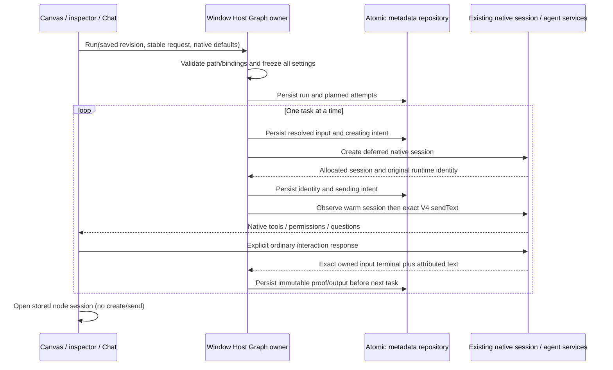

# Z2 implementation contract

Status: authorized development, 2026-09-24. Starting HEAD is `cbb91b064aee711f6ccf597390d2bff4609ea749` on `main`. Z1's native integration is accepted for progression only. User greeting/navigation screenshots do not prove matching session IDs, real Read/Edit/test, permissions, cancellation or restart. Those user-operated checks remain NOT RUN. The published Z1 Graph distribution and private profile behavior remain unchanged; this assignment authorizes no publication or Git mutations.

## Document and editor

Retain unversioned Z1 definitions and runs unchanged. Introduce explicitly versioned `version: 2` sequential definitions/runs and a version-2 storage envelope that accepts both formats. Opening or saving a Z1 document never reinterprets `{{inputs.*}}`; a user selects **Enable sequential editing** to copy its sole task into literal mode with inherited configuration. Historical definitions/results are never migrated or replayed.

A Z2 definition contains a unique Start with request text, one to eight Agent Tasks and a unique End selecting a task's output. All nodes have stable IDs and finite positions; tasks have names, instruction mode (`literal` or `bound`), instructions, input bindings and inherited/explicit native settings. Edges alone define one connected path; arrays and positions do not. Save permits incomplete topology/configuration in an otherwise valid document. Run rejects duplicate IDs, dangling/duplicate edges, branches, cycles, disconnected nodes, unsupported versions and invalid/missing configuration before creating any native session. The Host exposes the same readiness validator to the editor.

Limits (UTF-16 string lengths): names 200; IDs 200; 10 nodes/20 draft edges; Start request 100,000; instruction template 100,000; final output 100,000; resolved instructions 200,000; 16 bindings/task; alias 64 and `/^[A-Za-z][A-Za-z0-9_]*$/`; audit reason 2,000. Reject excess input, never silently truncate it. An oversized native final text remains a completed input with unusable output and a diagnostic; no dependent dispatch. Keep existing native diagnostic bound of 2,000 characters. Graph metadata stores text/settings references, never provider secrets.

Canvas is primary, with Design/frozen Run views and selected-node inspector. Add, rename, delete incident edges, reconnect and position editing are supported with keyboard-accessible controls and React Flow handles. Text editing must not trigger canvas deletion. History stays bounded beside the canvas. Selected workspace, view and settings sources remain visible. Native model/mode/reasoning controls write node overrides locally; ordinary workspace draft settings remain the source of inherited defaults. Changing them after admission does not change the run.

## Binding and native output

Each named binding chooses Start text or an earlier task's frozen final assistant text. Bound instructions substitute exact `{{inputs.alias}}` tokens once, without recursively interpreting inserted content. Unmapped/malformed tokens, unused malformed binding aliases, duplicate aliases, self/future/missing sources and empty required text are readiness/resolution errors. Literal mode preserves the entire instruction string verbatim and adds no context. Bindings never concatenate transcripts implicitly. Source text is untrusted supporting content; delimiters are not a security boundary.

At Run admission freeze the definition/layout revision, selected workspace identity/path, Start request, edge-derived task path and resolved native model/reasoning/mode/plan settings for every node. Validate all selections using existing provider registry projections, without paid probes or fallback. Before each task creation persist its resolved instructions and each binding's exact source/text/session/input correlation.

Observer accepts only same-session, same-command, same-epoch contiguous live facts or an explicitly verified warm original-runtime snapshot. On exact successful terminal header, take the final `assistantText` row for that header's `turnId`, require complete/nonblank text, and retain row/turn identity and terminal proof. No latest-message lookup, cold synthetic terminal proof or follow-up rewrite. Missing text may leave an input completed, but fails a required binding or selected End output without calling another agent.

## Owner, sequencing and persistence

The window Host Graph service is the sole graph owner. Native session/runtime remains the sole agent, provider, command inbox, transcript, interaction and tool owner. React edits drafts and invokes explicit commands; Main owns no Graph state. Existing local workspace routing and PID/token metadata lock remain authoritative. Graph does not lock project files against other Chats/editors; display a concurrent-edit warning. Remote/SSH/mobile Graph execution stays out of scope.

One unresolved graph per workspace key (`workspaceIdentity?.trim() || workspacePath`), one active task input. Each task gets a new ordinary deferred native session and one stable initial command/input ID. Native session service allocates session IDs. Dispatch phases `planned -> creating -> created -> sending -> accepted` are persisted before their side effects; loss of any reply never permits recreation/resend. Pending/skipped tasks do not create sessions. Persist the predecessor's exact terminal proof/output and successor preparation before successor native calls. Persistence failure never advances or releases ownership.

The stable Run request ID includes a fingerprint of captured target, revision and inherited settings; identical repetition returns the run, contradictory reuse fails. Navigation/refresh/reopen never creates sessions or sends work. Native tool execution may make multiple provider requests; assert one initial command per task, not one model request.

All sessions of an unresolved run remain protected, including completed predecessors. Block alternate prompts, edits/retries and model/mode mutations through existing Host guards; permit viewing, native permission/question responses and exact cancellation. Existing native descendant and preference-race protections remain. No automatic answers or global preference changes.

Desktop continuous observation is separate from existing mobile replayable delivery. Z2 changes neither transport semantics nor accepted input ownership/lease rules.

## Failure, cancellation and recovery

Run states retain Starting/Running/WaitingForPermission/WaitingForUser/CancelRequested/Completed/Failed/Cancelled/Interrupted/Unknown; task states add Pending/Skipped. Completed means native input completion, not test correctness. Definitive failure or binding failure skips descendants without repair. Cancellation persists run intent first, targets only a currently proved owned foreground input, and waits for native evidence. Even a late success after cancel intent cannot advance; preserve its actual proof, report cancellation of the remaining sequence. Between-node cancellation performs no native stop and skips unstarted tasks. No file rollback.

On Host reloading an unfinished run, stop automatic sequencing even if a warm transcript can prove a predecessor ended. Preserve terminal node evidence, mark run interrupted, inspect explicitly; never continue pending nodes automatically. Completed history remains immutable.

`inspectRecovery` performs reads only. It records exact original-runtime warm terminal evidence, active foreground evidence, or an explicit unknown reason. Existing lifecycle `unavailable`, idle, missing socket, new runtime, PID existence or timeout are never retirement proof. A minimal read-only native retirement query may expose a receipt keyed by workspace and original runtime identity, recorded only after existing managed-client disposal/owned-process termination succeeds; no receipt on failed cleanup. This receipt is Host-lifetime evidence, not a claim of cross-Host persistence. A previous Host's unproved runtime remains unknown.

Explicit `releaseInterrupted` requires a nonempty audit reason and confirmation. Serialize it after in-flight calls, re-inspect every uncertain attempt, and permit only authoritatively inactive work (exact original input terminal, proven original runtime retirement, or persisted never-submitted phase with no in-flight dispatch). Persist proof and released disposition before lifting only this graph's guards. Preserve status/outcome, session/input IDs and prior evidence; do not call abandoned work successful, roll back files or start another task. Active/unknown attempts are refused with inspectable reason. A new Run is a separate explicit action and may repeat side effects.

### Native runtime identity and retirement query

Persisted release audits must cover every original attempt exactly once and correlate each proof with that attempt's command/input, session, runtime, workspace and available epoch/terminal evidence. Never-submitted proof is valid only for the matching pre-send dispatch phase. Invalid or incomplete audits fail metadata validation; unchanged Z1 history without release remains unaffected.

Native runtime identities are opaque and include the existing per-spawn random instance nonce in addition to workspace/generation/PID diagnostics. Manager-local generation and a recyclable OS PID alone cannot identify an original runtime across Host restarts. Existing stored Z1 identity strings remain unchanged; a new process never matches them merely by reusing the same PID. No identity parser or credential/configuration migration is introduced.

`IZCodeAgentService.getWorkspaceRuntimeRetirement({ workspacePath, workspaceIdentity?, expectedRuntimeIdentity })` is a read-only Host query returning an exact `{ runtimeIdentity, workspaceKey, retiredAt }` receipt or `null`. The process manager records a receipt only after its existing managed protocol client disposal rejects pending requests and its owned stdio process-tree cleanup succeeds. Receipt lookup cannot spawn, submit, terminate or retry work. Failed/pending cleanup and lifecycle `unavailable` yield no receipt. Retain at most 256 receipts in the current Host; eviction and Host replacement return unknown. A current-runtime warm inspection also requires the persisted observation epoch when one is available. All Graph create/send flights must settle through the Graph owner before release inspection.

## Verification

Follow every row of Z2_VERIFICATION.md and label layers. Baseline logs live under `.tmp/z2-baseline`. Root typecheck/lint and architecture plus CLI checks, scoped formatting, source tests and actual native controlled-provider tests are required. Typecheck must finish before desktop bundle builds. No mass format or new lint suppression.

Use fresh isolation harness profiles/workspaces, synthetic provider credentials, loopback responses and actual Read/Edit/Bash plus independently executed fixture tests. Prove dynamic marker handoff with a distinct variant, three session/input mappings, native waits, exact cancellation, ordinary Chat survival, completed/interrupted restarts and safe release/refusal. Retain sanitized evidence. User live-model tools/restart and three-node checks remain NOT RUN until supplied. Z3, releases, installed credential access, company repositories and paid tasks are excluded.
