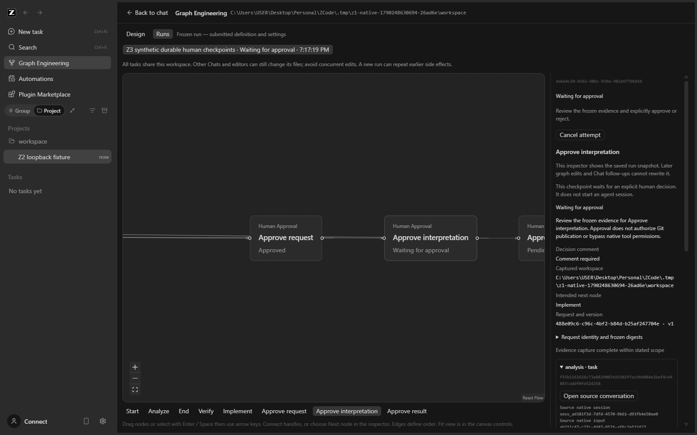
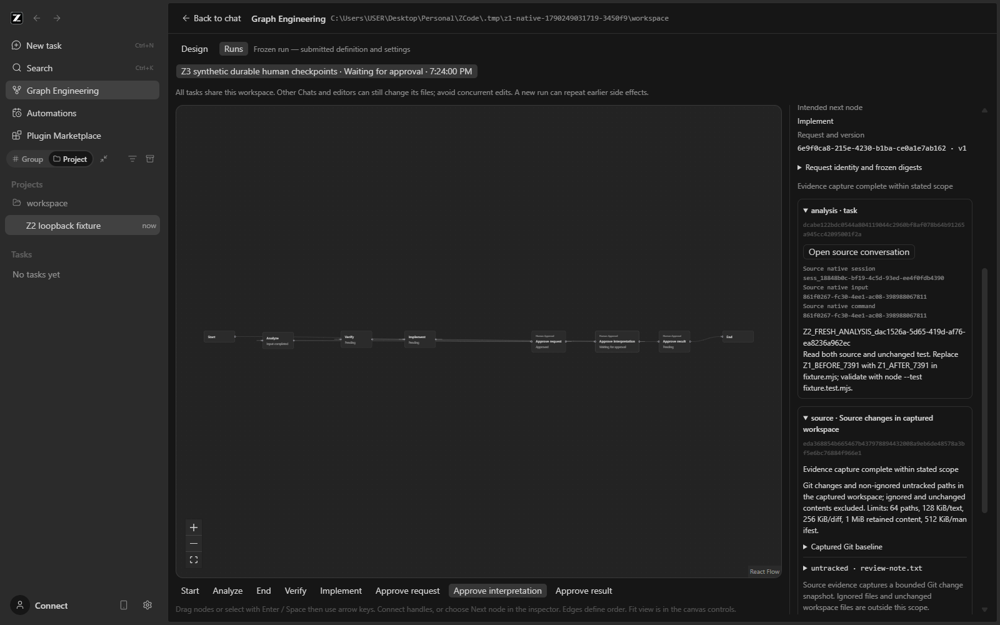
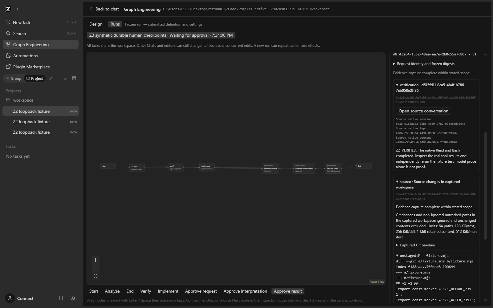
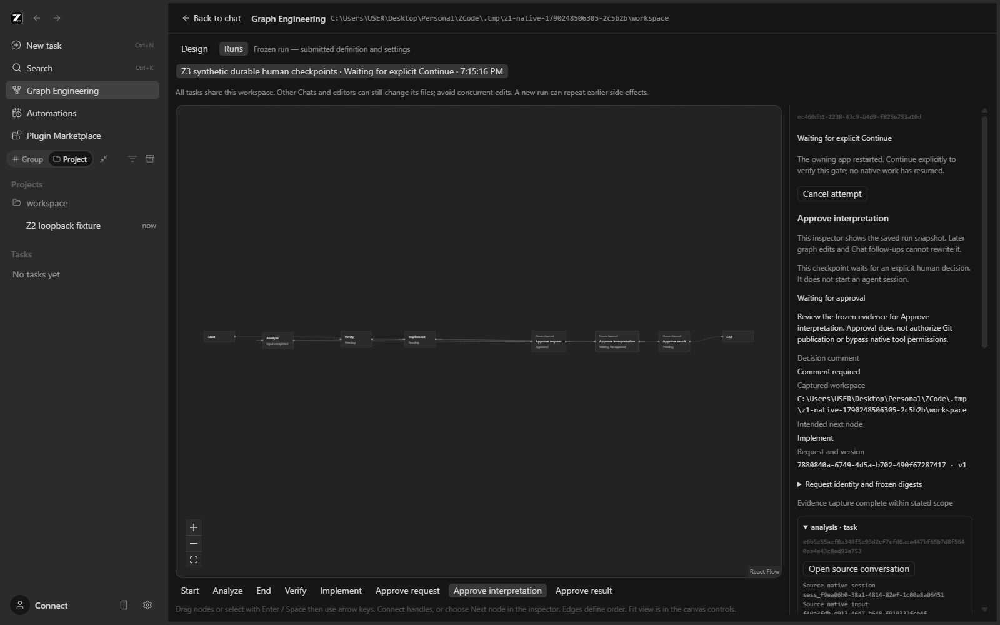
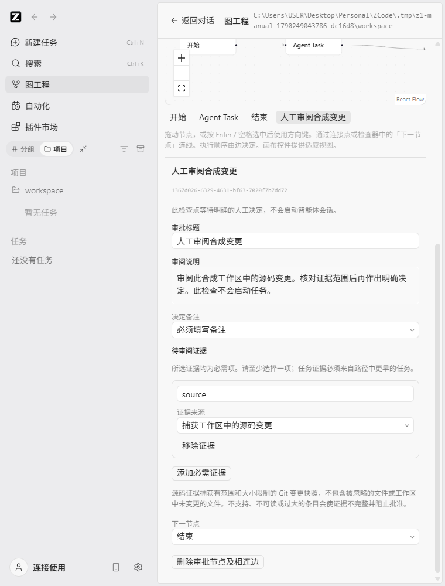

# Z3 implementation report — durable human checkpoints

Date/timezone: 2026-09-24, Asia/Kuala_Lumpur.

Selected milestone: **Z3 only**. Checkout: `C:\Users\USER\Desktop\Personal\ZCode`, branch `main`. Starting and final HEAD: `5ded9d1b6e9399e05f6ab6efc60234387322fe20` (no commit made).

The user's explicit instruction selects `future/Z3_CODEX_PROMPT.md`, requires complete bounded implementation and verification, preserves the native agent/Chat/configuration/history and later packaging, and prohibits automatic staging, committing, pushing, merging or Z4. The supplied untracked standalone/future/handoff/reference documents were present before implementation and remain preserved.

## Status

**IMPLEMENTED WITH NAMED BASELINE EXCEPTIONS — ready for user check.** All twelve required controlled native scenarios, all source suites, final desktop rerun and narrow-layout visual verification pass. CLI lint and full-repository formatting remain preexisting failures. This is implementation readiness, not live-user acceptance or a published Z3 installer.

User-operated live-provider/project checks remain **NOT RUN**. No Z1/Z2 greeting or navigation screenshot is promoted into project Read/Edit/test, approval or restart evidence. This report distinguishes source fixtures, real native integration with a controlled provider, user-operated checks and packaging.

## Prerequisites and baseline

Read the applicable root AGENTS.md, architecture governance skill/policy and generated Graph context, DESIGN.md, current Z1/Z2 specifications/contracts, Z2_REPORT.md, PUBLISH_REPORT.md, native PROGRESS.md, and all four documents referenced by the Z3 prompt: ROADMAP.md, EXECUTION_RULES.md, Z3_TASK.md and REPORT_TEMPLATE.md.

Z2 prerequisites were verified in actual source: the single serialized `GraphState` owner, frozen per-node settings and explicit bindings, deferred native session allocation, persisted creating/created/sending/accepted phases, original runtime/input terminal proof and final text, same-session Chat navigation, native questions/permissions, and audited inactive-only release. The current checkout also contains the authorized Graph z2.2 publisher, private packaged profile paths and exact native permission-acknowledgement helper. Those later changes and their historical publication report remain unchanged.

Toolchain actually used: Node **24.14.0**, pnpm **10.33.2**, matching `mise.toml`, from the existing project-local `.tmp/z1-toolchain`. Existing dependencies were used; no global toolchain or installed app configuration was changed. Root emitting typechecks were completed before desktop bundling, because they share Host output paths.

| Initial baseline command/check                                          | Result                                                                   | Evidence                                           |
| ----------------------------------------------------------------------- | ------------------------------------------------------------------------ | -------------------------------------------------- |
| `node scripts/check-workspace-freshness.mjs`                            | PASS after read-only fetch-metadata retry; main 0 ahead / 0 behind       | `evidence/z3/checks/baseline/freshness-retry.txt`  |
| First sandbox freshness attempt                                         | FAIL: `.git/FETCH_HEAD` permission denied; retained, not counted as PASS | `evidence/z3/checks/baseline/freshness.txt`        |
| `pnpm typecheck`                                                        | PASS, exit 0                                                             | `evidence/z3/checks/baseline/typecheck.txt`        |
| `pnpm --dir apps/zcode-cli typecheck`                                   | PASS, exit 0                                                             | `evidence/z3/checks/baseline/cli-typecheck.txt`    |
| `pnpm lint`                                                             | PASS, exit 0; 70 warnings, 0 errors                                      | `evidence/z3/checks/baseline/lint.txt`             |
| `pnpm architecture:check --changed`                                     | PASS; 0 violations                                                       | `evidence/z3/checks/baseline/architecture.txt`     |
| Graph/native guard source tests                                         | PASS; 62 tests                                                           | `evidence/z3/checks/baseline/graph-tests.txt`      |
| UI source tests                                                         | PASS; 20 tests                                                           | `evidence/z3/checks/baseline/ui-tests.txt`         |
| Native interaction/service/publishing/distribution/provider regressions | PASS; 55 tests                                                           | `evidence/z3/checks/baseline/regression-tests.txt` |
| CLI lint, `--continue`                                                  | FAIL / BASELINE EXCEPTION; 53 warnings, 85 errors                        | `evidence/z3/checks/baseline/cli-lint.txt`         |
| `pnpm fmt:check`                                                        | FAIL / BASELINE EXCEPTION; 2,875 files                                   | `evidence/z3/checks/baseline/format.txt`           |

The fresh baseline therefore passed 137 source tests. Historical packaged Z2 evidence is described in PUBLISH_REPORT; it is not presented as a new Z3 installer test. No required Z2 primitive was absent. Missing user-operated live checks do not block isolated development, and remain separately outstanding.

## Contracts and source map

Specifications were written before behavior changes in [Z3_SPEC.md](Z3_SPEC.md) and [Z3_SOURCE_SPEC.md](Z3_SOURCE_SPEC.md). The source specification documents the actual native API extension and its bounds. The existing module CONTRACT.md and public contract example were updated.

| Responsibility                                                      | Actual owner/API/files                                                                                                                                                      |
| ------------------------------------------------------------------- | --------------------------------------------------------------------------------------------------------------------------------------------------------------------------- |
| Public service and versioned graph DTOs                             | `packages/services/src/graph-engineering/contract.ts`, re-exported cohesive `approval-types.ts`; existing `IGraphEngineeringService` channel                                |
| Shape/readiness and persisted correlation                           | Graph `domain/sequential.ts`, `record.ts`, `approval-record.ts`, `approvals.ts`                                                                                             |
| Single mutable state and serialized transactions                    | Existing Graph `app/state.ts` / `GraphState`                                                                                                                                |
| Pending request, evidence checks, decision/idempotency and Continue | `app/approvals.ts` / `GraphApprovals`, called only through the existing service owner                                                                                       |
| Native dispatch and live one-use guard                              | Existing `app/sequencer.ts`, `app/service.ts`, `app/attempts.ts`; exact current runtime/client/payload permit around existing native send                                   |
| Atomic metadata and ownership                                       | Existing `adapters/repository.ts`; version-3 envelope, existing file lock and atomic rename                                                                                 |
| Native source evidence                                              | `IGitService.getSourceSnapshot` in `git/git.ts`, `gitService.ts`, `sourceSnapshot*.ts`; existing `GitCommandProvider`, repository resolver and `IFileService` bounded reads |
| Source adapter and composition                                      | Graph `adapters/evidence.ts`, Graph `node.ts`, existing services `node.ts`                                                                                                  |
| UI/service boundary                                                 | Existing `useGraphEngineering`; approval intent/view helper and inspectors under `packages/ui/src/graph-engineering/`; EN/CN labels                                         |
| Actual native sessions/tools                                        | Existing Graph native adapter, session service and V4 agent command path; no new native execution command, engine or provider store                                         |

Version 3 is explicit when adding the first approval to a draft. Version 2 and unversioned Z1 records retain their meaning and never dispatch on read. Native attempts and gate attempts are separate: gates have no native input, session or runtime. A run freezes the graph revision, workspace identity/path, model/reasoning/mode/plan selections, edge-ordered execution path and Start text.

Each gate request stores run/node/attempt IDs, request ID/version, frozen graph/settings digest, workspace, review title/text, comment policy, intended next node, immutable evidence snapshots/digests and completeness/issues. A decision stores its idempotency ID, exact request correlation, Approve/Reject, comment, timestamp and Host-generated local actor/session attribution. That attribution is **not certified identity or a tamperproof signature**.

The serialized Host persists the request before publishing controls, and commits an approval decision with one successor intent before dispatch. Exact duplicate decisions return the existing outcome; conflicting values or decision-ID reuse for another request fail. Pending gates restored after app restart require Continue before a separate review decision. An already committed approval with a provably undispatched successor also requires Continue. Uncertain creation/send retains Z2 interruption/guard behavior; no guessed replay exists.

Source snapshots identify exact Git HEAD plus scoped index/status digests and captured staged/unstaged/untracked text/diffs. Coverage is explicitly bounded to Git changes and non-ignored untracked paths in the captured workspace: **64 paths, 128 KiB/text, 256 KiB/diff, 1 MiB retained content, 512 KiB/manifest**. Ignored files and unchanged file contents are excluded. Binary, invalid UTF-8, oversized, unreadable, conflicted, symlink/junction/submodule, sparse/assume-unchanged and limit cases are visibly incomplete and cannot authorize. Two independent captures must agree. UTF-8 BOM is retained so its change cannot disappear from the digest. This is a bounded review facility, not the Z4 artifact platform.

The same owner rechecks evidence before decision, explicit continuation, and successor creation/send. Consecutive approvals remain relevant through the next native task; earlier gates are not retroactively invalidated by that authorized task's own edits. Changed graph/settings/evidence cannot inherit an old decision. Historical snapshots remain frozen. **Hashing and the metadata lock do not lock project files**; other editors can change files between checks. Final approval does not grant commit/push/merge/publication permission.

## Implemented behavior

- Entry, intermediate and final Human Approval nodes use the same node type. Configuration includes title, review instructions, required Start/prior-task/source bindings, and optional/required comments. Incomplete drafts save but Run readiness explains missing configuration.
- The canvas and frozen run inspector show Waiting for approval, Approved, Rejected and Stale evidence, plus exact request/evidence/decision details and continuation reasons. Selecting, viewing, entering a comment and opening an upstream conversation have no authorizing effect.
- Open source conversation uses the captured existing native session. Graph approval leaves native questions and tool permissions unanswered; ordinary Chat remains usable.
- Reject terminates without success; cancel of a waiting gate records permanent cancellation with zero native stop when no input is active. Late decisions cannot revive a terminal/cancelled/released run.
- Cold pending or approved-but-undispatched gates require explicit verified Continue. Unknown activity never gets Continue. Stale runs stay stale across restart. Original native inputs remain protected until terminal proof or Z2's audited inactive-only release.
- Native send exemption is one-use, live and exact-runtime/client/payload scoped. The persisted sending phase cannot be reused as replay permission through another native API.

## Verification matrix

Required native rows A02/A05/A07/A08 were executed against the actual owning Electron/Host/native CLI, with a controlled provider, actual tools, read-only native SQLite admission evidence, and actual app exit/reopen. The two crash-boundary cases use an explicitly test-only scoped Host filesystem-write interception, then close the owned app and reopen it without the interception. They do not fabricate native input rows or terminal proofs. This is controlled interruption testing, not a claim of universal power-loss tolerance.

All scenario commands are `node scripts/graph-engineering/z3-native-smoke.mjs --scenario=<name>`. The retained [native index](evidence/z3/native/index.json) identifies each profile, scenario and screenshot. Independent input counts refer to `session_input.payload.intent.sourceCommandId`; native queue row IDs are separately correlated to `payload.intent.queueItemId`. One native input can make several model requests.

| Requirement | Result | Layer                                            | Exact action and evidence                                                                                                                                                                                                                                                                                                                                                                                                                                                    |
| ----------- | ------ | ------------------------------------------------ | ---------------------------------------------------------------------------------------------------------------------------------------------------------------------------------------------------------------------------------------------------------------------------------------------------------------------------------------------------------------------------------------------------------------------------------------------------------------------------- |
| Z3-A01      | PASS   | Source + native regression                       | Original Z1/Z2 persisted fixtures and behavior pass. Final native Z1 literal compatibility, ordinary Chat, Z2 complete, restart-permission and persistence-recovery all pass; [regression index](evidence/z3/regressions/index.json).                                                                                                                                                                                                                                        |
| Z3-A02      | PASS   | Controlled native                                | `complete`: three distinct native sessions/initial inputs, zero gate inputs; predecessor proof precedes pending request; Implement has zero admissions until explicit review. [Summary](evidence/z3/native/complete/summary.json).                                                                                                                                                                                                                                           |
| Z3-A03      | PASS   | Service fixture + native keyboard                | Duplicate approve/concurrent reject have one winner and intent; changed payload/cross-request ID reuse conflict. Repeated native Enter at entry records one approval and one input. `approval-service.test.ts`, `approval-faults.test.ts`, complete summary.                                                                                                                                                                                                                 |
| Z3-A04      | PASS   | Service fixture + controlled native              | Frozen settings/request-version, source changes between decision/creation/send, consecutive approvals and cold stale state fail closed in fixtures. `stale-source` / `stale-graph` each retain the original request and only one Analyze input; [source](evidence/z3/native/stale-source/summary.json), [graph](evidence/z3/native/stale-graph/summary.json).                                                                                                                |
| Z3-A05      | PASS   | Controlled native                                | `complete`: actual native AskUserQuestion after entry approval; real Edit/Bash permissions, Read/Edit/Bash and unchanged independent fixture test. Graph review does not answer native interactions. [Independent test](evidence/z3/native/complete/independent-test.txt).                                                                                                                                                                                                   |
| Z3-A06      | PASS   | Service fixture + controlled native              | `reject` / `cancel`: one Analyze input and one unrelated Chat input, zero Implement/Verify. Unrelated native question remains unanswered until explicitly responded to; Chat then completes. Fixture checks zero stop for inactive gate and late-decision refusal; [reject](evidence/z3/native/reject/summary.json), [cancel](evidence/z3/native/cancel/summary.json).                                                                                                       |
| Z3-A07      | PASS   | Actual app restart                               | `restart-entry` / `restart-pending`: same request/version/digests, zero new native input/model activity on reopen; Continue only re-arms pending review, then separate approval admits once. [Entry](evidence/z3/native/restart-entry/summary.json), [intermediate](evidence/z3/native/restart-pending/summary.json).                                                                                                                                                        |
| Z3-A08      | PASS   | Actual Host/native boundary and restart          | `boundary-planned`: durable decision/intent, ledger count 1, planned successor; explicit Continue finishes at 3. `boundary-accepted`: ledger proves 2 inputs while stored phase is sending; restart stays interrupted, no Continue/replay. [Planned](evidence/z3/native/boundary-planned/summary.json), [accepted](evidence/z3/native/boundary-accepted/summary.json).                                                                                                       |
| Z3-A09      | PASS   | Service fixture + native disk failure            | Source tests cover failed pending-request/decision/intent writes and discarded successful reply followed by identical retry. `decision-failure` intercepts the actual metadata write: no saved decision, one Analyze input, no successor. [Summary](evidence/z3/native/decision-failure/summary.json).                                                                                                                                                                       |
| Z3-A10      | PASS   | Real synthetic Git fixtures + native             | 13 native Git tests plus one adapter test pass; complete native captures exact HEAD, tracked diff and untracked text. `incomplete-binary` / `incomplete-oversized` retain visible path/issues with only one Analyze admission. [Binary](evidence/z3/native/incomplete-binary/summary.json), [oversized](evidence/z3/native/incomplete-oversized/summary.json).                                                                                                               |
| Z3-A11      | PASS   | UI + controlled native + setup-only presentation | 24 UI tests, native Graph/Chat/Design/Runs navigation, exact-session inspection, ordinary Chat and private manual launcher/reopen pass. Actual Chinese/light approval draft at 760 × 1000 passes after the bounded overlap fix, with 12px separation and no horizontal overflow. [Visual summary](evidence/z3/regressions/z3-approval-chinese-light-narrow-summary.json). Pending/decision/restart in that locale/theme/width combination and actual mobile Web are NOT RUN. |

| Final source/build check                                                                     | Actual result                                                                                                            | Retained evidence                                             |
| -------------------------------------------------------------------------------------------- | ------------------------------------------------------------------------------------------------------------------------ | ------------------------------------------------------------- |
| Graph/approval/native guard source suite                                                     | PASS; **82 tests**                                                                                                       | `evidence/z3/checks/graph-tests.txt`                          |
| Native bounded Git source fixtures                                                           | PASS; **13 tests**                                                                                                       | `evidence/z3/checks/source-tests.txt`                         |
| UI suite                                                                                     | PASS; **24 tests**                                                                                                       | `evidence/z3/checks/ui-tests.txt`                             |
| Service/native-interaction/publisher/distribution/provider/isolated-fixture regression suite | PASS; **57 tests**                                                                                                       | `evidence/z3/checks/regression-tests.txt`                     |
| Root typecheck                                                                               | PASS, exit 0                                                                                                             | `evidence/z3/checks/typecheck.txt`                            |
| CLI typecheck                                                                                | PASS, exit 0                                                                                                             | `evidence/z3/checks/cli-typecheck.txt`                        |
| Root lint                                                                                    | PASS; **70 existing warnings, 0 errors**                                                                                 | `evidence/z3/checks/lint.txt`                                 |
| Architecture / pre-push verification                                                         | PASS; **0 violations**; pre-push command does not stage or push                                                          | `evidence/z3/checks/architecture.txt`, `pre-push.txt`         |
| Native CLI build/staging and desktop source build                                            | PASS; existing large-chunk/plugin timing warnings                                                                        | `evidence/z3/checks/agent-build.txt`, `desktop-build.txt`     |
| CLI lint, all packages with `--continue`                                                     | **FAIL / BASELINE EXCEPTION**; 53 warnings / 85 errors; all **138 normalized diagnostics identical** to initial checkout | `evidence/z3/checks/cli-lint.txt`, `cli-lint-comparison.json` |
| Full-repository formatting                                                                   | **FAIL / BASELINE EXCEPTION**; 2,872 failing paths versus 2,875 initially; **no new failing paths**                      | `evidence/z3/checks/format.txt`, `format-comparison.json`     |
| Z3 packaged installer/install/upgrade/second PC                                              | **NOT RUN**                                                                                                              | Existing z2.2 packaging preserved; no Z3 release invoked      |

The final source suites total **176 passing tests**, without double-counting the source adapter included in the Graph suite. Required lint/format failures are still reported as failures; no rule suppression or whole-repository reformat was used.

The three removed formatting failures are the edited native Git contract/service files `packages/services/src/git/git.ts`, `packages/services/src/git/gitService.ts` and `packages/shared/src/git.ts`. Scoped formatting of the owned source, documentation and JSON evidence passes; the other baseline failures remain visible.

## Intermediate failures and corrections

- Baseline fetch initially failed because the sandbox could not write Git fetch metadata. The permitted read-only freshness retry passed without changing source/index/history.
- During tests-first implementation, the native source API was initially absent; the focused tests failed until the documented API and adapter were implemented. The old unsupported-version assertion was advanced from version 3 to version 4 because Z3 explicitly introduces version 3; existing v2 behavior tests remain in the suite.
- A cold-service fixture reused synthetic session IDs after restart; its independent fixture counter was corrected to avoid collisions. Production native IDs continue to be runtime allocated.
- Review reproduced cross-gate decision-ID reuse and stale status being overwritten during Continue. Global request/decision/intent correlation checks and explicit stale preservation were added, with focused tests.
- Review reproduced a cold uncertain-input guard accepting the stored sending command ID. The new one-use in-memory exact-payload/runtime/client permit closes that path; cold and live-Unknown replay probes now fail as intended.
- Review reproduced a stale second gate reviving an earlier approved gate after restart. Stale eligibility now fails closed, and consecutive approvals are rechecked through the next native dispatch.
- A real Git fixture showed that decoding stripped a UTF-8 BOM. Exact BOM preservation was added; the previously failing independent test now passes.
- The first native complete test reached all real tasks/final gate but compared the native queue-row ID with Graph input ID. The corrected harness verifies `row.id === payload.intent.queueItemId` and `payload.intent.sourceCommandId === Graph inputId/commandId`. The initial failure log is retained; the revised full case passed.
- The final added settings-integrity test initially failed TypeScript because an array lookup could be undefined. Its explicit fixture precondition was narrowed; root typecheck then passed. This was a test typing correction, not relaxed behavior.
- Actual Chinese/light testing at 760 × 1000 exposed stacked canvas controls overlapping the approval inspector. `GraphEditor.tsx` now preserves natural height below the existing large-screen breakpoint and retains desktop flex/scroll behavior above it. The pre-fix visual failure is preserved. Actual post-fix bounds place the last canvas child at 806px and the inspector at 818px, with no horizontal document overflow. The main desktop native complete case passed again on this final UI build.
- An intermediate version-comparison edit also rewrote line endings in twelve otherwise unchanged Graph files. Scoped formatting restored those files with no Git content difference; the final formatting comparison has no added failures. Emitting typechecks likewise changed eight generated CLI declaration files' line endings; they were restored only after verifying their normalized content exactly matched HEAD. No CLI implementation or unrelated baseline formatting was changed.

## Visual and operator evidence

Actual native screenshots and exact request/session/input summaries are retained in [native/index.json](evidence/z3/native/index.json) and [regressions/index.json](evidence/z3/regressions/index.json). They are controlled-provider or setup-only evidence, not live-user acceptance. The screenshots are unedited captures of the actual interface.









The corresponding summary files retain request IDs/versions, evidence and graph digests, native session/input/command IDs and local decision audit. The [actual native test view](evidence/z3/native/complete/z3-native-verify-test-result.png) shows `node --test fixture.test.mjs` passing; the independent host test result is separately saved. The [uncertain-admission restart](evidence/z3/native/boundary-accepted/z3-accepted-decision-boundary-restarted.png) shows interrupted work without a replay control. Reject/cancel native ledgers include their deliberately separate ordinary Chat input; they do not represent two Graph task admissions.

The final desktop complete rerun is run `4a42116c-3b0a-42e7-a65e-128616950200` in isolated profile `.tmp/z1-native-1790249031719-3450f9`. Its three original native inputs all have matched `completedSuccess` proof:

| Node      | Native session                              | Input / source command                 |
| --------- | ------------------------------------------- | -------------------------------------- |
| Analyze   | `sess_18848b0c-bf19-4c5d-93ed-ee4f0fdb4390` | `861f0267-fc30-4ee1-ac08-398988067811` |
| Implement | `sess_f5b4d2eb-5ac5-44b3-be20-5591e940d143` | `35c1fdad-b6ab-4661-b547-dc0d61884899` |
| Verify    | `sess_91eeaa52-d5bd-4039-9782-93a4b3d3b645` | `a7869e53-03d4-4494-8e00-9c76909a9076` |

The intermediate approval request is `6e9f0ca8-215e-4230-b1ba-ce0a1e7ab162`, version 1; its explicit approve decision is `4486f00b-8b19-44cc-8c78-4ddab058a7f6`. The final request is `d8f432c4-f362-48aa-aa7e-2b0c55a7c807`, version 1, with decision `7af3bb55-d9a2-44d7-bf99-24d0c68da9b5`. Their full immutable evidence and original native correlations are in the complete summary. These are controlled synthetic test identities, not user project identities.



## User checks — separate

Performed by/date/provider alias/approved real workspace: **NOT RUN / not supplied**. Live-user run/node/session/input IDs, actual project tools, independent project tests, restart/cancellation/approval outcomes: **NOT RUN**. Installed-app upgrade/uninstall, second PC, Z3 packaged installer and release publication: **NOT RUN**. The existing z2.2 release remains the available historical package; this assignment does not publish Z3.

## Diff and security review

Changes are confined to Graph control types/domain/Host/UI, the narrow native Git evidence API/composition, focused synthetic tests/harnesses and Z3 documentation/evidence. Existing publisher/distribution/identity/updater settings and previous reports are preserved. No credentials, installed profiles, company repositories, live application model accounts or private integrations were accessed. Fixtures use controlled loopback providers and independent native tools; fixture Git commits occur only in verified newly created synthetic workspaces. No broad process termination or private native database writes are used.

Final source and test diffs were reviewed, including independent review of source evidence, approval/recovery invariants and native harness correlation. `git diff --check` passes, the staged diff is empty, and HEAD remains unchanged. The [owned-file manifest](evidence/z3/checks/diff-manifest.json) separates tracked changes, new Z3 files and all 50 preexisting untracked handoff/reference files. It records net line changes for the changed modules and new source/tests/harnesses, excluding documentation and binary evidence. No architecture baseline or lint rule was relaxed.

Approval evidence contains selected source/text in existing Graph metadata and persists with its history; no new encryption, retention/export service, artifact platform or tamperproof audit is claimed. Tests preserve their synthetic evidence directories for inspection. Remove only a specifically verified disposable fixture/profile when no owned process is using it.

## Exact local reproduction and manual check

Use the prepared checkout's Node 24.14.0/pnpm 10.33.2 and installed dependencies. If those project-local tools are absent, follow [Z1_SETUP.md](Z1_SETUP.md); it explains public tool downloads and process-local environment variables. Fresh dependency installation on a different PC is not newly certified by this Z3 run.

For a clean dependency checkout, the existing [verified Z1 bootstrap recipe](Z1_REPORT.md#exact-windows-operator-steps) uses `pnpm install --frozen-lockfile --ignore-scripts --store-dir .pnpm-store --reporter append-only`, then `node node_modules/electron/install.js` and `node scripts/prepare-native-search-tools.mjs`. Those steps download public dependencies/runtime assets; they were not repeated for Z3 because the prepared dependencies were already present. The source checks/build/manual commands below were executed in this checkout. An installer containing Z3 was not built or distributed.

From the repository root in PowerShell:

```powershell
$z3Tools = Join-Path (Get-Location) '.tmp/z1-toolchain'
$env:PATH = "$z3Tools;$z3Tools\node-v24.14.0-win-x64;$PWD\node_modules\.bin;$env:PATH"
$env:HUSKY = '0'
$env:PNPM_CONFIG_VERIFY_DEPS_BEFORE_RUN = 'false'
$env:npm_config_cache = Join-Path (Get-Location) '.npm-cache'
$env:ELECTRON_CACHE = Join-Path (Get-Location) '.electron-cache'
node --version  # v24.14.0
pnpm --version  # 10.33.2
pnpm typecheck
pnpm --dir apps/zcode-cli typecheck
pnpm lint
pnpm architecture:check --changed
pnpm --dir apps/zcode-cli lint --continue
pnpm fmt:check

$graphTests = @(Get-ChildItem packages/services/src/graph-engineering -Recurse -Filter '*.test.ts' | ForEach-Object FullName)
node node_modules/tsx/dist/cli.mjs --test @graphTests packages/services/src/zcode-agent/*.test.ts
node node_modules/tsx/dist/cli.mjs --test packages/services/src/git/sourceSnapshot.test.ts packages/services/src/git/sourceSnapshot.edges.test.ts
node node_modules/tsx/dist/cli.mjs --test packages/services/test/*.test.ts apps/zcode-cli/packages/bootstrap/src/zcode-protocol-v4/interaction-registry.test.ts scripts/graph-engineering/*.test.mjs
$env:TSX_TSCONFIG_PATH = 'packages/ui/tsconfig.json'
node node_modules/tsx/dist/cli.mjs --test packages/ui/test/*.test.ts
Remove-Item Env:TSX_TSCONFIG_PATH

# Finish emitting typechecks before these sequential builds.
$env:ZCODE_ENV = 'test'
node scripts/build-desktop-agent-cli.mjs
pnpm --filter @zcode/desktop build:no-runtime-assets

$z3Cases = @('complete', 'restart-entry', 'restart-pending', 'reject', 'cancel',
  'stale-source', 'stale-graph', 'incomplete-binary', 'incomplete-oversized',
  'boundary-planned', 'boundary-accepted', 'decision-failure')
foreach ($case in $z3Cases) {
  node scripts/graph-engineering/z3-native-smoke.mjs "--scenario=$case"
  if ($LASTEXITCODE -ne 0) { throw "Z3 case failed: $case" }
}
node scripts/graph-engineering/z2-z1-regression.mjs
node scripts/graph-engineering/native-smoke.mjs --chat
node scripts/graph-engineering/z2-native-smoke.mjs --scenario=complete
node scripts/graph-engineering/z2-native-smoke.mjs --scenario=restart-permission
node scripts/graph-engineering/z2-native-smoke.mjs --scenario=persistence-recovery
```

The controlled wrappers create fresh app/HOME/data/config and synthetic workspaces; they block external application traffic and use owned process handles. Native Electron execution requires an environment permitting its child processes. Do not replace these wrappers with ordinary `dev:desktop`, an installed-profile launch, broad process killing or manually rewriting native databases.

For a user-operated check, run `node scripts/graph-engineering/z3-launch-manual.mjs`. It prints its exact isolated profile/workspace, Start text, three bound task instructions, evidence selections and reopen command. It configures no provider and submits no work. **Only the user** should configure an authorized provider in that isolated app and start the task; this manual mode permits that provider's external model traffic.

1. Build `Start → Approve request → Analyze → Approve interpretation → Implement → Verify → Approve result → End`. Use the printed task instructions/bindings; set End to Verify. For each approval, enter review instructions, require a comment, and select the printed Start/upstream-text/source bindings. Save, inspect readiness, then explicitly Run.
2. At entry approval, verify no agent task has started. Entering a comment or changing tabs must not start one. Review the exact request/workspace/successor and approve; native questions/permissions must still require their normal responses.
3. At interpretation approval, inspect the frozen Analyze text and source scope/HEAD/diff. Open source conversation must select the original Analyze session. Reject or cancel in separate disposable runs and verify Implement never starts.
4. Quit with interpretation approval pending. Reopen using the **exact printed** `--profile` path; do not create a new profile. Verify the request/version/digests/text/history remain unchanged and no task resumes. Continue rechecks the pending gate; a separate approval authorizes its successor.
5. In a separate run, change `review-note.txt` in the printed synthetic workspace while the gate is pending. The old approval must become Stale evidence and never submit Implement. Cancel and create a newly reviewed run; there is no refresh/replay shortcut.
6. In the successful run, respond to native tool permissions, verify actual Edit and Bash output, review final source evidence and approve the final gate. Final approval must create no extra native task and perform no Git publication. Run `node --test fixture.test.mjs` independently in the printed synthetic workspace; the original test file must remain unchanged.
7. Record the provider alias only, exact run/node/session/input IDs, decisions, tools, independent test output and restart/cancel results. Until supplied, these user-operated checks remain NOT RUN.

## Next eligible milestone

Z4 — Evidence and deterministic tools is the next milestone in the roadmap after Z3's required verification and any lead/user acceptance decision. **Not started.** Git staging/commit/push/merge/publication performed for this assignment: **none**.
