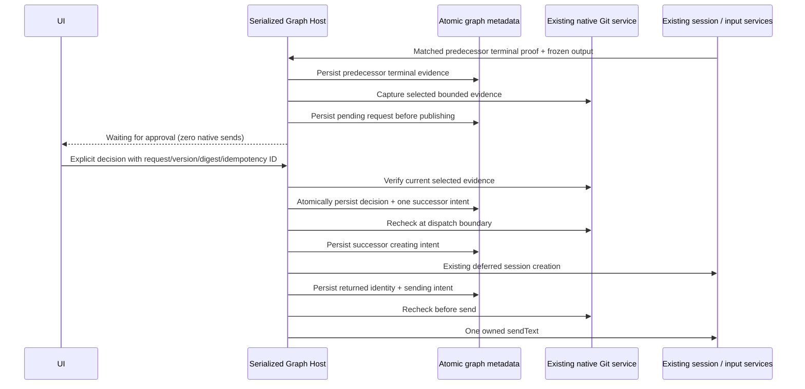

# Z3 — durable human checkpoints

Status: implementation contract, 2026-09-24. Explicit Z3 authorization supersedes only the old future-scope restriction. Z1/Z2 historical results and the authorized Graph z2.2 distribution remain unchanged. Z4 is not authorized.

## Prerequisites and scope

Starting HEAD is `5ded9d1b6e9399e05f6ab6efc60234387322fe20`. Existing Z2 contracts, serialized Host sequencer, matched native terminal proof, frozen bindings/settings, same-session navigation, and audited inactive-only release are present. Source tests/typechecks pass before changes; CLI lint and repository formatting have retained failing baselines. User-operated live-project/tool/restart checks remain NOT RUN and do not block isolated controlled-provider development.

Version 3 explicitly extends sequential definitions with optional Human Approval nodes. Version 2 and unversioned Z1 documents retain their meaning; adding a gate upgrades the editable draft only. Historical runs never migrate into executable work. One to eight tasks, zero to eight approvals, one Start and one End form one edge-ordered path. No branches, repair routes, extra agent engine, remote Graph execution, provider store or publication permission.

## Contract and owner

The existing window Host `GraphState` remains the sole mutable owner; all commands serialize on the captured workspace identity/path. `GraphEngineeringService` exposes explicit `decideApproval` and `continueApproval` commands through the existing service/hook/RPC path. Native task attempts remain separate from approval attempts: a gate has no native input, command, runtime or session. Existing native permission/question ownership is unchanged.

An approval node has title (`name`), review instructions, one or more required evidence bindings (Start request, a strictly earlier task's frozen final text, or the supported source-change snapshot), and comment policy `optional` or `required`. Incomplete drafts save; Run readiness reports missing/invalid evidence selections. Bindings never silently select arbitrary latest text. All native settings and the graph revision are frozen at Run.

Each gate attempt persists its identity, status, immutable request (ID/version, run/attempt/node, captured workspace, frozen graph/settings digest, review text, intended successor, captured evidence and digests, completeness/issues), optional decision, and one successor intent. Decisions include client idempotency ID, exact request/version/digest, Approve/Reject, comment, timestamp, and a Host-generated local actor/session identifier. This is local attribution, not certified identity or a tamperproof signature. A duplicate identical decision ID returns its original committed result; reused IDs with changed content and conflicting decisions explicitly fail. Entering comments, viewing history, selecting nodes or navigating tabs cannot authorize anything.

## Evidence and source boundary

Text evidence stores the actual snapshot, digest and upstream native session/input/command identity. Open conversation opens that recorded session. Source evidence uses a narrow read-only extension to the existing native Git service because its current UI change list omits unsupported untracked files. Capture identifies exact Git HEAD/index/worktree baseline and changed/untracked entries within explicit limits. Text/diffs are retained in graph metadata; binary, oversized, unreadable, symlink/submodule or unsupported repository entries and enumeration limits produce visible incomplete evidence, preventing approval. No claim that all workspace files or ignored files are captured. Adapter tests use independent synthetic Git fixtures and literal expected results.

The request stores a content digest excluding capture time. Before accepting a decision, continuing after restart, and immediately before a successor's creation/send through the existing sequencer, the Host validates frozen graph/settings/request identity, current saved graph revision/content, all prior successful native terminal proofs, and selected source evidence. Any relevant change marks the gate Stale evidence, preserves historical snapshots and blocks dispatch. Recovery is cancel and explicitly start a newly reviewed run; Z3 does not refresh or repair stale runs automatically. Hashing and the Graph metadata lock do not lock project files; another editor can write between checks. This time-of-check/time-of-use limit is shown to operators.

Consecutive approved control nodes retain their evidence obligations through the next native task's creation/send; the recheck walks back only to the last native task. Once that task has executed, its legitimate source edits do not invalidate an earlier gate retroactively. A stale run or any stale gate is never eligible for Continue. The ordinary agent input guard admits the exact Graph send only with a one-use in-memory permit held during the current sequencer call, matching its frozen payload, native runtime and Graph client identity. A persisted `sending` phase is evidence of uncertainty, never permission to replay via ordinary native APIs.

## Durable ordering and recovery

Reject records a non-success terminal run and skips pending work. Cancel while waiting persists permanent cancellation and sends zero native stop commands when no input is active. Late decisions cannot revive terminal/cancelled/released runs. Failure to persist a request/decision/intent causes no downstream effect and revokes automatic advancement. A lost successful reply can retry its identical decision ID without another effect.

After owning-app restart, there is no automatic gate or agent advancement. A persisted pending gate or committed approval with a provably undispatched (`planned`) successor may offer explicit Continue only after predecessor proofs, ownership, absence of uncertain attempts and current evidence are verified. Continue re-arms a pending request for a separate decision, or dispatches the already approved successor once. Creation/sending/accepted uncertainty retains Z2 interruption guards and inactive-only release; it never recreates/resends to guess. Inspecting history is read-only. Persisted approval evidence and audit remain available even after stale/rejected/cancelled outcomes.

## UI and verification

Reuse current canvas, controls, typography, themes, localization and hooks. Gate canvas statuses: Waiting for approval, Approved, Rejected, Stale evidence. Inspector shows exact request/version, workspace, evidence completeness/baseline/digests/source sessions, successor, comments/decision history, and explicit Continue blocked reason. Controls are scoped to run/gate/request; repeated keyboard/click activation retains the same decision payload until acknowledged.

Implement and execute Z3-A01 through A11 from `future/Z3_TASK.md`. A02/A05/A07/A08 require the actual owned Host/native integration with a controlled loopback provider and independent input-ledger evidence; process restart must be real. Preserve native Read/Edit/Bash and independent fixture tests. Retain baseline failures, intermediate failures, actual screenshots and exact isolated manual instructions in Z3_REPORT. User-operated real-provider/project checks remain NOT RUN unless supplied. No Git staging, commit, push, merge, publication or Z4 work.
