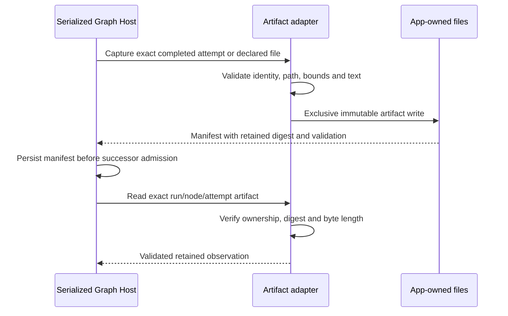

# Z4 artifact, strict output and project recipe contract

This specification extends the existing Graph owner for Z4 only. Historical Z1–Z3 records are unchanged. The Host owns artifact creation and project recipe changes; React submits typed commands through the Graph service. Native execution remains outside this subsystem.

## Ownership and event order

Artifacts identify workspace key, run, node and attempt, plus native input/session/command or deterministic operation when applicable. The caller allocates an opaque artifact ID before writing. Artifact types are final text, structured JSON, bounded file/diff, command and test result. Provenance distinguishes model final output, observed workspace content, native command and native parsed test evidence. Content is an observation, not source certification.

The artifact store is adjacent to existing Graph metadata beneath the injected app-owned Graph data directory. Immutable files are created exclusively. Exact same-ID/same-record retries are allowed; conflicting writes fail. Reads require the exact workspace/run/node/attempt identity and recompute SHA-256 and UTF-8 byte length. IDs never become arbitrary paths. Metadata-only exports exclude raw content by default; the Graph service performs that projection.

Content is bounded to 256 KiB per artifact. Missing, binary, invalid UTF-8, oversized or unsafe declared files produce an explicit incomplete record with an issue, never silently shortened content. Only configured workspace-relative file paths can be captured. Absolute paths, traversal, backslashes, external URLs, Windows alternate streams, symlinks/junctions/reparse aliases and nonregular files are refused. Every path component is checked and realpath containment is verified before and after bounded reads. These checks detect common escapes and concurrent changes; they are not an OS sandbox or complete filesystem isolation guarantee.

Explicitly declared `.diff` and `.patch` paths are retained as `diff` artifacts under the same text/path/bounds/redaction rules. They are inert snapshots with workspace-file provenance, never applied or treated as proof that a patch succeeded. No file discovery or automatic indexing is performed.

The store uses the existing native feedback redactor on retained copies, records when redaction changes content, and does not access secret storage. Digests and lengths describe retained bytes. Redacted content is visibly marked and must not be mistaken for an unmodified validation input. Strict structured validation runs against the exact final output before capture; no repair/extraction prompts are sent. Exports and telemetry do not include raw artifact content by default.

## Strict structured output

Ordinary Agent Task output remains text-first. Optional local schemas support object, array, string, finite number, boolean and null; objects declare properties/required keys and `additionalProperties:false`. Optional enums and bounded string/array sizes are supported. References, arbitrary expressions and executable validators are unsupported. The root output must be an object.

Strict JSON rejects prose, fences, trailing data, duplicate object keys (including escaped aliases), the reserved keys `__proto__`, `constructor` and `prototype`, invalid syntax, excessive bytes, more than 16 levels of nesting, or more than 4,096 members/items. Reserved keys are also rejected in schema properties and decoded JSON Pointer segments. The implementation uses a bounded lexical walk to reject duplicate keys and depth before the existing `JSON.parse`, then explicit local-schema validation. Local schemas are bounded to 32 KiB, eight levels and 256 schema nodes. No provider parameters are changed.

Selection uses a bounded RFC 6901 JSON Pointer: empty pointer selects the object; otherwise at most 16 `/`-separated segments, `~0` and `~1` decoding only, own properties only and canonical array indices. No dot expressions, wildcards, prototype lookup or evaluation. Invalid/missing paths fail. Bindings always resolve through the exact completed attempt and immutable artifact, not the current file or latest conversation row.

## Editable project recipes

Z4 reads/writes only the selected workspace's `.zcode/config.json` `graphRecipes` property, preserving other keys. It does not inherit parent or user recipes or modify provider/secret settings. Recipe edits use expected content digest concurrency, bounded JSON shape validation, a file lock and same-directory atomic replace. Missing configuration is an empty recipe set. Unsafe config path components are refused.

Recipes declare ID/name, executable, fixed argument array, workspace-relative cwd, timeout, declared source paths, expected output paths and verifier. Recipe IDs are at most 128 characters and timeouts are 100–600,000 milliseconds, matching native admission bounds. Shell-script recipes and shell concatenation are unsupported in Z4. Arguments are literal configuration, never model-generated substitutions. Executable choice cannot come from artifact bindings. Native operation authorization and execution belong to the native service and are separate from graph gates.

Verifier kinds are `command` (known process outcome), `build` (exit plus declared fresh outputs) and `test` (`zcode-json-v1` report, positive minimum and optional exact count, required test names, explicit prior build node). The report is an object with `format:"zcode-test-v1"`, `operationId`, `sourceDigest`, `buildDigest`, and `tests:[{name,status:"passed"|"failed"|"skipped",message?}]`. The real C# assertion runner produces this bounded report; it is not an xUnit or TRX compatibility claim. A plain command with no tests must not display Tests passed. Recipe validation requires bounded paths/arguments/counts and a build/output declaration for test provenance. Missing/stale/malformed reports, zero tests, skipped required tests and source/build mismatches are nonpassing evidence.

Literal argument placeholders are limited to `{operationId}`, `{sourceDigest}`, `{buildDigest}` and `{reportPath}`, populated by the Host from the owned operation and captured observations. Recipes may list environment variable names for native output redaction; values remain with the native environment owner and are never saved in recipe configuration. Declared file fingerprinting retains sorted path/byte-length/SHA-256 records only, supports binary build files up to 32 MiB each and 32 declared files, and verifies unchanged regular-file identity before/after streaming. It does not expose binary contents.

Build freshness uses an explicit pre-dispatch observation of every expected output, including safely validated missing paths, then a bounded post-process observation. File observations include modification times separately from content-only fingerprints: touching or reproducing identical bytes changes the freshness observation without changing the content digest. An unchanged pre-existing output is not fresh Build evidence. Empty declared source lists produce the deterministic digest of an empty list; they make no source-coverage claim. Missing output observations never hide unsafe-path, permission or read errors.

Separate post-process observations must agree on bytes: Build fingerprints and freshness file records must have identical path/digest/length entries, and the retained valid Test report must match the report-file fingerprint used for freshness. A file replacement between those reads is a visible validation failure, never mixed evidence from different contents.

The Test verifier accepts at most 1,000 declared/discovered tests and requires at least one passed execution in addition to its configured positive discovered count and required names. All-skipped results cannot pass. Tool output selectors reserve `command` and `test`; declared output/report paths cannot use these exact names, and a Test report cannot also appear in expected outputs. Persisted Agent artifacts must match their exact native input and command IDs whenever those provenance fields are present.

## Acceptance

Independent fixtures cover strict malformed/duplicate/deep/oversized JSON and schema mismatch, own-key pointers, immutable retries and identity/digest tampering, unsafe/outside/symlink/binary/oversized capture, redaction visibility, metadata projection without content, safe recipe edits preserving unrelated keys, concurrent-revision rejection and shell/path rejection. Native command/report semantics are verified separately through the actual native execution adapter and synthetic C# workspace in the Z4 report.

Native feedback redaction may normalize JSON formatting without removing private data. Artifact retention preserves exact original bytes only when the bounded duplicate-key-rejecting parser proves that original and scrubbed JSON values are identical, or when the only change is CRLF-to-LF line normalization. A true redaction remains incomplete; duplicate keys never use semantic equivalence because an overwritten member could conceal a secret. Mixed prose/JSON normalization remains conservative and cannot yield valid rewritten evidence.
