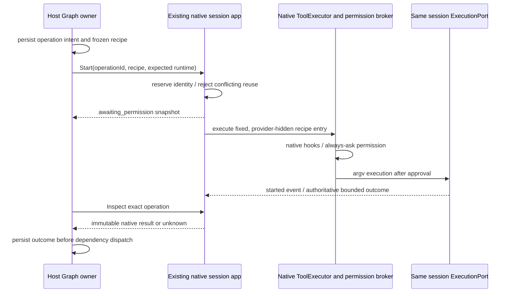

# Z4 native recipe execution boundary

Z4 adds a narrow native command entry because `ITerminalService.write` has no authoritative per-command result. The CLI already owns `ExecutionPort` and the `NodeExecutionAdapter` used by Bash. This extension uses that same session instance through the normal `AgentRuntime.scheduleTools` / `executeTools` executor and permission broker. It does not spawn a Host process supervisor or submit a model input.

## Contracts and owners

Tool creation explicitly uses `purpose: "native-recipe"` on the existing Host initialize/create services. This starts the same read-only native client and creates the existing deferred native session with automatic title generation disabled; it does not require or enable a provider, synchronize account provider configuration, or accept a model selection. Ordinary Chat initialization and creation retain model readiness. The Graph adapter compares the same native runtime identity before and after creation, and subsequent command calls stay pinned to it. The purpose is a Host routing parameter, never a new protocol or agent engine.

Native interaction responses are control operations. A `resolveInteraction` command carrying a session ID may use only the already-existing Host client without requiring a model/provider or starting a replacement process. The CLI still validates the exact session and pending interaction ID. All model-initiating commands retain existing model readiness and Graph ownership checks; explicit runtime identities retain the existing exact-runtime check. Opening a native conversation already uses the read-only control path and must preserve the same session.

`IZCodeAgentService.startRecipe`, `inspectRecipe`, and `cancelRecipe` require an existing session target and the exact `expectedRuntimeIdentity`. Their CLI protocol counterparts are `session/recipe/start`, `session/recipe/inspect`, and `session/recipe/cancel`; strict runtime schemas live in the shared protocol. Start accepts an already persisted caller `operationId` and a fixed recipe: named identity, executable, argv array, workspace-relative cwd, timeout, and optional names of native environment variables whose values require redaction. It accepts no shell string, arbitrary expression, secret value, or model-selected command.

The session app owns one bounded operation map, one active operation at a time, and exact AbortControllers. The Host Graph owner persists dispatch intent before invoking Start, persists native evidence before dependent work, and owns the durable graph/artifact record. The native map is runtime-local, never a second durable graph queue. A duplicate operation ID with identical canonical request returns the existing snapshot; conflicting reuse is rejected. Completed results are immutable. A missing operation on inspect/cancel returns `unknown`, never completed/inactive and never triggers execution or session hydration. A cold runtime cannot recover an operation by replaying Start. The Host checks runtime identity on every call.

## Permission and execution sequence

The recipe ToolEntry is hidden from the model and requires a separate native allow-once permission in every mode. Graph approval cannot satisfy it. The entry is fixed to one canonical request and exact tool invocation; hook-modified command data is rejected, not executed. A successful tool approval authorizes repository code under the existing native trust boundary; this is not an OS sandbox. Native hooks remain subject to existing workspace trust. The command does not opt into shell-init snapshots, provider calls, or inherited agent input queues.

The selected cwd must stay within the captured workspace. Reject traversal, absolute cwd, symlink/junction components, missing directories, command-shell executables, and Windows batch shims. The native handler revalidates the captured cwd immediately after permission and before execution, rejecting directory replacement through a symlink/junction while permission was pending. This narrows the approval wait race; filesystem checks are observations, not an atomic OS sandbox. An executable may be an explicit installed tool path or tool name. Arguments are fixed configured argv strings; no model-text interpolation is provided by this boundary.

## Results, privacy, cancellation, uncertainty

Start promotes the caller-created deferred session through `AgentRuntime.ensureSessionPersistedForExternalActivity` before any tool event or process. This creates the native parent session and title event without a model request, input admission, or automatic title-generation call. Existing protocol event reconciliation updates the deferred persistence mirror. Native pending permission interactions work without manufacturing an assistant message or agent turn; command evidence belongs to the Graph inspector.

The existing execution contract receives an additive `processExitObserved` field, set only by the actual child `exit` event. Native recipes expose this separately from the adapter's status. A started operation without that observation becomes `unknown`, including a forced-stop deadline that merely settled the existing adapter. The recipe owner also waits for the underlying ExecutionPort result after ToolExecutor's early cancellation race, so snapshots do not mutate after a premature terminal result.

Snapshots preserve operation/session/recipe identity, canonical request digest, cwd, native started fact, timestamps and status. A command result preserves actual exit status, signal, timeout/cancel flags and bounded stream text/byte counts/truncation flags. `processStarted`, successful exit, report validation, and configured acceptance remain separate facts. No raw stdout/stderr is sent to telemetry or executor result events. Named environment values are resolved only inside the native owner, replaced before previews/results, never copied into the graph. Native redaction runs before emitting the retained text. Output overflow is visible and cannot be promoted to successful evidence. Any stream truncated by the native collector is withheld entirely, with byte count and truncation retained: a partial secret at the collector boundary cannot safely be redacted by whole-value matching.

Cancellation aborts only the exact operation's signal through the existing adapter. It does not call session-wide Stop or identify a process by guessed PID. The running operation remains unsettled until its authoritative result arrives; a cancelled request alone is not proof of complete process cleanup. Native adapter cancellation remains best effort, and unexpected process/transport loss is unknown at the Host boundary. No automatic retry, replay, or force-release is added.

## Verification

Tests use an isolated environment, temporary synthetic workspaces, a real native ToolExecutor/permission broker and existing NodeExecutionAdapter. Cover no work before native approval, actual argv exit/output, deny, targeted cancellation, duplicate/conflicting dispatch, bounded output, synthetic secret redaction, unsafe cwd/symlink/shell rejection, absent/cold lookup, and immutable results. Actual Electron/Host integration is separately required by Z4 acceptance and recorded in Z4_REPORT.md. Existing native Chat and Graph gates are regression checks, not replaced by unit fixtures.
