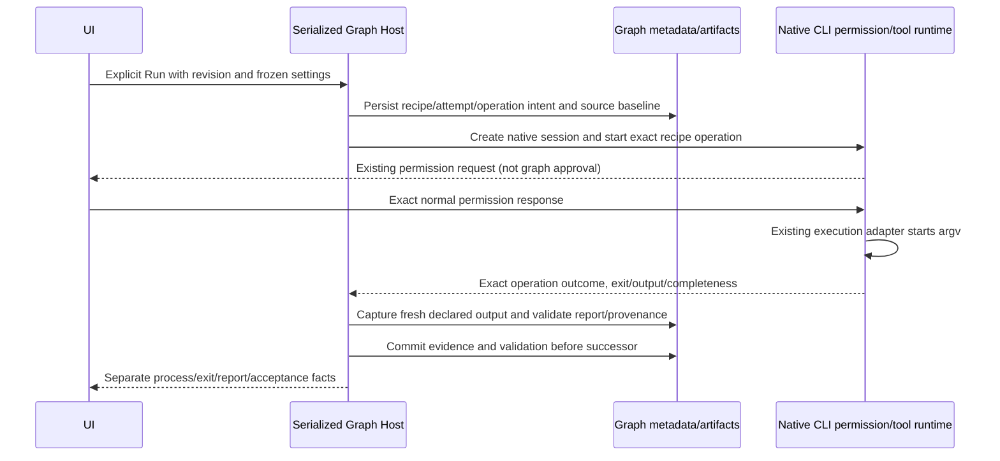

# Z4 — inspectable evidence and deterministic tools

Status: implementation contract, 2026-09-24. The explicit Z4 assignment supersedes earlier prospective restrictions only; historical Z1–Z3 reports and the published z2.2 package remain unchanged. Z5 is not authorized.

## Verified baseline and bounded scope

The checkout remains `main` at `5ded9d1b6e9399e05f6ab6efc60234387322fe20`. Z3 is present as 38 tracked modifications and 212 existing untracked files, all captured before editing in `.tmp/z4-baseline/worktree.json`. Actual Z3 ownership, exact-input proof, approval correlation, one-use native send guard and conservative restart were inspected. Fresh checks pass 82 Graph/native, 13 source, 24 UI and 57 regression tests and both typechecks. Root lint has 70 warnings/zero errors; CLI lint and full formatting retain failures. Live-user/project checks remain NOT RUN.

Version 4 extends the same sequential graph, adding optional Tool nodes, immutable run artifacts and strict structured output. Existing unversioned/v2/v3 definitions and historical runs retain their meaning; reading or migration never executes work. One Start and End, at most eight agent tasks, eight tools and eight approval nodes form one path. Version 4 permits tool-only paths with at least one executable node; existing versions still require an agent. No branches, repair, parallelism, background scheduler, second agent engine, provider store or OS sandbox.

## Owners and public boundary

The existing serialized `GraphState` owns definitions, frozen runs, native/tool attempt intent, artifact manifests and successor admission. Immutable content is adjacent to metadata beneath the existing injected Graph data directory. React uses Graph service/hooks only. Native CLI runtime owns command operations and their exact cancellation through its existing execution adapter and permission/tool machinery. Main remains transport/process scheduling, not a second task owner.

The existing terminal service only writes PTY characters and cannot supply authoritative command completion. Z4 therefore adds the smallest typed native service/protocol extension specified in `Z4_NATIVE_SPEC.md`, using existing native execution rather than a Host subprocess supervisor. Tool nodes have an operation identity and dedicated native session for normal permission UI but no model input. Same-session navigation uses that actual session; ordinary agent tool capabilities remain unchanged.

## Recipes and authority

Editable project recipes use the existing `.zcode/config.json` convention under a dedicated Graph recipes key. Reads are bounded and validated; edits preserve unrelated keys and use atomic writes. Merely loading a recipe never authorizes it. The run freezes selected recipe content/digest. Recipe definition includes a named executable, argument array, workspace-relative cwd, timeout, declared source paths/expected outputs, verifier and optional preceding build reference. No model-selected executable, interpolated model argument, expression evaluation or implicit shell script is supported. Built-in typed substitutions are limited to the exact operation identity, source digest and declared report path; these are independently generated facts, never model text.

Normal native execution approval remains separate from graph approval. The configured invocation is previewed, and the native permission path must approve the exact frozen argv/cwd/timeout. A recipe can execute trusted project code and access network if that command does so; this is not filesystem or network isolation. No network/package permission is inferred from a model claim or gate approval. Existing secret/config owners are untouched; output redaction and explicit completeness/provenance never transform redacted material into exact proof. Raw artifact content is local and excluded from manifest export and telemetry.

## Artifacts and structured output

The artifact contract and bounded parser/storage are specified in `Z4_ARTIFACT_SPEC.md`. Manifest identity includes workspace, run, node, attempt, artifact type/selector, provenance, digest, bytes, capture time and validation. Types cover exact native final text, strict JSON, declared bounded file/diff, native command result and validated test result. Content loads verify ownership/digest/size; unsupported or tampered content is visible and blocks dependent bindings. Paths originate only in declared recipe configuration, never agent-produced text. Traversal, outside paths, symlinks/reparse points, invalid UTF-8/binary and cap violations fail closed. Captures are observations; file hashing is not a lock on external editors.

Agents remain text-first unless explicitly configured for strict JSON-object output with a bounded local schema. Strict parsing rejects duplicate keys, prose/fences/trailing data, unsafe keys and byte/depth limits. Validation failure is distinct from native `completedSuccess`: retain the native proof and invalid output, mark the graph attempt failed for dependencies, and send no repair prompt. Reviewer claims retain model provenance; a `pass` string never becomes test evidence. Whole-artifact bindings select a named output from a particular earlier node attempt; JSON-field bindings use the documented bounded JSON pointer parser and validated JSON only. No latest-session/file fallback or silent truncation.

The optional reviewer profile reserves `evidenceReferences`: when present it must be a schema-declared array of artifact IDs from earlier valid captured attempts in the same run/workspace. Every referenced manifest/content is revalidated; arbitrary paths, foreign IDs or invented references invalidate the output. Other application fields carry model-reported data only.

## Durable sequencing and recovery

Intent is durable before native work; identical dispatch IDs return the same operation and conflicting reuse fails. Lost start/result replies preserve Unknown/Interrupted and block dependents. Read/reopen never invokes start. Cancellation addresses only the stored operation/session/runtime; a cancel request is not terminal proof. A started process without an observed exit remains Unknown even if a contradictory terminal status is received. Cold native operation absence is unknown, not success or permission to retry. Existing native guards and audited inactive-only release remain conservative and must include tool activity. Native process exits with code zero may still produce invalid/incomplete evidence. Persistence failure never advances successors.

## Verification semantics

The Host's committed cache stores a detached snapshot after each successful metadata write. Subsequent mutations to a working run cannot advance its cached dispatch phase or evidence before persistence; failed intent or acknowledgement writes retain the last durable phase for conservative recovery.

Graph metadata replacement reuses the shared `atomicWritePrivateTextFile` primitive while retaining the Graph repository's existing exclusive owner lock. The existing primitive retries only the same atomic file replacement for bounded OS sharing errors, never native creation/start or a Graph decision. Exhausted or other write failures still interrupt before successor admission. Windows native runs and an independent isolated file probe reproduced `EPERM` during rapid replacement, including without a test reader; concurrent readers increased its frequency.

UI keeps process started/known outcome, exit success, fresh report parsing and acceptance separate. Command-only recipes never say Tests passed. Build validation records declared source digest and captured outputs. Tests require exact operation/source/build correlation, declared report path, fresh content, positive configured minimum and required discovered tests with no required skips. Missing, stale, malformed, zero-test, wrong-build/source, capped or failed reports cannot pass. Source and build checks before/after execution detect observed changes, not writes between observations.

`Z4_FIXTURE_SPEC.md` defines the actual isolated C# proof and known test count. Z4-A01 through A11 are required; A04/A05/A06/A08 run the actual native command adapter with real processes and fresh files. Compare final checks against the captured Z3 working tree, preserve baseline exceptions and intermediate failures, capture actual screenshots, and write Z4_REPORT.md. User live-provider/project, installed-profile and packaging checks remain NOT RUN unless separately performed. No staging, commit, push, merge, publication or Z5.

## Z4 native editor and inspection surface

The existing Graph editor adds Tool nodes, upgrading only an explicitly changed draft to version 4. Adding a later approval must preserve version 4. Native Agent Tasks retain all existing settings and tools; optional strict JSON output is a local schema editor with explicit apply and no provider parameter changes. Inputs and gate evidence explicitly select prior-node artifact selectors (`final`, `structured`, `command`, `test` or declared file path), with optional bounded JSON Pointer. Old Start/final-text bindings remain available.

Project recipes are edited as bounded JSON through the Graph hook, loaded on explicit user action and saved with the returned configuration digest. The editor names the `.zcode/config.json` scope, literal argument/placeholder rules and unsupported shells; viewing or saving recipes never executes them. Schema/recipe errors remain visible and never silently normalize into a runnable definition.

The Tool editor exposes its stable node ID in a read-only, selectable field so a Test recipe can name its earlier Build node without reading internal application metadata. Copying or selecting this identity does not alter the graph or dispatch work.

Version-4 human gate digests include the frozen Tool recipes and their digests alongside existing graph and Agent settings. Changing persisted Tool configuration therefore invalidates continuation of the old request. Version-3 digest composition remains unchanged so existing gate history remains readable and continuable under its original contract.

Run inspection shows native process admission/outcome, exit success, fresh report parsing and acceptance as separate facts, frozen recipe/operation/runtime identity, counts/issues, and each artifact's provenance, digest, size and validity. Content is loaded on explicit inspection and rendered as escaped text, including HTML. The metadata export action uses the service's content-excluding projection. Open conversation targets the stored native session for both Agent and Tool nodes. UI state is a disposable projection; the Host remains authoritative for execution, validation and stale-result rejection. English/Chinese labels, shared controls, theme tokens, keyboard controls and the existing stacked narrow layout are retained.

Tool inspector report freshness and parsed-report facts apply only to Test recipes. Build and command recipes display localized "Not applicable" for these facts, distinct from an unestablished Test result, so successful Build evidence cannot appear to have failed a report requirement. The labels explicitly name Test reports. Deleting a Tool node uses a Tool-specific label while retaining the same editor removal command and edge cleanup.
