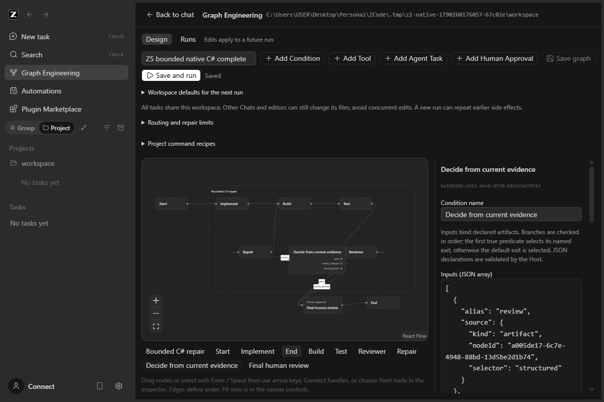

# Z5 — explicit routing and bounded repair

Date/timezone: 2026-09-24, Asia/Kuala_Lumpur. Selected milestone: **Z5 only**.

Checkout: `C:\Users\USER\Desktop\Personal\ZCode`, branch `main`. Starting and current HEAD: `5ded9d1b6e9399e05f6ab6efc60234387322fe20`. The starting worktree contained **664 existing changed/untracked entries** (52 tracked changes and 612 untracked files), including uncommitted Z3/Z4. They were inventoried and copied before editing. The user's instruction explicitly prohibits staging, commits, pushes, merges and Z6.

## Status

**IMPLEMENTED WITH NAMED BASELINE EXCEPTIONS — ready for user check.** All twelve Z5 acceptance rows are covered, including **20 required controlled native scenarios**, actual presentation, manual setup/reopen and focused native compatibility reruns. The complete and no-progress scenarios were rerun successfully after the last guard corrections and rebuild. No required isolated prerequisite or implementation blocker remains.

Implementation: typed Conditions, exclusive DAG routing and one explicitly bounded repair region are implemented in the existing Graph Host, React UI and native service integration. There is no second agent engine, provider owner, native command executor, C# sidecar or embedded Vue app.

Automated evidence: the current source passes **276 source/fixture tests**: 141 Graph, 8 native Host adapter, 13 source snapshot, 70 services/protocol/harness fixtures, 34 UI and 10 native recipe/session tests. Controlled native evidence is separate from this total. Root/CLI typechecks, root lint, architecture and CLI/desktop builds pass. CLI lint and whole-checkout formatting remain named baseline exceptions, detailed below.

User-operated real-provider/project checks, packaged installer/second-PC checks and unavailable platforms are **NOT RUN**. A controlled native PASS does not accept the feature on the user's behalf. Historical Z1 screenshots establish a greeting and native Chat navigation only; they do not establish project Read/Edit/test, permission, cancellation or restart acceptance.

## Prerequisites and baseline

Read the applicable root `AGENTS.md`, `DESIGN.md`, architecture-governance skill and controlled module context, current Graph contracts/specs, actual Z4 report and source, and the complete selected [prompt](future/Z5_CODEX_PROMPT.md), [task](future/Z5_TASK.md), [roadmap](future/ROADMAP.md), [execution rules](future/EXECUTION_RULES.md) and [report template](future/REPORT_TEMPLATE.md). Historical roadmap descriptions were checked against source rather than treated as proof of completion.

The actual prerequisites exist: Host-owned durable attempts and exact native session/command identity; Z3 gates and inactive-only release; Z4 immutable artifacts, strict structured output, declared native recipes and source/build/test correlation. Fresh isolated baseline native runs exercised Z4 Read/Edit/Build/Test plus independent tests and completed restart, Tool crash recovery, invalid structured output, and ordinary Chat. All passed. No prerequisite blocker required implementing another milestone.

Pinned environment: **Node 24.14.0, pnpm 10.33.2**, prepared checkout dependencies and Electron runtime; **.NET SDK 8.0.425** for the synthetic C# fixture. The fixture uses cleared NuGet feeds and no external packages. The C# source is test material, not an application sidecar.

The freshness check initially failed because the sandbox denied writing `.git/FETCH_HEAD`; the scoped retry of the same read/synchronization check passed, reporting main 0 ahead/0 behind origin/main. Root/CLI typechecks passed at baseline. Baseline tests totaled 233 passes. Root lint had 70 warnings/0 errors; CLI lint had 53 warnings/85 errors; full formatting named 2,870 failing paths. Original failures remain in the retained baseline logs.

The published z2.2 identity/updater/installer path, historical reports/evidence, native Chat and configuration ownership are preserved. No installed app profile or credentials were inspected. The separate old Vue/C# prototype was not opened or changed. No earlier M4 work was assumed.

## Contracts and source map

[Z5_SPEC.md](Z5_SPEC.md) and the Graph [CONTRACT.md](../../packages/services/src/graph-engineering/CONTRACT.md) were updated before behavior changes, including the owner/event sequence diagram, typed predicates, iteration lineage, native failure evidence, limits, approval ordering and recovery. The contract and base type split prevents a type dependency cycle and keeps the public boundary within its architecture limit.

| Owner / boundary                                      | Current implementation                                                                                                                                                                                  |
| ----------------------------------------------------- | ------------------------------------------------------------------------------------------------------------------------------------------------------------------------------------------------------- |
| Public DTOs and compatibility                         | `packages/services/src/graph-engineering/routing-types.ts`, `base-types.ts`, `contract.ts`, public service exports                                                                                      |
| Pure topology, predicates and persisted-record checks | `domain/routing*.ts`, `domain/definition.ts`, `domain/record*.ts`, `domain/approvals.ts`, `domain/release-validation.ts`                                                                                |
| Serialized mutable owner and persistence              | `app/state.ts` (`GraphState`), `app/service.ts` (`GraphEngineeringService`), existing `adapters/repository.ts`                                                                                          |
| Frozen plan, fresh iterations, decisions and budgets  | `app/run-plan.ts`, `routing-plan.ts`, `routing-decision.ts`, `routing-checks.ts`, `routing-deadline.ts`, `routing.ts`                                                                                   |
| Native admission and exact evidence                   | Existing `app/sequencer.ts`, `tools.ts`, `tool-evidence.ts`, `artifacts.ts`, `approvals.ts`, `recovery.ts`                                                                                              |
| React projection and commands                         | `packages/ui/src/graph-engineering/GraphCanvas.tsx`, Condition/region/confirmation/inspection components; `hooks/useGraphEngineering.ts`, `useGraphReadiness.ts`; existing view store and EN/CN locales |
| Controlled native and independent fixtures            | `scripts/graph-engineering/z5-*`, reusing the existing isolation and native harness facilities                                                                                                          |

The actual Agent path remains `createGraphNativePort` → `IZCodeSessionService.initializeWorkspace/createSession` → native runtime identity → `sendConversationCommandV4` with the existing `sendText` envelope. The Host persists runtime-assigned session ID, command/input ID and dispatch intent before sending. Native observations correlate the exact command and authoritative terminal fact. The native input ledger's row ID is its queue item ID, not the graph input ID; evidence checks session, `sourceCommandId` and queue item attribution explicitly.

Tools continue through `createGraphToolPort` → existing `startRecipe`, `inspectRecipe` and `cancelRecipe` on `IZCodeAgentService`. There is no new native protocol or native process supervisor in Z5. Open conversation selects the stored existing session via the existing workspace-to-Chat navigation; inspecting an old iteration submits no input.

Unversioned/v2/v3/v4 definitions and history retain their original semantics. Only an explicit draft upgrade introduces version 5. Old records are not rewritten as repair graphs or executed when opened. The existing `run` method gains a typed `action: "continue"` command variant for an exact route checkpoint, preserving the existing service method boundary. Graph approval continuation remains a separate existing command.

Workspace identity remains `workspaceIdentity?.trim() || workspacePath`; file operations use the captured path. Native model/provider/settings services remain authoritative. Permission and question responses use the existing native UI and policy. Graph approval does not replace permission approval, change workspace mode, or authorize publication.

## Implemented behavior

Conditions evaluate a bounded declarative language over explicitly bound validated JSON artifacts: typed scalar equality/inequality, finite numeric comparisons, presence and bounded boolean combinations. Named exits have ordered priority, a declared default and an explicit NeedsHuman error policy. Missing operands and wrong types cannot coerce to a false or successful branch. Exactly one route is selected, other nodes become Skipped, and an exclusive merge does not wait for an unselected branch. No JavaScript expression or model-supplied target executes.

Readiness rejects arbitrary cycles, undeclared exits, invalid region entries/exits, missing current evidence dependencies and final-gate bypass. Every End path crosses the required final Human Approval, and no Agent Task or Tool can run after that final approval. A Test's configured Build must dominate it on every applicable initial and repair path, not merely appear earlier in a topological list. Invalid preflight creates no session or run.

One optional repair region freezes its initial writer, repair writer, body, decision, allowed exits, source paths and no-progress policy. The default is **two repairs after iteration zero**, with a hard maximum of five repairs. Run bounds are at most **64 native admissions** and **24 hours**; the demonstrated graph uses 12 admissions and 600,000 ms. Each Agent input and Tool operation reserves one admission before session creation. Internal model requests are separate and are not capped by that admission counter. Token/cost usage is explicitly unavailable because no authoritative native usage ledger is exposed here.

Every iteration has fresh attempt/command/operation IDs and fresh native sessions in the same captured workspace. An explicit iteration-to-attempt map selects all execution evidence; no unqualified first/last historical attempt is used. Earlier failures, proofs, immutable artifacts, decisions and skipped attempts remain inspectable.

Z5 distinguishes test provenance from test acceptance. A valid `verification` artifact can report genuine failed assertions only after an observed process exit, complete output, fresh exact operation/source/build report, positive configured named tests and intact evidence. The Tool remains Failed. A missing/stale/wrong-source report, failed Build, timeout, cancellation, unknown process, malformed output or transport uncertainty cannot authorize repair. Schema-valid reviewer PASS cannot override failed machine tests.

Reviewers must reference the exact current Test verification artifacts. Repair input binds a bounded immutable feedback envelope with prior iteration identity, current source digest, actual findings, exact artifact identities and machine observations. No whole transcript or repository is implicitly copied. After the authorized writer, the Host captures the new source baseline. Unexpected later source/configuration changes stop rather than silently authorize another attempt.

No-progress compares the declared source plus complete findings and named test statuses/messages, excluding invocation identities. A repeated failed state stops NoProgress; distinct failure details remain distinct. Maximum repairs, admissions and deadline stop visibly and never become successful verification. The Host deadline observer persists expiry before cancelling only exact owned native handles. Late events reconcile their original attempts without starting another iteration.

Every selected Condition decision, inspected values and successor checkpoint persist before downstream admission. Reopening never dispatches. A safe, still-planned checkpoint with definitive inactivity can be explicitly continued after rechecking source/configuration, original evidence, budgets and identities. Duplicate continuation retains the same request and admits once. Accepted or possibly accepted repair input remains Interrupted/Unknown after restart, without replacement or replay. Audited release covers all historical attempts and does not treat a missing cold Tool operation as cleanup proof.

The UI adds labelled Condition ports, a selectable bounded region, frozen-run confirmation, iteration selection, exact Condition values/routes, current limits/deadline/stop reason, and exact-session navigation. Changing an exit removes only obsolete outgoing exit edges; users wire new exits explicitly. Run saves its cloned definition before confirmation and submits exactly the displayed revision/settings. Pending confirmation retries cannot silently substitute a new intent. EN/CN text and narrow desktop layout use existing components and tokens.

## Verification matrix

The native harness launches actual Electron, Host, CLI, native permissions/questions and tools in private app/HOME/config/data and synthetic workspaces. Automatic providers are loopback fixtures; application network traffic is restricted by the existing isolation harness. Native metadata and SQLite are inspected read-only. A negative scenario's PASS means the required refusal occurred, not that its project tests passed.

| Requirement ID | Result | Layer                               | Exact command/action                                                                                                                         | Actual result                                                                                                                | Evidence path                                                                          |
| -------------- | ------ | ----------------------------------- | -------------------------------------------------------------------------------------------------------------------------------------------- | ---------------------------------------------------------------------------------------------------------------------------- | -------------------------------------------------------------------------------------- |
| Z5-A01         | PASS   | source + native                     | Historical graph/gate/tool tests; fresh baseline Z4 `complete`, `crash`, `json-invalid` and ordinary Chat; final Z4 complete and Chat reruns | Old history/acyclic semantics retained; ordinary tools and same-session navigation remain available                          | [native index](evidence/z5/native/index.json), `native/final-regressions/`, check logs |
| Z5-A02         | PASS   | source + native UI                  | `z5-native-smoke.mjs --scenario=condition-{true,false,default,missing,wrong-type}`                                                           | True/false/default each complete one branch plus merge with 3 inputs; missing/wrong type stop NeedsHuman after 1 input       | [native index](evidence/z5/native/index.json)                                          |
| Z5-A03         | PASS   | native + independent process        | `z5-native-smoke.mjs --scenario=complete`; independent unchanged C# runner                                                                   | Initial 0/3, repair one 2/3, repair two 3/3; exact feedback; final human gate and independent success                        | [complete](evidence/z5/native/current/complete/summary.json)                           |
| Z5-A04         | PASS   | native                              | `--scenario=reviewer-pass`                                                                                                                   | Valid JSON PASS plus genuine failed machine tests stops NeedsHuman; no final-success admission                               | `native/current/reviewer-pass/`                                                        |
| Z5-A05         | PASS   | native + source                     | `--scenario=exhausted`, `admissions`, `deadline`; async admission/deadline fixtures                                                          | Exactly frozen bounds, persistent counters; expiry targets only owned active work; no next input                             | `native/current/{exhausted,admissions,deadline}/`                                      |
| Z5-A06         | PASS   | native + independent evidence audit | `--scenario=no-progress`                                                                                                                     | Same source/findings/tests stop after two total iterations; distinct permanent failures reach repair limit                   | `native/current/no-progress/`, fingerprint audit log                                   |
| Z5-A07         | PASS   | native + source                     | `--scenario=invalid-json`; `z5-native-boundaries.mjs --scenario=unknown-repair`; unknown ACK fixtures                                        | Invalid output sends no repair; real accepted uncertain repair is not replayed on reopen                                     | respective native directories                                                          |
| Z5-A08         | PASS   | native + source                     | `z5-native-boundaries.mjs --scenario=decision-restart`; duplicate Continue fixture                                                           | Persisted planned checkpoint reopens with zero sends; explicit duplicate Continue admits one repair; counters/IDs survive    | `native/current/decision-restart/`                                                     |
| Z5-A09         | PASS   | native                              | `--scenario=cancel`, `reject`                                                                                                                | Stop during repair; no subsequent iteration; unrelated native Chat question survives and completes                           | respective native directories                                                          |
| Z5-A10         | PASS   | native + source                     | `--scenario=old-artifact`, `stale-source`; `--scenario=stale-continue`; stale/out-of-order fixture facts                                     | Prior-iteration references and changed source cannot authorize current repair; late facts do not advance unknown runs        | respective native directories and Graph tests                                          |
| Z5-A11         | PASS   | source + native UI                  | `z5-native-invalid.mjs`; topology/recipe preflight tests                                                                                     | Gate bypass and off-region cycles rejected with zero native work                                                             | invalid native summary and Graph tests                                                 |
| Z5-A12         | PASS   | native UI                           | Complete run iteration selection, Open conversation, region/Condition inspection and completed restart; `z5-native-presentation.mjs`         | Exact historical sessions/artifacts/selected values; navigation creates zero inputs; actual Chinese/light 760px desktop view | actual screenshots and complete summary                                                |

The successful repair contains **six Agent inputs and six native Build/Test processes = 12 Graph admissions**, across three iterations, with **25 controlled model requests: 19 execution requests plus 6 auxiliary title requests**. Initial Implement is **one admitted input**, making four execution requests and one auxiliary request. The three Reviewers account for nine execution plus three auxiliary requests; the two Repairs account for six execution plus two auxiliary requests. All **12 actual native sessions are distinct roots** in the native session ledger, with `parent_id = null` and the exact captured workspace directory. Counts come from native session/input/operation evidence and the [controlled request ledger](evidence/z5/native/current/complete/controlled-model-requests.json), not animation or prompt text.

Final successful run: `70b10950-5f51-43d7-8f0c-8715e567d7a8`. Initial Agent session `sess_c3d516cd-925d-4881-a60f-0551235f2fd3` owns input/command `087b4e21-94d0-47de-bc57-be21544efa5e`. The following actual Test attempts belong to that same run:

| Iteration | Exact iteration ID                     | Test operation                         | Verification artifact                  | Actual tests                |
| --------- | -------------------------------------- | -------------------------------------- | -------------------------------------- | --------------------------- |
| Initial 0 | `0ef5dd66-21a9-426f-910f-970f8f1cc8e9` | `4ebb0e0f-3b7f-402c-bcf1-f24350c981f6` | `bc2a8a5e-1d2e-4b8a-87d9-69ebe1b7efe7` | 0 passed / 3 failed, exit 1 |
| Repair 1  | `d2227c0e-f093-4499-ba48-0a72a7e15f54` | `6a5a9058-709f-46d1-b555-34d21b18a8f6` | `ffdf0e39-9e95-460b-992c-f62cfea5f6bd` | 2 passed / 1 failed, exit 1 |
| Repair 2  | `261845be-08fe-4cfc-b4df-a295c68d395d` | `eb6127a9-de38-497b-851e-ea76605f9da0` | `edad99e5-f8e2-4869-964b-7f6012cfa7db` | 3 passed / 0 failed, exit 0 |

Final Test session: `sess_c2812aa7-62af-4b5a-ac6f-cf71ea26cdcb`; source digest `295b19f442eebbacb47a3206595fb9de5a25226fe60be79880eaa0a2a2711bbe`; build digest `b1aae4d1904813e89c8d7610429780cd782a2781a0ebf3ce49931ef1fa352a9a`. After explicit final approval, independent unchanged runner operation `1502f510-3a1a-4485-8fd0-8bfbc8e6306f` exits 0 with all three named tests passed. Complete identities and report provenance are retained in the [native summary](evidence/z5/native/current/complete/summary.json).

| Controlled scenario                     |                   Agent inputs | Tool processes | Model requests | Graph admissions | Total iterations | Final result                                                   |
| --------------------------------------- | -----------------------------: | -------------: | -------------: | ---------------: | ---------------: | -------------------------------------------------------------- |
| Complete                                |                              6 |              6 |             25 |               12 |                3 | Completed only after final human approval                      |
| Permanent failure                       |                              6 |              6 |             25 |               12 |                3 | BudgetExhausted; no fourth iteration                           |
| Admission bound                         |                              3 |              2 |             13 |                5 |                2 | BudgetExhausted; no sixth admission                            |
| Deadline                                |                              3 |              2 |             11 |                5 |                2 | BudgetExhausted after exact owned cancellation                 |
| No progress                             |                              4 |              4 |             16 |                8 |                2 | NoProgress                                                     |
| Reviewer false PASS                     |                              2 |              2 |              9 |                4 |                1 | NeedsHuman                                                     |
| Invalid reviewer JSON                   |                              2 |              2 |              9 |                4 |                1 | NeedsHuman                                                     |
| Old artifact                            |                              4 |              4 |             17 |                8 |                2 | NeedsHuman                                                     |
| Cancel                                  | 4 including one unrelated Chat |              2 |             14 |                5 |                2 | Cancelled; unrelated Chat completes                            |
| Reject                                  | 4 including one unrelated Chat |              2 |             16 |                5 |                2 | Rejected; unrelated Chat completes                             |
| Stale source                            |                              2 |              2 |             10 |                4 |                1 | NeedsHuman before first repair                                 |
| Decision restart                        |                              3 |              2 |             11 |                5 |                2 | One explicit continuation, then exact cancellation             |
| Unknown repair restart                  |                              3 |              2 |             11 |                5 |                2 | Interrupted with original sending identity; no Continue/replay |
| Stale continuation                      |                              2 |              2 |              9 |                4 |                2 | NeedsHuman before any repair input                             |
| Condition true / false / default (each) |                              3 |              0 |              9 |                3 |                1 | Completed through selected branch and final approval           |
| Condition missing / wrong type (each)   |                              1 |              0 |              3 |                1 |                1 | NeedsHuman; no selected exit                                   |

Boundary evidence deliberately stalls the next `creating` metadata write after a durable decision, or the initial repair `accepted` metadata write after real native acceptance, then closes and reopens the exact owned app. It is an actual persistence/crash-boundary test, not a claim that a transport packet was dropped. At the accepted boundary the Graph projection cannot publish the stalled write, so the harness invokes the mounted panel's existing `onOpenConversation` callback with the already-created session/workspace identity and verifies the real pending native question. Normal iteration navigation is independently exercised through the actual Open conversation button. No native session or business-state row is injected.

Repository checks and baseline comparison:

| Check                                               | Actual result                                                                                    | Evidence                                                                                                                                                       |
| --------------------------------------------------- | ------------------------------------------------------------------------------------------------ | -------------------------------------------------------------------------------------------------------------------------------------------------------------- |
| `pnpm typecheck`                                    | PASS, exit 0                                                                                     | [typecheck](evidence/z5/checks/typecheck-final.log)                                                                                                            |
| `pnpm --dir apps/zcode-cli typecheck`               | PASS, exit 0                                                                                     | [CLI typecheck](evidence/z5/checks/cli-typecheck.log)                                                                                                          |
| Graph service tree                                  | 141 PASS, zero skipped                                                                           | [Graph tests](evidence/z5/checks/graph-tests-final.log)                                                                                                        |
| Native Host adapter / source snapshot               | 8 / 13 PASS                                                                                      | separate final logs                                                                                                                                            |
| Services, protocol and independent harness fixtures | 70 PASS                                                                                          | regression final log                                                                                                                                           |
| UI                                                  | 34 PASS                                                                                          | UI final log                                                                                                                                                   |
| Native recipe/session executor                      | 10 PASS                                                                                          | native final log                                                                                                                                               |
| `pnpm lint`                                         | PASS, 70 warnings/0 errors, unchanged baseline count                                             | [root lint](evidence/z5/checks/root-lint-final.log)                                                                                                            |
| `pnpm --dir apps/zcode-cli lint --continue`         | **FAIL**, exit 1; 53 warnings/85 errors, exact baseline parity                                   | [CLI lint](evidence/z5/checks/cli-lint.log), [comparison](evidence/z5/checks/cli-lint-comparison.json)                                                         |
| `pnpm architecture:check --changed`                 | PASS; zero violations/baseline/new                                                               | [architecture](evidence/z5/checks/architecture-final.log)                                                                                                      |
| Native CLI / desktop builds                         | PASS, exit 0; emitting steps run sequentially, before native apps                                | build logs                                                                                                                                                     |
| Full / scoped formatting                            | Full **FAIL**, exactly the same 2,870 baseline paths; scoped **PASS**, no new failing paths      | [full log](evidence/z5/checks/format-final.log), [comparison](evidence/z5/checks/format-comparison.json), [scoped](evidence/z5/checks/scoped-format-final.log) |
| Diff whitespace / worktree preservation             | PASS; 664 starting entries retained: 620 byte-identical, 44 intentionally extended, none missing | [diff check](evidence/z5/checks/diff-whitespace-final.log), [preservation](evidence/z5/checks/baseline-inventory-comparison.json)                              |

CLI comparison uses a multiset of package/file/severity/rule/message and compares positions/counts too: **138 diagnostics before and after; zero added, removed or changed**. No Z5 CLI/native protocol source change enlarges the inherited violations. The preexisting max-lines counts remain `create-app.ts` 1,155, `app/types.ts` 592 and protocol `server.ts` 834. No rules or baselines were suppressed.

## Intermediate failures and corrections

- Working typecheck/architecture exposed a contract type cycle, public-contract size and test imports in the pure domain. Types were moved to the existing base contract; executable tests moved to app test files. Final checks pass without changing architecture rules.
- The first native confirmation check showed displayed revision 1 but admitted revision 2 because Confirm saved again. The UI now saves the captured draft before showing confirmation and submits that exact revision. Focused retry/settings regressions and the native complete rerun pass.
- The initial complete ledger assertion compared graph input IDs with native queue row IDs. The real workflow had already produced 0/2/3 passing tests, but that harness run remains FAIL. The assertion now correlates actual session, `sourceCommandId` and queue item identities; a separate rerun passed.
- The first Condition harness passed an empty optional-verification string, which is invalid JSON. It now supplies explicit `null`. No product validation was relaxed; that failed setup dispatched zero inputs.
- Actual native Condition editing revealed a stale outgoing edge after renaming the default exit. The editor now removes only outgoing ports no longer declared. A focused failing/passing unit regression and native rerun verify preserved incoming/unrelated/current-exit edges.
- Actual selection of Condition showed four output editors, expected zero. Two stateful sibling components reused the same React key. Distinct `output:`/`settings:` keys remove stale controls. Native assertions now require Condition/End zero output editors and Agent one. The original failure remains retained.
- Independent review found that final-gate dominance alone allowed native work after the final review. Readiness now rejects that order. It also found that a topological list could hide a Build skipped on another branch; shared domination preflight rejects before any native creation.
- Reserving an intermediate approval's successor made that successor look like an unapproved predecessor. Validation now slices the actual visited prefix before the gate. A regression proves exactly one fresh successor input reaches the final gate.
- Cold prepared final gates could be mistaken for their incoming route checkpoint. Preparing the gate consumes that checkpoint atomically; cold recovery uses the original approval continuation. The focused restart regression passes.
- Deadline crossing asynchronous revalidation or the durable sending write now prevents native send/start. A sending intent is retained as uncertain rather than rolled backward to make it replayable. Late authoritative completion after unknown acceptance reconciles without routing.
- Reviewer outcomes now require strings without coercion. A Condition with no reviewer can route trustworthy failed observations to a non-success exit without treating a default internal value as model PASS; the success exit remains blocked. Both focused regressions were observed failing before correction and passing afterward.
- Final review reproduced a non-string predicate operator such as `["eq"]` passing enum coercion and falling through to a different comparison. Operators now require actual strings in the authoritative domain validator. Definition/readiness/direct-evaluation regressions fail closed.
- Individually valid Test/reviewer inputs could combine into an oversized repair-feedback envelope after the Condition had been tentatively marked visited. Its Invalid error then conflicted with persisted route-history validation. The error path now removes only that invalid current Condition from visited history, retains its exact bindings/values/message and persists NeedsHuman with zero successor/iteration/input. Budget/NoProgress retain their intentional Evaluated decision history. Permanent regressions reproduce the original failure and pass after correction.
- The first presentation script reopened a saved design in Runs and timed out selecting its draft node. Clicking Design corrected the harness; the original log/profile remains retained. No product behavior was relaxed.

Intermediate logs/screenshots are retained under the native index and checks. Setup or test-harness failures are distinguished from product failures. No failed run is relabelled as a successful execution.

## Visual and operator evidence

All screenshots are from actual native Electron with synthetic fixtures and controlled providers, not mockups or live-user evidence. The full graph can require zoom/pan; use the inspector and Fit controls to read the selected node and region.

- [Frozen confirmation](evidence/z5/native/current/complete/z5-run-confirmation.png): actual saved definition/settings and visible finite limits.
- [Initial failure](evidence/z5/native/current/complete/z5-iteration-0-native-test-report.png) and [its repair route](evidence/z5/native/current/complete/z5-iteration-0-route.png): iteration zero's real failed tests and exact selected Condition values.
- [Second repair's Test evidence](evidence/z5/native/current/complete/z5-iteration-2-native-test-report.png) and [pass route](evidence/z5/native/current/complete/z5-iteration-2-route.png): current artifacts and final-success route after three passing assertions.
- [Final human gate](evidence/z5/native/current/complete/z5-final-current-evidence-gate.png), [region limits](evidence/z5/native/current/complete/z5-region-final-evidence.png) and [completed history reopened](evidence/z5/native/current/complete/z5-completed-history-reopened.png): approval remains explicit and reopen sends nothing.
- [Readable region and Condition](evidence/z5/native/current/presentation/z5-readable-region-condition.png), [explicit limits](evidence/z5/native/current/presentation/z5-explicit-repair-limits.png), [Chinese/light narrow canvas](evidence/z5/native/current/presentation/z5-chinese-light-narrow-canvas.png) and [Condition editor](evidence/z5/native/current/presentation/z5-chinese-light-narrow-condition.png): actual pointer-dragged layout and 760 × 1000 desktop presentation, visually inspected with no horizontal document overflow. Setup/presentation sent zero inputs/model requests.



Immutable original `iteration-0-report.json.txt`, `iteration-1-report.json.txt`, `iteration-2-report.json.txt` and corresponding `verification.json.txt` files accompany the summary. The report bytes are not reformatted. Generated summary wrappers may be formatted for repository consistency.

## User checks — separate

User authorization/performed-by/date/provider alias/real workspace and corresponding run/node/session/input IDs: **NOT RUN / not supplied**. No user-operated tool/test result, restart, cancellation or approval PASS is inferred.

The following remain **NOT RUN**: live-provider/real-project acceptance; installed app upgrade/uninstall; another PC; Z5 installer/package/publication; mobile Web/remote Graph; macOS/Linux native acceptance. A narrow Windows desktop screenshot is not mobile Web proof. The historical z2.2 installer does not contain these uncommitted Z3–Z5 changes.

## Diff and security review

Incremental changes are limited to Graph contracts/domain/Host/UI, focused tests, Z5 controlled native scripts/specs/report/evidence and current progress. Existing native engine, provider/configuration ownership, public protocol and packaging were reused. Final independent review inspected routing, exact evidence, native uncertainty, all-history release and predecessor compatibility; resolved findings are listed above.

No existing credentials, installed settings, company repositories, private integrations or paid/live-model account was used. Only exact task-owned app processes are stopped. No private runtime tables are written. Existing Z3/Z4 and historical evidence are compared to the captured pre-Z5 inventory, not merely HEAD.

All **664** starting entries remain present: **620 byte-identical**, **44 deliberately extended within Z5**, **zero missing**. All 461 captured historical evidence files, 32 earlier fixture scripts and 12 captured CLI entries remain byte-identical, as do the historical Z3/Z4 specifications and reports. HEAD is unchanged and the staged index is empty. Final source diff, scoped formatting and whitespace checks pass. Full formatting still fails on the exact same 2,870 baseline paths (zero additions/removals); CLI lint remains the exact 53-warning/85-error baseline. This is not a claim that every invoked repository check passed.

Limits remain explicit: observed source hashes are not an OS filesystem lock; unrelated Chat/editor writes can make a graph stale. Recipes can execute trusted workspace code and are not a command/network sandbox. Existing native descendant cleanup remains best effort; missing proof stays unknown. No encryption, general retention manager, tamperproof certification, exactly-once external side effects or token-cost guarantee is claimed. Strict bounded JSON/report/file limits from Z4 still apply. There is one bounded region, sequential native work, no automatic approval, no hidden repair agent, no parallel workers and no uncertain replay.

## Exact local reproduction and manual check

Run PowerShell in this repository with the pinned toolchain and prepared dependencies. These commands were exercised in this checkout; a fresh dependency installation or second-PC build was NOT RUN. If this machine's project-local toolchain is available:

```powershell
. .\.tmp\z1-env.ps1
$env:PATH = "$PWD\node_modules\.bin;$env:PATH"
pnpm typecheck
pnpm --dir apps/zcode-cli typecheck
pnpm lint
pnpm --dir apps/zcode-cli lint --continue
pnpm architecture:check --changed
pnpm fmt:check
$graphTests = @(Get-ChildItem packages/services/src/graph-engineering -Recurse -Filter '*.test.ts' | ForEach-Object FullName)
node node_modules/tsx/dist/cli.mjs --test @graphTests packages/services/src/zcode-agent/*.test.ts
node node_modules/tsx/dist/cli.mjs --test packages/services/src/git/sourceSnapshot.test.ts packages/services/src/git/sourceSnapshot.edges.test.ts
node node_modules/tsx/dist/cli.mjs --test packages/services/test/*.test.ts apps/zcode-cli/packages/bootstrap/src/zcode-protocol-v4/interaction-registry.test.ts scripts/graph-engineering/*.test.mjs
node node_modules/tsx/dist/cli.mjs --test apps/zcode-cli/packages/bootstrap/src/app/native-recipe.test.ts apps/zcode-cli/packages/bootstrap/src/app/native-session-create.test.ts
$env:TSX_TSCONFIG_PATH = 'packages/ui/tsconfig.json'
node node_modules/tsx/dist/cli.mjs --test packages/ui/test/*.test.ts
Remove-Item Env:TSX_TSCONFIG_PATH
# Finish emitting checks before either bundle or any native app is launched.
$env:ZCODE_ENV = 'test'
node scripts/build-desktop-agent-cli.mjs
pnpm --filter @zcode/desktop build:no-runtime-assets
```

On another development machine, put Node 24.14.0 and pnpm 10.33.2 on PATH and make .NET SDK 8.0.425 available to `dotnet` (the fixture disables SDK roll-forward). Follow the existing [setup instructions](Z1_SETUP.md); `.tmp/z1-env.ps1` is this checkout's local environment helper, not a distributable prerequisite. Do not point acceptance checks at an installed profile. The ordinary production development launcher is not the isolated test entrypoint.

Controlled acceptance commands (each creates its own private profile and synthetic workspace):

```powershell
foreach ($case in @('complete','exhausted','admissions','deadline','no-progress','reviewer-pass','invalid-json','old-artifact','cancel','reject','stale-source','condition-true','condition-false','condition-default','condition-missing','condition-wrong-type')) {
  node scripts/graph-engineering/z5-native-smoke.mjs "--scenario=$case"
  if ($LASTEXITCODE -ne 0) { throw "Native scenario failed: $case" }
}
foreach ($case in @('decision-restart','unknown-repair','stale-continue')) {
  node scripts/graph-engineering/z5-native-boundaries.mjs "--scenario=$case"
  if ($LASTEXITCODE -ne 0) { throw "Native boundary failed: $case" }
}
node scripts/graph-engineering/z5-native-invalid.mjs
node scripts/graph-engineering/z5-native-presentation.mjs
node scripts/graph-engineering/z5-launch-manual.mjs --verify-setup
```

For user-operated testing, run `node scripts/graph-engineering/z5-launch-manual.mjs`. It prints the exact private profile/workspace, prompts, reviewer schema, Condition JSON, declared source paths and recipe commands. It configures no provider and sends no Agent input or Tool command. Configure only an authorized provider in that isolated app when choosing to perform live acceptance; manual mode permits that user-configured provider's traffic. Keep the printed profile path for reopening.

1. Upgrade the draft explicitly to the sequential editor, then version 5. Create `Start → Implement → Build → Test → Reviewer → Condition`; add `Repair → Build`. Wire `pass → Final human review → End`, `needs_changes → Repair`, and `needs_human → Final human review`. Keep the final gate outside the region. Set End's output source to Test. Positions are presentation; explicit edges define execution.
2. Add Build/Test as Tool nodes. Copy Build's displayed Node ID. In a second repository terminal run `node scripts/graph-engineering/z5-manual-recipes.mjs --profile "EXACT_PRINTED_PROFILE" --build-node-id "COPIED_BUILD_NODE_ID"`. Load project recipes, paste the printed array and Save recipes; select `fixture-build` / `fixture-test`. Printing recipes does not execute them.
3. Use the launcher's Implement instructions to seed the deliberate `left + right + 1` defect in `MathOps.cs`, preserving `Runner.cs` and all build/test configuration. Reviewer uses bound alias `verification`, Test artifact selector `verification`, the printed strict output schema and exact `evidenceReferences`. Repair uses bound alias `feedback` and source `repair-feedback`. A real manual provider may repair in one attempt; two repairs are a deterministic acceptance-fixture condition, not a required delay imposed on users.
4. Paste the printed Condition inputs/branches/verification with the actual Test/Reviewer node IDs. Set **Default exit** to `needs_human`, Apply, then connect named exits. Final human review binds Test selector `test` and requires a comment. In routing settings select the final gate, admissions 12 and deadline 600000 ms. Click **Add bounded repair region** and select initial/repair/decision IDs; enter all six body node IDs one per line, repair exit `needs_changes`, pass exit `pass`, maximum repairs 2, no-progress enabled and the printed source paths one per line. Save and resolve readiness errors.
5. Click Run; inspect the saved revision, settings and limits before Confirm. Respond to actual native permissions/questions separately. Switch iterations in each node inspector; compare displayed session/input/operation/artifact IDs with the existing native conversation. Navigation must produce zero new inputs. A failed report remains failed even if the model claims PASS.
6. Inspect all three named assertions (`add-positive`, `add-negative`, `add-zero`), current source/build/report identities and the final gate. After genuine Build/Test, run `node scripts/graph-engineering/z5-manual-recipes.mjs --profile "EXACT_PRINTED_PROFILE" --verify` for the independent unchanged runner. Approve only the current evidence; approval does not authorize Git publication.
7. Quit and reopen using `node scripts/graph-engineering/z5-launch-manual.mjs --profile "EXACT_PRINTED_PROFILE"`. Confirm history is unchanged and nothing starts. Exercise cancellation/rejection and safe checkpoint continuation in separate disposable runs; unknown accepted work must remain non-replayable. Record actual IDs, actions, tool/files/test results and screenshots before declaring user acceptance.

Automated [fresh setup](evidence/z5/native/manual-setup/summary.json) and [exact-profile reopen](evidence/z5/native/manual-reopen/summary.json) pass with zero inputs/processes/model requests, unchanged private source/configuration/sentinel bytes and preserved settings across reopen. The recipe-printer and explicit independent `--verify` helper also passed on a separate genuinely built synthetic fixture. These are setup/helper checks, not user-operated acceptance. Never reset installed settings or terminate processes by name to reproduce these checks.

## Next eligible milestone

**Z6 — Templates and game pilot**, after Z5 verification and the applicable user/lead acceptance decision. **Not started.** Git staging, commit, push, merge, packaging publication and installed-profile modification for this assignment: **none**.
