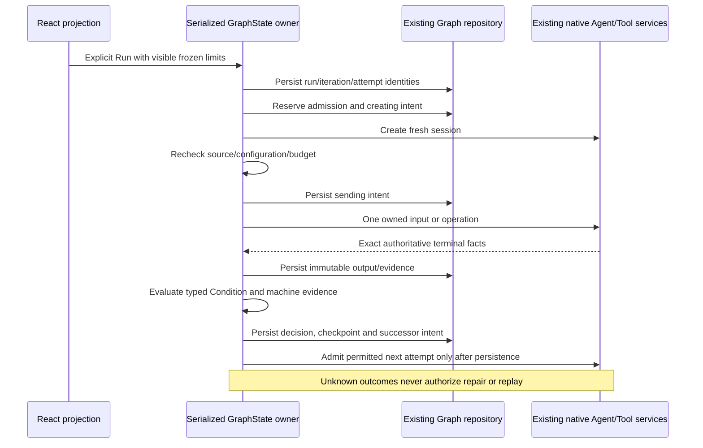

# Z5: explicit routing and bounded repair

Scope: the user's explicit Z5 assignment only. Z4 artifacts, native recipes, strict output and Z3 gates were verified in the current checkout. Historical unversioned/v2/v3/v4 records keep their original meanings and are not rewritten on read. Native session creation, input admission, permissions, tools and cancellation remain with the existing services. No new native protocol, engine, provider owner or process supervisor is required.

## Owner and contracts

Version 5 extends the current Graph definition/run union. `GraphState` remains the single serialized Host owner and the existing repository persists detached committed snapshots before events. Pure domain functions validate topology, evaluate bounded predicates and resolve exact iteration attempts. App helpers decide routing/budgets through existing artifact, recipe, native and evidence ports. React only edits definitions and displays persisted projections.

Edges may carry `sourcePort` on Condition exits. Version-5 definitions have `routing`: a required `finalGateId`, run-wide finite `limits` (`maxNodeAdmissions`, `deadlineMs`), and at most one optional declared repair `region`. A region declares id/name, initial `entryNodeId`, `repairEntryNodeId`, `decisionNodeId`, `bodyNodeIds`, named `repairExit`/`passExit`, `maxRepairIterations`, `stopOnNoProgress` and bounded declared `sourcePaths`. The default is two repair iterations after iteration zero. Hard bounds are five repairs, 64 native node admissions and 24 hours. Every native Agent input and Tool operation reserves one admission; pure Conditions/gates do not consume this counter. Counts are reserved before native session creation and are not refunded after uncertainty.

The existing `run` command adds an explicit `action: "continue"` variant with target, run ID, request ID, checkpoint ID and checkpoint digest. Its existing start shape remains valid. This preserves the public service boundary without pretending a route checkpoint is a Human Approval or introducing another channel. Continuation is a user command, never a read effect. Identical continuation requests return the existing run; conflicting reuse rejects.

## Conditions and branches

A Condition has named branches in explicit priority order, one named default exit and `errorPolicy: "needs-human"`. Each branch contains a declarative predicate over an explicitly bound artifact input. The first true predicate selects one exit; otherwise the default exit is selected. There is no eval, executable expression, model-supplied target, free-text keyword matching or coercion.

Predicates support `eq`, `neq`, numeric `gt/gte/lt/lte`, explicit `present`, and bounded `all/any/not`. Operands name an input alias and bounded JSON Pointer; constants are finite JSON scalars. Equality requires identical scalar types; comparisons require finite numbers. Missing aliases/artifacts, missing comparison operands and wrong types produce NeedsHuman, not false/PASS. `present` alone explicitly tests pointer existence without treating null/false/zero as absent. Predicate depth is at most eight, total nodes 64, branches four and input bindings eight. Existing strict JSON and pointer bounds apply.

Predicate operators must be actual strings from the declared enum. Arrays or other values that stringify to a valid operator are rejected by definition validation and by direct evaluation; they cannot fall through to another comparison.

Conditions persist exact input artifact IDs/digests, attempt/iteration IDs, inspected values, selected exit and successor intent before any successor admission. A Condition may declare `verification` with current `testNodeIds`, optional `reviewerNodeId` and `successExit`. A success exit requires all configured current machine verifications to pass and any configured reviewer to report `pass`. A model PASS with failed machine evidence stops NeedsHuman. Region decisions require this verification declaration and a structured reviewer.

Every v5 route that can reach End must pass the configured final Human Approval. Conditions have exactly one edge for each named exit; other nodes have one successor except End. Exclusive DAG branches may merge without waiting for an unselected predecessor. Nodes excluded by a selected route are recorded Skipped, never Completed. All nodes must belong to a supported route. Arbitrary cycles are rejected; the only removable back edge is the declared decision's repair exit to its repair entry. Removing that edge must leave a DAG, and the region's initial and repair paths must reach its decision without escaping the declared body. Entry and repair entry are Agent Tasks; body nodes outside those writer entries may not silently change the verified source baseline. The final gate is outside the region.

The configured final gate must follow native work: no Agent Task or Tool may be reachable after it before End. Pure Conditions and further human controls can inspect existing evidence, but an earlier approval cannot authorize unseen later edits as the final review.

## Iterations, evidence and definitive failure

Each iteration has a new identity/index and an explicit node-to-attempt map. Every admitted Agent/Tool uses a fresh attempt, command/input/operation ID and native session. Earlier failed attempts, native proof, artifacts and decisions remain retained. A shared resolver uses the persisted iteration map; no unqualified first/last node lookup selects execution evidence. Renderer-only attempt selection never changes that map.

Ordinary Z4 artifact bindings still require completed validated output. Z5 adds a narrowly scoped `verification` artifact selector for trusted native Test facts. Its structural/provenance validity is distinct from test acceptance. It exists only when the actual process ended with an observed exit, streams are complete, a fresh strict report matches the exact operation/source/build, positive configured tests are present, and no infrastructure/source/build/report-integrity failure exists. Real failed assertions can make this valid observation's `outcome` fail while the Tool attempt remains Failed. Timeout/cancel/spawn/unknown, truncated or redacted output, zero/missing/stale/malformed reports, wrong provenance and changed files never qualify. Build failures remain non-repairable in this bounded version.

Only that exact definitive Test failure, or a current structured reviewer `needs_changes` with trustworthy configured machine observations, can authorize the declared repair exit. Outside the declared region, failed native work keeps existing stop semantics. All configured required Test recipes use the region's same declared source set and this iteration's successful Build outputs.

Reviewers bind the current verification artifacts explicitly. Their structured object includes outcome `pass | needs_changes | needs_human`, findings as bounded `{code,message}` records and `evidenceReferences` naming the exact bound current verification artifacts. Old iteration/artifact references cannot authorize a current route. Missing/invalid reviewer output stops without a repair prompt.

The repair entry requires an explicit `repair-feedback` input binding. The Host constructs its immutable bounded JSON envelope from the prior decision's exact reviewer findings, verification observations/artifact identities, source digest and prior iteration identity. It captures no whole transcript/repository. Binding that envelope does not authorize a command or change permissions. Native Read/Edit remain normally available to the fresh repair Agent under the unchanged workspace policy.

If feedback construction exceeds its bound after predicate evaluation, the current Condition is Invalid and its bindings, inspected values and error remain retained. It is removed only from the current iteration's advanced route history before the NeedsHuman stop is persisted; no successor or repair iteration is admitted. Intentional NoProgress and BudgetExhausted decisions remain Evaluated in route history, since their evidence and selected repair exit were valid.

The region source fingerprint uses declared paths through the existing bounded recipe fingerprint port. It is checked before admission and again after asynchronous native session creation before send/start. After an authorized writer entry completes, the next source baseline is captured; after verification/review, unexpected source changes stop. Matching hashes at observed instants are not an OS filesystem lock. A configured no-progress fingerprint hashes that source plus complete canonical findings and named test statuses/messages, excluding only native report invocation identities. Summary text alone is insufficient. Repeated fingerprints stop NoProgress; different failures retain distinct evidence.

## Frozen configuration and event order

The run freezes definition, native settings, recipe snapshots/digests and limits. Its configuration digest is derived from that frozen plan, not append-only attempt history. Editor changes cannot mutate an active run. Admission rechecks the saved definition/project recipe constraints and native model availability; a conflict stops and requires a new reviewed run. No mode escalation or replacement model is attempted.

## Budgets, stopping and recovery

Admission count and absolute deadline persist with the run. Check both at each admission and immediately before send/start; reserve counters before effects. A Host-owned deadline observer persists expiry before targeting only existing owned native handles. Late facts may reconcile their original attempt but cannot clear stop/cancel/reject state or start another iteration. If cancellation/exit remains uncertain, retain Unknown/CancelRequested ownership rather than declaring a safe terminal status. Token/cost usage remains explicitly unknown because the current Graph port supplies no authoritative usage ledger.

Visible stop reasons distinguish NeedsHuman, BudgetExhausted and NoProgress from input completion, validation failure and human approval. These are confirmed terminal only when admitted native work is definitively inactive. No-progress or budget exhaustion is never success.

Reopening never dispatches. A persisted route/repair checkpoint can become AwaitingContinuation only when every previously admitted operation has definitive inactivity proof and the successor has not reached creating/sending. Explicit Continue verifies the exact checkpoint/decision, current source/configuration, remaining counters/deadline and all historical activity. It then admits the already-persisted successor once. A lost creation/input/operation acknowledgement stays Interrupted/Unknown without replacement. Existing Human Approval continuation remains separate and must validate the current iteration. Audited release covers every historical attempt and retains uncertainty; cold absent Tool operations do not become proof of cleanup.

## UI and verification

Use existing React Flow/components/hooks, semantic design tokens and EN/CN text. Show labelled Condition handles and a derived selectable repair-group container. Region inspection shows frozen limits, admissions, deadline, stop reason and iterations. Node inspection selects an exact historical attempt, its artifacts and existing session; navigation submits zero inputs. Condition inspection shows actual evaluated values and route. Run confirmation displays limits and captures the exact displayed definition/settings before submission.

Editing a Condition's declared exits removes only its outgoing edges for names no longer declared. Existing declared exit edges and all incoming/unrelated edges remain unchanged; the editor never guesses a replacement target. The newly named exit must be connected explicitly before Run. Node inspection renders only the selected node's controls: one output editor for an Agent Task and none for End, Condition, Tool or Approval. Stateful sibling editors use distinct keys so changing selection cannot leave an orphaned output schema panel.

For v5, Run first saves a cloned definition and captures native settings at click time. The confirmation displays the returned saved revision; Confirm submits that exact revision without a second save. Saved-definition conflicts fail closed; v2–v4 retain their existing save/run flow. If the absolute deadline passes while a sending intent is being persisted, the Host calls no native send/start, retains that uncertain intent with a visible BudgetExhausted stop reason and requires audited inactivity before release; it does not roll the phase back to make it replayable.

Tests precede behavior edits. Domain/service fixtures cover all Z5-A01–A12 invariants, including illegal edges/gate bypass, typed invalid values, duplicate continuation, stale/out-of-order facts, counters and write failures. Controlled native acceptance must demonstrate genuine initial failure, two fresh repairs, real rebuild/retest and independent success; permanent failure exhaustion; unknown/invalid input; decision and accepted-input crash boundaries; cancellation/rejection with unrelated Chat; exact iteration navigation. Preserve predecessor graphs/tools/gates/history and baseline exceptions. Use isolated app data and synthetic projects; all user-operated provider/project, packaged/second-PC and unavailable platform checks remain NOT RUN until actually performed. No Z6 or Git publication is authorized.
