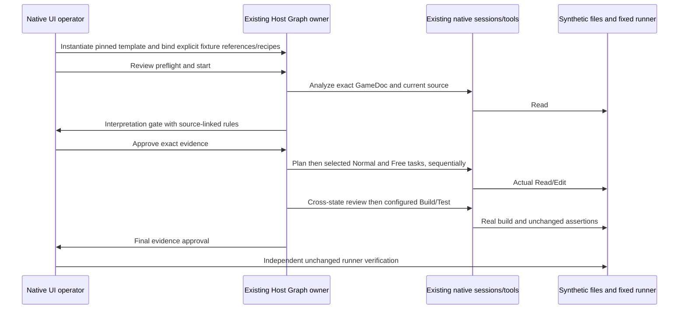

# Z6 synthetic native acceptance fixture

This is a deliberately small, public development fixture, not a specification for a real game. Its only authority is the generated `GameDoc.md` supplied to the isolated test workspace. No company material, provider credentials, installed profile or private integration is used. No RTP target, sample size or acceptance tolerance is supplied, so math/RTP comparison is **not applicable**; this fixture cannot establish certification or production suitability.

## Source and expected behaviors

The generated `GameDoc.md` declares these rules with stable anchors. Native Analyze must read that exact file and the existing `SlotRules.cs`, identify the source for every rule, and report unknowns separately. The interpretation approval precedes implementation.

| ID  | Synthetic authority                                                                                                                                        | Fixed independent edge cases                                                                                                             |
| --- | ---------------------------------------------------------------------------------------------------------------------------------------------------------- | ---------------------------------------------------------------------------------------------------------------------------------------- |
| R1  | Normal starts a new round, resets prior accumulated win/retriggers, and adds the supplied nonnegative win.                                                 | A normal round without a trigger has zero free spins; starting a new round discards a prior round's accumulated state.                   |
| R2  | A Normal trigger awards exactly three Free spins unless the win cap already stopped the round.                                                             | Triggered normal round has three spins; a cap-reaching trigger has zero.                                                                 |
| R3  | Free consumes one remaining spin, then its supplied nonnegative win joins the same accumulated total. A retrigger awards two spins at most once per round. | First retrigger changes three spins to four; a second retrigger consumes one with no award; accumulated Normal and Free wins are shared. |
| R4  | Accumulated win is capped at ten. Reaching/exceeding ten clamps the stored total to ten, marks the round stopped, and clears all remaining Free spins.     | Oversized normal and Free wins, including maximum integer input, stop at ten; retrigger cannot revive a capped round.                    |
| R5  | Free input after stop or after spins reach zero is inert. Negative win input throws before changing state.                                                 | Exhausted/stopped state remains byte-for-byte equivalent; invalid Normal and Free input leave the original state unchanged.              |

Bonus and Respin are absent from the synthetic GameDoc and are explicitly excluded at instantiation. They must not acquire native attempts/sessions. Selected Normal and Free tasks execute sequentially against the same workspace and shared `SlotState`. The state owner is the C# fixture itself; Graph sequences native tasks and verifies current evidence, without simulating game execution.

## Ownership and boundaries

The generated project contains only `SlotRules.cs` and an unchanged `Runner.cs`, an explicit project, pinned SDK selection, cleared NuGet feeds and empty local import files. The controlled provider can request the actual native Read/Edit tools; it cannot write source directly. Its deterministic responses are test input, not a second engine. Configured native Tool nodes own Build/Test execution through existing ZCode native services. A separate independent invocation runs the unchanged built C# runner and verifies exact named reports, source/build fingerprints and operation identity.

The slot template has no repair region. Z5's one authorized initial writer/one repair writer source guarantees remain unchanged. A failure stops for an explicit human decision; the separate bug-fix template demonstrates bounded repair. No script edits the runner to obtain a pass, invents rules from game terminology, treats prose PASS as machine success, or changes math to meet an unspecified target.

## Required fixture verification

- Fixed C# assertions are authored before the source implementation. Independent tests prove the deliberately defective initial source fails and the intended sequential Normal/Free patches pass all required named cases.
- Source trace maps each named assertion to one of R1–R5 and the exact generated GameDoc digest. Runner and GameDoc bytes remain unchanged throughout native edits.
- Native A07 uses the shipped generic and bug-fix templates, real explicit handoffs, native edits, genuine Build/Test, final human gates and bounded routing where configured.
- Native A08 instantiates the shipped slot template, pins its version and selections, exercises interpretation/final gates and verifies exact native session/input/operation/artifact identities. Excluded Bonus/Respin nodes dispatch nothing.
- Missing source, recipe/tooling or required criteria are actionable preflight failures. Missing RTP target never produces a fabricated RTP result.
- Screenshots and structured logs record actual native results. Live-user/provider/company-project, packaging, second-PC and unavailable platform checks remain **NOT RUN**.

The user explicitly waived `Z6_REPORT.md`. This fixture specification and acceptance evidence do not change that instruction or authorize Z7 or Git publication.
