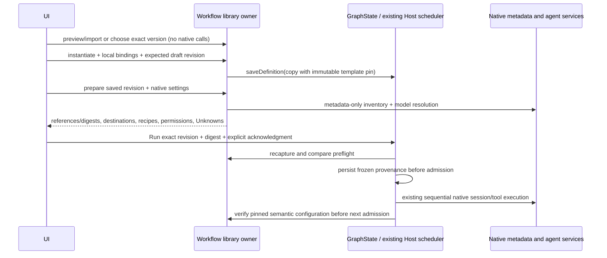

# Z6 reusable native workflows

Status: implementation specification, 2026-09-24. Z6 only. The user's latest instruction waives Z6_REPORT.md; verification evidence and setup instructions remain required. Existing Z1-Z5 records and native Chat remain compatible.

## Ownership and contracts

The profile-local Workflow library owns named entries, archive flags and immutable numbered versions. Every mutation supplies the last observed library revision. An atomic transaction rereads storage under an exclusive lock; stale writers fail without replacing data. Built-in versions are immutable. Duplicate creates a new identity. Archive retains all versions. Historical runs never dereference a mutable library entry.

GraphState remains the sole workspace draft/run owner. Instantiate validates a portable package and explicit local bindings, copies a chosen template version, then calls the existing saveDefinition with expectedRevision. It does not execute. Local dirty draft replacement is explicit in the UI. Invalid imports/previews change neither owner.

IGraphWorkflowService is a separate bounded public capability in the existing Graph module: library read/mutate, dry transfer preview, instantiate, and prepare. It adds no scheduler, engine, provider store, installer or accepted-input queue. Existing Graph run commands gain a preflight digest and operational acknowledgment for template instances. Existing non-template graphs retain their behavior.

## Portable and local data

Portable v1 packages contain only an allowlisted name/description, v5 graph/layout, bounded scalar parameter schema, reference requirements and optional sequential node selections. No run/session/artifact records, workspace identity/path, provider configuration, local reference paths or concrete recipe bindings are accepted. Start request and per-node model overrides are removed on capture/export. Tool recipe slots are symbolic node IDs. A portable package rejects unknown fields and unsupported graph versions. Export preview reports removed fields and rejects obvious secret/private-path literals; this is not a claim of general secret detection. The operator reviews the entire portable JSON before export. Evidence export remains the existing separately reviewed action.

Parameters are data in the Start request, never shell/path/network interpolation. Document/instruction references must be explicitly bound to existing bounded workspace-relative regular files; symlink escapes fail. Skills select native catalogue IDs and preserve their actual native origin/path/digest. Recipe slots select existing project recipes; import cannot install/connect/execute. Local bindings and supplied parameter values are frozen in the instance and run, excluded from portable export. Optional sequential behavior nodes are removed only by explicit boolean choice, with excluded node IDs/reasons pinned; no implicit skipped native tasks.

## Native configuration and drift

Preparation captures inherited native instruction metadata, selected extra references, native skill/plugin/hook/MCP metadata, resolved node primary destinations, native title-generation destination behavior, other auxiliary Unknowns, permission mode and exact recipe digests. It never reads installed credentials for development. Only an existing native workspace client may provide native metadata; a cold runtime yields Unknown without startup. The underlying metadata RPC must skip seeding, unpacking, migrations, hooks, connection and execution. See Z6_NATIVE_SPEC.md.

All Unknowns require an explicit operational acknowledgment. Missing required sources, skills, target-engine/request/test criteria or recipe slots block preparation. Missing runtime inventory blocks selected skill resolution; it cannot invent a skill. No claim that a local primary makes other traffic local. The run pins template version/digest, graph revision, parameter values, local reference digests and the exact preflight. Relevant reference/configuration changes stop further admission with NeedsHuman; the operator must review a new run. Editable implementation source is not treated as an immutable instruction reference. Existing Z5 source guards and repair rules remain unchanged.

## Shipped workflows

The native metadata preview also resolves the selected recipe executables using native environment/path rules without starting any process. Known missing tools block preparation. Unknown lookup behavior remains disclosed and requires acknowledgment. A declared executable produced by a dominating Build is identified as pending that Build's existing evidence contract, avoiding a fabricated pre-build success. Availability alone does not certify SDK versions, script contents or traffic.

1. Engineering: Analyze → Implement → Build → Test → Review → Final approval.
2. Bugfix: Implement, one bounded repair region with mandatory Build/Test and typed reviewer findings/condition, Final approval. Limits/source paths are explicit project bindings; no unbounded repair.
3. Slot refinement: Analyze authoritative documents → interpretation approval → Plan ownership → explicitly selected Normal/Free/Bonus/Respin tasks sequentially → shared-state review → Build/Test → findings → final approval. No slot repair region is configured by default. Rules/findings cite supplied sources or identify questions; no source means no inferred game rules. RTP is N/A without a supplied target and sampling/acceptance rule. No certification claims.

The synthetic C# fixture and independent edge cases are specified in Z6_FIXTURE_SPEC.md. Private company use remains NOT RUN; PRIVATE_PROJECT_PILOT_CHECKLIST.md must require separately named authorization.

## Acceptance

Automated fixtures cover Z6-A01 lifecycle/concurrent stale writes, A02 immutable pins, A03 malformed/unsupported import with zero execution/installation calls, A04 synthetic secrets/local-data export exclusion, A05 native references/digest drift, A06 known/Unknown destination inventory, A09 missing inputs. Actual controlled native Electron runs cover A07 generic/bugfix and A08 source-linked C# slot edge cases, with independent file/test evidence and screenshots. A10 company/live-provider acceptance is NOT RUN. Baseline CLI lint and repository formatting failures remain visible; do not suppress rules or reformat unrelated files.
