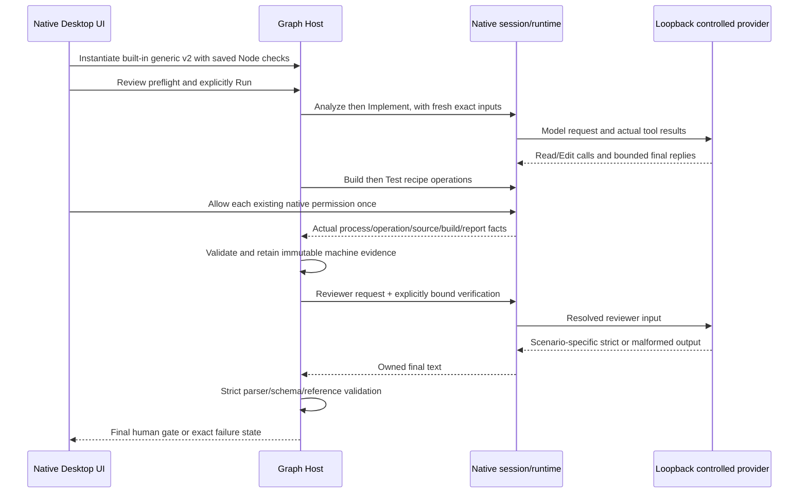

# Native reviewer closeout acceptance

This extends TASK.md against checkout ed3bd3a, without replacing the existing implementation. The current built-in generic Sequential Engineering template is version 2. Historical saved definitions and runs remain unchanged. Explicit new instantiation must select that exact built-in version.

## Ownership and contract

Graph Host remains the only owner of admission, attempts, immutable artifacts, evidence validation and the final approval request. Native sessions own Read/Edit and native recipe command execution, permission handling and terminal facts. The controlled loopback provider supplies model responses only. The driver must never execute Build/Test scripts or seed verification artifacts.

Reviewer receives the original request and current verification. Only the explicitly bound verification artifact ID is permitted; a nested reportArtifactId is not a binding. Strict JSON, ownership, freshness and evidence validation remain unchanged. Valid needs_changes and needs_human are reviewer outcomes, not parser failures; the existing final human gate presents them. The generic template stops on a failed machine Test before reviewer dispatch. No final gate is automatically approved. Reviewer no-command wording is prompt guidance; native tools are available and no new permission contract is introduced.

## Fixture and scenarios

Reuse isolation.mjs, the z6 loopback provider transport, z5 observation/artifact readers and native permission helpers. Add cohesive fixture/response/UI/proof/driver files. Each scenario gets a fresh owned disposable profile/workspace, an ignored and untracked zz-demo.txt initially containing before, asynchronous Node Build/Test scripts, a declared output and a zcode-test-v1 JSON report. Include scripts in declared source paths. Only actual native Edit changes the source. Request is exactly `Modify zz-demo.txt file content to after`.

Scenarios: pass, prose-fence, unbound-report, needs_changes, needs_human, test-failure. A successful Test must contain one named assertion, zero failures and matching operation/source/build IDs. The failed Test must contain a genuine failed assertion and no reviewer admission. Preserve every failed receipt. Record native ledger/session IDs, all attempts and command facts, resolved reviewer instructions/output, retained artifacts and the final gate request.

Source and native negative runs confirm the version-5 routing distinction: failed reviewer output validation or a failed Test makes that attempt Failed, then the generic non-repair route stops the run as NeedsHuman with no final-gate request. Valid reviewer outcomes needs_changes/needs_human instead have a Completed reviewer attempt with valid output and a pending final human gate. A run-level NeedsHuman label alone must never be used to classify a reviewer response.

Remove the reviewer test's max-file-lines exception and separate its existing service fixture from scenarios. Preserve its coverage and label it service-level only. No policy thresholds or baseline changes.

## Native UI and validation

Exercise Workflows task versus Context, saved check summaries before execution, the focused Project setup editor, readable Design with inspector tab changes, and Runs request/history, reviewer outcomes and parser failures. Capture real native window content at 1280x720 and 1920x1080; label negative screenshots. Inspect pixels before claiming visual acceptance. Bounded fixes need an updated rule here and regression assertions before implementation.

Confirmed UI correction: Workflows currently labels Start.request as Context. Show that immutable/current draft request in a separate Task request preview. Context lists only explicitly selected template document/instruction/skill references, with an empty-state label otherwise. Saved Build/Test check names must carry saved/not-run wording. History rows must retain keyboard activation and focus, lost when the prior button list became table rows. These are Renderer projections only; no service writes or new state owner.

Native screenshot inspection also found the Workflows run button rendering the missing key graph.z4.run. Reuse the existing translated graph.run action and assert the visible native button label. Do not add a new action or change preflight behavior.

Native instantiation confirms Start input is the existing parameter envelope, not the bare task string. The exact request remains template.parameters.request. Display that request only when the captured input equals the canonical envelope rebuilt through the existing applyGraphRunRequest transform; otherwise show actual raw input. Do not change runtime binding or rewrite historical records. Reviewer output summaries select only the current iteration's exact attempt and use its persisted validation result; valid outcomes and invalid output have different labels/actions. Invalid machine check evidence must not be mislabeled as reviewer JSON failure.

Visual inspection of the native 1280x720 Design screenshot confirms the whole-graph fit shrinks labels to roughly half size and clips nodes. Keep saved positions/topology unchanged. Use a readable minimum zoom of 0.85 and center the selected node when node navigation changes, so users can inspect/pan the existing graph without microscopic text. This is viewport state only, with no definition or run mutation.

The first successful native run exposed a remaining viewport readiness/resize gap: a selected reviewer could remain outside the canvas after changing mode or window size. Selection focus must wait for the actual React Flow viewport and node measurements, and respond to canvas dimensions. Native acceptance must check the selected node lies inside the canvas at both requested sizes, and capture the saved-check editor separately where the list and editor exceed one screen.

Run root typecheck, lint and architecture without new exemptions. Serialize emitting work: root typecheck, CLI typecheck, CLI build, Desktop build:no-runtime-assets, then freeze hashes for Main, Host, preload and renderer JS plus CLI. Native runs must use those artifacts. Run the existing .NET regression using installed SDK 8.0.425 and existing routing; do not change global.json or install tools. Record exact failures by layer.

The existing .NET native run reached Completed with genuine passing tests, then its proof incorrectly classified all generated TRX as clean based only on fixture source. VSTest adds absolute assembly paths. The observed eight user-directory paths are intentionally sensitive under the existing privacy contract; the stored preview differs only by those path replacements and line endings. Correct the harness expectation from original generated TRX bytes, independently of product redaction output. Preserve the clean/sensitive flag, validation and digest checks; require user-path removal from the actual preview. Do not change product redaction policy or normalized evidence validation.
