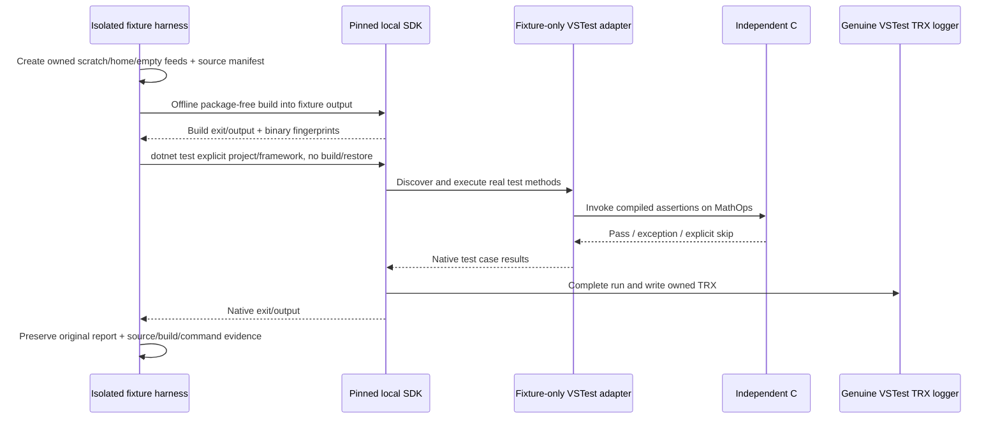

# Pre-Z8 package-free genuine VSTest fixture specification

## Purpose and boundary

This fixture proves whether the locally installed, pinned .NET SDK can run a synthetic VSTest test project and generate genuine TRX without downloading a test framework. It supports U2 adapter engineering; it does not establish product integration, a company project, a paid provider, or the U6 human pilot.

The coordinator authorized only new `scripts/graph-engineering/pre-z8-dotnet-*` fixture files and this specification in this lane. Existing product source, shared contracts, native services, historical fixtures, configuration and evidence remain unchanged. No checkout build outputs are written. Separate scratch output ownership permits this experiment to run alongside the coordinator's native baseline.

## Owners and invariants

- The JavaScript fixture harness owns one newly created directory under this checkout's `.tmp`, identified by a marker. It never cleans or overwrites another fixture.
- The SDK-selected `dotnet` process owns compilation and VSTest execution. The real VSTest engine and its built-in TRX logger own report generation. Fixture code must never synthesize TRX or substitute the internal Graph JSON report.
- A small fixture-only adapter implements the documented VSTest discoverer/executor interfaces and invokes separately compiled C# assertions against synthetic `MathOps.cs`. The adapter does not manufacture expected success from the requested test scenario.
- Assertions and adapter source hashes are retained. A failing scenario changes only the synthetic implementation, then rebuilds. The unchanged assertions must actually fail.
- The selected project, framework, configuration, source/build digests, operation/report identity and exact argv are recorded separately from parsed report observations.
- Reports stay under unique invocation directories and must not pre-exist. Original TRX bytes and SHA-256 are retained alongside stdout, stderr, exit status and command timings.
- Test execution uses the previously captured Build outputs with `--no-build`/`--no-restore`; source and binaries are fingerprinted again afterward.
- Tool timeout or infrastructure failure is never recorded as a passing assertion result. Cleanup is scoped to owned child processes; there is no process-name kill or broad filesystem cleanup.



## Isolation and toolchain

Pin SDK `8.0.425` using fixture-local `global.json` with roll-forward disabled. Initially target `net8.0`; a second target may be added only when an already-installed reference pack/runtime permits an offline build. Read SDK-local ObjectModel/testhost/logger assemblies, never user package caches or credentials.

Use a whitelist environment and private fixture `HOME`, `USERPROFILE`, AppData, temp, `DOTNET_CLI_HOME`, `NUGET_PACKAGES`, HTTP cache and MSBuild-user paths. Private empty machine-configuration paths prevent accidental original machine/home NuGet configuration discovery. Disable telemetry, first-run/global-tool changes, workload advertising, compiler/build servers and NuGet audit. Use explicit empty `NuGet.Config` package sources; any restore creates only scratch SDK assets and must install zero packages. Do not install a dependency, use an installed user cache, or access a network feed.

Build synthetic projects with explicit source includes. Fixture-local empty `Directory.Build.props`, `Directory.Build.targets` and `Directory.Packages.props`, plus explicit import settings, prevent parent project customization. The fixture can copy required SDK test-host assemblies to its output as part of this explicit fixture build; original installed SDK files are never modified. The standard test-project entry remains `dotnet test <project>.csproj` with the configured fixture adapter.

## Required experiment cases

1. A standard `.csproj` invocation executes at least three real independent assertions with passing TRX results and zero exit code.
2. Mutating only `MathOps.cs` and rebuilding causes those assertions to fail with nonzero exit and genuine failing TRX results.
3. Report source/assembly identity matches the exact project and target framework selected by argv; equal test names from a second project or framework remain distinct in the recorded scope.
4. A supported filter selects zero tests; actual zero-result TRX and process outcome are recorded without calling it adequate verification.
5. Explicit skipped tests and an all-skipped selection retain their actual TRX statuses and never become execution proof.
6. Repeated runs use distinct report paths; previous files stay unchanged. Pre-existing destination paths are rejected before execution.
7. Source changed after Build or binary changed after Build is detected by the fixture association check even if real VSTest runs successfully.
8. The fixture assets/configuration prove no NuGet package installation and no inherited feed files; assertion/adapter sources remain unchanged across the implementation mutation.
9. Capture genuine passing and failing reports with the existing Graph artifact store. Record whether generic redaction changes the bytes; changed/redacted reports must remain incomplete and never become unmodified valid artifacts. This probe does not authorize weakening the product's redaction or integrity contract.

Tests label unavailable capabilities or infrastructure limitations explicitly; a failed feasibility experiment is evidence to retain, not a reason to write a fake report. A custom fixture adapter proves the VSTest/report boundary, not general MSTest/xUnit/NUnit production compatibility.

The pinned genuine VSTest engine may report `notExecuted="0"` in its summary despite `UnitTestResult outcome="NotExecuted"` entries. Derive skipped observations from the actual entries and reconcile total/executed/passed/failed. Preserve this discrepancy in evidence; a zero summary field is not proof that all tests executed.

## Evidence and resumption

The harness persists an evidence manifest with source/script versions, SDK observations, exact commands, file hashes, stdout/stderr, exit codes, report paths and case outcomes. Keep failed attempts. An on-disk result records completed cases and the exact next action if a later step fails. A fixture run never marks U2 product or U6 live acceptance complete.

Checks to run in this lane: Node syntax and focused fixture tests; architecture check before/after; focused lint/format. The coordinator runs required integrated typecheck/lint and product regressions once combined changes settle. No staging, commit, push, publish, application installation or Z8 work.

## Verified feasibility receipt — 2026-09-27

The fixture implementation ran with pinned Node `24.14.0`, .NET SDK `8.0.425` and genuine VSTest `17.11.1-release-24455-02 (x64)`. The command below exited **0: 9 tests passed, 0 failed, 0 skipped**, including the parent and eight cases. This is an automated isolated feasibility receipt, not product U2 acceptance or a user/live pilot.

```powershell
. .\.tmp\z1-env.ps1
$env:PATH = "$PWD\node_modules\.bin;$env:PATH"
node --import tsx --test scripts/graph-engineering/pre-z8-dotnet-fixture.test.mjs
```

Retained evidence is rooted at `.tmp/pre-z8-dotnet-Yn1d9z/evidence.json`; its `commands` entries and `logs` directory preserve exact executable, argv, cwd, child PID, start/end times, exit status, stdout and stderr. The manifest records generated source/build/copied-host digests, selected SDK path, SDK toolchain digests, and the implementation file digests. The secondary `Alternative.Tests.csproj` / `net6.0` fixture has its own manifest at `.tmp/pre-z8-dotnet-oUXWdE/evidence.json`. It uses an already installed reference pack/runtime and proves identity separation only; it does not extend a product support policy.

| Actual case                  | Retained report under primary `workspace/` unless stated                       | Observed result                                                                                                                |
| ---------------------------- | ------------------------------------------------------------------------------ | ------------------------------------------------------------------------------------------------------------------------------ |
| Passing assertions           | `results/4ce21277-070f-4ba8-8da3-b2ae458642aa/results.trx`                     | Exit 0; 3 Passed, 1 NotExecuted; total 4, executed 3                                                                           |
| No matching filter           | `results/6e56cbc7-4cd6-436c-823c-33abcca22ec0/results.trx`                     | Exit 0; total/executed/passed 0; inadequate verification                                                                       |
| All skipped                  | `results/88d0b600-d604-46a6-951f-ad86ff1394d3/results.trx`                     | Exit 0; 1 NotExecuted, executed 0; inadequate verification                                                                     |
| Repeated invocation          | `results/7921332a-83eb-48eb-a547-944172584672/results.trx`                     | Different operation/report/TestRun identity; earlier original bytes unchanged; destination reuse rejected                      |
| Equal names in another scope | Secondary `workspace/results/da844c1e-1881-4fda-a195-1dc53d56141d/results.trx` | Same four test names, 3 Passed; explicit Alternative project/net6.0 and different assembly codeBase                            |
| Changed source, old binaries | `results/3c82593c-6e99-452a-a40d-b8fd56bacdce/results.trx`                     | Real VSTest still passed 3; source association independently rejected                                                          |
| Rebuilt faulty source        | `results/2ee945d9-b833-4ff7-b381-211ef3ee8b9e/results.trx`                     | Exit 1; 3 Failed, 1 NotExecuted; unchanged assertions and adapter; original Build association rejected                         |
| Existing artifact retention  | Primary `graph-artifact-probe/` plus manifest observations                     | Original passing/failing reports both redacted and correctly marked incomplete; original SHA differs from retained preview SHA |

The passing original report SHA-256 is `4fb59523ab6f30330bc04253b00fd2cc6be73f1f0b7ec7ce77774648d97586d6`; the failing original SHA-256 is `0ae22041486599e7e5c05cab0d7d0e5fbb3c2cc64e245ad27b578e8778c0abf1`. Original TRX and diagnostics remain in the isolated scratch directories; they contain machine/path metadata and are not copied into a tracked fixture or this document.

All restored assets identify only the explicitly supplied fixture `NuGet.Config`, no package libraries, and the private package directory remained empty. Compilation uses SDK references, not an installed test-framework package. These executions do not establish network access; no feed is configured and no packages were installed. The harness does not claim OS sandbox or native Graph permission/lease/cancel coverage: those product integrations remain separate tests.

The SDK provenance digest is `64cd1b029b4875b6bc52181a804ff0b6a36e9bda0059a0c60085303414d59a58`. Individual SHA-256 values are retained for each file and rechecked with the Build/report association:

| SDK-relative file                                                              | SHA-256                                                            |
| ------------------------------------------------------------------------------ | ------------------------------------------------------------------ |
| `dotnet.dll`                                                                   | `bd2684dacd53e26484385364c48cfe8248932c802083a68c3e93f8fe545f4579` |
| `vstest.console.dll`                                                           | `f1ff0ab865ef2f2d4f045469676b6faf4c2104160b1a9364b424a8115dc0e165` |
| `Microsoft.TestPlatform.Build.dll`                                             | `fe3bb9b4e83be37b9f472b09af094094b7b13588e4f5fccf212c2294b1e0cb59` |
| `Microsoft.VisualStudio.TestPlatform.ObjectModel.dll`                          | `95b2c444e5c939fc1d26852b4f2f657d5d5c1763d371d9d262c17f2eb0f8902f` |
| `testhost.dll`                                                                 | `1d8bf94b1c8bced40668b4ed6484aef4ab68152d8a01e4549ed50db3edb9e2d6` |
| `Extensions/Microsoft.VisualStudio.TestPlatform.Extensions.Trx.TestLogger.dll` | `96e435e1798a1203fb0a742c73cd1aab4cdd8ee9143360d7f411df5a0f236e93` |

Earlier failed experiments are preserved: `4ZuE0O` and `yQFpXa` lacked host adapter discovery until the adapter was copied into the test output; `3iyOMG` had working execution but over-strict fixture assertions about `notExecuted`. Its original reports are real. The first experiment's erroneously passed manifest was explicitly annotated and corrected to failed after diagnosing Node subtest failures not throwing into the parent; subsequent manifests require every successful case. The intermediate `88lrpx` run also passed 9/9 before adding explicit installed-toolchain and script provenance. Do not repeat these failed operations without a new reason.

Focused validation also passed: Node syntax checks for all four new scripts; `oxlint` for those scripts with 0 warnings and 0 errors; `oxfmt` for the owned scripts/specification/audit; and `node scripts/architecture/architecture-check.mjs check --changed` with 0 violations, 0 baseline violations and 0 new violations. Architecture context was reviewed before source changes. This lane added only documentation and script fixtures; no managed product source changed. Integrated repository typecheck/lint and regression receipts belong to the coordinator and are not claimed by this lane.

## Read-only review of the U2 draft

`U2_CONTRACT_DRAFT.md` was reviewed after the genuine proof. Keep the draft's single owner/native execution/immutable recipe and conservative recovery decisions. The following refinements are evidence-driven proposals for the coordinator, not product implementation in this lane:

1. Distinguish a **redacted raw preview** from a **trusted normalized report**. Existing `createGraphArtifactStore` behavior stays intact: changed raw TRX remains `incomplete`, and its preview digest never substitutes for the original-byte digest. The sentence about retaining original bytes must not imply bypassing privacy filtering.
2. Introduce one adapter operation that obtains a bounded original byte snapshot through the existing link-safe, identity-checked file reader, returns its exact SHA-256/length/mtime, and supplies those same bytes to the pure parser. The current `readDeclaredFile` and separate observation can support this with an equality check, but a single snapshot result is easier to review than two independent reads. Do not independently reread for the preview or silently compare digests of decoded/reformatted XML.
3. Before normalization becomes valid, the Graph owner independently verifies native terminal outcome, exact run/node/attempt/operation/session identity, the frozen non-preexisting report path, original snapshot freshness, unchanged source, exact approved Build output hashes, explicit project/framework/configuration/filter scope and XML assembly identity. The normalizer must not accept an XML-supplied operation ID, digest or command as trusted identity.
4. Store an additive immutable normalization receipt: parser/profile version, original report SHA-256/byte length, report TestRun ID, normalized artifact digest, raw-preview artifact identity and digest, frozen execution scope, native operation identity, source/build digests and assertion counts. Obtain a redacted raw preview from the same captured snapshot and keep its incomplete state. The canonical normalized artifact goes through the same artifact store; if its content is redacted or truncated it is also incomplete. No caller may promote a preview or a bare digest to valid evidence.
5. Normalize only structural test identities/statuses/counts needed for verification; keep arbitrary stack traces/output/computer/user metadata in the preview. Bind project/framework/expected assembly to full test identity, using class/method/Test ID rather than display name alone. Equal test names from distinct scopes must remain distinct. Validate all result/definition/entry joins, root/times and counters before attaching native identity.
6. Permit the observed VSTest `notExecuted=0` summary only when actual NotExecuted entries and total/executed/passed/failed reconcile exactly. This is a known logger discrepancy, not a general counter mismatch allowance. Zero executed, all skipped, missing required passing tests and nonterminal/unknown outcome remain inadequate. The controlled fixture observer is intentionally not the secure product XML parser.
7. A restart may use a complete, integrity-checked immutable normalization receipt as the saved observation. It may not regenerate one from a redacted preview, a partial receipt or a report belonging to a new operation. If the required receipt was never completed, record incomplete/recovery-needed and do not replay uncertain native work.

Required follow-up negatives include original report replacement during capture; original/preview SHA confusion; mutated normalization receipt; valid-shaped XML with wrong assembly/framework/operation; duplicate test/execution joins; unsupported nested/parameterized result structures; stale source/Build; and privacy redaction of normalized identity. MTP, MSTest/xUnit/NUnit-specific behavior, arbitrary project execution, live paid providers and human pilot checks remain **NOT RUN**. This package-free adapter establishes the real VSTest engine/TRX boundary only.

The ratified U2 pure parser now lives in `domain/trx-report.ts` with bounded XML/shape/value helpers. On 2026-09-27, `node --import tsx --test packages/services/src/graph-engineering/app/trx-report.test.ts` passed **39/39**. The regression data is explicitly metadata-anonymized genuine output, not native execution evidence. Test-first review reproduced and fixed illegal whitespace character references outside the XML root and an inclusive 1 ms duration tolerance; the original genuine reports still parse. The enhanced package-free native fixture passed **9/9**, retaining fresh unmodified originals and parsed observations at `.tmp/pre-z8-dotnet-jPnICP/evidence.json`; its secondary project/framework manifest is linked from that manifest. A later **7/7** read-only replay against those original byte digests passed and wrote `.tmp/pre-z8-dotnet-jPnICP/parser-replay.json`, including parser-source hashes. After structural TypeScript narrowing fixes, the final **7/7** pure-parser and trusted-capture replay is recorded at `.tmp/pre-z8-dotnet-jPnICP/parser-capture-replay.json`, with stable implementation hashes and the focused test-log digest. No native command was repeated for either replay.

The capture security suite `adapters/trx-capture.test.ts` adds **10/10** passing checks for exact BOM/chunk identity, privacy-preview separation, encoding/bounds/paths, timestamps, junctions and deterministic replacements/growth during capture. Supply `PRE_Z8_TRX_FIXTURE_MANIFEST` with the retained genuine manifest to execute its positive native-report replay; absent that explicit fixture, the test reports that replay as skipped and runs no native command. With the manifest supplied, the combined parser/capture suite passed **49/49, zero skipped**, logged at `.tmp/pre-z8-parser-capture-recheck.log`. Genuine pass/fail/zero/skipped originals all pass structural capture, mismatched existing assemblies fail, and original raw previews remain redacted/incomplete. Focused lint/format checks passed; read-only compiler diagnostics for all six parser/capture-test files found zero issues; architecture check reported zero violations. Coordinator-owned integrated validation and native Graph evidence remain separate requirements.
