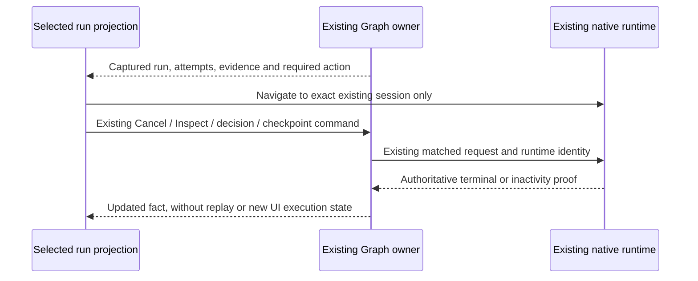

# Run understanding and conservative next actions

Prepared from the current U3 source investigation. U4 implementation starts only after U3's verified checkpoint. Existing Graph records, native session identities, terminal proof, approval decisions and recovery owners remain authoritative; this work adds read-only presentation and scoped view state.

## Projection contract

The selected immutable run, including its captured definition and latest relevant iteration, supplies a pure `graphRunSummary` UI projection. Display execution, evidence and human decision in three separately labelled fields. Never combine them into a generic engineering-success badge. Execution Completed means the captured route completed; it does not upgrade agent prose or human consent into test evidence.

Evidence states distinguish no configured tests, not run, agent-reported output, command/Build result, captured valid test pass, captured valid test failure, and invalid/stale/incomplete evidence. A command-only result never satisfies a Test. Across multiple configured Tests, every required selected Test in the current relevant iteration must have independently accepted observation and passing criteria for a test-pass summary. Missing/skipped/unknown/invalid attempts prevent that summary; an earlier repair iteration cannot substitute. Keep individual check results visible so an invalid check does not conceal a genuine failure elsewhere. Legacy absence of newer observation fields stays conservative. State that source association is at capture time; opening history does not rerun freshness checks or establish correctness of today's workspace.

Human decision distinguishes not required, pending, approved and rejected. Approval is bound to the exact saved request ID/version/digest and source evidence; stale or incomplete evidence is never displayed as current approval merely because a prior decision exists. Existing `graphApprovalActionState`, durable decision intents and service revalidation remain the only admission path. Review text identifies the successor and whether approval can admit further native work.

## Selected-run content and actions

Ratified UI-only pure contracts: `graphRunSummary(run: GraphRun)` returns `runId`, captured `target`, `requestText`, result (`text`, `artifact` or `absent`), execution (`status`, optional current node/attempt/status, `stopRequested`), evidence, human decision, and captured source snapshots with gate/request/attempt/alias/time. `graphRunEvidence(run)` returns a stable nonlocalized state (`no-tests`, `not-run`, `agent-reported`, `command-only`, `tests-passed`, `tests-failed`, `invalid`), individual check projections (node/name/attempt/kind/state/status/verification/artifact IDs/issues), and issues. UI components translate these codes and keep the underlying stored facts inspectable. These helpers perform no IO and create no authoritative execution state.

For required Test coverage, conservatively include every frozen Test recipe or explicit Test declaration in the captured definition, including missing or skipped current attempts. Do not invent inactive-branch exemptions. Reuse the shared required-recipe-kind projection through its public contract if needed. For v5 human decisions, include the exact current final gate and actually admitted/pending/rejected current gates, excluding unvisited entry gates regenerated for repair. For older sequential versions use gates on the frozen planned path. Approval requires a complete, non-stale saved request and exact request ID/version/digest equality with the saved decision; prior iteration decisions cannot substitute.

Show the captured request, result (or its explicit absence), current step and actual workspace before technical IDs. List file changes only from captured approval source snapshots, with their capture scope/completeness; do not compute or imply a new live diff. Preserve full evidence and technical identities behind labelled details. Keep exact attempt/run/iteration selection. Inspector prompt values remain the stored `resolvedInstructions`/`bindings`; no later conversation text can replace them.

A persistent selected-run action area links permission/question waits to the exact existing native session. It only navigates, never submits a new input or responds through a second channel. Approval and offered-checkpoint actions navigate to existing controls. Unknown/Interrupted directs the user to inspect the exact owned session; no replay. Invalid setup/evidence directs inspection and an explicit new request after correcting configuration. Genuine failure relies on the existing bounded repair policy; no generic Retry button. Release remains explicit, audited and limited to authoritative inactivity. Cancellation displays Stop requested until proof, exact target session(s), and that already-written files remain. Unrelated sessions survive.

## Bounded rendering and stale reads

Use a bounded page of run-history controls (recommended 25) with explicit pagination/count; retain all canonical runs and preserve selected run identity when pages change. Measure a synthetic 500-summary fixture without injecting authoritative execution state. Lazy details and scroll bounds do not truncate canonical artifacts. Artifact/manifest async reads use the current run/attempt scope plus request sequence, so a late older read cannot replace a newer requested artifact or another run. Read errors remain visible and do not silently become valid evidence.

The 500-row acceptance harness mounts the actual `GraphRunHistory` component with visibly labelled synthetic immutable props in a separate browser fixture, the actual locale provider, actual `applyTheme` setup and current built CSS. Merely toggling `dark` omits the application's `theme-zai-*` tokens and is not a valid theme check. No Graph service, runtime, profile history or acceptance evidence is fabricated. Use existing installed esbuild/Playwright/browser dependencies, an owned empty browser profile, loopback-only fixture requests and normal browser sandboxing. Verify at most 25 run controls, all 500 original props unchanged, keyboard pagination/selection and return-to-selected behavior, plus light/dark screenshots at 1280×720 and 1920×1080. Record actual render/interaction measurements with environment and fixture-layer limitations; they are not human-pilot timing or installed-app conformance.

Read-only evidence calls use a scoped hook through the existing Graph service and target, independent of the global mutation/admission action lock. Current read errors reject to the inspector; stale scope returns are suppressed. The inspector clears/replaces only its local read projection under an exact request sequence and displays loading/error explicitly. The existing remount key already prevents many cross-run cases; this addresses same-view read intent and the current behavior where a failed read can leave prior content visible without a local error. A metadata-only summary cannot discover missing/corrupt files. Such read failures remain separate from the captured acceptance fact, with no historical mutation or new live-validity claim.

Review corrections: zero configured Tests remains explicit beside command-only and agent-reported evidence; pending command/Build checks use pending-check wording rather than claiming required Tests exist. Genuine assertion failures direct inspection of the captured failure and recorded bounded repair/stop state; they do not claim configuration is invalid. Invalid evidence has separate corrective guidance. An inspector without a selected/current attempt lists no previous-attempt artifacts. Explicit historical attempt selection still exposes that exact attempt, and End can expose only its exact captured result artifact. Graph-scoped keyboard focus uses visible existing border/background theme tokens for buttons, inputs, selectors and disclosures; the global focus styling is unchanged.

## Verification and ownership

UI lane owns pure projections, summary/actions, history pagination and evidence presentation. Coordinator owns integration and any required scope guards through existing hooks. Independent domain/review lane audits cancellation/approval/recovery and extends meaningful race tests only for concrete coverage gaps. Native lane proves exact session navigation, permission/question/gate behavior, captured evidence, Stop requested/terminal distinction and unchanged unrelated sessions using isolated controlled fixtures. Existing safety regression failures are not relabelled as passes. No new runtime state machine or schema migration is proposed.

Required cases include no-test completed+approved, command-only, valid fail vs invalid reports, mixed multiple checks, missing/current repair evidence, stale approvals, duplicate/concurrent decisions, cancellation after edits, late terminal completion, Unknown/restart/release without replay, retained artifacts missing/corrupt, old-run selection, 500-summary keyboard pagination, 1280×720/1920×1080 and technical details access. User-operated/live checks remain NOT RUN.
