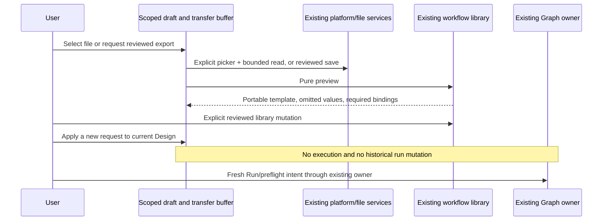

# Sequential transfer and repeat requests

Prepared from the current U3 source investigation. Implementation starts after U4 is verified. This adds no file/runtime/config owner. The existing workflow library owns immutable portable versions, the existing draft store owns unsubmitted editor/transfer state, and native platform/file services own file selection/read/save. Parallel remains experimental; Z7-A12 and conditional U5-P01–P03 remain open and are not claimed supported.

## File transfer

Use `IPlatformService.selectFile` where `canSelectFilePath` is true, read the explicit selected file through the existing public `IFileService` in a hook, and use `IPlatformService.saveFile` for reviewed export bytes. Ordinary Web without these capabilities keeps the explicit Advanced JSON path with an explanation. No UI filesystem access, `window.zcode`, new host protocol or command execution is needed.

Import reads at most 256,001 bytes and rejects files beyond the existing 256,000 transfer bound, invalid UTF-8, empty/non-file/changed reads and unsupported envelopes. Use the file service's stat/mtime/size and bounded byte read; validation still flows through `workflow.preview(action: import)`. File selection/cancel/read/schema/preview errors preserve the current definition and retained transfer text. A new successful preview resets its review checkbox. Import never installs references, recipes, models, MCP connections or workers; explicit reviewed Create/Save version changes only the library. Instantiation retains the existing Save/Discard/Cancel replacement flow.

Export previews the selected exact immutable template version or explicitly captures the current definition, disclosing omitted local values. A separate unchecked acknowledgement is required before file save. Encode exactly the reviewed JSON; file save cancellation preserves preview and draft. Export is a template, not a history/evidence/parallel backup. Explain that task prose may contain source or secrets even though the portable scanner checks common patterns; review is still required. The exported envelope is always the existing `zcode-workflow` v1 shape, never a coerced parallel plan.

Capture preserves graph topology, structured schemas, conditions, limits, final gate and semantic reference roles while removing only local bindings, source paths, Start request and model overrides as already specified. Existing selected reference roles are exported as required rebinding roles with stable IDs/kinds/affected node IDs, since the frozen instance does not retain their original optional flag. Do not embed document/skill contents, absolute paths or native instruction delivery policy. Saved library exports retain their original declared role requirements. Test current multi-check and custom advanced graphs through the exact export/import path.

Retain transfer text/name/description by workspace. Review state belongs to an exact preview operation, entry/version, draft content and scope; it must not survive changing those inputs. Async picker/read/preview/save results check scope and generation. Late results never replace a newer transfer buffer or another workspace. Errors are presented separately from valid prior preview data and cannot silently authorize that old preview for new input.

Coordinator-owned hook contract: `useGraphTemplateFiles(target)` exposes `canImportFile`, `canExportFile`, `importFile(isCurrent)` and `exportFile(json, isCurrent)`. Import returns `{ path, json }` or `undefined` for cancellation/stale scope. Export sends a fresh UTF-8 `ArrayBuffer` containing exactly the reviewed JSON to the native save dialog with suggested name `workflow.zcode-workflow.json`, and returns the existing `SaveFileResult` or `undefined` for stale scope. Current errors propagate to the transfer view; no hook error/preview/admission owner is added. The caller's intent-generation predicate is combined with the hook's service/platform/workspace lifetime and cleanup generation before and after asynchronous work, including StrictMode cleanup/setup. Native file operations already authorized by the explicit button may finish after a scope change, but their late result cannot authorize or replace a newer review.

Import requires finite integer byte size and finite mtime from the local file service, checks file type/size before reading, performs one bounded `readFileRange` and a second stat, and rejects size/mtime/type/returned-length changes. UTF-8 decoding is fatal and blank content is rejected. This is a bounded read of the explicitly selected file, not a guarantee against an external same-size/same-mtime rewrite; the exact returned text still requires strict library preview and explicit review. No file is read or written when the local capability is unavailable.

Pending unapplied editor buffers are separate from saved/dirty canonical Design state. Replacement must account for them explicitly. Save cannot claim to save unapplied text; Cancel/error/late completion preserves it. Any explicit Discard clears only the unchanged buffers covered by that decision after successful replacement; otherwise require resolution through existing editor controls before replacement. Never silently carry an old buffer into a new template and treat it as that template's canonical value.

## Repeat request

Provide an explicit New request form on the current Design. It changes only the canonical draft's Start request and the versioned instance's `request` parameter, using the same parameter rendering as initial instantiation. Preserve current node IDs, template/version pin, references, multiple checks and mappings, schemas, condition/repair policy and per-node settings. Custom definitions retain their existing shape; unsupported non-string request parameters explain the Advanced path. Applying a request does not execute or overwrite prior run records.

The public pure transform is `applyGraphRunRequest(definition: GraphSequentialDefinition, request: string): GraphSequentialDefinition`. Require a nonblank request within the existing 12,000-character parameter bound and exactly one Start. For a pinned instance, only an existing string `parameters.request` can be updated; a missing or non-string field requires Advanced rather than inventing an undeclared parameter. Share the exact existing parameter-to-Start renderer with initial instantiation and preserve every other parameter and exclusion. For an unpinned sequential definition, update only Start text. Return a cloned draft without revision, pin or local-binding mutation. Run readiness remains the existing separate authoritative gate.

Run remains a separate deliberate action with a new durable request ID and freshly bound preflight review. Previously written files remain in the workspace; repeat preparation displays that fact and points to prior runs/current project changes. No reset or idempotent replay is implied. Editing a request invalidates affected open preflight consent. Existing active/uncertain-run and Host lease protections continue to gate admission. Native controlled tests prove distinct run/session/input identities, reused check/reference selections and unchanged earlier prompts/settings/evidence.

## Acceptance

Prove valid round trip, UTF-8/size/malformed/parallel rejection, cancel/read/preview/save failures, concurrent buffer edits, workspace changes and replacement Cancel preserve drafts. Prove omitted local/auth/history values and preserved reference/check/topology semantics. File dialog UI wiring may use an explicitly labelled controlled Electron seam in isolated tests; actual OS dialog ergonomics remain a human pilot check. Run reuse must have new explicit identities and stable old records. No parallel portability claim, clone preparation or supported-release promotion is authorized.
