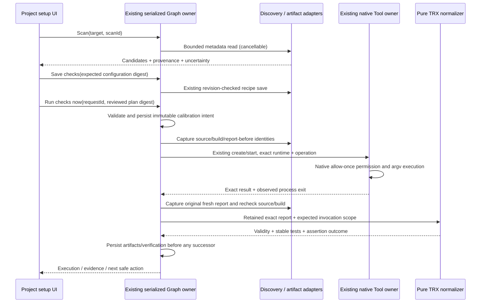

# U0 .NET discovery, native checks and TRX audit

Recorded 27 September 2026. This is a source investigation and a proposed additive contract, not execution evidence. The coordinator owns final contracts and integration. The user's U0–U6 assignment supersedes the older phase-only restrictions in the planning pack.

## Evidence boundary

- Read root `AGENTS.md`, the architecture-governance skill, CLI instructions where the native boundary was inspected, the pre-Z8 master plan/backlog/delivery/source register/handoff, Graph `CONTRACT.md`, and the Z4 artifact/native specifications.
- Actual working tree at investigation start: modified `README.md`; untracked guide and pre-Z8 documents. No product changes were present then. They were preserved.
- The coordinator owns the fresh workspace, architecture, typecheck, lint and native baseline commands. This lane did not repeat them or treat historical logs as passing evidence.
- This lane did not execute any .NET project, build, restore, model request or test, and did not install dependencies. It did not read installed credentials, user NuGet caches/configuration, company workspaces or native provider settings.
- Shell resolution found `dotnet.exe`; installation directory metadata showed SDKs `8.0.425`, `9.0.311`, `9.0.312`, `9.0.318`, `10.0.301`, `10.0.401`. These observations do not establish the SDK selected by a particular workspace or native app environment.
- No tracked `.csproj`, `.sln`, `.slnx` or TRX file was found. Existing Z4 scripts generate an isolated C# console assertion runner, which writes the internal JSON format; that is not VSTest/TRX evidence.
- A metadata-only inventory located existing repository-owned synthetic NuGet directories. Three of the latest inspected synthetic directories were empty. This is not a claim about every historical fixture or installed package cache.
- Memory registry search returned no task-relevant entries; no memory-derived facts are used.

## Confirmed source map

| Responsibility                   | Current source                                                                                                            | Finding                                                                                                                                                                  |
| -------------------------------- | ------------------------------------------------------------------------------------------------------------------------- | ------------------------------------------------------------------------------------------------------------------------------------------------------------------------ |
| Public recipe/evidence types     | `packages/services/src/graph-engineering/artifact-types.ts`                                                               | Test accepts only `format: "zcode-json-v1"`; verifier contains `reportPath`, count policy, required names and global `buildNodeId`.                                      |
| Recipe shape and script boundary | `domain/artifact-schemas.ts`                                                                                              | Strict schema; 32 recipes, 32 source/output paths, 64 arguments, 600,000 ms timeout; command shells and script entry extensions rejected.                                |
| Recipe persistence               | `adapters/recipes.ts`                                                                                                     | Reads only workspace `.zcode/config.json`; digest comparison, file lock and atomic replace preserve unrelated configuration.                                             |
| Path and fingerprint safety      | `adapters/artifact-files.ts`                                                                                              | Regular files only; root/ancestor link and reparse checks; containment and before/open/after identity checks; 32 paths, 32 MiB per fingerprinted file.                   |
| Artifact retention               | `adapters/artifacts.ts`, `domain/artifacts.ts`                                                                            | 256 KiB text artifacts; exact ownership/digest checks; redaction or truncation is incomplete, not valid substituted evidence.                                            |
| Run snapshot and Build binding   | `app/run-plan.ts`                                                                                                         | Recipe is cloned and digested into each attempt. Test must reference an earlier Build; v5 also requires dominance on all initial/repair routes.                          |
| Current native preflight         | `adapters/workflow-preflight.ts`, `adapters/workflow-tools.ts`                                                            | Reads native executable availability without invoking it. Built-in checks additionally assume node IDs `build`/`test` and recipe `buildNodeId === "build"`.              |
| Pre/post execution evidence      | `app/tool-evidence.ts`                                                                                                    | Captures source/build digests, pre-report identity and fresh Build outputs; checks unchanged source and Build bytes; retains original report before parsing.             |
| Strict internal report           | `domain/tool-verification.ts`                                                                                             | `zcode-test-v1` payload; invocation/source/build match; duplicate identities invalid; 1,000 results maximum; positive count, executed tests and required tests enforced. |
| Evidence in history              | `domain/tool-records.ts`, `domain/routing-verification.ts`                                                                | Strict persisted records and route evidence checks must be extended with any additive fields. A type-only change is insufficient.                                        |
| Native Tool orchestration        | `app/tools.ts`, `app/ports.ts`, `adapters/tools.ts`                                                                       | Same Graph owner; persisted intent before native create/start; exact session/runtime/operation checks; unknown acknowledgment is not replayed.                           |
| Native operation execution       | `apps/zcode-cli/packages/bootstrap/src/app/native-recipe-operations.ts`, `native-recipe-tool.ts`, `native-recipe-path.ts` | Existing runtime ToolExecutor/permission broker and ExecutionPort; fixed argv, always-ask allow-once permission, exact cancellation and process-exit proof.              |
| Native recipe protocol           | `packages/shared/src/native-recipe.ts`, `packages/shared/src/zcode-protocol/index.ts`                                     | Strict start/inspect/cancel DTOs. No new process channel is needed for `dotnet`.                                                                                         |
| Service composition              | `packages/services/src/graph-engineering/node.ts`, `app/service.ts`                                                       | Graph service owns repository, recipes, artifacts, native ports and admission. UI must keep using its public service/hooks.                                              |
| Existing isolated C# basis       | `scripts/graph-engineering/z4-fixture.mjs`, `z4-csharp-source.mjs`, `z4-recipes.mjs`                                      | Pinned SDK and private fixture home/feed policy already exist. Preserve this regression; add a distinct genuine VSTest fixture.                                          |

Paths without a repository prefix in this table are under `packages/services/src/graph-engineering/`.

## Initial support decision proposed to the coordinator

| Profile                                                                                                                   | Discovery                                    | Verified execution policy                                                                                                                                                    |
| ------------------------------------------------------------------------------------------------------------------------- | -------------------------------------------- | ---------------------------------------------------------------------------------------------------------------------------------------------------------------------------- |
| Local SDK-style C# project, known VSTest test metadata, bounded complete local source/input scope, installed dependencies | Candidate with provenance                    | Initial supported profile after genuine report/native acceptance passes.                                                                                                     |
| Multiple solutions/projects                                                                                               | Return all candidates                        | User selects; never silently choose the first solution.                                                                                                                      |
| Multiple test projects or target frameworks                                                                               | Return explicit project/framework selections | Expand to separate frozen Test recipes/Tool nodes within existing graph limits, with one owned report per invocation. No shared fixed report name across unexpanded targets. |
| VSTest with genuine passing/failing/skipped results                                                                       | Candidate                                    | Preserve original TRX and deterministic normalized identities/results; genuine failing assertions remain failed evidence, not parser failure.                                |
| Microsoft.Testing.Platform, including older opt-in bridge properties                                                      | Detect or report uncertainty                 | Unsupported until its separate runner/options/report contract is verified. Do not change the project runner.                                                                 |
| Conditional/dynamic imports, external linked sources, unsupported SDK/project types, unresolved generated inputs          | Candidate with specific limitation           | Do not claim complete source coverage. Require a separately resolved/approved profile; no silent metadata-only fingerprint.                                                  |
| More than 32 declared source/output files, 1,000 results, or 256 KiB retained report                                      | Detect the bound                             | Explicit unsupported/oversized result. Any capacity increase is a separate bounded, tested contract change.                                                                  |
| PowerShell/batch/shell harness, RTP/game acceptance                                                                       | File hint only when relevant                 | Unsupported as machine-verified .NET checks in this initial profile. No wrapper executable to bypass script restrictions, no inferred RTP claim.                             |
| Remote workspace                                                                                                          | Existing local-only Graph constraints apply  | No new remote execution capability.                                                                                                                                          |

Microsoft documents distinct VSTest/MTP command behavior and runner selection; an installed SDK alone cannot prove the selected project runner. The VSTest command documents no-build behavior and the fixed TRX filename overwrite hazard across target frameworks. These justify explicit runner selection, captured build reuse and separate invocation report locations. [Runner documentation](https://learn.microsoft.com/en-us/dotnet/core/tools/dotnet-test), [VSTest CLI documentation](https://learn.microsoft.com/en-us/dotnet/core/tools/dotnet-test-vstest).

The proposed small-profile boundary is a declared compatibility limit, not permission to weaken the backlog. If the selected supported pilot exceeds it, extending the bounded source/report contract is required before claiming that pilot is supported.

## Additive shared contracts

### A. Read-only discovery

Expose typed scan and cancellation commands through `IGraphEngineeringService`; compose a `GraphProjectDiscoveryPort` into the existing Graph service. The adapter performs asynchronous filesystem reads. Pure metadata classification belongs in the domain. Renderer state only retains the request ID, selected candidate and loading/error projection.

Suggested result fields:

```ts
interface GraphProjectDiscovery {
  scanId: string;
  workspaceKey: string;
  status: "complete" | "cancelled" | "limited";
  metadataDigest: string;
  candidates: Array<{
    path: string;
    kind: "solution" | "solution-xml" | "project";
    projects: string[];
    targetFrameworks: string[];
    runner: "vstest-candidate" | "mtp" | "unknown";
    provenance: Array<{ path: string; digest: string; reason: string }>;
    uncertainties: string[];
  }>;
  diagnostics: Array<{ code: string; path?: string; message: string }>;
}
```

Use a request-scoped abort signal in the Host and explicit `scanId` over RPC if cancellation cannot transport a signal. Cancellation is read cancellation, not a Graph/native Stop. Never apply results unless the current workspace identity and scan ID match. Discovery results are advisory and need not become a second durable project cache.

Proposed initial bounds to ratify in the implementation spec: maximum 2,048 visited directory entries, depth 12, 128 metadata files, 256 KiB per metadata file, 4 MiB aggregate metadata, plus a bounded wall-clock deadline and cancellation checks between reads. Limit exhaustion returns `limited`; it cannot silently publish a complete candidate. Exclude `.git`, `.zcode` except the existing recipe read path, `.vs`, `bin`, `obj`, `node_modules`, package/vendor/generated output directories and owned report locations. Do not follow directory links/reparse aliases.

Read `.sln`, `.slnx`, `.csproj`, `global.json`, relevant local `Directory.Build.props`, `Directory.Build.targets`, `Directory.Packages.props` and explicit local project/import references. Resolve only bounded local declarative paths; treat conditional/property-expanded/imported unknowns as unknown. Surface unreadable or malformed files with a path and bounded diagnostic. Do not read arbitrary NuGet/auth configuration or package credential stores. Do not run MSBuild evaluation, test discovery, restore, scripts, model calls or MCP during scan.

### B. Graph-local Test-to-Build binding

Add an optional `buildNodeId` to `GraphToolNode` for graph-local Test binding. Older definitions and existing saved Test recipes retain their current `verifier.buildNodeId` fallback. New template instantiation explicitly maps its stable Build slot to the selected Test node's `buildNodeId`; the saved shared recipe is never rewritten.

Use one pure resolver for preflight, run-plan, template compatibility, repair and parallel consumers. It returns a cloned effective recipe for the node; the effective recipe is validated, frozen and digested into the attempt. Validate Build kind, earlier/dominating relationship, source scope and supported Test format before admission. Conflicting or dangling mappings are actionable setup errors. Persisted snapshots and prior runs are unchanged. Include mapping changes in preflight/configuration identity.

The existing `node.id === "build"`/`"test"` special cases cannot be the general compatibility authority. Stable template slot requirements plus resolved graph identities must survive node renaming/remapping.

### C. Versioned VSTest verifier

Extend the discriminated Test verifier union with a separate `dotnet-vstest-trx-v1` branch. Keep the legacy `zcode-json-v1` branch unchanged. The new branch needs a reviewed .NET invocation descriptor (exact project/solution target, configuration, framework, optional runtime and filter, expected test assembly identity), the existing count/required-test policy, and an invocation-owned report path template. The recipe snapshot/digest includes every one of these values.

Prefer the first guided profile to invoke one explicit project/framework per Test node, from workspace cwd `.`. Generate a path such as `.zcode/graph-results/{operationId}/results.trx`; only the Host's operation placeholder may occur in that path. Freeze `resolvedReportPath` in the attempt before native dispatch, validate the resolved workspace path/ancestors, and reject any pre-existing destination. All capture/freshness checks operate on that resolved path, never on a later configuration lookup.

TRX does not natively carry Graph's `operationId`, `sourceDigest` and `buildDigest`. The trusted application adapter attaches them only after it proves the exact native process/result, owned fresh report, unchanged captured source and exact prior Build binaries. It must not accept those identities from report prose or generate a passing envelope before those checks.

Build and Test share the same complete ordered source manifest. Initial Build must freshly produce every declared output under existing rules; ordinary incremental success with unchanged files is insufficient. Use an explicitly reviewed rebuild plan or invocation-owned build-output plan and prove it in the fixture. Test must use the captured build without implicit rebuilding/restoring; if its command can rebuild, invalidate the prior Build and require fresh evidence instead. Include all tested assemblies and relevant runtime/configuration outputs in the Build fingerprint. Any unresolved source/import/output coverage blocks supported calibration.

### D. Trusted normalization and secure XML

Keep parsing deterministic and free of IO. The file adapter owns bounded capture/path safety; domain parsing owns syntax/shape/counters/identity semantics; `GraphToolEvidence` owns association with native invocation and acceptance. Retain original report artifacts and normalized test observations separately.

Reject DTD/entity declarations, external entities, processing instructions other than a supported XML declaration, malformed UTF-8, malformed/incomplete XML, duplicate attributes, unexpected roots/namespaces, excessive depth/text/attributes/elements, duplicate report IDs and duplicate test identities. No entity resolver, network loader, stylesheet transform or attachment dereference is permitted. XML attachments and source paths are data only; never follow them.

Validate supported TRX structure, report ID/time consistency, complete result summary, result counters versus actually parsed leaf results, test definitions/results association and per-result outcomes. Normalize only supported outcomes: `Passed` to passed, `Failed` to failed, supported nonexecution to skipped. Infrastructure/aborted/disconnected/timeout/in-progress/unknown states remain invalid/incomplete for repair and acceptance. Microsoft exposes materially different TRX outcome values; a generic non-failed-to-passed conversion is unsafe. [VSTest outcome source](https://raw.githubusercontent.com/microsoft/vstest/main/src/Microsoft.TestPlatform.Extensions.TrxLogger/ObjectModel/TestOutcome.cs).

Qualify stable test identity by project, framework/runtime and assembly plus TRX test identity/data-row identity. Never merge equal display names from separate projects/frameworks. Preserve complete original display names/failure detail in inspectable reports. The existing normalized name bound is 200 characters; either use a stable digest-based identity with an explicit display-name mapping or make a separately tested bounded extension. Never truncate identifiers into possible collisions. Required-test selection must use those stable identities while displaying understandable names.

Counter/byte/result limits apply before acceptance; no early truncation into a passing subset. Zero results, all skipped, missing required tests or an approved exact count mismatch are inadequate/invalid. No automatic lowering of `expectedTests`, `minimumTests` or required names after failure.

Current services have **no direct XML parser dependency**. The lockfile lists transitive `sax@1.6.0`, `xml2js@0.5.0`, and `@xmldom/xmldom@0.8.12`; the latter entry explicitly warns of critical issues. The conventional local pnpm `sax` package location was absent. Do not import a transitive/packager parser as an undeclared runtime dependency. The coordinator must choose a maintained declared parser under the dependency policy, or a deliberately restricted bounded XML subset parser with exhaustive negative coverage. Regex extraction alone is insufficient.

### E. Separate process, report and assertion facts

Keep native process status, report validity and assertion outcome as separate fields. Existing v5 `observationValid/outcome` supports known assertion failures for bounded repair; preserve its strict prerequisites. A nonzero native exit with complete genuine failing assertions may be valid failed evidence. A nonzero exit with an apparently passing partial report, cancellation, timeout, missing process-exit proof, redacted/truncated report, or report/build/source mismatch cannot pass and cannot authorize repair.

The command artifact may be nonpassing while a v5 report observation proves genuine failed assertions. Do not erase that distinction by requiring every nonzero exit to become a parse error, or by making every parsed report actionable. If new report-validity fields are added for calibration/UI, persist and validate them in record schemas/integrity checks too.

### F. Tool availability and explicit calibration

Reuse `previewExecutionEnvironment` for nonexecuting executable resolution. It currently establishes availability only, not selected SDK/version or package/feed readiness. Present that limitation directly. Any `dotnet --info`/version execution is a separate user-approved native command; scan/save must not invoke it.

Propose one `calibrateChecks` command on the existing Graph service with `target`, stable `requestId`, `expectedRecipeDigest`, selected Build/Test recipe IDs, and a reviewed plan digest. It compiles a transient tool-only v4 definition, persists the immutable calibration run under the same Graph record/owner, and uses the existing sequencer/native Tool path. It must not replace the user's saved definition or draft. Add explicit calibration-purpose metadata if needed; preserve prior run formats. Check-only calibration needs no provider/model execution.

Factor admission so calibration shares request idempotency, workspace owner/lease, unresolved-work/parallel checks, persisted intent, process identity, cancellation and recovery. Do not introduce a separate command queue or standalone Host process supervisor. Source/check/executable/selection changes invalidate the plan digest. A failed test calibration is a valid recorded execution outcome, not a reason to forbid saving a syntactically valid profile. Restore remains a separate explicit action because it writes files and can access feeds/network; never copy original-home credentials into the private environment.



Cold reads never call Start. Unknown native execution retains its original identity and is not replayed. Desktop/mobile projections continue reading the same Graph/native owner; no separate mobile calibration runtime is introduced.

## Package-free genuine VSTest fixture feasibility

**Hypothesis, not executed:** SDK `8.0.425` includes `Microsoft.VisualStudio.TestPlatform.ObjectModel.dll`, VSTest console/core/engine assemblies, `testhost.dll`, its dependency manifest, `testhost-8.0.runtimeconfig.json`, and `Extensions/Microsoft.VisualStudio.TestPlatform.Extensions.Trx.TestLogger.dll`. The runtime configuration names `Microsoft.NETCore.App` `8.0.31`; an `8.0.31` reference pack is installed. These are public installed SDK files, not credentials.

A separately named synthetic fixture can compile its own tiny `*TestAdapter.dll` against the SDK ObjectModel reference, implement `ITestDiscoverer` and `ITestExecutor`, and invoke real compiled C# assertion methods. Real VSTest should then generate TRX through its built-in logger. This exercises genuine test-engine/report behavior without downloading MSTest/xUnit packages. The adapter is test infrastructure only; it is not a product replacement for users' test frameworks. Microsoft's documented extension interfaces support this route. [VSTest extension contract](https://github.com/microsoft/vstest/blob/main/docs/Overview.md).

Use a new repository-owned disposable fixture home, pinned `global.json`, explicit empty package source configuration, private `DOTNET_CLI_HOME`/NuGet/MSBuild paths and existing isolation helpers. Reference the SDK assembly explicitly; do not read user caches. Build synthetic adapter and tests, run the real VSTest engine with explicit adapter path and owned report path, and retain stdout/stderr/exit/TRX/assembly digests. Runtime dependency/testhost resolution is an open feasibility check; directory inventory alone does not prove it.

The coordinator reserved the build/output lane while U0 native baseline runs. No fixture compile/test was started by this audit. New fixture execution is the exact next experiment once that lane is available; no dependency install/network access is needed for the proposed attempt.

## Required verification matrix

Every item below is **NOT RUN by this audit**. The implementation report must replace that label only with current evidence.

| Layer                           | Required checks                                                                                                                                                                                                                                                                    |
| ------------------------------- | ---------------------------------------------------------------------------------------------------------------------------------------------------------------------------------------------------------------------------------------------------------------------------------- |
| Pure discovery classification   | `.sln`/`.slnx`/SDK C# metadata, multi-solution ambiguity, explicit VSTest/MTP/unknown, names-only hints, conditional/dynamic/external imports, malformed files, no silent first selection.                                                                                         |
| Controlled filesystem adapter   | Cancel/deadline/entry/byte/depth limits; unreadable metadata; missing files; root/nested symlink/junction/outside links; workspace switch with delayed result; zero process/model/MCP submissions.                                                                                 |
| Recipe and binding domain       | Correct Test/Build kind, command-only rejection, renamed Build, missing/dominance/repair path rejection, shared recipe unchanged, old definition fallback, digest invalidation and custom-field round trip.                                                                        |
| Secure TRX parser               | Genuine namespace/report sample, pass/fail/skipped, empty/all-skipped, inconsistent counters, missing summary, partial XML, duplicate test/report/attribute, data rows, malformed entity, DTD/XXE, excessive bytes/depth/count, unsupported outcomes and long identities.          |
| Native evidence association     | Pre-existing report path rejected; stale copied report/time mismatch; source/build changes before/during Test; per-project/framework isolation; capture/fingerprint race; native nonzero+failed assertions versus crash+passing partial report; cancellation/truncation/redaction. |
| Controlled Graph/native service | Persist-before-start, duplicate/lost acknowledgment, exact session/runtime IDs, native permission required, no extra provider request, no saved-definition mutation during calibration, same owner/lease/recovery gates.                                                           |
| Genuine isolated .NET           | Package-free adapter feasibility, actual engine-generated passing/failing/skipped/zero reports, stable count/identity, repeated fresh builds, separate project/framework invocations, controlled crash and native permission path.                                                 |
| Built artifact and human pilot  | Existing app paths with new controls, real selected project runner/dependencies/report behavior, timing/usability and three unfamiliar operators. Keep user/live items NOT RUN until performed.                                                                                    |

## Risks and exact next actions

1. Coordinator ratifies contracts/spec before U2 source edits: graph-local Build binding, VSTest discriminator, invocation report path, discovery bounds, complete source coverage and calibration admission.
2. Prove the package-free fixture using the available SDK in an isolated build slot. Record engine version, exact commands, fixture hashes and actual TRX. Do not infer production framework support solely from a custom fixture adapter.
3. Select secure XML implementation with a declared dependency policy or a tightly bounded supported subset; retain malicious/oversized fixtures and fail closed.
4. Implement pure parser/discovery/compiler tests before dependent UI, then integrate through existing ports/state owner. Schema, persisted history and preflight changes are coordinator-owned.
5. Decide source-manifest expansion only from actual supported pilot needs. The current 32-file limit and implicit/conditional imports are the largest coverage constraint; a guessed project file is not a valid substitute.
6. Preserve MTP, script harness, RTP and private-feed compatibility as explicitly unsupported/unknown until separately evidenced. Continue independent U1/U3–U6 work safely; do not mark their live pilot requirements complete.

No staging, commit, push, publication, installer replacement or Z8 work was performed.
