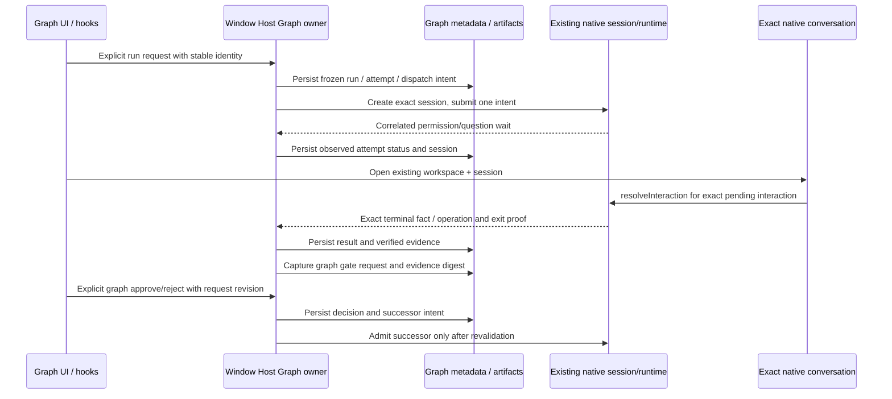

# U0 safety and regression audit

Date: 27 September 2026. Source inspected at `7e5f02d76abf20d567df1a9e6ddb868ab3421205` on `main`. This is a bounded investigation for the authorized U0–U6 programme. The coordinator owns the integrated baseline, implementation, builds and phase reports. No product source was changed by this investigation.

## Evidence boundary

Read the current root `AGENTS.md`, architecture policy, relevant `DESIGN.md` rules, pre-Z8 handoff/master/backlog/delivery/source register/report template, Graph module contract, Z3/Z4 native contracts, relevant source and fixture entry points. No nested `AGENTS.md` was found under the inspected `packages/services`, `packages/ui` or `docs` trees.

Preserved the preexisting modified `README.md`, untracked LLM guide and planning pack. No checkout staging, commit, push, publishing, installed profile, installed credentials, company workspace, live provider or native app launch was used in this audit. Historical test counts in the handoff were not accepted as fresh results. The memory registry search found no relevant project history.

Fresh observations made by this investigator:

| Check                                                   | Result                                       | Scope                                                                                                                                                                              |
| ------------------------------------------------------- | -------------------------------------------- | ---------------------------------------------------------------------------------------------------------------------------------------------------------------------------------- |
| `node scripts/check-workspace-freshness.mjs --no-fetch` | PASS; ahead 0 / behind 0                     | Cached remote state only. Coordinator separately owns normal freshness.                                                                                                            |
| Helper-selected `node --version`, `pnpm --version`      | `v24.14.0`, `10.33.2`                        | Matches current `mise.toml`; no install.                                                                                                                                           |
| `.NET` SDK directory inspection                         | `8.0.425` exists                             | Read-only installed-tool metadata; no restore/build/evaluation performed here.                                                                                                     |
| Electron, CLI and desktop output files                  | Present                                      | CLI and desktop outputs were last modified 25 September; existence is not proof they match later implementation. Rebuild before implementation acceptance.                         |
| Native question protection unit tests                   | PASS, 4 / 4, exit 0                          | `node --import tsx --test apps/zcode-cli/packages/bootstrap/src/zcode-protocol-v4/interaction-registry.test.ts`; 581.4877 ms reported total. Fake timers and native registry only. |
| Late Tool completion after Cancel microprobe            | Expected conservative state observed, exit 0 | Controlled service fixture only; exact procedure below.                                                                                                                            |
| Native permission rendering, screenshots, live pilot    | NOT RUN by this investigator                 | Coordinator can execute the isolated native recipe below.                                                                                                                          |

`rg.exe` resolves to a non-executable WinGet link in this environment. `git grep`, `git ls-files` and bounded PowerShell reads worked. Plain `bash` resolves to the Windows subsystem launcher, while `C:\Program Files\Git\bin\bash.exe` and `C:\Program Files\Git\usr\bin\bash.exe` exist. Put the Git Bash directory on the test process PATH before scenarios using native Bash. Do not change global PATH.

## Ownership and response paths

The existing architecture is suitable for the programme. Preserve these owners rather than creating a second response channel or scheduler.



| Responsibility                                                           | Actual source                                                                                                                                        |
| ------------------------------------------------------------------------ | ---------------------------------------------------------------------------------------------------------------------------------------------------- |
| One workspace Graph writer, serialized commands and retained request IDs | `packages/services/src/graph-engineering/app/service.ts`, `app/state.ts`, `adapters/repository.ts`                                                   |
| Tool execution intent and observation                                    | `app/tools.ts`, `app/tool-evidence.ts`; actual execution remains behind native Tool port                                                             |
| Graph Human Approval capture, correlation and revalidation               | `app/approvals.ts`, `domain/approvals.ts`, `approval-types.ts`                                                                                       |
| Exact native-session navigation                                          | `packages/ui/src/app-shell/WorkspaceShellLayout.tsx` (`handleSelectTaskInChat`), `graph-engineering/GraphToolInspector.tsx`, `GraphRunInspector.tsx` |
| Native permission/question selection and response                        | `packages/ui/src/v4/SessionPane.tsx`, `V4InteractionDialogs.tsx`, `pendingInteractionAdapter.ts`, `PermissionDialog.tsx`                             |
| Confirmed-inactive inspection and audited release                        | `app/recovery.ts`, `adapters/recovery.test.ts`, `adapters/release-validation.test.ts`                                                                |
| Native question automatic-resolution exclusions                          | `apps/zcode-cli/packages/bootstrap/src/zcode-protocol-v4/interaction-registry.ts` and its tests                                                      |

`V4InteractionDialogs` rejects snapshots for a different session, chooses the first native permission/user-input interaction it can render, and leaves hook trust review to its existing separate owner. Native responses use `resolveInteraction` and the current interaction ID through `useV4Conversation`. It retains a local response flight guard; accepted, duplicate and noop acknowledgements settle that command. Graph ownership disables ordinary extra input without hiding native interaction responses.

Graph approvals use a different contract: run/node/attempt/request IDs, request version/digest, frozen graph/settings and evidence are correlated. `app/approvals.ts` rechecks saved definition and source/evidence before a decision and before downstream native work. An approved gate is not a native tool permission and does not manufacture test success.

Recovery never interprets a missing session, cold history, replacement runtime or a generic non-running header as inactivity. A release requires every attempt's exact native/never-submitted proof, a supported unresolved status, explicit confirmation and a 1–2,000 character audit reason. Release preserves unknown outcomes and neither undoes files nor resubmits work. The service persists `CancelRequested` and skips unstarted successors before targeted cancellation; observed process exit is still required.

## Permission symptom: confirmed facts and open cause

The user's “Build awaiting approval, no visible action” report is still a reported symptom until a controlled runtime trace reproduces it. Do not mark it a transport defect or a proven user workaround from source alone.

Confirmed source-level discoverability issue: `GraphRunPanel.tsx` has no persistent native-interaction action independent of node selection. `GraphRunInspector.tsx` resolves the selected node/attempt, and the Tool's **Open conversation** button exists inside `GraphToolInspector.tsx` only when that Tool is selected and has a session ID. Region selection suppresses the node inspector. Selecting another node can therefore leave the run waiting without the waiting Tool's conversation action in the inspector. This justifies U4's persistent action area, but does not prove it caused the user's particular run.

The smallest existing controlled reproduction is:

```powershell
. .\.tmp\z1-env.ps1
$env:PATH="$PWD\node_modules\.bin;C:\Program Files\Git\bin;$env:PATH"
if (Test-Path Env:Z1_PACKAGED_EXE) { throw 'Use an explicit, separately reviewed built-artifact fixture; do not inherit an executable override.' }
node scripts/graph-engineering/z4-native-smoke.mjs --scenario=build-only --configured-provider --ui-first-wait
```

This command must run only after the coordinator has finished any shared-output build/typecheck. `--configured-provider` still configures the loopback fixture, not a user's real provider. `--ui-first-wait` checks that the actual Tool inspector reaches `WaitingForPermission`, rather than inferring UI rendering from disk. `openToolPermission()` in `z4-native-helpers.mjs` then asserts:

1. Exact native `operationId` and `sessionId` match the Tool inspector.
2. The native process has not started before consent.
3. Graph navigation opens that exact existing session.
4. The Graph-owned-input notice and native **Allow** option are visible.
5. Native input ledger and model-request counts are unchanged by navigation.
6. It captures the native permission screenshot before approving the synthetic command.

The existing script then explicitly approves the owned fixture command, waits for the actual direct `dotnet` process, inspects artifacts, and requires zero model requests and zero Agent inputs for this Tool-only scenario. It writes `z4-summary.json`, screenshots, native log and controlled-provider requests under the newly printed private profile. It closes its app/provider in the completion path. If startup or permission rendering fails, preserve the new summary/body/screenshot instead of retrying with a different session or fabricated state.

Needed U4 addition to this native scenario: capture the waiting run while Start or another completed node is selected, assert the new persistent action remains visible, open it, and reassert the same IDs and unchanged ledger. Repeat navigation and back without responding, then answer once. An action-area test must not resolve the native permission through a newly invented Graph API.

## Fixture isolation verdict

The inspected automated fixture path is appropriate for these authorized native checks, subject to using its fresh automated profile and local builds. The relevant files are `scripts/graph-engineering/isolation.mjs`, `native-bootstrap.cjs`, `z4-fixture.mjs`, `z7-fixture.mjs`, and controlled provider files.

- `createIsolation()` defaults to a new `.tmp/z1-native-*` directory. It creates private `HOME`, `USERPROFILE`, app data, native data, temporary directories, synthetic workspace and empty `.env` files. A small environment allowlist excludes inherited provider secrets. Provider configuration is written using the local controlled provider origin.
- Git uses empty private global config and `GIT_CONFIG_NOSYSTEM=1`; the synthetic workspace receives its own Git root. Some regression fixtures create seed commits only inside their explicitly owned temporary repositories. They do not stage or commit this development checkout.
- Desktop bootstrap blocks protocol registration, registry commands and recent-document mutation. Its web-request hook rejects non-loopback network requests for automated fixtures; inherited HTTP(S) proxies point to the fixture. This is an application test isolation boundary, not an OS sandbox for arbitrary project code.
- C# fixtures use a private CLI home, package cache, MSBuild-user paths and machine configuration directories. They supply empty NuGet package sources, disabled shared build servers and pinned SDK `8.0.425`. No installed-account NuGet credentials are copied.
- `manual: true` intentionally enables provider network and does not seed fixture provider credentials. Do not use the older `z*-launch-manual.mjs` entry points for automated no-credentials acceptance. `z7-launch-fixture.mjs` explicitly uses automated isolation and is suitable for a controlled operator exercise, but remains an interactive fixture, not live-provider proof.
- `Z1_PACKAGED_EXE` changes the entry point and profile path. Reject an inherited value during development checks. A later U6 artifact check must name the freshly built local artifact and preserve the user's installed app; a development bootstrap pass is not a packaged pass.
- The publish unit tests use injected command implementations. `publish-git.test.mjs` permits only local Git commands in a synthetic repository and asserts no `gh`, push or `ls-remote` call in its dry-run. Executing those tests does not authorize or run the real publication script.

## Existing automated entry points

There is no generic Graph test script in the current services/UI package manifests. Run the actual files with Node/tsx. The root coordinator should capture exit codes, command output and source identity in its evidence directory. These commands are listed for execution, not claimed as executed here:

```powershell
. .\.tmp\z1-env.ps1
$env:PATH="$PWD\node_modules\.bin;C:\Program Files\Git\bin;$env:PATH"
$graphTests=Get-ChildItem packages/services/src/graph-engineering -Recurse -Filter '*.test.ts' | Select-Object -ExpandProperty FullName
$gitTests=Get-ChildItem packages/services/src/git -Recurse -Filter '*.test.ts' | Select-Object -ExpandProperty FullName
node --import tsx --test @graphTests @gitTests
$uiTests=Get-ChildItem packages/ui/test/graph*.test.ts | Select-Object -ExpandProperty FullName
node --import tsx --test @uiTests
node --test scripts/graph-engineering/*.test.mjs
node --import tsx --test apps/zcode-cli/packages/bootstrap/src/zcode-protocol-v4/interaction-registry.test.ts
```

The UI `graph*.test.ts` files exercise pure projection/submission helpers; they do not establish actual DOM/focus/navigation behavior. The script suite includes actual isolated C# processes, so it is more than a pure unit suite. Avoid concurrent .NET/native scenarios where artifact ownership or machine load would make timing evidence ambiguous. Root `pnpm typecheck`, root lint, CLI checks, architecture check and desktop build remain coordinator-owned and must follow the current serial output order.

Useful existing native regression commands, each creating a separate controlled fixture:

| Purpose                                                       | Exact entry point                                                                                                                                                |
| ------------------------------------------------------------- | ---------------------------------------------------------------------------------------------------------------------------------------------------------------- |
| Same-session native permission with configured provider       | `node scripts/graph-engineering/z4-native-smoke.mjs --scenario=build-only --configured-provider --ui-first-wait`                                                 |
| Actual edit, source gate, Build/Test, final gate, restart     | `node scripts/graph-engineering/z4-native-smoke.mjs --scenario=complete`                                                                                         |
| Native Tool cancellation and unrelated Chat question survives | `node scripts/graph-engineering/z4-native-smoke.mjs --scenario=cancel`                                                                                           |
| Crash / lost accepted metadata acknowledgement                | `node scripts/graph-engineering/z4-native-boundaries.mjs --scenario=crash` and separately `--scenario=lost-ack`                                                  |
| Cold pending graph approval                                   | `node scripts/graph-engineering/z3-native-smoke.mjs --scenario=restart-pending`                                                                                  |
| Committed graph decision, undispatched successor              | `node scripts/graph-engineering/z3-native-smoke.mjs --scenario=boundary-planned`                                                                                 |
| Uncertain accepted successor does not replay                  | `node scripts/graph-engineering/z3-native-smoke.mjs --scenario=boundary-accepted`                                                                                |
| Stale selected source cannot authorize                        | `node scripts/graph-engineering/z3-native-smoke.mjs --scenario=stale-source`                                                                                     |
| Model says pass; real assertions fail                         | `node scripts/graph-engineering/z4-native-smoke.mjs --scenario=model-pass`                                                                                       |
| Invalid evidence                                              | Separate `z4-native-smoke.mjs` scenarios `zero`, `missing`, `stale`, `wrong-source`, `wrong-build`, `json-invalid`, `json-oversized`                             |
| Secret sentinel remains redacted                              | `node scripts/graph-engineering/z4-native-smoke.mjs --scenario=redaction`                                                                                        |
| Typed Conditions do not route invalid input                   | Separate `z5-native-smoke.mjs` scenarios `condition-missing`, `condition-wrong-type`, `reviewer-pass`, `invalid-json`, `old-artifact`                            |
| Bounded repair and final review                               | `node scripts/graph-engineering/z5-native-smoke.mjs --scenario=complete`                                                                                         |
| Preserved experimental parallel lifecycle                     | Separate `z7-native-smoke.mjs` scenarios `complete`, `failure`, `restart`, `combined-failure`; add `complete --concurrency=1` and `conflict` for full old matrix |
| Existing parallel transfer gap                                | `node --import tsx scripts/graph-engineering/z7-portability-audit.mjs` intentionally exits 1 while Z7-A12 remains unmet                                          |

The historical native scripts depend on current UI labels/test IDs and may need legitimate updates when Guided/default views change. Preserve semantic assertions, identity checks and negative cases; do not turn a selector failure into an acceptance pass by bypassing the product UI or rewriting result state.

## Negative matrix and review priorities

| Requirement / risk                                  | Current test anchors                                                                                  | Required programme validation                                                                                                                                                 |
| --------------------------------------------------- | ----------------------------------------------------------------------------------------------------- | ----------------------------------------------------------------------------------------------------------------------------------------------------------------------------- |
| Duplicate Run, lost create/send acknowledgement     | `app/service.test.ts`, `app/sequential-faults.test.ts`, UI `graphSubmission.test.ts`                  | Reuse one retained intent across Guided confirmation/retry; no new session/input on navigation or lost reply.                                                                 |
| Initial persistence failure                         | Same service/fault suites                                                                             | No native call, no cached reservation; exact retry is possible after recovery.                                                                                                |
| Competing Host or workspace identity                | `adapters/repository.test.ts`, `app/service.test.ts`, UI `graphEngineeringView.test.ts`               | Recipe/discovery late result cannot apply to another identity; retained form state must not become a new workspace's fact.                                                    |
| Native permission / user question / Graph approval  | Native helper above; native registry tests; `approval-service.test.ts`                                | Separate labels and authorized response paths. Persistent action must open exact session, preserve existing guard, and remain reachable with another node selected.           |
| Duplicate/concurrent/stale graph decision           | `approval-service.test.ts`, `approval-faults.test.ts`, UI `graphApprovalView.test.ts`                 | Only one winner; preserved request/version/digest/comment; no source mutation between decision/create/send accepted silently.                                                 |
| Cancel / late completion                            | `app/service.test.ts`, `adapters/evidence-service.test.ts`, microprobe below                          | Stop requested is not stopped; only owned operation cancelled; observed late success cannot admit successor or restore green success.                                         |
| Unknown/Interrupted recovery                        | `adapters/recovery.test.ts`, `release-validation.test.ts`, `sequential-faults.test.ts`                | No universal Retry; no inactive proof from cold/missing/foreign runtime; audit write failure keeps the guard.                                                                 |
| Source/output/report freshness                      | `adapters/z4-review.test.ts`, `app/tool-verification.test.ts`, `app/tool-evidence.ts`                 | Preserve exact captured bytes/provenance; build/report replacement between reads invalidates acceptance.                                                                      |
| Machine failed / invalid evidence versus model pass | `app/routing.test.ts`, `routing-region.test.ts`, `routing-service.test.ts`                            | New adapter and status UI must not route malformed/zero/all-skipped reports or treat human approval as a verified test pass.                                                  |
| Process crash or truncated output                   | `adapters/z4-review.test.ts`, `tool-evidence.ts`                                                      | Unobserved exit stays Unknown; partial seemingly passing report cannot prove success; failure code with genuine failed tests remains a distinct valid failure.                |
| Strict report capacity                              | `domain/tool-verification.ts`                                                                         | Existing 1,000-test bound is retained unless separately extended and tested; duplicate names, missing required tests, stale invocation/build/source and oversize do not pass. |
| Read/save/scan/import no side effect                | `workflow-service.test.ts`, `workflow-preflight.test.ts`, `workflow-store.test.ts`, portability audit | Instrument discovery/probe/import native calls; zero session/check/install/MCP/clone work until explicit reviewed execution.                                                  |
| Guided/Advanced and old versions                    | `legacy-persistence.test.ts`, `routing-record.test.ts`, UI edit/view tests                            | Preserve supported custom fields and historical frozen runs; unsupported projection must be explicit and read-only rather than lossy.                                         |
| Accessibility/keyboard/scaling                      | Native DOM tests needed                                                                               | 1280×720 and 1920×1080, keyboard-only primary action/error focus, input Delete protection, supported themes and zoom. Screenshots alone do not establish conformance.         |
| Large history/artifacts                             | New declared fixture needed                                                                           | Measure a stated history size and bytes; any UI bounding must leave canonical artifacts intact.                                                                               |
| Experimental Fork/Join retention                    | `parallel-lifecycle.test.ts`, `parallel-workspaces.test.ts`, native Z7 scenarios                      | Keep exact child ownership, max two workers, inactive/owned-only cleanup and original/integration workspace distinctions. Keep transfer limitation explicit.                  |

Highest-priority integration review points:

1. New source/report discovery and normalization must remain behind public service contracts; no UI file/process access, shell wrapper bypass or credential import.
2. New run/approval summaries must derive from captured evidence, native owner state and exact selected run, with three independent execution/evidence/decision axes.
3. Readiness/confirmation fingerprints must change when target, source, recipe, executable, settings or policy changes; UI-only hashes cannot replace Host checks.
4. The persistent native action should be navigation into the current native interaction owner. Reusing `PermissionDialog` without its current snapshot/command owner risks duplicate or stale responses.
5. Existing ambiguous acceptance, inactive release, source rechecks and question protection cannot be removed merely because the common Guided path appears simpler.

## Fresh late-completion microprobe

This source-service probe used the existing `evidenceFixture` and an injected controlled cancel acknowledgement. It created only a synthetic OS-temporary directory; the fixture disposed the service and removed its own directory afterward. No native process/model was launched.

```javascript
const cleanup = [];
const f = await evidenceFixture({
  after(fn) {
    cleanup.push(fn);
  },
});
try {
  await f.run();
  f.options.tools.cancel = async (_target, attempt) =>
    structuredClone(f.operations.get(attempt.operationId));
  const pending = await f.current();
  const requested = await f.service.cancel({ target: f.target, runId: pending.id });
  f.finishTool();
  const result = await f.wait((r) => r.toolAttempts[0].operation?.status === "completed");
  // Observed exact output below.
} finally {
  for (const close of cleanup.reverse()) await close();
}
```

Observed output: `cancelStatus=CancelRequested`, `finalRunStatus=Cancelled`, `firstToolStatus=Cancelled`, `nextToolStatus=Skipped`, `starts=1`, native `operationStatus=completed`, and `cancelRequestedAt=12`. `app/tool-evidence.ts` deliberately gives persisted cancellation intent precedence over late success. This refutes a suspected source-reading race; it is not a newly discovered defect. A permanent regression assertion is useful if U4 changes this path, but no product fix is warranted solely for this probe.

## Screenshot and evidence plan

For every new native UI scenario record source commit plus working-tree change identity, SHA-256 of actual CLI/main/Host/renderer build files, private profile path, fixture scenario, exact run/attempt/session/operation/interaction IDs and before/after native input counts. Use a fresh fixture per destructive/cancellation/restart scenario. Keep screenshots next to the matching summary; never copy screenshots from historical Z7 evidence into a fresh result set.

Minimum pre-Z8 screenshot set to capture after implementation:

1. Agent-assisted creation with actual workspace, model/permission summary, zero required recipes, and tests **Not configured**.
2. Distinct recipe loading/empty/read-failed/incompatible states and retained task after returning from setup.
3. Supported project candidate selection, exact calibration command review and genuine report result with origin/build/source identities.
4. Guided and Advanced views of the same definition; Advanced-only state preservation notice.
5. A waiting Build run with another node selected and the persistent required action visible; then its exact native permission; then separate Graph approval evidence.
6. Three-axis completed Agent-only summary and real failed/invalid/zero-test cases.
7. Stop requested, confirmed cancellation and interrupted unknown/release-refused states.
8. Sequential file import preview/cancellation and the visible experimental parallel transfer limitation.

Capture both agreed viewport sizes. For permission controls assert DOM visibility/focus and exact native IDs in addition to screenshots. For cancellation/recovery capture the underlying persisted status/proof as well as the screen. Synthetic fixture pass does not establish live-provider quality, real-project compatibility, mobile/remote behavior or operator understanding.

## Baseline issues and exact next actions

Preexisting feature gap: Z7-A12 Fork/Join portability remains unsupported; keeping parallel explicitly experimental is the plan's recommended release choice, not fixing or concealing this gap. Preexisting CLI lint and whole-repo formatting failures are documented historically; fresh counts belong in the coordinator's baseline ledger. The user's approval symptom remains unconfirmed until new runtime evidence. Existing builds are present but dated, and UI interaction/pilot/performance measurements above remain NOT RUN here.

Next actions for the coordinator:

1. Complete serial baseline checks and the configured-provider Build permission scenario; retain failures with their actual layer and identity.
2. Add this native registry command to combined regression coverage; it is outside the Graph/Git file globs.
3. Define U1/U2 contracts before UI implementation, retaining strict report/native outcome separation and supported-project uncertainty.
4. Use the existing native permission scenario as U4's before/after regression and extend it to an unrelated selected node, keyboard reachability and repeated navigation.
5. At U6 run the combined applicable automated matrix against the final built outputs. Prepare the three-engineer and real-project pilot; mark all user-operated/live checks NOT RUN until actual operator evidence exists. Do not claim the Z8 entry gate is satisfied by controlled fixtures alone.

## Follow-up: coordinator's native startup failure

The coordinator subsequently completed fresh serial CLI typecheck/build and desktop build, then ran the recommended Build permission scenario. Its sandboxed attempt failed before the Graph UI loaded. This investigator read only the explicitly supplied owned evidence:

- `.tmp/pre-z8-current/u0-native-permission.log`
- `.tmp/z1-native-1790449219595-298cd5/native.log`
- `.tmp/z1-native-1790449219595-298cd5/z4-summary.json`

Confirmed facts: Playwright reported `page.waitForLoadState: Navigation failed because page crashed!` at `isolation.mjs:178`; the native log reported repeated GPU process exits `-1073741515` and renderer `reason: launch-failed`, `exitCode: 49`. The summary contains zero assertions/screenshots, an empty native input ledger and Tool results, no provider errors, and zero model requests. This is a failed native-startup attempt, not evidence that the Graph permission transport failed or passed. The exact OS cause is not established by those numbers alone.

An ordinary process-metadata query was denied. An approved read-only metadata query for the two known fixture PIDs and their direct children succeeded, showing Node `2096` → command launcher `8424` → this checkout's Electron `34352`, with Electron children `14696` and `29144` still present at that observation. No process was stopped by this investigator. Do not generalize those point-in-time PIDs to later sessions; revalidate ownership before cleanup.

`isolation.close()` writes the native log and requests before awaiting `stopApp()`. `stopApp()` awaits `app.evaluate(app.exit)` and then `app.close()` without a bounded shutdown fallback. The evidence plus remaining owned Electron process makes a blocked shutdown call a plausible cleanup explanation; which await is blocked is not proved. Because `launch()` threw before returning its window, the caller's `window` variable is unset, so its ordinary failure screenshot path cannot run. Startup screenshot absence is explained by this harness structure and is not evidence of a blank successful app.

Safe continuation: interrupt the coordinator-owned execution session, confirm this fixture's exact processes have exited (or stop only the revalidated owned tree if necessary), then run the same unchanged isolated harness in a fresh profile with the required approved execution environment. Do not add `--no-sandbox`, disable web security, alter native approval policy, reuse installed data, or treat an elevated shell retry as permission to weaken application controls. Preserve both attempts separately. A bounded harness shutdown/startup-diagnostic improvement can be implemented under U6 if needed, with explicit ownership checks and no change to product execution semantics.

### Fresh unchanged retry: PASS

After the coordinator interrupted its owned execution session, an approved read-only recheck found none of the five known fixture PIDs still present. No process termination was needed. The unchanged command was then run with approved command-sandbox escalation in a fresh automated profile, without changing application/OS sandbox flags or native permissions:

`node scripts/graph-engineering/z4-native-smoke.mjs --scenario=build-only --configured-provider --ui-first-wait`

Result: **PASS, exit 0**, approximately 10 seconds. The fresh profile is `.tmp/z1-native-1790449608051-bed6ce`; full log is `.tmp/pre-z8-current/u0-native-permission-elevated.log`. Actual native Build permission/session/process assertions passed; the native Agent input ledger and model request count remained zero. The native permission screenshot was visually inspected and shows the existing **Allow** control and Graph-owned-input notice. This controlled baseline did not reproduce the user's missing-action symptom.

Durable copies of both summaries, three screenshots, and tested-build SHA-256 identities are under `docs/graph-engineering/evidence/pre-z8/u0/`. The passing summary is `native-permission-pass.json`; the failed startup summary is `native-startup-failure.json`; qualification and build-file hashes are in `native-permission-receipt.json`. Neither failed startup nor the later pass replaces the other. These are native controlled-provider results, not live/installed-app acceptance.

## U1 independent review: recipe coupling in an Agent-only run

Review scope: the new independent `agent-assisted` template, public recipe compatibility helper, service instantiation and preflight. Historical template source remains separate; fresh root-owned tests are responsible for asserting the old built-in digests. The new template binds actual Analyze/Implement outputs into fresh native sessions, captures source at a required-comment final gate, and makes no configured-test claim. Instantiation checks compatible saved recipes before saving a Tool graph and correctly skips that configuration read for an Agent-only graph. Its immutable library version/digest and definition revision checks remain present.

One actionable finding was confirmed against current source before the coordinator's fix: Agent-only **execution** still depends on unrelated recipe configuration. `GraphWorkflowService.prepare` delegates to `createWorkflowPreflight.capture`, which unconditionally reads `.zcode/config.json` and includes its digest. `GraphEngineeringService.run` then calls `createRunPlan`, which repeats that read for every v4/v5 graph and stores the digest in routing state. `GraphRoutingChecks.verify` recaptures preflight and directly compares the recipe digest before subsequent admissions. No Tool node is needed for any of those reads.

Fresh probes on 27 September 2026, with no native process or model invocation:

| Controlled probe                                                                                                                                                                               | Actual result                                                                                                                                                                   |
| ---------------------------------------------------------------------------------------------------------------------------------------------------------------------------------------------- | ------------------------------------------------------------------------------------------------------------------------------------------------------------------------------- |
| Instantiate the real `agent-assisted` template; give the real preflight adapter an owned synthetic `.zcode/config.json` containing `{"graphRecipes":`; mocked native/model readers count calls | Rejected with `Error: Invalid strict JSON value.` Native preview calls **0**, model-selection reads **0**. The verified-owned temporary probe directory was removed afterward.  |
| Existing `routingFixture`; remove the template pin only to isolate admission planning from preflight; make recipe read throw; prepare and run a graph with zero Tool nodes                     | Recipe reads **1**, rejection `Synthetic recipe read failure`, native creates **0**, native sends **0**.                                                                        |
| Same no-Tool routing fixture; start Analyze normally; change only the returned recipe digest while retaining `recipes: []`; emit successful Analyze                                            | Run becomes **NeedsHuman**, message `Saved graph, frozen settings or project recipes changed; start a newly reviewed run.` Native sends remain **1**, so Implement is withheld. |

Recommended minimum separation, shared under the coordinator: use one explicit Tool-dependency predicate and a stable, recognizable no-recipe snapshot/digest for newly prepared Agent-only runs. Skip recipe configuration reads/drift checks only when the frozen run declares this independence. Preserve old persisted run semantics conservatively, all Tool/repair-region recipe checks, source snapshots, native environment/model/reference checks, frozen definition/settings checks and final evidence decisions. A parse failure in native configuration itself must remain a native configuration failure; bypassing the Graph recipe parser does not grant native runtime readiness.

The coordinator owns product fixes and permanent regression tests. This finding is confirmed, not a reason to weaken the machine-verification templates. New `pre-z8-u1-*` harness preparation is spec-first, passes six pure provider-contract tests and scoped lint/format/syntax checks, and awaits a fresh combined build before native execution.

### Follow-up review of the coordinator's separation

The subsequent product delta introduces `domain/recipe-dependency.ts`, whose predicate is true for any Tool node or repair region. New independent plans and preflight use the SHA-256 of `graph:no-project-recipes:v1`; routing omits recipe reads only when both the predicate is false and the stored digest equals that marker. Source review confirms the two digest paths hash the same raw marker. Native inventory/model/reference, frozen graph/settings, deadline and source checks remain in place. Old stored recipe digests do not automatically opt into this behavior; old template provenance may conservatively stop rather than be silently migrated. No additional safety defect was found in this separation. The coordinator reported its red-to-green permanent coverage; this investigator has not relabeled those tests as independently executed evidence.

The coordinator also assigned four existing native drivers for public-navigation adaptation: `z4-native-editor.mjs`, `z5-native-editor.mjs`, `z6-native-ui.mjs`, and `z6-native-library.mjs`. Those changes reach Setup, Management and optional context disclosures through UI controls. The old dirty-replacement checkbox test is translated to an explicit replacement-dialog test with saved-record comparison, Cancel retention and subsequent Discard. Original recipe bytes, frozen versions, native ledger/model counts, negative imports, archive and downstream native execution assertions remain. Fresh scoped `node --check` for all four and `pnpm exec oxlint` passed (zero warnings/errors); scoped formatting passed. Their native runs remain NOT RUN pending the coordinator's rebuilt checkpoint.

### U1 controlled native acceptance checkpoint

After the coordinator's U1 build signal, the new full native scenario passed in `.tmp/z1-native-1790451817244-b3679b`, exit 0. It exercised the actual recipe-read states, malformed-config retry, incompatible and compatible saved recipes, typed-task retention, real recipe-configuration compare-and-swap failure, two owned workspaces switched through the public Desktop entry/sidebar, dirty replacement Cancel, and real owned-record atomic-save failure. The failure helper's finally receipt confirms identical saved-record SHA-256 before and after restoration. None of those preparation operations admitted a native input or requested a model.

Agent-assisted v1 then completed exactly three native task sessions with captured Analyze/Implement handoffs. The ordinary native question and one-time Edit permission targeted the original session; the final required-comment Graph gate remained separate. Fresh Review evidence and independent source assertions confirmed the intended fixture change before approval, with unchanged test source and zero Tool attempts or machine-test artifacts. The completed run is `2eba82da-9ed7-48d6-9762-6c73974513d1`; its ledger has three admissions, 11 loopback controlled-provider requests and zero provider errors. A restart retained exact record/provenance/input/source state with zero replay. The unchanged test fixture is **NOT RUN** by design: approval and agent prose do not establish machine verification.

A separate preflight-only probe passed in `.tmp/z1-native-1790451947417-52e9b1`. Its valid JSON configuration contained invalid unrelated `graphRecipes` data. Actual native instantiation/preflight succeeded with empty recipe inventory and unchanged configuration bytes, with acknowledgement unchecked, confirmation disabled, no run, no native admission and no model/tool work. This verifies the coordinator's Graph recipe-dependency separation through the real native configuration owner without bypassing it.

Prior native failures are retained and distinguished: an incorrect fixture requirement to reread immediately after Edit encountered the native Read-state cache and conservatively stopped NeedsHuman; a presentation regex wrongly matched a negated test-success sentence after an otherwise completed run; and the first preparation-only driver read the initial record before its acknowledged creation. Those harness defects were corrected against actual native/UI contracts. Each failed attempt remains FAIL; none is relabeled from a later successful retry.

Durable summaries, 18 passing screenshots, three failure screenshots/summaries, malformed input, exact restoration receipt and SHA-256 manifest are in `docs/graph-engineering/evidence/pre-z8/u1/`. `pre-z8-u1-native-spec.md` records the spec-first assertions and attempts. Provider/fault tests are 11 PASS. Root typecheck, lint, service and architecture results remain coordinator-attributed. Old z4/z5/z6 navigation adaptations still need their integrated native runs. User-operated/live/real-project pilot, OS scaling/accessibility conformance and a deliberately held in-flight RPC during workspace switching remain **NOT RUN** here. No installed credentials, company project, live paid model, development-checkout commit or sandbox weakening was used.

Next actions for integration: retain this U1 evidence as the phase checkpoint; run the adapted existing native regressions against each final combined build as required; extend U4 action discovery from the confirmed native owner/identity baseline; and include both new U1 native entry points plus provider/fault pure tests in U6's automated command inventory. A preparation-only recipe-independence run must never be reported as a completed graph execution.
