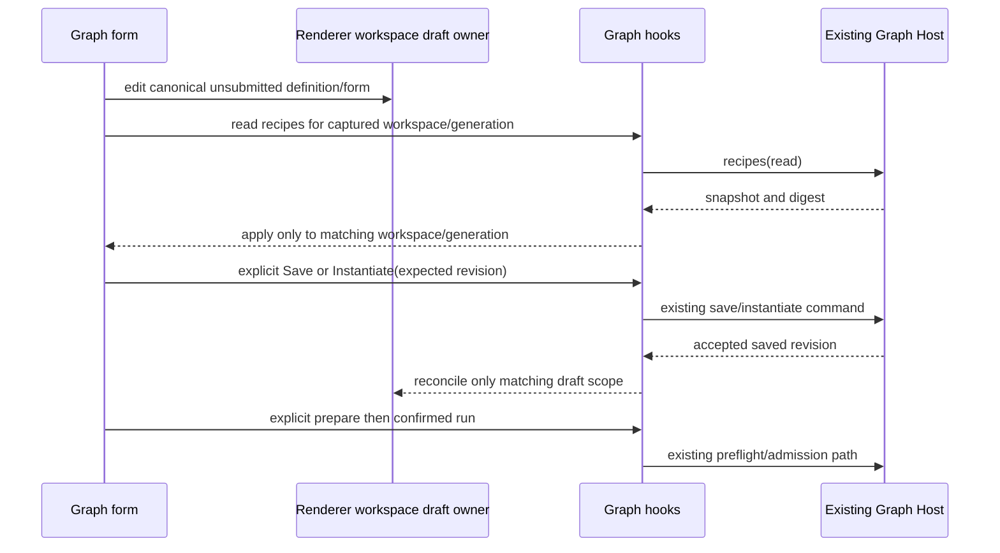

# U0 Graph UI audit

Date: 27 September 2026. Scope: source investigation of Graph journeys, renderer draft ownership, recipe states, Guided/Advanced seams, native interaction navigation, and file/skill APIs. This is a read-only product-code audit; no runtime reproduction, UI benchmark, native acceptance, or screenshot was produced by this lane. The current user assignment authorizes U0–U6 and supersedes the planning pack's historical phase-only stop instructions.

## Evidence and preservation

- Read the root `AGENTS.md`, `DESIGN.md`, architecture skill, Graph service contract/public facades, pre-Z8 planning pack/handoff, relevant UI helpers/tests, and native setup/interaction boundaries before conclusions.
- The observed working tree initially contained the preexisting modified `README.md`, untracked `LLM_USER_GUIDE.md`, and untracked pre-Z8 pack. No product code was modified by this lane. Preserve all of them.
- Root reported a fresh `architecture:check --changed` pass before delegation. The direct architecture context wrapper for `ui` ran successfully; `ui` is currently unmanaged, with no separate module manifest. Cross-package dependencies must still use public contracts and hooks.
- Environment incident: plain `pnpm architecture:context ui` resolved bundled pnpm 11.19.0/Node 24.19.0, attempted dependency verification/install, and failed with `ERR_PNPM_ABORTED_REMOVE_MODULES_DIR_NO_TTY` before module purge. No install retry or CI override was attempted. Plain `node` was 24.11.1; `mise.toml` requires 24.14.0 and pnpm 10.33.2. Use the coordinator-inspected `.tmp/z1-env.ps1` and local `node_modules/.bin` PATH for subsequent tool commands. Coordinator subsequently reported pinned-toolchain typecheck PASS; do not report this lane as having independently rerun it.
- Plain freshness failed on read-only `.git/FETCH_HEAD`. Coordinator subsequently reported approved normal freshness PASS against current origin. This incident is an environment boundary, not a product regression.
- `rg` launcher was unavailable in this shell; bounded `git grep` and PowerShell reads were used instead. Memory quick lookup returned no task-relevant entries; no memory-derived product facts are used here.

## Confirmed current journey

1. `GraphEngineeringPanel.tsx` owns a local sequential/parallel toggle and displays the actual workspace path. It renders the sequential editor keyed by `workspaceIdentity?.trim() || workspacePath`. Graph currently rejects remote/identity targets through `isLocalGraphTarget`; retain that support boundary.
2. `GraphEditor.tsx` stores `{base, draft}` in component state, derives readiness through `useGraphReadiness`, and keeps selection only in `graphEngineeringViewStore`. Design/Runs are the two current destinations. Library is a Design-only dialog; Project recipes is a Design-only expandable section.
3. `GraphLibrary.tsx` opens through `useGraphWorkflow.read()`, selects an entry, clears the selected version, and requires the user to choose a version. Version choices expose digests. Duplicate name/archive controls precede the instantiation form. A new template version never automatically changes an existing saved graph pin.
4. `GraphTemplateBindings.tsx` owns parameter/binding state locally, keyed by entry/version from its parent. Request is an ordinary text input. References require a raw relative path or skill ID. Tool slots display every loaded recipe and an `Unresolved bindings` placeholder. A separate Load existing project recipes button populates the choices.
5. `graphWorkflowView.ts::templateBindingErrors` checks required/typed parameters, required references, nonempty recipe bindings, and repair source paths. It does not classify recipe kind or installed-tool readiness. Current UI choices do not prove backend compatibility acceptance.
6. `IGraphWorkflowService.instantiate` saves through the existing graph owner with `expectedRevision`; the UI only replaces its draft after a successful result. The current dirty replacement control is a checkbox, not Save/Discard/Cancel.
7. `GraphProjectRecipes.tsx` separately requires Load, edits raw JSON, and saves with `expectedDigest`. It retains the typed JSON on a failed save. A recipe snapshot is not execution evidence.
8. `GraphEditor` invokes `prepareRunConfirmation` for v5. `graphSubmission.ts` and its tests preserve the saved revision, frozen native settings, preflight digest, and ambiguous-request identity; confirmed dispatch uses the same saved definition. Do not bypass this path while simplifying forms.

## Recipe-state findings

| Observed state | Current presentation / owner | Required improvement |
| --- | --- | --- |
| Never loaded | Hook `recipes === null`; empty choices plus unresolved placeholder | Explicit Not loaded followed by automatic read when the relevant panel opens |
| Read pending | Shared hook `pending`; no recipe-specific read state | Recipe Loading with stale-response ownership; do not label reads as saving |
| Loaded empty | Snapshot `recipes: []`; same choices as never loaded | None configured plus Set up build/test checks and return context |
| Read failed | Shared hook `error`; choices remain empty or retain a prior snapshot | Read failed plus Retry read; distinguish stale prior data |
| Wrong kind | Every recipe offered for every Tool slot | Filter/disable using a shared authoritative compatibility contract |
| Syntax valid, executable missing | No slot-level distinction | Separate static configuration validity from installed tool and calibration state |
| Changed configuration | Digest supplied on save; existing UI has no explicit stale slot state | Re-read/reselect and invalidate affected reviewed preflight |

`useGraphEngineering.readRecipes()` generation-checks `setRecipes`, but returns the old result to its caller even if the generation changed. Today the workspace switch unmounts the old editor, so source alone does not prove a cross-workspace transplant. Once drafts persist independently, also suppress stale returned values and capture the original workspace key at every async continuation. `useGraphWorkflow.invoke()` already returns `undefined` after its scope changes and is a useful local pattern.

Do not automatically retry a failed recipe read in a render/effect loop. Autoload once for Not loaded; make error retry explicit. Keep the last successful digest and editable form separate from read status so failed refresh/save cannot erase user edits.

## Draft ownership and migration hazards

| State | Current owner | Risk / preservation rule |
| --- | --- | --- |
| Saved definition, recipe file, library versions, runs | Existing Host services/persistence | Remain authoritative; preserve revision/digest conflict checks |
| Unsubmitted definition | `GraphEditor` component `useState` | Lost when Graph unmounts for Chat, parallel mode, or workspace change |
| Template parameters and bindings | `GraphTemplateBindings` component `useState` | Lost on template/version selection and dialog content unmount |
| Recipe JSON/digest draft | `GraphProjectRecipes` component `useState` | Lost when leaving Design or the whole panel |
| Graph selection | `graphEngineeringViewStore` keyed by workspace identity/path | Already renderer-only; extend or add a store in this same directory |
| Confirmation/ambiguous submission and decision intent | Existing hook refs and submission helpers | Do not confuse retained drafts with accepted work; preserve idempotent reconciliation |

`reconcileGraphDraft` correctly adopts an incoming revision only when the draft is unchanged or matches the incoming definition; otherwise it leaves a conflict. Preserve this exact behavior in retained storage. Do not silently rebase a dirty draft. Template creation success may replace that workspace's draft; cancel, rejected mutation, failed save, and stale replies must not.

Recommended renderer owner: a workspace-keyed draft store under `packages/ui/src/store/`, holding canonical definition base/draft and form drafts keyed by immutable template ID/version. It stores no sessions, accepted queues, scheduler cursor, authoritative readiness, or evidence. Keep Host history out of this store. A draft may remain in memory across ordinary navigation; persistence across application restart is a separate explicit design choice and should not silently copy private task text into new storage.



## Smallest U1 integration plan

Coordinator decision received during this audit: add built-in ID `agent-assisted`, v5 Analyze → Implement → Review → final gate → End, no Tool recipes, explicit agent-led verification wording. Keep existing `generic`, `bugfix`, and `slot` versions unchanged. Root owns its contracts/template registration; UI lane consumes them.

1. Spec first: document one renderer draft owner, four destinations, recipe-read state, latest-compatible immutable version default, dirty replacement choices, and zero-execution read/setup boundary.
2. Extend the renderer store/hook before moving panels. Retain graph and per-template form drafts by workspace key. Add recipe-specific Not loaded/Loading/Ready/Error state and late-result protection; retain shared action serialization for mutations.
3. `GraphEngineeringPanel` + `GraphEditor`: persistent header with actual workspace, current workflow, saved/unsaved/conflict state; Workflows / Design / Runs / Project setup. Keep canonical editor owner stable across these views or use the store before conditional unmounts.
4. `GraphLibrary`: intent-first entry choice; default a new selection to the latest supported non-archived version while keeping an explicit version detail control. Put Duplicate/archive/version management under a separate management area. Use the new agent-assisted template by name, never silently replace a selected verified template.
5. `GraphTemplateBindings`: request first; clear verification policy; optional context under expansion; autoload checks only when Tool slots require them. Missing checks navigate to Project setup with retained template draft. Required-field links point to actual controls. Do not require a raw node ID in a common correction.
6. Replace the dirty checkbox with a concrete Save/Discard/Cancel dialog. Save must succeed before instantiate; Discard replaces only after successful instantiate; Cancel preserves both the design draft and template form. Failed instantiate must leave the original dirty design available.
7. Keep readiness as a projection of Host validation plus local navigation metadata. A blocked Run should state the cause (busy/read-only/conflict/unresolved existing run/model/settings/definition), with a real corrective link where available. Do not reinterpret raw errors as proof of readiness.
8. Update English and Chinese locale strings together; retain `text-ui-*`, semantic colors, keyboard focus, and the existing responsive stacked inspector.

Wireframe, proposed common route:

```text
Graph  | Actual workspace path | Workflow name | Saved / Unsaved / Conflict
Workflows       Design        Runs        Project setup       Advanced experimental parallel

Workflows: New workflow / Use saved workflow
  Agent-assisted task     Verification: agent-led, configured test evidence not included
  Task [multiline request]
  Context [expand]
  Preview: Analyze -> Implement -> Review -> Final approval
  Create workflow

Verified engineering:
  Build check [Loading / selected compatible check]
  Test check  [None configured: Set up build/test checks]
  Return from setup retains this request and selected template version.
```

## U3 seams: one canonical definition

- `GraphNodeInspector.tsx` currently exposes native aliases, literal/bound mode, raw output schema, and source selectors. There is no Guided/Advanced switch. Add a pure capability/projection helper; Guided edits update existing fields in the canonical object by stable node ID rather than regenerating the graph.
- Preserve supported advanced declarations (`routing`, selectors/pointers, custom schemas, native overrides, explicit literal/bound semantics). If the simplified form cannot represent them, Guided is read-only with the specific reason and Advanced link. Do not strip them during a view toggle.
- `GraphBindingSource.tsx` currently offers all task/producers, including future/self sources; Host readiness handles invalid selections. Guided options should be bounded to valid predecessor output types/routes and create existing `GraphInputBinding` values. Context chips are labels over these exact bindings, not a second context engine.
- Before-run prompt preview should show literal text plus visibly unresolved placeholders. After run, use `GraphNodeAttempt.resolvedInstructions`, `bindings`, and captured final output, as `GraphRunInspector` already does. Never substitute later Chat text or recursively expand output.
- Existing `GraphCanvas.tsx` already has Fit view controls, reconnect, keyboard-focusable nodes, and `deleteKeyCode={null}`. `GraphNodeNavigation.tsx` already provides a keyboard button alternative. Preserve these rather than rebuilding them.
- `graphEditing.ts::appendGraphNode` inserts before the single edge into End, not arbitrary selected-edge insertion. `removeGraphTask` removes only incident edges and deliberately retains missing references for correction; its test asserts this. Add dependency preview/confirmation without silently rewriting bindings/End. Implement insert-between as an explicit stable-edge edit.
- `GraphConditionEditor` is currently raw JSON for inputs/branches/verification. `GraphRoutingEditor` exposes raw milliseconds/admission counts and repair IDs. Add typed presets only for existing supported declarations. Display initial attempt plus repair count and minutes; validate compiled budgets with Host constraints. Unknown/invalid evidence remains `needs-human`, never ordinary false/default routing.

### File and skill API boundary

- File picker/save: `usePlatform()` returns `IPlatformService.selectFile`, optional `selectFiles`, `canSelectFilePath`, and optional `saveFile`. `saveFile` accepts an `ArrayBuffer` with `suggestedName`, returns success/canceled/error/path. Never call `window.zcode` directly.
- File metadata/content: public `IFileService.searchWorkspaceFiles`, `stat`, `readTextFile` via a workspace-resolved hook. Keep file imports bounded; a selected path is not permission to recurse into its parent. Existing `useReaddir` lacks the Graph-specific generation semantics, so do not adopt it as a draft owner.
- **Important cold-runtime hazard:** `useSkills` calls `zcodeAgentService.getSkillReferenceCatalog`. The implementation at `zcodeAgentService.ts` around line 4004 calls `getReadOnlyClient(params)`; that helper around line 3112 defaults to `start-if-needed`. Merely mounting this hook can start a runtime. Its read-only name does not satisfy Graph's stricter no-start preview contract.
- `Z6_NATIVE_SPEC.md` and `previewExecutionEnvironment` already provide existing-only native metadata discovery (including discovered instructions/skills) with no runtime initialization, installation, MCP connection, migration, or executable probe. For Graph selection, either derive choices from this sanctioned metadata with verified stable-ID mapping, or introduce a coordinator-owned existing-only catalog option with cold-start tests. Do not blindly reuse the ordinary composer hook.
- Compare selected guidance against native-discovered instructions/skills before adding explicit context; show duplicates/missing entries. No automatic enable/install or new service connection.

## U4 seams: status, action, and recovery

- `GraphRunPanel` presents one run status; `GraphToolInspector` has useful separate process/report/acceptance facts, but there is no consolidated three-axis summary. Derive Execution / Evidence / Human decision separately from captured run/attempt facts. Completed agent-only work must show test evidence not configured; graph approval does not manufacture Verified status.
- Run inspector already displays captured inputs, resolved prompt, bindings, final output, terminal proof, artifacts, and frozen provenance. Keep those objects immutable. A new changes/evidence summary should point to these existing artifacts and source snapshots rather than rereading arbitrary current files as past evidence.
- `GraphToolInspector` and task `GraphRunInspector` pass `run.target.workspacePath`, exact persisted session ID, and workspace identity to `onOpenConversation`. `WorkspaceShellLayout.handleSelectTaskInChat` activates the correct target, selects the existing workbench session, and switches to Chat; this handler contains no create/submit operation.
- `SessionPane` renders `V4InteractionDialogs` for the selected native snapshot, even while Graph owns ordinary input. `V4InteractionDialogs` selects the actual pending permission/userInput interaction and sends the existing `resolveInteraction` command. Graph approval separately uses `decideApproval` with exact gate request/version/digest. Preserve these three response paths.
- A persistent Graph action area can find the current waiting native attempt from the run, name the step/session and link to its conversation; a graph gate action should select the actual pending gate. It must not depend on which unrelated historical node the user selected in the inspector. Do not embed duplicate permission controls or send a new agent input.
- The reported Build approval problem remains **NOT REPRODUCED**. Current source supports a discoverability hypothesis; it does not prove permission transport failure or a working workaround for that user's installed state.
- `CancelRequested` already differs from `Cancelled`; `GraphRecovery` requires explicit inspection and `graphRunCanRelease` only permits interrupted/unknown/stop-requested records with confirmed inactivity. Retain audit reason/confirmation and no replay. A cause-specific explanation can wrap these controls without inventing Retry.
- `GraphRunHistory` currently renders every run button; output sections use scroll clipping but still mount complete text. Add bounded/page/virtualized display for a declared 500-summary fixture while preserving canonical artifacts and selected-run access. No timing target is established by this source audit.

```mermaid
sequenceDiagram
  participant Graph as Graph action area
  participant Nav as Existing workbench navigation
  participant Pane as Existing SessionPane
  participant Native as Native interaction owner
  Graph->>Nav: captured workspace identity/path + session ID
  Nav->>Pane: select existing session; show Chat
  Native-->>Pane: authoritative pending interaction snapshot
  Pane->>Native: explicit permission/question response
  Note over Graph,Native: navigation creates no session and submits no agent input
```

## U5 seams: transfer and scope

- `GraphTemplateTransfer.tsx` already has preview/import/capture/export-review semantics and invalidates review after JSON/name/description edits. It currently exposes JSON text, not native import/save dialogs.
- Put reviewed file transfer around that existing service path. Import reads bounded selected content into a preview; only reviewed successful library mutation accepts it. Cancel/read/validation errors preserve both current design and transfer draft. Export writes only the explicitly reviewed service-produced JSON through `platform.saveFile`; arbitrary local JSON is not a reviewed export.
- Make omitted local settings, references/check bindings, credentials/history, and parallel plans explicit. Existing secret/private-path negative preview fixtures must remain effective; scanning is not a proof that arbitrary task prose contains no secrets.
- Choose sequential supported / parallel experimental, as the plan recommends. Existing top-level parallel toggle is easily discoverable and lacks an explicit experimental boundary in the inspected component. Move it to Advanced/experimental presentation and retain local plans, clone ownership, max-two-worker semantics, integration location, retrieval and retention warnings. Z7-A12 remains a recorded portability failure, not “fixed” by hiding export.

## Verification plan and exact next actions

No tests were executed by this audit lane. Existing test source was inspected; historical logs are not current passes.

1. Unit projections: extend `packages/ui/test/graphWorkflowView.test.ts`, `graphEngineeringView.test.ts`, `graphEditing.test.ts`, `graphWorkflowSubmission.test.ts`, and approval/routing tests. Cover exact snapshot pinning, recipe read-state transitions, A→B late responses, template-version form retention, cancellation of replacement, failed save/instantiate, advanced-field identity preservation, predecessor-only chips, unresolved preview, no implicit routes, and three independent status axes.
2. Hook/store behavior needs explicit tests, not only copied implementation assertions: begin a delayed A read, switch to B, resolve A, and prove no B form/snapshot mutation. Save conflict/ACK uncertainty must preserve existing request identity and draft values.
3. Native E2E starting seam: `scripts/graph-engineering/z6-native-library.mjs`, `z6-native-ui.mjs`, `z4-native-presentation.mjs`, `z5-native-observe.mjs`, and `z2-native-helpers.mjs`. `isolation.mjs` creates a synthetic workspace/private home/appdata, local controlled provider endpoint, and separate Git boundary; automated mode does not copy installed credentials. Inspect modifications before execution and serialize native builds with root.
4. Extend actual native journeys: no-recipe create→preflight→Analyze/Implement/Review→gate; recipe never-loaded/loading/empty/read-failed/incompatible; setup-and-return with sentinel task; dirty Save/Discard/Cancel; same-session permission/question navigation with before/after ledger counts; cancelled transfer and malformed import; Advanced round trip; keyboard Delete inside inputs; 1280×720 and 1920×1080 in both themes.
5. Use captured run/session/input IDs plus ledger counts as proof of zero additional work. A screenshot alone cannot prove session continuity or no execution. Record screenshots and JSON identity evidence together.
6. U6 prepared manual pilot remains NOT RUN until three unfamiliar operators perform the planned tasks and record timings/help/errors. Physical scaling/mobile/remote/installed-app behavior and a user's live company project remain NOT RUN absent separate actual evidence/authorization.

Coordinator next action: author the U1 spec and shared template/readiness decisions, then dispatch the disjoint UI implementation lane described above. This audit does not block progression or authorize changing native execution semantics.
