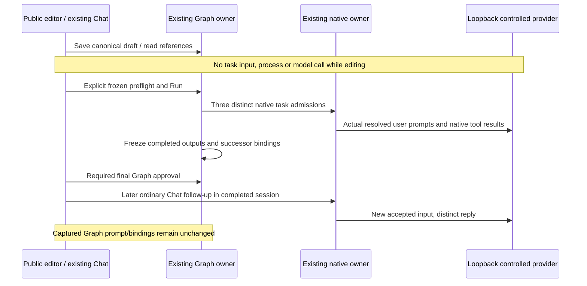

# U3 isolated editor and captured-input acceptance

Specification precedes the `pre-z8-u3-*` driver. Status: both isolated U3 native scenarios **PASS** on the same verified identity-fix build; actual evidence is indexed below. `U3_EDITOR_SPEC.md` and the U3 backlog remain authoritative. The existing renderer draft store, Host revision/lease owner, native input ledger and immutable attempt evidence retain their ownership; the harness never writes Graph records or injects RPC/evidence.

## Two isolated journeys

Use fresh automated `createIsolation()` profiles below this checkout's `.tmp`, reject inherited installed executable overrides and reuse only the loopback synthetic provider, private configuration and guarded synthetic source fixture. No installed credentials, paid/live providers, company projects, dependency installs or product builds. Fixture-only baseline Git operations never target the development checkout. Preserve receipts and previous profiles on every failure.

The **editor** journey may seed valid static Build/Test recipe configuration in its own workspace solely to instantiate the existing bounded-repair template with two explicit Test scopes. It executes no recipe or model. Native metadata initialization uses public empty Chat without submission. Cover:

1. Guided/Advanced navigation preserves the canonical saved definition, IDs, edges, settings, template pins, references and local Test-to-Build mappings. Custom text remains exact, including repeated/unsupported tokens that become explicitly Advanced-only. Unapplied malformed output-schema and condition JSON buffers survive mode, node and workspace changes without becoming canonical execution data.
2. Context candidates expose their actual source mapping. An existing source selection is idempotent; disabled future/non-dominating selections remain explained. Draft prompt preview distinguishes resolved Start text from future output and never fabricates attempt or artifact evidence.
3. The reference catalog is an explicit existing-only read. Native `AGENTS.md` selection is distinguished by exact path/content from a different file with identical content. Missing/disabled skills are visible; nothing installs or submits. Search and selected-path validation are real service calls. Cancel, invalid/missing/outside-root selection and a late selection response preserve the prior binding. The coordinator's service tests separately own empty/oversized/invalid-UTF8/junction and native-metadata mismatch negatives.
4. The coordinator authorized a narrowly scoped Electron `dialog.showOpenDialog` response seam inside the owned harness, restored in `finally`. It supplies only cancellation or paths within the owned profile and can hold one response to exercise stale workspace/template selection. Label this as controlled platform/UI wiring proof, never actual OS-dialog interaction. No private React/store/service calls or RPC interception are allowed.
5. Keyboard Delete inside instructions edits text only; Start/End cannot be removed. Inserting on a selected Condition edge preserves its `sourcePort` and the remaining branches. Deletion previews affected edges/bindings/gate/repair/End references; Cancel preserves everything. Confirm leaves unresolved semantic references visible instead of choosing replacement evidence or End output. Explicit End/reconnect actions use existing controls.
6. The existing repair preset retains its final gate and both selected Tests. Show one initial attempt, two additional repairs, thirty minutes and twenty-four admissions. Valid edits preserve unrelated declarations; reject additional repairs outside 0–5, deadlines over twenty-four hours and admissions over sixty-four. Shared domain tests own exclusive-route budget and unsafe evidence/unknown-state routing semantics; UI screenshots do not substitute for them.

The **native handoff** journey uses the existing agent-assisted Analyze/Implement/Review/final-gate flow with real native Read, question and Edit operations. The fixture modifies only `fixture.mjs`; independent `fixture.test.mjs` remains unchanged and is not executed. Cover:

1. Remove and rebuild a predecessor binding through actual Advanced/Guided controls, preserving custom prompt text. Assert the saved binding source and alias match the selected candidate, then inspect unresolved draft preview before admission.
2. Include literal brace text in Start and in the controlled actual Analyze output. Captured bindings, native input ledger payloads and observed provider user prompts must include each selected predecessor output exactly once; inserted brace text is not recursively interpreted.
3. Explicitly select already-native `AGENTS.md` with `native-aware-v1`. Frozen provenance records `native-instructions`; the prompt suffix must not request a duplicate native Read of that guidance. Observe actual tool requests and results; metadata/reference reads alone submit nothing.
4. Require ordinary native question/permission responses on the exact existing session/input and the existing final Graph gate. Record actual source evidence, three native task admissions and frozen preflight/prompt/binding identities.
5. After the run completes, submit one explicitly authorized synthetic ordinary Chat follow-up in the existing Analyze session. Return a distinct controlled reply and prove the native ledger contains that new input while Graph's captured attempt instructions, bindings, predecessor outputs, provenance and prior run record remain byte-equivalent. Reopen the captured input inspector and verify it shows the original resolved prompt, not the later Chat input/output.

## Tests and durable evidence

Write fixture guards and controlled-response assertions before their implementation. Test refusal to reuse/escape a profile, preservation of unexpected source, exact brace/handoff values and refusal of duplicate/missing predecessor evidence. These are driver tests, separately labelled from product domain/service checks and actual native UI execution.

Record actual build hashes, owned profile and commands, zero-work checkpoints, native session/input identities, captured definition/provenance/prompt/bindings, permission/question and final-gate evidence, later Chat identity, screenshots, failures and exact next actions. Preserve selected copies with SHA-256 manifests under `docs/graph-engineering/evidence/pre-z8/u3/`; retain compact receipts instead of a separate phase report. Capture actual 1280×720 and 1920×1080 viewports without claiming OS scaling coverage.

Driver preparation: twelve `pre-z8-u3-*.mjs` files pass syntax, formatting and focused lint (zero warnings/errors). Seven fixture/provider/dialog guard tests pass; original RED receipts for the missing fixture implementation and dialog guard precede these changes. These driver checks are separate from actual Electron acceptance. The coordinator has supplied the serialized U3 build signal; the next actions are fresh `--scenario=editor`, then `--scenario=handoff` runs, preserving any first failure before repair/retry. Actual OS dialog operation, novice/human/live-provider/company-project pilot, wider platform qualification and Z8 remain **NOT RUN**.

Initial editor attempts are preserved: `.tmp/z1-native-1790458687455-649d59` stopped on a driver-only ENOENT assumption before a design had ever been saved; `.tmp/z1-native-1790458812927-3b6ef2` stopped on a driver assertion made while native reference validation still displayed Reading. Both admitted zero model inputs/requests. Corrections preserve an absent record through read-only actions and wait for the actual ready/selected-path projection. The coordinator independently found a search/picker generation loading race and is rebuilding that narrow UI fix; no handoff native input has been admitted while awaiting that final build.

Editor attempt 3 (`.tmp/z1-native-1790459046667-8e097b`) ran the rebuilt reference-search fix and passed the actual reference/cancel/stale-selection, context mapping/draft-preview, unsupported-text/mode and keyboard checks with zero native work. It then found a product defect: after malformed buffers, mode/node/workspace navigation rendered the Condition editor twice in one inspector. The strict unique locator failed; the captured body repeats the full Condition form. Source review found `GraphConditionEditor` and `GraphDeleteNode` sharing `key={node.id}` as siblings (and the Guided Task key uses the same value). The UI owner/coordinator owns the fix; the harness retains its exact-one assertion. This attempt is not an editor PASS and remaining repair/canvas checks are still pending. Its owned native process is closed before rebuild.

Final evidence: editor attempt 5 (`.tmp/z1-native-1790459301475-ba9db1`) passes the complete editor/reference/buffer/repair/canvas journey with zero native Agent inputs or model requests and unchanged synthetic source, test and configuration bytes. Exact-one controls prove the duplicate-key repair in the actual app. Attempt 4 had already passed that repair but stopped on a driver-only unescaped JSON edge selector; its failure is retained. Handoff attempt 1 (`.tmp/z1-native-1790459341004-247972`, run `4909f6be-f89d-4421-af93-f8290e314935`) passes with three Graph native inputs, one authorized later ordinary Chat input, twelve controlled model requests and five native Read/question/Edit tool calls. Captured source bindings and native guidance match exactly, no duplicate guidance Read occurs, final approval is required, and the complete captured Graph run remains byte-equivalent after later Chat. No paid/live provider or test command ran. Both apps are closed.

Durable receipts: `docs/graph-engineering/evidence/pre-z8/u3/native-matrix.json` distinguishes all six attempts; `manifest.json` covers fifty files (2,801,144 bytes), including both final summaries, twenty-one final screenshots, failure receipts/screenshots, observed provider messages and three retained output artifacts whose descriptor/content byte counts and SHA-256 values were independently checked. The final two scenarios have identical recorded CLI/Main/Host/renderer hashes. Seven driver guard tests pass separately. Technical preview captures are retained; a clearer common Guided screenshot with technical details collapsed is scheduled for the next authorized U4 fixture or final U6, without repeating completed native operations solely for a screenshot.

The coordinator also assigned navigation-only maintenance of `z4-native-editor.mjs`, `z5-native-editor.mjs`, `z6-native-ui.mjs` and `z6-native-library.mjs`: explicitly open Advanced before legacy raw editors, open parent disclosures before raw recipe/reference fields, and confirm the new deletion impact dialog while proving Cancel preserves the node. Keep every existing semantic assertion. Those older native regressions remain **NOT RUN** until the coordinator's combined-suite signal.
