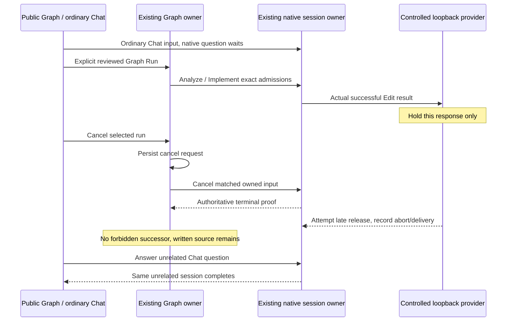

# U4 isolated run-understanding and cancellation acceptance

Specification precedes the `pre-z8-u4-*` fixture and driver. Status: U4 native cancellation is in repair. The first native cancellation attempt failed before Graph Run because the driver returned from the independent companion to the Runs view and then waited for the Design-only Run control; see `docs/graph-engineering/pre-z8/glm-handoff/evidence/u4-cancel-attempt-1/pre-z8-u4-summary.json` and `pre-z8-u4-failure.png`. TASK_001 repairs that return-to-Design boundary; the remaining U4 native journeys stay **NOT RUN** until their own passes. `U4_RUN_SPEC.md` and U4-01 through U4-08 remain authoritative. All U3 evidence is immutable in its durable manifest.

Use the existing guarded fresh automated profile, synthetic source fixture, private configuration and loopback controlled provider. The native runtime remains the sole session/input/tool/terminal owner; the Graph service owns cancellation, admission, approval and recovery. The harness performs public UI actions and read-only ledger/record observations. It does not inject RPC results, mutate a Graph run, create a second Host, weaken sandbox/approval controls, or access installed credentials/projects. Only the existing fixture source baseline Git preparation is allowed; no development-checkout staging or commits.

## Genuine cancellation after an edit

1. Prepare an agent-assisted workflow using the already proven public U3 reference/context path. All design/reference reads have zero native input before an explicit ordinary Chat or Graph Run action. Capture readable Guided controls at 1280×720 and 1920×1080, with technical preview details collapsed; retain the older technical captures.
2. Start one separate ordinary Chat in this owned workspace. The controlled provider requests a real native question, which remains unanswered. Capture its exact session/input and confirm it has no source-edit or command authority.
3. Explicitly prepare and acknowledge the Graph run. The independent companion returns through the shared `showGraph` helper, which deliberately selects **Runs**; the Run control is rendered only under **Design**. The driver must therefore explicitly select `graph-view-design` after the companion detour and wait for the public Run control before clicking it — never a forced click, hidden DOM invocation or direct state mutation. Around this boundary the prepared definition/revision, request/reference selection, source/test/config bytes, the one-entry companion ledger and the model-request count must remain unchanged, with no new native input or provider request; selecting a view is read-only and never an admission. Analyze performs its real Read; Implement performs its real Read, question and Edit through the unchanged native permission path. The new persistent run action must navigate to those exact sessions/inputs without adding another input or answering through a second channel.
4. Hold only the controlled provider's response after the exact successful native Edit result has arrived. Independently verify the actual source is `AFTER_SOURCE` and the test file is byte-identical. This hold is provider behavior in the isolated fixture, never a product/runtime synchronization barrier.
5. Observe the real persisted run and UI transitions while clicking the existing public cancellation action. Require the durable cancel request to precede authoritative terminal proof for the same run/session/input. Record Stop requested UI only if actually observed; the coordinator's deterministic projection tests separately verify that wording. Native fetch abort may make this transient too brief for a screenshot, which is not an invented observation or a terminal failure.
6. Attempt to release the held provider reply after cancellation. Record whether the response connection was already aborted or a reply was actually sent. Require the run to remain cancelled, no Review/final-gate/successor admission, unchanged cancelled input identity, and unchanged already-written source/test bytes. Service race tests separately own a truly delivered late native terminal event; a closed provider response must not be labelled as one.
7. Navigate to the still-unanswered ordinary Chat, prove it remains the same waiting input/session, explicitly answer its question, and observe its actual completion. Graph history and cancellation remain unchanged. No global stop or unrelated-session mutation is permitted.

## Identity correlation between Graph attempts and native ledger rows

The Graph record and the native `session_input` ledger use **separate identity namespaces** by design. They are correlated, never string-equal.

- `attempt.commandId` (bare UUID, `run-plan.ts:53`) identifies the submitted native command.
- `attempt.inputId` intentionally equals `commandId` (bare UUID, `run-plan.ts:58`).
- `session_input.id` is a separate queue-row identity `queue_<commandId>` (`command-inbox.ts:75-77`), stored by `session-inputs.ts:49`.
- `payload.intent.sourceCommandId` (bare UUID) identifies the original command and equals `attempt.commandId`.
- `session_id` identifies the owning native session and equals `attempt.sessionId`.

The proof must correlate a Graph attempt with exactly one native ledger entry using the exact owning session ID **and** the exact original source command ID, then independently validate the queue-row ID mapping `ledger.id === "queue_" + attempt.commandId`. It must not match by suffix, substring, or prefix removal, and must not accept a match when only one ownership attribute agrees. The queue-row ID mapping is defined locally in the proof to preserve layer boundaries; private runtime implementations are not imported into the harness layer.

## Presentation and evidence layers

Assert the new execution/evidence/human-decision axes against each actual captured record, including the no-test completed/approved U3-shaped flow and cancelled-after-edit flow. Summary request/result/workspace/changes are projections of the selected immutable run only. Required actions navigate existing permission/question/gate/recovery controls. Technical details retain exact captured instructions, bindings, IDs and artifacts.

Extend the genuine U2 proof helper with current-UI evidence-axis assertions after the UI contract is stable. A small serial current-build subset may cover command/probe, valid passing tests, genuine failed tests and invalid source association; the complete eight-scenario native matrix remains the combined U6 regression. Deterministic projection tests may replay actual U2 receipts without presenting that as new native execution. No old record is rewritten or injected into an authoritative run store to manufacture a UI result.

Existing service regression tests own stale/duplicate/concurrent decisions, recovery checkpoints/inactivity/release, true late terminal events, and immutable artifact validation. A separate pure 500-summary rendering/history test must never inject fake runs into the live service. Root owns the selected evidence-read hook race checks. Actual native artifact read failure, missing/corrupt file handling and restart selection can be added only with guarded owned-fixture mutation, exact finally restoration and byte receipts; do not weaken evidence acceptance or erase prior artifacts.

The coordinator authorized actual artifact read-error checks in the fresh U4 completed profile. A per-launch U4 nonce marker, canonical plain ancestors, exact local workspace/run/attempt/artifact ownership, stored descriptor equality, digest and byte length must all match before faulting a file. The harness temporarily renames one owned artifact for the missing case or changes only its retained content for a digest-mismatch case. It restores the exact original bytes and timestamps in `finally`, refuses an unexpected replacement instead of overwriting it, and writes a restoration receipt even if the UI assertion fails. Current-request read errors must be visible and stale previous content absent; the captured summary acceptance state, Graph record and native ledger remain unchanged. The restored artifact and export manifest are then read through the actual UI. Older U0–U3 evidence and unrelated profile files are never fault targets.

Write meaningful fixture response/ownership tests before implementation. Preserve actual commands, build hashes, all attempted profiles, cancelled/request/terminal identities, provider abort/release receipts, original/after source and test hashes, concurrent Chat proof, screenshots and exact next actions. Archive selected proof with a SHA-256 manifest. Human novice/live-provider/company-project pilot, actual OS picker operation, OS scaling and broader cross-platform/installer qualification remain **NOT RUN**.
