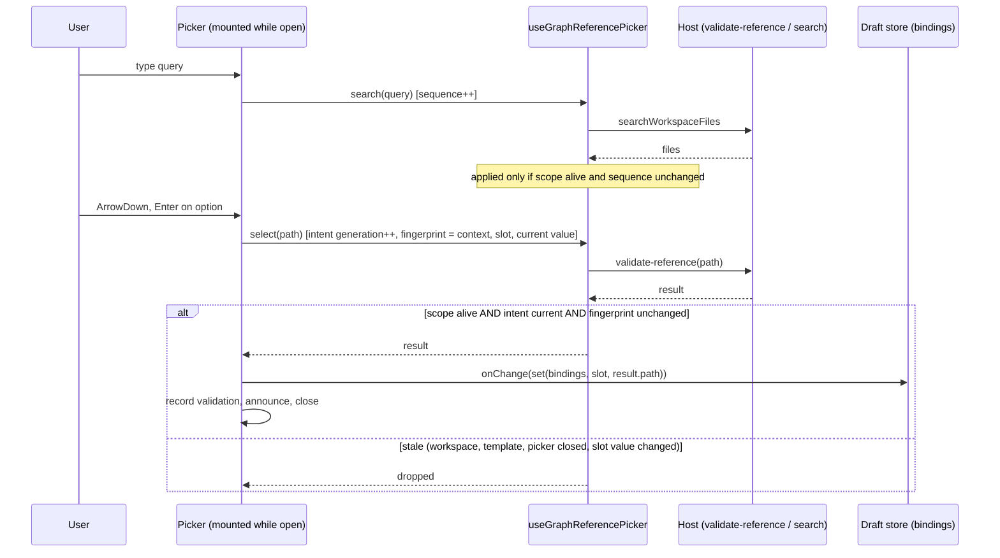

# Context picker specification

Status: **2026-09-30. Written before implementation (AGENTS.md: spec first); implemented in the Cloud on branch `claude/graph-context-picker`, based on the handoff tip `bd93022`.** Implements audit finding B2 and supersedes the per-role context form recorded in [IMPLEMENTATION_SPEC.md](IMPLEMENTATION_SPEC.md) section 8.2 (see its item 12). Windows native acceptance is **PENDING**; see section 13. Sections 1-10 are the specification as written; section 11 records where the build differs and what remains open.

## 1. Problem and outcome

In Runs → New run the Context section rendered, for every reference role of the workflow, a bordered form: selected value, node ids, query field, Search, Choose file…, result buttons, native instruction buttons, a status area and a nested `Advanced` field. Adding one file meant reading that wall for every role.

Outcome: a compact summary, one removable chip per selected reference, an **Add context** action that opens a searchable picker, and an accessible **Advanced** route to the existing raw fields. Nothing about what a selection _means_ changes.

Scope: **Runs → New run only** (`GraphTemplateBindings`). The Workflows destination's node inspector (`GraphNodeInspector`) still renders the per-role `GraphReferenceField` through `GraphReferenceBindings`; both are kept and unchanged.

## 2. Contract: what is reused and what does not change

Reused unchanged (no new catalogue, binding schema, service or permission system):

- `GraphTemplateBindings.references: Record<roleId, string>` and `referencePolicy?: "native-aware-v1"` (`workflow-provenance.ts`).
- Role declarations `template.references[]`: `{ id, label, kind: document | instruction | skill, required, nodeIds }`.
- `projectSetup({ action: "reference-catalog" })` and `projectSetup({ action: "validate-reference", path })` via `useGraphProjectSetup`; workspace file search via `useGraphReferencePicker` (`fileService.searchWorkspaceFiles`, `limit: 30`); the native file chooser `platform.selectFile()` when `canSelectFilePath`.
- Required-reference validation `templateBindingErrors` (which disables Review) and the Host's `instantiateTemplate` checks (required missing, undeclared key).
- The draft owner `useGraphDraftStore`, keyed by `(workspaceKey, templateKey)`.
- Reviewing, admission and preflight (`Review and run`, `activeRun` block, per-run acknowledgment).

## 3. Cardinality and replacement

The schema stores **one string per role**. Therefore:

- A role has at most one chip. The UI never offers "add another" for a role that is set; it offers **Replace**.
- Real roles today: generic and agent-assisted templates declare `instructions` (instruction, optional) and `skill` (skill, optional); the bugfix and slot templates declare `gameDoc` (document, **required**), `math` and `source` (document, optional). The picker is driven by the declared roles, not by these examples.
- In the picker the user first chooses the **slot** (a role). A slot that already holds a value states so and states that selecting a result **replaces** it. Replacement happens only on an explicit Enter or click on a result, and is announced.
- Which nodes receive a reference is `role.nodeIds`. It is shown as node names ("Used by Analyze, Implement"), never by editing `nodeIds`.

## 4. State owners

| State                                     | Single owner                                                                    | Others                                                                                                                         |
| ----------------------------------------- | ------------------------------------------------------------------------------- | ------------------------------------------------------------------------------------------------------------------------------ |
| Selected references (the payload)         | `useGraphDraftStore` (`bindings.references`)                                    | Section and picker send commands via `onChange`; they keep no second copy.                                                     |
| Skill / instruction catalogue             | `useGraphProjectSetup` lane `reference-catalog`, scoped to the workspace target | Read by the section and passed down.                                                                                           |
| File search results, in-flight validation | `useGraphReferencePicker` inside the **mounted** picker content                 | Unmounting the picker invalidates every pending read.                                                                          |
| Per-chip validation record                | Section component state `{ contextKey, byRole: { roleId: { path, result } } }`  | Used only for display, and only when `contextKey` and the exact value still match; otherwise the chip reads _Not checked yet_. |
| Open / preset slot / live message         | Section component state                                                         | UI-only. Reset when `contextKey` (workspace + template) changes.                                                               |

`contextKey` = `workspaceKey` + `templateKey`. Workspace identity uses the existing key (`workspaceIdentity?.trim() || workspacePath`) already supplied as `workspaceKey`.

## 5. Payload semantics (the part tests must pin)

| Action                              | Effect on `bindings`                                                                                                                                                                                                                                                                                     |
| ----------------------------------- | -------------------------------------------------------------------------------------------------------------------------------------------------------------------------------------------------------------------------------------------------------------------------------------------------------- |
| Select a file or instruction result | Validate (`validate-reference`), then `references[role] = result.path` (the Host's canonical, workspace-relative path), `referencePolicy = "native-aware-v1"` when the value changed (as today).                                                                                                         |
| Select a skill                      | `references[role] = skill.id`; only enabled skills with a digest are selectable; same policy rule. No Host call.                                                                                                                                                                                         |
| Replace                             | Same as select; the previous value is overwritten for that role only.                                                                                                                                                                                                                                    |
| Remove                              | The role's key is **deleted**. `referencePolicy` and every other field (`recipes`, `recipeGroups`, `buildMappings`, `sourcePaths`, other roles) are untouched. A removed required role is missing again, so `templateBindingErrors` lists it and Review stays disabled; the role is never made optional. |
| Advanced raw edit                   | As today: `references[role] = text`, no policy change. An empty or whitespace-only value deletes the key (a cleared field and an unset role produce the same payload).                                                                                                                                   |
| Cancel, Escape, failed validation   | No change to `bindings`.                                                                                                                                                                                                                                                                                 |

A binding key that no declared role owns (possible from an older seed) is shown as an **orphan chip** marked "not accepted by this workflow version" with a Remove action. It is never silently dropped, and the Host still rejects it as before.

## 6. What a chip may claim

- Delivery is shown **only** from the Host's `validate-reference` result: `native-instructions` → "Already delivered as native instructions"; `explicit-read` → "Explicit read reference". The Host's own `issues` (for example "Native instruction delivery is Unknown…") are shown verbatim beside it.
- A value with no validation record for this exact value (restored draft, _Run again_ seed, Advanced entry) reads **Not checked yet**. It is checked when the run is reviewed.
- Nothing is ever labelled "inherited". AGENTS.md is a chip only if the user selected it.
- Skills: `enabled && digest` → available; `!enabled || !digest` → "Disabled or unverifiable"; loaded catalogue without that id → "Unknown"; catalogue not loaded or unavailable → "Skill list not loaded". Identity is shown as `name` plus `id · scope` when known, otherwise the raw id.
- Stored ids, paths, node instructions and reference content are displayed exactly as stored; only UI-owned labels are localized.

## 7. Picker behaviour

Opening: the **Add context** button, a chip's **Replace**, or a required slot's **Choose…** (preset slot). A popover anchored at the button; focus moves to the search field.

Sources by slot kind: `document` → workspace file search; `instruction` → native instruction entries from the catalogue (filtered by the query) then file search; `skill` → catalogue skills filtered by the query. Opening the picker reads the catalogue once if not loaded (the same read-only `previewExecutionEnvironment` that every `validate-reference` already performs; no model, no process, no run).

Keyboard (ARIA combobox + listbox): typing searches (debounced); ArrowDown/ArrowUp move the active option (wrapping) and **nothing is active initially**; Home/End stay with the text field so the caret keeps working; **Enter selects only an active, enabled option** (Enter with no active option does nothing) and never submits or starts the workflow (`preventDefault`); Escape closes and returns focus to the control that opened the picker (or Add context if it no longer exists); Tab leaves the results naturally.

States that must be visible and honest: loading (`Reading…`), no results, catalogue unavailable/unknown (with the Host's unknown reasons), search error, invalid path or over-size file (Host validation error shown beside the slot and results, the previous value kept), disabled or unverifiable skills (listed, not selectable, reason shown), search unsupported for this workspace.

Required slots that are empty stay visible outside the picker with their error text next to them.

## 8. Event order and stale results

| Late reply after…                      | Rule that drops it                                                                                |
| -------------------------------------- | ------------------------------------------------------------------------------------------------- |
| switching workspace                    | the hook scope is keyed by service, platform and workspace; `useGraphProjectSetup` scope likewise |
| changing template                      | the picker is remounted (`key=contextKey`) and closed; fingerprint includes `contextKey`          |
| closing the picker                     | unmount runs `invalidateGraphReferenceReads(scope)`                                               |
| removing or replacing the slot's value | the fingerprint includes that slot's current value, so the older intent is no longer current      |
| a newer search                         | search sequence                                                                                   |

Desktop (`desktop-continuous`) and phone remote (`web-remote-replayable`) semantics are unaffected: this feature reads workspace files through the same services and holds only renderer draft state. Graph is local-workspace only today.

## 9. Failure and non-goals

- No execution: opening, searching and selecting may call only `reference-catalog`, `validate-reference` and `searchWorkspaceFiles`; never `run`, `instantiate`, `prepare`, project commands, skill installation or any permission response. Tests record every call and assert this.
- Not changed: native permissions, approval, evidence validation, reviewer parsing, historical workflow versions, `templateBindingErrors`, admission, the raw Advanced field ids.
- Not built: multiple references per role, a new catalogue, recent-file suggestions, drag and drop, previewing file content.

## 10. Acceptance scenarios and how each is verified

Verification classes: **M** pure model (node:test), **R** round-trip against the real Host `instantiateTemplate` (node:test in `scripts/graph-engineering`), **B** real components and hooks in real Chromium via a Vite-built harness. In **B** the Host, file service and platform are **fixtures**; that boundary is labelled in the harness and in the report. **W** Windows native acceptance, PENDING.

1. Add a file by typing and Enter; chip appears; payload has the canonical path and policy. M, R, B.
2. Skill selected from the catalogue; disabled skill listed but not selectable. M, B.
3. Slot already set: notice says replace; Enter replaces that role only. M, B.
4. Remove an optional reference: key deleted, other fields identical. M, R, B.
5. Remove a required reference: placeholder with error, Review disabled, not optional. M, B.
6. Escape closes and restores focus; Enter never triggers Review or `instantiate`. B.
7. Failed validation and cancel preserve the previous binding; error visible beside the slot. B.
8. Late search or validation reply after workspace switch, template change, close, remove, replace is ignored. B.
9. Loading, empty, unavailable catalogue, search error, unsupported. B.
10. No forbidden call during open/search/select. B.
11. en and zh-CN labels present for every new message id. M.
12. Advanced raw fields keep `graph-template-reference-<role>` ids and drive the same payload. B.
13. Actual native context binding, draft preservation and a native run. **W: PENDING.**

## 11. As built: differences from sections 1-10, and what remains open

Files (all under `packages/ui/src/graph-engineering/` unless noted): `graphContextChips.ts` (pure model and the add / replace / remove / raw operations), `GraphContextSection.tsx` (owner: summary, chips, required placeholders, popover state, catalogue read, validation records, announcements, focus, Advanced), `GraphContextPicker.tsx` (mounted only while open: slot chooser, combobox, listbox, states), `GraphContextChip.tsx`, `GraphContextText.ts`, `i18n/locales/graphContextPicker.ts`; `GraphTemplateBindings.tsx` swaps the old section for the new one and passes node names and `contextKey`.

Differences and decisions made while building:

1. **Update-function `onChange`.** The section sends `onChange(update)` and the draft store applies it to the latest bindings, so a completion that arrives late cannot write back a stale snapshot over a concurrent edit.
2. **Narrower intent fingerprint.** The old per-field fingerprint included _all_ bindings, so picking in one role while another role's validation was in flight silently dropped the first. The new one is context + slot + that slot's current value.
3. **Remove deletes the key.** The old skill selector's "—" wrote `""` and set the policy. Remove writes nothing else. The Host treats absent and `""` alike (`Boolean(...)`), and the round-trip test shows the frozen template is identical.
4. **Orphan chips have no Replace**, only Remove, because there is no declared slot to replace into.
5. **The catalogue is read when the picker opens** (spec section 7), not behind the old explicit "Read available native guidance and skills" button. It is the same read-only `previewExecutionEnvironment` that `validate-reference` performs on every selection. If it fails, the picker shows the error with **Try again**; nothing else is blocked.
6. **Nothing is active on open, and after any result-set change the active option resets.** Enter with no active option does nothing. This is deliberate: a late result must not change which file an Enter selects.
7. **Options:** at most 50 rendered (`GRAPH_CONTEXT_OPTION_LIMIT`); file search stays at the existing limit of 30; the query is debounced by 200 ms.

Remaining limits (none is hidden by the tests):

- **Windows native acceptance is PENDING.** Nothing here ran in the Electron app, against the real native session owner or `previewExecutionEnvironment`, or on Windows paths.
- **The maintained native drivers** that fill `graph-template-reference-<role>` (`reviewer-native-ui.mjs`, `z6-native-ui.mjs`, `z6-native-library.mjs`, `tour-after.mjs`) were kept working by design (same test id, inside one `
` that they already open) but **have not been run** against this change.
- **Chip validation status is session-only.** After a reload, a restored draft or a _Run again_ seed, chips read _Not checked yet_ until review.
- **Some zh-CN text stays English, outside this change:** the workflow-steps line uses the UI-owned node-name map, which has no entry for the agent-assisted `review` node, and the "Complete or correct these fields" list prints raw template labels.
- **Host error text is shown verbatim**, including any absolute path the Host puts in it (for example the `ENOENT` message for a missing file). Not changed.
- **A native instruction entry outside the workspace** (user scope) is listed but the Host rejects it when selected (error shown beside the slot).
- **Phone-width layout** of the popover is sized `min(34rem, 100vw - 2rem)` but was not exercised at phone width.
- **Two ways to edit references** exist until the Workflows node inspector is migrated.
- The chip `Replace`/`Remove` buttons and the Advanced fields are disabled while a run is unresolved, matching the rest of the form (spec 8.6); **B1 (editing while a run is active) is not part of this change.**

## 12. Verification (Cloud; node v24.14.0 pnpm 10.33.2)

Every row is the command's own exit status, not the exit of a trailing `echo` or `tail`. Environment: Linux container; Node 24.14.0 installed with nvm from nodejs.org (nvm verified the SHA-256 checksum); pnpm 10.33.2; dependencies from `pnpm install --frozen-lockfile --ignore-scripts` (exit 0; `pnpm-lock.yaml`, `package.json` files and `architecture-policy.yaml` unchanged). The Electron postinstall was not run.

| Check                                                                                                                                                                                                                                                                                                         | Result                                                                                                   |
| ------------------------------------------------------------------------------------------------------------------------------------------------------------------------------------------------------------------------------------------------------------------------------------------------------------- | -------------------------------------------------------------------------------------------------------- |
| `pnpm typecheck`                                                                                                                                                                                                                                                                                              | exit 0                                                                                                   |
| `pnpm lint`                                                                                                                                                                                                                                                                                                   | exit 0: 75 warnings, 0 errors (baseline before this change: 75 warnings, 0 errors)                       |
| `pnpm architecture:check` (full)                                                                                                                                                                                                                                                                              | exit 0                                                                                                   |
| `pnpm architecture:check --changed`                                                                                                                                                                                                                                                                           | exit 0 (before committing; it compares the working tree with `HEAD`)                                     |
| `oxfmt --check` on every changed or new source, test and script file (the documentation files were formatted and re-checked afterwards: exit 0, except `CLOUD_HANDOFF.md`, which was already not formatter-clean at the handoff tip and was left unreformatted; the section appended to it passes on its own) | exit 0 (repo-wide `pnpm fmt:check` was not run; it fails on the CRLF Windows checkout, recorded earlier) |
| Graph UI tests, `packages/ui/test/graph*.test.ts`                                                                                                                                                                                                                                                             | exit 0: 159 pass, 0 fail (baseline before this change: 138 pass)                                         |
| All UI tests, run from `packages/ui`                                                                                                                                                                                                                                                                          | exit 0: 165 pass, 0 fail                                                                                 |
| Graph services tests, all `packages/services/src/graph-engineering/**/*.test.ts`                                                                                                                                                                                                                              | exit 0: 358 pass, 0 fail, 2 skipped (the 2 skipped need `PRE_Z8_TRX_FIXTURE_MANIFEST`, not set)          |
| UI → Host round trip, `scripts/graph-engineering/context-picker-roundtrip.test.mjs` (real Host `instantiateTemplate`, no fixtures)                                                                                                                                                                            | exit 0: 6 pass, 0 fail                                                                                   |
| Existing script helper tests (`pre-z8-u2-proof`, `pre-z8-u2-fixture`, `z6-provider-responses`), with `.tmp/` present                                                                                                                                                                                          | exit 0: 19 pass, 0 fail                                                                                  |
| Browser scenarios, `scripts/graph-engineering/context-picker-browser.mjs` (real components in real Chromium 141.0.7390.37)                                                                                                                                                                                    | exit 0: 14 passed, 0 failed                                                                              |

Two invocations failed first, for reasons unrelated to this change, and were re-run correctly:

- All UI tests run from the **repo root**: `nonCliAcpRetirement.test.ts` cannot load (`Cannot find package '@/lib'`). The same failure reproduces at the untouched handoff tip `bd93022` from the repo root, and the test passes (6 of 6) from `packages/ui`, where the `@/` alias resolves. Re-run from `packages/ui`: see the table.
- The three existing script helper tests: 7 U2 tests failed with `ENOENT … /.tmp` because the gitignored `.tmp/` directory was left on the original machine (CLOUD_HANDOFF.md). The same 7 fail at the handoff tip. With `.tmp/` present all 19 pass, the handoff's own number. `.tmp/` was removed again afterwards.

The harness page (`context-picker-browser/main.tsx`) is not part of `pnpm typecheck`. It was type-checked ad hoc with a scratch tsconfig outside the repo: no error in the page or in `packages/ui/src/graph-engineering`; the only messages were missing `@types/node` resolution in unrelated `packages/services` files, an artifact of the scratch config's location.

### Mutation checks (the tests can fail)

Each defect below was injected on its own, the named test was run, and the file was restored byte-identical. All were detected.

| Injected defect                                                   | Detected by                                                 |
| ----------------------------------------------------------------- | ----------------------------------------------------------- |
| `graphContextRemove` blanks the value instead of deleting the key | 8 of 23 model and round-trip tests                          |
| Enter selects the first result when none is active                | browser: "keyboard: add a file; nothing is active…"         |
| Disabled skills become selectable                                 | browser: "skills: identity and enablement…"                 |
| Selection fingerprint ignores slot and current value              | browser: "late validation replies are ignored…"             |
| The existing hook's search-sequence guard removed                 | browser: "late search replies never replace newer results…" |
| Focus is not restored on close                                    | browser: "escape and cancel restore focus…"                 |

Not mutated: the workspace-switch case. It is protected by three independent layers (the section closes the picker when `contextKey` changes, the picker is remounted by `key`, and the hook scope is keyed by workspace), so removing one layer does not fail the test. That is defence in depth, not a gap in the assertion.

### Fixture and real, in the browser run

Real: `GraphTemplateBindings`, `GraphContextSection`, `GraphContextPicker`, `useGraphReferencePicker`, `useGraphProjectSetup`, `useWorkspaceServicesResolution`, Radix Popover, the draft store and i18n; and, over real files in temporary workspaces, the Graph Host `projectSetup` facade and `createProjectSetupPort` (`validate-reference`: path normalization, workspace restriction, 100 KB and non-empty UTF-8 checks, digest, native-delivery decision).

Fixture (labelled in the code and in the receipt): the native environment preview (`previewExecutionEnvironment`; no native runtime exists in Cloud), `fileService.searchWorkspaceFiles` (a directory walk), `platform.selectFile`, and the transport (a Playwright bridge instead of RPC). Any other service or platform member the components touch is recorded as FORBIDDEN and throws; every scenario asserts none was touched and that `instantiate` ran only when the scenario clicked Review. The template used is the built-in `agent-assisted` one, plus a derived copy with one required document role, because the built-in required-role templates also need project checks unrelated to this feature (the round-trip test does use the real built-in `slot` template).

### Screenshots (Cloud Linux Chromium, fixture services; not Windows native)

`screenshots/context-picker/`: `selected-context`, `search-results`, `validation-error` and `required-removed`, each at `1280x720` and `1920x1080`, plus `required-removed-zh-CN-light-1280x720`. The receipt is `results/context-picker-browser.json`.

## 13. Windows native acceptance: **PENDING** (not executed)

Not covered by anything above: the built Electron Desktop app, the real native session and permission owner, the real `previewExecutionEnvironment`, Windows path handling, and a real workflow run. To accept it on the Windows machine, with the controlled provider and a disposable workspace:

1. Build fresh (`pnpm typecheck` before the Desktop build, never between the build and a native run). Open Graph → Runs → New run.
2. **Actual context binding.** Add a workspace file to _Additional project instructions_ with **Add context** (type, ArrowDown, Enter). Add the workspace `AGENTS.md`: the chip must read _Already delivered as native instructions_ only if the native runtime is initialized, otherwise _Explicit read reference_ with the Host's "Unknown" note. Select a real enabled skill. Press **Review and run** and confirm the review lists exactly these references with the same paths and delivery.
3. **Rejections are real.** Pick an empty file, a file over 100 KB and (with **Choose file…**) a file outside the workspace: each shows the Host error beside the slot and leaves the previous chip.
4. **Draft preservation.** With chips set, switch to Workflows and back, then switch workspace and back: chips and request are unchanged. Remove a required reference (bugfix or slot template): Review stays disabled and the label is listed under the request.
5. **Native run.** Start the run, answer the permissions in the native conversations, and confirm the run's frozen definition and provenance show the selected references (same paths, digest and delivery). Confirm that no run, session or command existed before **Start**.
6. Keyboard and language: repeat step 2 keyboard-only, in zh-CN and in Zai Light. Escape must return focus to the control that opened the picker.
7. Run the maintained drivers that fill `graph-template-reference-<role>` (`reviewer-native.mjs`, `z6-native-ui.mjs`). They should still find the raw fields under **Advanced**; they have not been run since this change.

Record the result and date here when done; until then the status stays **PENDING**.
