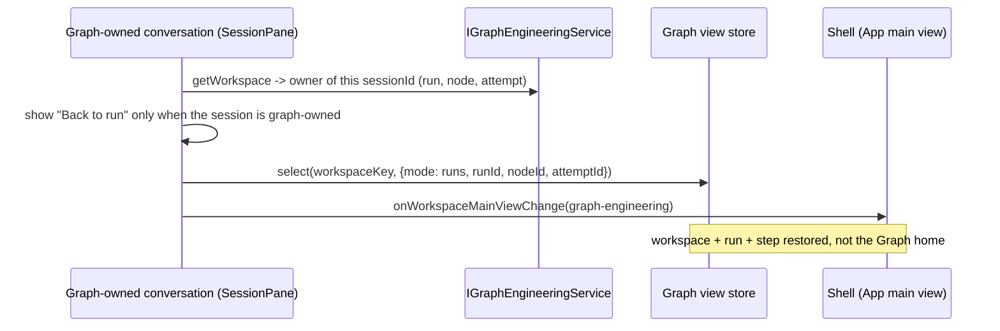

# Implementation specification (approved direction)

Status: **approved 2026-09-30, implemented in this working tree (see section 8 for recorded deviations).** This document is the spec required by `AGENTS.md` before behaviour changes. It supersedes the "renderer projections only / no service writes" rule in the earlier plan. The prototype is a reference for interaction, not for content: see "What must not be copied".

## 1. Contract

Reuse the existing authoritative service operations (`IGraphEngineeringService`, `IGraphWorkflowService`, the native session/permission owners). Do **not** add a second owner, workflow schema, persistence mechanism or execution engine. Renderer state is limited to navigation, unsent drafts and read projections.

Unchanged: Graph Host owns admission, attempts, immutable artifacts, evidence validation and the approval request. Native sessions own tools, permissions and terminal facts. Strict reviewer output, evidence-reference binding, source freshness, pinned template versions, historical definitions, approval semantics, conservative recovery, workspace ownership/admission restrictions and per-run acknowledgment.

Not in scope: permission-policy changes, Chat composer "Run as a workflow…", reviewer retry, relaxed validation, new dependencies, app-wide redesign.

## 2. Destinations and navigation

| Destination   | Internal mode | Contents                                                                                                                                                                                                     |
| ------------- | ------------- | ------------------------------------------------------------------------------------------------------------------------------------------------------------------------------------------------------------ |
| **Runs**      | `runs`        | Left: **New run** (prominent), _Needs you_, _Running_, _Recent_ (paged, 25). Right: the new-run form, the inline Review step, or the selected run.                                                           |
| **Workflows** | `design`      | The existing design surface (Guided/Advanced, canvas, bindings, conditions, repair policy, saved positions), the Workflow library dialog (choose, versions, transfer), "New request" for the current design. |
| **Checks**    | `setup`       | Saved-check list plus **one** selected editor; scan and .NET preset under _Add_.                                                                                                                             |

The former `workflows` mode is retired. Its content becomes the **new-run pane** of Runs: `select(workspace, { mode: "runs", pane: "new" })`. A persisted `mode: "workflows"` is read as `runs` + `pane: "new"`. Test ids of the three destination buttons stay `graph-view-runs`, `graph-view-design`, `graph-view-setup` (labels change); `graph-view-workflows` is removed and the drivers that used it click `graph-view-runs` then `graph-new-run`. The default destination for a workspace with no stored selection is **Runs / new-run** (not Design).

Vocabulary: _Task_ = the request; _Run_ = one execution; _Permission_ ≠ _Approval_. The destination is not called Tasks because the app sidebar uses "task" for Chat sessions.

### Workflows layout (concrete)

```
┌ Workflows ──────────────────────────────────────────────────────────────────┐
│ <workflow name> · Saved|Unsaved|Conflict   [Workflow library] [Save graph]  │
│                                            [Review and run]                 │
│ Guided | Advanced   ·  Add: Condition · Tool · Agent Task · Human Approval  │
│ Workspace defaults ▸   Bounded repair policy ▸   New request ▸  (one level) │
│ ┌ canvas (positions untouched) ──────────────┐ ┌ inspector: Task | Inputs |  │
│ │                                            │ │ Output | Advanced          │
│ └────────────────────────────────────────────┘ └────────────────────────────┘
│ step list (keyboard)                                                         │
└─────────────────────────────────────────────────────────────────────────────┘
```

Changes to this surface are limited to: the destination label, "Review and run" replacing "Save and run" (it opens the inline Review in **Runs**), `aria-current` on navigation, and the header cleanup (experimental toggle moved out of the primary header row). Guided/Advanced, bindings, conditions, repair policy, versions, transfer and saved node positions are not modified. "Workflow library" remains the entry to versions and transfer.

### Runs layout (concrete)

- **Activity list** (`graph-run-history` kept): rows are keyboard-activatable, show the request as primary text and status + time as secondary text, keep `data-testid="graph-run"` and its data attributes, keep 25-per-page pagination and the range/selected-page controls.
- **Needs you** is derived from the complete `view.runs` (the Host projection), never from the visible page. The strip appears on every destination while any run has a pending permission/question wait or a decidable gate, and links to the run and step. A test asserts a pending run on page 2 is still surfaced. It does not claim a global queue beyond `view.runs`.
- **Run view**: header (request, status, Run again, Cancel), the three facts (Execution, Checks, Your decision), one **result block**, then the **step trail** and the step inspector. **View run graph** toggles the existing read-only canvas of the frozen run definition.
- **Step trail** is derived from facts, not a fixed sequence: for a version-5 routed run it lists the current iteration's visited nodes in visit order, marks repair iterations, and shows the routing cursor as "Next"; for a sequential run it lists the planned path. Branch exits and repair loops are visible in the read-only graph.
- Concurrency: the existing owner blocks admission while a run is unresolved (`activeRun`). The new-run form and _Review and run_ stay disabled with the existing reason and a **View run** action; grouping never implies parallel runs.

## 3. State derivations (from facts, not from one label)

### Gate / human-decision state

Per gate node `G` with attempt `a`, request `q`, decision `d` and run `R`:

| State                   | Derived when                                                                                                                                                                      |
| ----------------------- | --------------------------------------------------------------------------------------------------------------------------------------------------------------------------------- |
| `approved` / `rejected` | Existing rule: request complete and matching, decision matches request id/version/digest, no issues.                                                                              |
| `pending`               | `a.status = WaitingForApproval`, request complete and matching, no issues.                                                                                                        |
| `not-reached`           | No request exists and `R` is still active (unresolved and not `Unknown`/`Interrupted`).                                                                                           |
| `not-requested`         | No request exists and `R` reached a settled outcome without dispatching the gate (`Failed`, `NeedsHuman`, `Cancelled`, `Rejected`, `BudgetExhausted`, `NoProgress`, `Completed`). |
| `unknown`               | Any request/decision issue (`mismatched-*`, `incomplete-*`, `stale-*`), or `R` is `Unknown`/`Interrupted`/`StaleEvidence`. Issue codes remain visible.                            |

Aggregate: `rejected` > `approved` (all approved) > `pending` > `unknown` > `not-requested` > `not-reached`; no gates → `not-required`.

### Result block (one per run)

Chosen from persisted facts, in this order: pending gate → waiting on native permission/question → reviewer output invalid → failed Test → invalid evidence → stopped for another reason → confirmation of a finished run. Contents: headline naming the failed object, a cause taken from the persisted diagnostic (not paraphrased into a new claim), _Still true_ built only from captured facts (checks with accepted results, captured file changes, gate state), and named actions. Valid reviewer `needs_changes`/`needs_human` are **not** failures: they show the reviewer decision beside the pending gate. Invalid machine-check evidence is never labelled as reviewer output and vice versa.

### Permission information (read-only)

1. If the native owner exposes the pending request for the session, show its actual tool/target/input, labelled _Pending request_.
2. Otherwise show the configured executable/arguments of the Graph-known check, labelled **Configured command (not the exact permission request)**.
3. Graph never sends, defaults or suppresses a permission response. The only action is opening the existing conversation.

## 4. Event order

### Review and run

```mermaid
sequenceDiagram
  participant U as User
  participant F as New-run form (renderer draft)
  participant W as IGraphWorkflowService
  participant G as IGraphEngineeringService
  U->>F: Review and run (button disabled while any call is in flight)
  alt form fingerprint == design.template AND design saved AND no unsaved edits
    F->>F: reuse current saved design (no instantiate)
  else
    opt unsaved design draft
      F->>U: Save and replace / Discard and replace / Cancel (existing dialog)
    end
    F->>W: instantiate(id, version, expectedRevision, parameters, bindings)
    W-->>F: saved definition (new revision)
  end
  F->>G: prepare confirmation (existing save + workflow preflight)
  G-->>F: snapshot + provenance digest
  F->>U: inline Review (nothing executes)
  U->>F: tick acknowledgment, Start
  F->>G: run(confirmed, preflight{digest, acknowledgedUnknowns})
  Note over G: lost reply retains the exact submission (existing); retry sends the same request id
```

An intentional new run is a new Review and Start after a fresh preparation; retrying a lost reply is the retained-submission path already in `useGraphEngineering`. Render, remount and repeated clicks do not instantiate again: the fingerprint is `template id + version + digest + parameters + bindings`, compared with the current saved design, and the button is disabled during flight. If the existing APIs cannot make an implicit instantiate safe in a case found during implementation, the explicit _Save as workflow_ step stays and the gap is reported.

### Back to run



The link carries `workspacePath`, `workspaceIdentity` and `remoteSessionId` from the session pane; it does not match by path alone.

## 5. Approved copy rules

Do not copy synthetic claims: eight unknowns, exactly three permission prompts, inherited AGENTS.md, "unchanged since last run", passing checks or a passing reviewer. Production uses the captured/available facts: the real preflight `unknowns` list, the real command recipes, the real references. "Since your last run" is omitted unless a comparison of two real preflight digests is available and explained.

## 6. Accessibility guidance

WCAG 2.2 AA is design guidance where practical, not a release gate. Concretely: keyboard reachability and visible focus (the existing `graphFocusClass` border/fill applied to Graph and the Chat return link), `aria-current` on navigation, roving tabs for detail views, status by icon plus text, controls ≥28px, en/zh-CN without mixed language on touched screens.

## 7. Acceptance matrix

Verified in the built Desktop app with the controlled provider and existing native harness, plus focused unit tests:

- first-use and returning task entry; context selection and saved-check mapping
- preflight digest, explicit acknowledgment, sticky area visible at 1280×720
- permission waits and Back to run to the right workspace/run/step
- pass, Test failure, malformed reviewer output, unbound reference, valid `needs_changes`, valid `needs_human`
- approval bound to exact request id/version/digest with required comment
- draft preservation on navigation, cancel, workspace change and failure
- repeat request creates no run until explicit Start
- historical definitions and evidence unchanged
- pending actions discoverable across navigation and pagination
- 1280×720 and 1920×1080, Zai Dark and Light, English and Simplified Chinese

The four-interaction repeat journey is a **target** until demonstrated in the integrated app; it is not a measured usability result.

## 8. Implementation status and recorded deviations

Implemented in this working tree (see [IMPLEMENTATION_REPORT.md](IMPLEMENTATION_REPORT.md) for evidence). Where the built behaviour differs from the text above, this list is authoritative.

1. **Workflow selector first.** In the new-run form the compact workflow selector is above the request, because the request and other parameters belong to the chosen workflow. The prototype put the request first.
2. **Context.** The outer disclosure is removed and the section is headed _Context_. The per-role blocks (workspace file search, native picker, skill selection, one `Advanced` raw field) are unchanged. The chip picker from the prototype is **not** implemented; the selected context is shown (from the frozen preflight) in the review.
3. **Permission details.** Graph cannot read the pending native request without leasing the session projection, which is an ownership question. Graph therefore shows only the **configured command** of the step, labelled as configuration, and points to the conversation. No exact-request preview exists.
4. **"Since your last run" is omitted.** No real preflight-digest comparison is implemented, so the line is not shown.
5. **Review and run.** Implemented with the existing instantiate + preflight mechanisms. `saveDefinition` bumps the revision even for identical content, and the preflight preparation called it on every review. The renderer now skips that save when the draft equals the Host's current definition at the same revision. No service contract changed. **Save as workflow only** remains as a secondary action.
6. **New-run form during an active run.** While any run is unresolved the whole form is disabled with the existing reason and a _View run_ action. The draft is kept but cannot be edited until the run resolves.
7. **Workflows.** Destination label, _Review and run_ (opens the review in Runs), the experimental toggle moved from the header to a footer line. _New request_ stays in Workflows. Nothing else on that surface changed.
8. **Checks.** List plus one guided editor for the selected check; project scan and the .NET preset moved below the editor; Advanced JSON unchanged.
9. **Localisation.** Built-in workflow names, parameter and reference labels and common step names are shown in Chinese through a UI-owned id map. Other Host-authored text (node instructions, some descriptions) stays English.
10. **Focus.** `graphFocusClass` now covers the whole Graph panel (header and footer included) and the Chat return-link banner. It already existed and worked; the earlier audit claim that Graph focus was invisible was wrong.
11. **Not migrated.** Historical native drivers that use the removed `graph-view-workflows`, `graph-workflow-run` or the Design "Save and run" path were not migrated or re-run; see the report.
