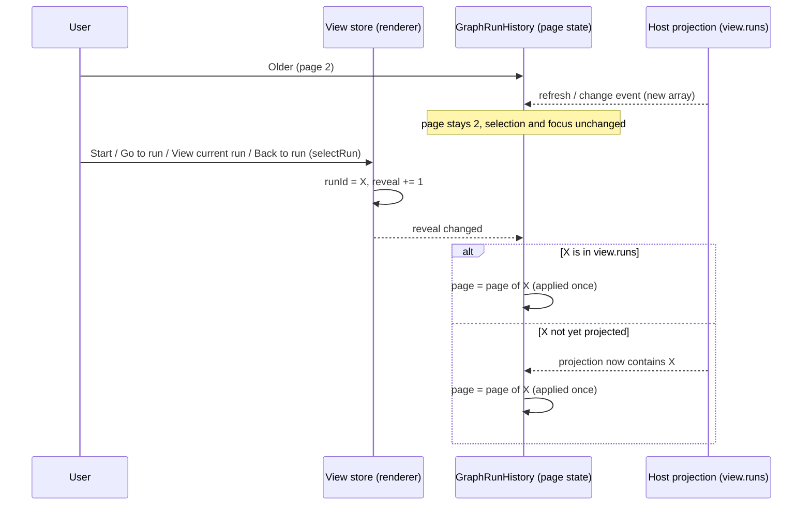

# UX-M2 specification: pick up where you left off

Status: **2026-09-30, each section written and committed before the behaviour it describes** (AGENTS.md: spec first). Plan: [UX_M2_MILESTONE.md](UX_M2_MILESTONE.md). Baseline: integration tip `3c5cff4` (merge of PR #4), branch `claude/graph-ux-m2`. Windows acceptance is not claimed by anything here.

## 1. Vocabulary

- **History**: the Runs destination's list of this workspace's runs (`GraphRunHistory`), paged 25 at a time.
- **Explicit navigation to a run**: a user action whose purpose is to open one run: a history row, **Start** (the admitted run opens), **Go to run** (Needs-you), **View current run**, **Back to run** (a Graph-owned conversation), the "open run" link beside a blocked reason, and a check run started from Checks. Every one of them goes through the view store's `selectRun`.
- **Refresh / Host event**: `useGraphEngineering.reload` after a change event, a manual refresh, or any new `view.runs` projection. None of them calls `selectRun`.

## 2. UX-M2.1: newest-first history that follows you

### 2.1 Facts from the source (not assumptions)

- The Host appends a run to its record when it admits it (`app/service.ts`: `runs: [...record.runs, run]`) and updates runs in place (`app/state.ts`: `runs.map`). It never reorders, removes or re-inserts a run. The Host's own fixtures read the newest run as `runs.at(-1)`. **The Host array is therefore in creation order, oldest first.**
- The renderer passes `view.runs` to `GraphRunHistory` unchanged; `graphHistoryPage` slices it 25 per page. The page is component state initialised once from the selected run; nothing moves it afterwards.
- `useGraphEngineering.reload` publishes a new view without setting `loading`, so the editor and the history stay mounted across refreshes; `GraphEditor` is keyed by workspace, so page state never crosses workspaces.
- The UX-M1 browser fixture Host **prepends** admitted runs (`unshift`), unlike the real Host. It is corrected to append (a fixture fidelity fix, recorded in the report).
- Graph timestamps (`createdAt`, `capturedAt`, `decidedAt`, `releasedAt`, `deadlineAt`, `acceptedAt`) are epoch milliseconds. Five sites render them with `toLocaleString()`, which follows the OS/browser locale, not the app locale; one (`GraphWorkflowProvenance`) uses `toISOString()`, which throws on an invalid value.

### 2.2 Ownership (nothing new is stored)

| State or rule                            | Single owner                                                                                                               |
| ---------------------------------------- | -------------------------------------------------------------------------------------------------------------------------- |
| The runs and their creation order        | Host projection `view.runs` (append order). Never mutated or re-sorted in place by the renderer                            |
| Display order                            | pure `graphRunsNewestFirst(runs)`: a new array, reverse append order                                                       |
| Which run is selected                    | view store selection `runId` (unchanged)                                                                                   |
| Which page is shown                      | `GraphRunHistory` component state (unchanged owner), clamped by `graphHistoryPage`                                         |
| "Reveal the selected run's page" request | view store selection `reveal`: a counter that `selectRun` increments. Renderer-local, navigation only, not a history store |
| Timestamp text                           | pure `graphTimestamp(value, locale)`; the stored number is never changed                                                   |

### 2.3 Rules

1. **Order.** History shows runs newest first by **creation order**: the reverse of the Host's append order. `updatedAt`, status changes and progress never reorder rows. The order is total and deterministic: two runs with the same `createdAt` (or a clock that went backwards) keep their append order, reversed. The projection returns a new array and never mutates `view.runs` (a frozen array must work).
2. **Needs-you is unchanged.** It is still derived from the complete `view.runs`, not from the page, and keeps its scope line.
3. **Reveal on explicit navigation.** Every `selectRun` increments `reveal`. When `reveal` changes, the history shows the page containing the selected run, including when that run was already selected and the user had browsed to another page since. If the run is not yet in `view.runs` (the reply of Start can precede the refreshed projection), the reveal stays pending and is applied when the run appears; it is applied once.
4. **Refreshes never move anything.** A new `view.runs`, a change event or a manual refresh does not change the page, the selected run or keyboard focus. A newer run arriving while an older page is shown shifts rows by one; that is accepted. Rows stay keyed by run id.
5. **Clamping.** A page number outside `[0, pages-1]` is clamped at render (existing `graphHistoryPage`); an empty history shows page 1 of 1.
6. **Wording.** The paging controls read **Newer runs** / **Older runs** (Chinese: "较新的运行" / "较早的运行") and match the order: page 1 holds the newest runs, **Newer** is disabled on page 1, **Older** on the last page. The range text is unchanged in meaning ("1–25 of 27 runs · Page 1 of 2").
7. **Timestamps.** Graph-owned timestamps are formatted with the **app locale** (`useZCodeIntl().locale`) and the viewer's time zone, as before (no `timeZone` option; the stored value is unchanged). A missing, non-numeric or invalid value renders a localized "Time not recorded" and never an invented date (not 1970, not "Invalid Date", no throw). `GraphWorkflowProvenance` keeps its exact ISO-8601 UTC text (it is a captured operational fact) and gains the same invalid-value handling.
8. **Keyboard.** Rows keep Enter/Space selection and keep focus on the row (UX-M1). A reveal never moves focus; the focus request of **View current run** / **Go to run** is unchanged.

### 2.4 Event order

### 2.5 Acceptance and how each is verified

1. Order is reverse append order; ties and out-of-order `createdAt` keep append order; the input (frozen) is not mutated. **Unit** (`graphRunsNewestFirst`, `graphHistoryPage`).
2. Page 1 shows the newest runs; Newer/Older wording and disabled states match. **Browser** (27-run fixture) and **unit** (locale keys).
3. Start with more than 25 runs while browsing an older page: the admitted run is on page 1, selected and visible. **Browser**, fixture Host appending like the real Host.
4. Go to run and View current run reveal the page, including an already selected run after browsing away. **Browser**.
5. A refresh and a Host change event while on an older page: page, selection and focused row unchanged. **Browser** (focus asserted by test id and `document.activeElement`).
6. Needs-you still reaches a waiting run that the shown page does not list (the user browsed to an older page), and Go to run reveals it. **Browser** (the UX-M1 scenario, re-arranged to keep its semantic assertion).
7. Timestamps: English and Chinese render differently for the same value, invalid values render "Time not recorded", the stored value is untouched. **Unit** and **Browser**.
8. Mutation checks: reversing order removed; reveal not applied; reveal applied on refresh.

The historical driver `pre-z8-u4-history.mjs` (500 synthetic rows, keyboard paging) is updated to the new order with the same assertions (bounded rendering, keyboard paging to the end, "Show selected run", Tab+Enter selects the neighbouring row). The native `ux-m1-native-runs.mjs` step E3 is updated the same way as the browser scenario; it runs only on Windows and stays pending until executed there.
