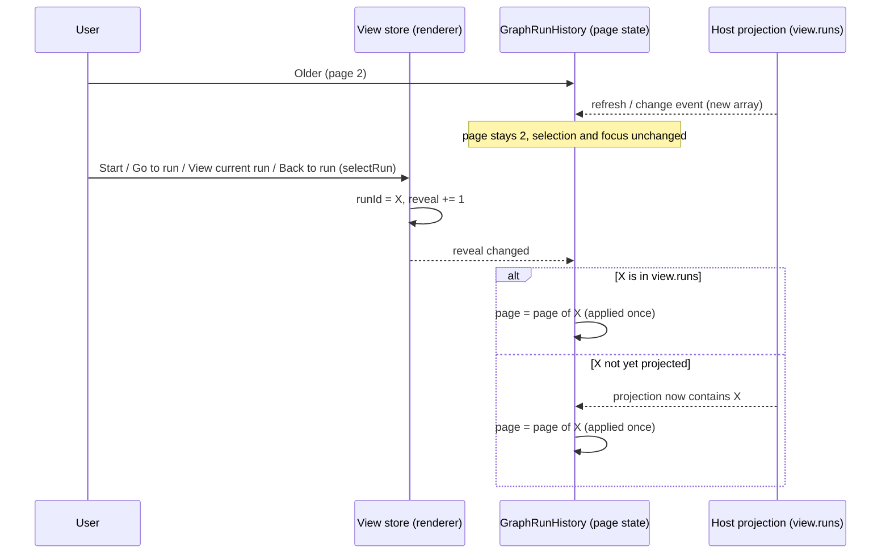
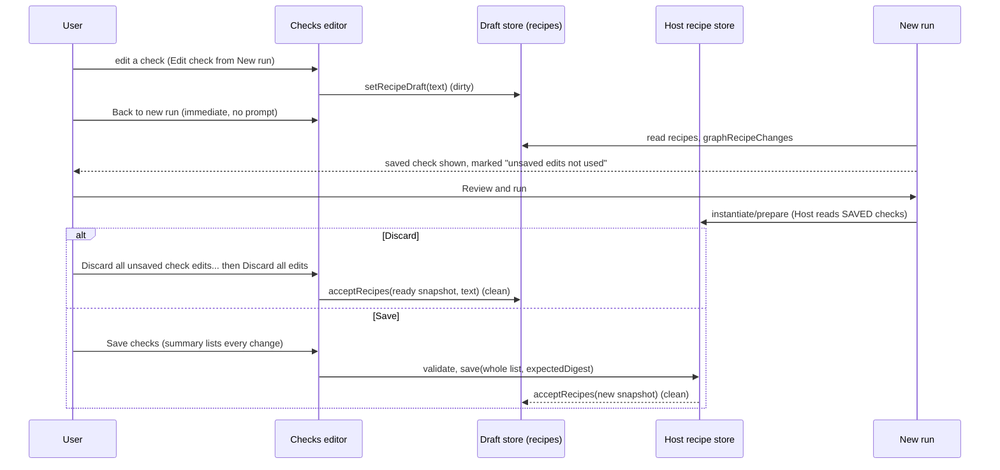

# UX-M2 specification: pick up where you left off

Status: **2026-09-30, each section written and committed before the behaviour it describes** (AGENTS.md: spec first). Plan: [UX_M2_MILESTONE.md](UX_M2_MILESTONE.md). Baseline: integration tip `3c5cff4` (merge of PR #4), branch `claude/graph-ux-m2`. Windows acceptance is not claimed by anything here.

## 1. Vocabulary

- **History**: the Runs destination's list of this workspace's runs (`GraphRunHistory`), paged 25 at a time.
- **Explicit navigation to a run**: a user action whose purpose is to open one run: a history row, **Start** (the admitted run opens), **Go to run** (Needs-you), **View current run**, **Back to run** (a Graph-owned conversation), the "open run" link beside a blocked reason, and a check run started from Checks. Every one of them goes through the view store's `selectRun`.
- **Refresh / Host event**: `useGraphEngineering.reload` after a change event, a manual refresh, or any new `view.runs` projection. None of them calls `selectRun`.

## 2. UX-M2.1: newest-first history that follows you

### 2.1 Facts from the source (not assumptions)

- The Host appends a run to its record when it admits it (`app/service.ts`: `runs: [...record.runs, run]`) and updates runs in place (`app/state.ts`: `runs.map`). It never reorders, removes or re-inserts a run. The Host's own fixtures read the newest run as `runs.at(-1)`. **The Host array is therefore in creation order, oldest first.**
- The renderer passes `view.runs` to `GraphRunHistory` unchanged; `graphHistoryPage` slices it 25 per page. The page is component state initialised once from the selected run; nothing moves it afterwards.
- `useGraphEngineering.reload` publishes a new view without setting `loading`, so the editor and the history stay mounted across refreshes; `GraphEditor` is keyed by workspace, so page state never crosses workspaces.
- The UX-M1 browser fixture Host **prepends** admitted runs (`unshift`), unlike the real Host. It is corrected to append (a fixture fidelity fix, recorded in the report).
- Graph timestamps (`createdAt`, `capturedAt`, `decidedAt`, `releasedAt`, `deadlineAt`, `acceptedAt`) are epoch milliseconds. Five sites render them with `toLocaleString()`, which follows the OS/browser locale, not the app locale; one (`GraphWorkflowProvenance`) uses `toISOString()`, which throws on an invalid value.

### 2.2 Ownership (nothing new is stored)

| State or rule                            | Single owner                                                                                                               |
| ---------------------------------------- | -------------------------------------------------------------------------------------------------------------------------- |
| The runs and their creation order        | Host projection `view.runs` (append order). Never mutated or re-sorted in place by the renderer                            |
| Display order                            | pure `graphRunsNewestFirst(runs)`: a new array, reverse append order                                                       |
| Which run is selected                    | view store selection `runId` (unchanged)                                                                                   |
| Which page is shown                      | `GraphRunHistory` component state (unchanged owner), clamped by `graphHistoryPage`                                         |
| "Reveal the selected run's page" request | view store selection `reveal`: a counter that `selectRun` increments. Renderer-local, navigation only, not a history store |
| Timestamp text                           | pure `graphTimestamp(value, locale)`; the stored number is never changed                                                   |

### 2.3 Rules

1. **Order.** History shows runs newest first by **creation order**: the reverse of the Host's append order. `updatedAt`, status changes and progress never reorder rows. The order is total and deterministic: two runs with the same `createdAt` (or a clock that went backwards) keep their append order, reversed. The projection returns a new array and never mutates `view.runs` (a frozen array must work).
2. **Needs-you is unchanged.** It is still derived from the complete `view.runs`, not from the page, and keeps its scope line.
3. **Reveal on explicit navigation.** Every `selectRun` increments `reveal`. When `reveal` changes, the history shows the page containing the selected run, including when that run was already selected and the user had browsed to another page since. If the run is not yet in `view.runs` (the reply of Start can precede the refreshed projection), the reveal stays pending and is applied when the run appears; it is applied once.
4. **Refreshes never move anything.** A new `view.runs`, a change event or a manual refresh does not change the page, the selected run or keyboard focus. A newer run arriving while an older page is shown shifts rows by one; that is accepted. Rows stay keyed by run id.
5. **Clamping.** A page number outside `[0, pages-1]` is clamped at render (existing `graphHistoryPage`); an empty history shows page 1 of 1.
6. **Wording.** The paging controls read **Newer runs** / **Older runs** (Chinese: "较新的运行" / "较早的运行") and match the order: page 1 holds the newest runs, **Newer** is disabled on page 1, **Older** on the last page. The range text is unchanged in meaning ("1–25 of 27 runs · Page 1 of 2").
7. **Timestamps.** Graph-owned timestamps are formatted with the **app locale** (`useZCodeIntl().locale`) and the viewer's time zone, as before (no `timeZone` option; the stored value is unchanged). A missing, non-numeric or invalid value renders a localized "Time not recorded" and never an invented date (not 1970, not "Invalid Date", no throw). `GraphWorkflowProvenance` keeps its exact ISO-8601 UTC text (it is a captured operational fact) and gains the same invalid-value handling.
8. **Keyboard.** Rows keep Enter/Space selection and keep focus on the row (UX-M1). A reveal never moves focus; the focus request of **View current run** / **Go to run** is unchanged.

### 2.4 Event order

### 2.5 Acceptance and how each is verified

1. Order is reverse append order; ties and out-of-order `createdAt` keep append order; the input (frozen) is not mutated. **Unit** (`graphRunsNewestFirst`, `graphHistoryPage`).
2. Page 1 shows the newest runs; Newer/Older wording and disabled states match. **Browser** (27-run fixture) and **unit** (locale keys).
3. Start with more than 25 runs while browsing an older page: the admitted run is on page 1, selected and visible. **Browser**, fixture Host appending like the real Host.
4. Go to run and View current run reveal the page, including an already selected run after browsing away. **Browser**.
5. A refresh and a Host change event while on an older page: page, selection and focused row unchanged. **Browser** (focus asserted by test id and `document.activeElement`).
6. Needs-you still reaches a waiting run that the shown page does not list (the user browsed to an older page), and Go to run reveals it. **Browser** (the UX-M1 scenario, re-arranged to keep its semantic assertion).
7. Timestamps: English and Chinese render differently for the same value, invalid values render "Time not recorded", the stored value is untouched. **Unit** and **Browser**.
8. Mutation checks: reversing order removed; reveal not applied; reveal applied on refresh.

The historical driver `pre-z8-u4-history.mjs` (500 synthetic rows, keyboard paging) is updated to the new order with the same assertions (bounded rendering, keyboard paging to the end, "Show selected run", Tab+Enter selects the neighbouring row). The native `ux-m1-native-runs.mjs` step E3 is updated the same way as the browser scenario; it runs only on Windows and stays pending until executed there.

## 3. UX-M2.2: explicit unsaved-check semantics

Finalized **2026-09-30**, before UX-M2.2 was implemented. Approved approach: disclosure, Discard and a Save summary; **no** blocking Save/Discard/Keep dialog on Back or on navigation to a pending run.

### 3.1 Facts from the source

- The unsaved check draft is `useGraphDraftStore().workspaces[key].recipes = { text, baseText, digest }`: `baseText` is the saved list (JSON of the snapshot at `digest`) the draft started from; `text` is the whole edited list. Dirty means `text !== baseText`. It survives navigation and is per workspace.
- **Save checks** validates `text` through the Host and then saves the **whole list** with `expectedDigest = digest`. So a save writes every retained edit, including ones made on earlier visits (Windows C9).
- A conflict is `digest !== snapshot.digest` (the saved checks changed elsewhere). The conflict block offers **Discard edits and use loaded checks** (`acceptRecipes(snapshot, text)`), and Save is blocked.
- New run reads only the Host snapshot (`recipeReadState.snapshot` when `ready`); preflight is built by the Host from the saved recipe store. Unsaved edits are never part of a review or a run. Nothing says so today.
- The dirty status is one line below the form ("Unsaved project-check edits are retained for this workspace."). No discard exists outside the conflict case. The sticky Back bar says only that choices are kept.

### 3.2 Ownership (no new store, no new write path)

| State or rule                     | Single owner                                                                                          |
| --------------------------------- | ----------------------------------------------------------------------------------------------------- |
| Unsaved check edits               | draft store `recipes` (unchanged)                                                                     |
| Saved checks                      | Host recipe store via `recipes read/save` (unchanged authority, validation, digest check)             |
| What changed, by stable id        | pure `graphRecipeChanges(recipes)` over (`baseText`, `text`); derived, never stored                   |
| Discard                           | the existing `acceptRecipes(snapshot, text)` with a **ready, non-conflicting** snapshot; nothing else |
| Discard confirmation, open/closed | component state in the Checks editor (renderer-local)                                                 |

### 3.3 Rules

1. **Back is immediate.** **Back to new run** keeps the check draft and returns at once. No dialog, no prompt, on Back, on the tabs, on Needs-you, on **Go to run**, **View current run** or **Back to run**.
2. **Changes by stable id.** `graphRecipeChanges` compares `baseText` and `text` by recipe `id`: **added** (id only in the draft), **modified** (both, content differs; key order ignored), **removed** (id only in the saved base), and **order changed** (the same ids in a different order). Names come from the draft (added, modified) or the base (removed) when they are strings; otherwise only the id is shown. A draft that is not a JSON array of objects, or has a recipe without a string id, or has duplicate ids, is **unsummarizable**: the UI says the changes cannot be listed and never presents a partial list as complete. Text that differs only in formatting is reported as "only formatting".
3. **Visible near the actions.**
   - Checks editor, list: a modified row is marked "Unsaved changes", an added row "New · not saved". Removed checks, which have no row, are in the summary.
   - Checks editor, above **Save checks**: one summary block (replacing the old one-line status): the lists above; "They are not used by the next run. Review and runs use the saved checks until you save."; and the save scope: "**Save checks** writes the whole check list, including every change listed here, also those made earlier in this workspace." **Save checks** is described by this block (`aria-describedby`).
   - Sticky Back bar: when the draft is dirty, "Unsaved check edits stay in Checks and are not used by the next run."
   - New run, Checks section: when the draft is dirty, one line: "Checks has unsaved edits. Review and the next run use the saved checks shown here." A selected check whose id is modified or removed in the draft carries a marker ("Unsaved edits in Checks are not used" / "Removed in unsaved edits; the saved check is still used"). The row keeps the **saved** name, kind and "Saved · not run"; draft values are never shown there or substituted. When the draft is unsummarizable, the line says the edits cannot be listed and no per-row marker is claimed.
4. **Save is unchanged.** Enabled state, validation, digest conflict, the admission refusal while a run is unresolved, and the post-save refresh are unchanged. An unsummarizable draft does not change whether Save is enabled; Save still validates first and refuses an invalid list.
5. **Discard names its scope and is confirmed.** **Discard all unsaved check edits…** appears beside Save when the draft is dirty and there is no conflict. It opens an inline confirmation (no modal): "Discard all unsaved edits to the check list? Every check returns to the saved checks, not only the one that is open." with the same change summary, **Discard all edits** and **Keep editing**. Only **Discard all edits** changes anything: `acceptRecipes(snapshot, text)` with the current, ready snapshot. **Keep editing** changes nothing. Discard is available while a run is unresolved (it only touches the renderer draft).
6. **Stale or missing saved checks.** Discard is disabled, with its reason, unless the saved checks are loaded (`ready`); it never resets to an older `baseText` as if it were current. When the saved checks are not currently loaded, the summary says it compares with the saved checks loaded earlier. In a conflict the existing conflict block and its **Discard edits and use loaded checks** stay the only discard path (unchanged), and the summary says it compares with the version the draft started from.
7. **Open check after discard.** If the open check's index no longer exists after a discard, the editor opens the first check.

### 3.4 Event order

### 3.5 Acceptance and how each is verified

1. `graphRecipeChanges`: added/modified/removed/order, key order ignored, names, formatting only, invalid JSON, missing and duplicate ids. **Unit**.
2. Edit check -> change -> Back: Back is immediate; the New-run row keeps the saved name and is marked; the pane line is shown; Review's preflight lists the saved check (Host payload and review text), not the edit. **Browser** with the real recipe store.
3. Save summary: after edits on two separate visits (one check changed, one added, one removed), the summary lists all of them by id and name; Save writes exactly that list (real `.zcode/config.json`). **Browser**.
4. Discard: cancel changes nothing; confirm restores the saved list; the label and confirmation name the whole list. Disabled while the saved checks are not loaded. Conflict keeps its own flow. **Browser**.
5. Unsummarizable raw JSON: the summary says so, Save is not newly enabled and still refuses. **Browser** and **unit**.
6. Save refused while a run is unresolved; Discard and editing still work. **Browser**.
7. Localization of every new message in English and Chinese; check names and ids stay verbatim. **Unit** (keys) and **Browser** (zh).
8. Mutation checks: summary drops removed checks; New-run marker missing; Discard without confirmation; Discard enabled without a ready snapshot.

## 4. UX-M2.3: error framing on this journey

Finalized **2026-09-30**, before UX-M2.3 was implemented. Scope: Context selection, Checks read/save, and the New-run action bar (with the inline review's commit bar, which is the same admission path). Nothing else.

### 4.1 Inventory (from the source, before any change)

| Surface                                    | Today                                                                                                                                                | Gap                                                                                                                                                                      |
| ------------------------------------------ | ---------------------------------------------------------------------------------------------------------------------------------------------------- | ------------------------------------------------------------------------------------------------------------------------------------------------------------------------ |
| Picker, search result fails the Host check | "Could not use {value}. The previous selection was kept." + Host diagnostic                                                                          | the sentence claims a previous selection even when the slot was empty                                                                                                    |
| Picker, native chooser path fails          | only the Host diagnostic (for example "Unsafe workspace-relative path segment."): the attempted value is set to `""`, so the framing line is skipped | no UI explanation, no file named (Windows observation 4)                                                                                                                 |
| Picker, native chooser cancelled           | nothing new; but an earlier failure for the slot stays on screen, now without its framing line                                                       | a cancel reads like a failure                                                                                                                                            |
| Picker, native chooser throws              | `void chooseNative()` rejects unhandled; nothing is shown                                                                                            | a failure with no message                                                                                                                                                |
| Checks read fails                          | `GraphRecipeReadStatus`: "Project checks could not be read. Retry the read to use current configuration." + diagnostic + Retry                       | already framed; unchanged                                                                                                                                                |
| Checks save fails                          | the raw message near Save, **and** the same message again in the editor's generic alert                                                              | no explanation of what is still true; shown twice on one screen                                                                                                          |
| New-run action bar / review commit bar     | the raw message of any action error except a checks save (M1 section 9)                                                                              | no explanation; errors of unrelated operations (cancel, a decision, a design save) can still appear there, although M1 section 9 limits these bars to the admission path |

### 4.2 Ownership

| State or rule                                  | Single owner                                                                                                                                                     |
| ---------------------------------------------- | ---------------------------------------------------------------------------------------------------------------------------------------------------------------- |
| The action error and which operation raised it | `useGraphEngineering` (unchanged single action error). Its `errorSource` gains `review` (preflight), `start` (Start) and `design` (design save) besides `checks` |
| Instantiate errors                             | `useGraphWorkflow` (unchanged)                                                                                                                                   |
| A picker attempt and its outcome               | `GraphContextPicker` component state; the chosen path is reported by `useGraphReferencePicker.selectNative(onPicked)`                                            |
| Framing text                                   | UI locale tables (`graph.m2.*`). Host diagnostics are shown verbatim beneath it, never rewritten or translated                                                   |

### 4.3 Rules

1. **Framing above, diagnostic verbatim below.** Every error on these surfaces shows one UI-owned sentence (what did not happen and what is still true) and, beneath it, the authoritative message byte for byte.
2. **Picker.**
   - A failed check of a chosen file: "Could not use {file}." followed by "The previous selection {previous} was kept." only when the slot held a value, otherwise "Nothing is selected for this slot." `{file}` is the value the user chose: the search result, or the file name of the path the native chooser returned (the full returned path is in the element's title). It is never empty and never invented.
   - A cancelled chooser shows nothing and clears an earlier failure message for that slot; it is not a failure.
   - A chooser that throws: "The file chooser did not return a file." with the same previous/nothing sentence and the diagnostic.
3. **Checks save.** Near **Save checks**: "The saved checks were not changed. Your unsaved edits are kept." + the Host or validation message. The editor's generic alert does not repeat a `checks` error on the Checks destination.
4. **New-run action bar and review commit bar show only admission-path errors**: instantiate (`useGraphWorkflow`), `review` and `start`. Framing: for instantiate and `review`, "Review could not be prepared. Nothing was started; your request, context and check choices are kept."; for `start`, "Start did not complete. Check the run list to see whether a run was admitted before you start again." (a lost response can have admitted a run, so nothing here claims it did not). The UX-M1 Windows fix stays: a `checks` error never appears beside **Review and run**.
5. **Elsewhere unchanged.** The generic alert keeps showing other operations' errors on their own destinations, and stays suppressed in the New-run pane and the inline review (UX-M1). The check-run calibration review (`GraphChecksSetup`) is outside this journey and unchanged.
6. **Localization.** New framing exists in English and Simplified Chinese. File names, paths, check names, ids and diagnostics are not translated.

### 4.4 Acceptance and how each is verified

1. Picker: failed search selection with and without a previous value; chooser path failure names the file and frames it; chooser cancel shows nothing and clears an earlier failure; chooser throw is framed; the binding never changes; the diagnostic is byte-identical. **Browser** (Context-picker harness and the UX-M2 suite).
2. Checks save failure (injected, and a real digest conflict): framed once near Save, not repeated by the generic alert, diagnostic verbatim. **Browser**.
3. New-run bar: a preflight failure is framed; a checks-save error and an unrelated operation's error are not shown beside Review (M1 regression kept). The review bar frames a Start failure without claiming nothing started. **Browser**.
4. English and Chinese framing. **Unit** (keys) and **Browser**.
5. Mutation checks: "previous selection" shown without one; cancel treated as failure; chooser path unnamed; checks error shown beside Review; duplicate checks alert.

## 5. As built: deviations and open items (2026-09-30)

Where the implementation differs from, or adds to, sections 2 to 4. Nothing above was rewritten.

1. **Notice styling (adds to 3.3 rule 3).** Screenshot inspection showed the first build rendering the new notices (unsaved-edit line, row markers, Back-bar note, unsummarizable message) as warning-orange text, which DESIGN.md rules out because the warning colour does not reach 4.5:1 as text in Zai Light. They now use `GraphWarningNote`: foreground text with a warning-tinted icon.
2. **"Save checks" label.** The summary names **Save checks**, the user guide already called it that, and PRODUCT.md's vocabulary is _Check_, but the button read "Save recipes" (zh "保存配方"). The UI-owned label is now "Save checks" / "保存检查". Test ids are unchanged. The historical manual launchers (`z4/z5/z6-launch-manual.mjs`) still say "Save recipes"; they describe older UI throughout and were not edited.
3. **Discard focus.** The confirmation puts focus on **Keep editing** (the safe choice); **Keep editing** returns focus to the Discard button.
4. **Replace dialog (4.3 rule 4).** Because the New-run bar now receives only admission-path errors, a failed design save from the replace dialog ("Save and replace") would no longer have reached that dialog. The dialog receives the `design` error separately (`designError`). This path has **no browser interaction test**: the harness stubs the Workflows design panel, so a dirty design cannot be produced there. It is covered by review only.
5. **Fixture fidelity.** The UX-M1 browser fixture Host prepended admitted runs; it now appends like `app/service.ts`. The fixture native chooser can now be made to throw (`host.fail("selectFile", …)`), like the other fixture operations.
6. **Runner.** The UX-M1 runner was split so UX-M2 uses the same harness (`ux-browser-runner.mjs`); the UX-M1 command line is unchanged.
7. **Pre-existing, confirmed, fixed here.** Before the change, a failed **Save checks** was rendered twice on the Checks destination (near Save and in the generic alert), and a native-chooser error was an unhandled rejection with nothing shown. Both were reproduced with a throwaway probe before any product change.
8. **Not done, recorded.** A picker option chosen with the mouse can leave focus outside the search field, so Escape does not close the picker until the field is focused again; observed in the test harness only and not investigated (the keyboard path is unaffected). The run inspector's fixture `deadlineAt` (30 minutes in milliseconds) renders as a 1970 time, as before: it is a valid stored value, not an invented date. The check-run calibration review (`GraphChecksSetup`) still shows `graph.error` of any source; it is outside this journey.
9. **Unchanged, pre-existing.** `pnpm lint` reports 75 warnings, none in changed files. Repo-wide `pnpm fmt:check` was not run (known unrelated findings); changed files were checked.
