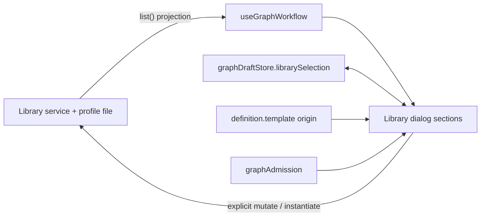
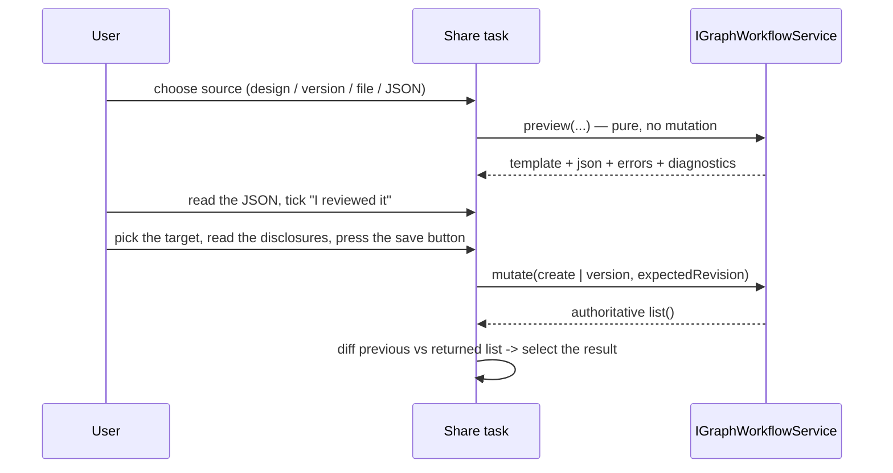

# UX-M3 specification

Contracts for [UX_M3_MILESTONE.md](UX_M3_MILESTONE.md). Each checkpoint's section is written and committed **before** its behavior. Section numbers match the checkpoints. Vocabulary follows `PRODUCT.md`: a **workflow** is a reusable, versioned definition; a **run** is one immutable execution.

## 0. Shared ownership and vocabulary

| Fact                                 | Owner                                                                                           | Renderer may                                       |
| ------------------------------------ | ----------------------------------------------------------------------------------------------- | -------------------------------------------------- |
| Library entries, versions, digests   | `IGraphWorkflowService` + the profile file `workflow-library.json` (atomic, locked, revisioned) | read a projection (`useGraphWorkflow`); never edit |
| Built-in versions                    | Repository (`builtinTemplates`), published by the service as `BUILTIN_TEMPLATE_VERSION`         | show only what `list()` returns                    |
| Which version the next instance uses | `graphDraftStore.librarySelection` (renderer, per workspace, unchanged)                         | write on explicit user selection                   |
| Origin of the current design         | `definition.template` (`id`, `name`, `version`, `digest`), a fact of the saved design           | read only                                          |
| Occupied workspace                   | `graphAdmission(view.runs)` (renderer view of the Host's one-unresolved-run rule)               | read only                                          |

Terms used in the UI. **Version N**: the library version number of one workflow (integer, immutable). **Latest**: the highest compatible non-archived version the Host currently offers, shown only when the workflow offers more than one. **Used by current design**: the design's `template` matches the row's workflow id, version **and** digest. There is no generic "Current version". The digest, library revision and raw JSON are technical identities and live under **Advanced**; the definition revision and the portable-format/graph-schema versions are not user vocabulary.

## 1. UX-M3.1 — one library surface, clear version semantics

### 1.1 Structure

One dialog, opened from **Workflow library** on Workflows (`graph-library-open`), with the sections **Workflow**, **Versions**, **Use**, **Share**, **Advanced** in that order. The nested "Manage versions and transfer" modal is removed (`graph-library-manage` no longer exists). Share and Advanced are disclosures; both are always present and reachable. In the New-run pane the same Workflow and Use content is shown inline (no dialog, no Versions/Share/Advanced), plus the version line of 1.3.

### 1.2 Workflow and Versions

- Every workflow shows **Built-in** or **Yours**. Archived workflows are marked **Archived** and cannot be used or given new versions.
- Versions are rows, one per version the Host returned: **Version N**; **Latest** on the highest compatible version when the workflow offers more than one; **Used by current design** on the row that matches the design's pin (id, version and digest); a creation date only for user-created versions with a valid `createdAt` (built-ins store 0 and show no date). Selecting a row writes `librarySelection`; every user-created version is individually selectable.
- A built-in lists only the versions `list()` returned (today exactly one). A selection that names a version the Host does not offer is **not** changed by this checkpoint; M3.3 owns that case.
- Metadata for the selected version (workflow name, description, Built-in/Yours, version, date) is visible; digest and library revision are under Advanced.
- Duplicate and Archive/Restore stay, in the Versions section. For a built-in the duplicate action reads **Duplicate to edit** and Archive is disabled with the reason "Built-in workflows cannot be archived. Duplicate to edit."

### 1.3 Use, and the version a run will instantiate

- The Use section is the existing binding form and its actions (labels: dialog action **Load into design**, formerly "Create workflow"; New run keeps **Review and run** and **Save as workflow only**).
- New run shows, above the form, `Using <workflow> · Version N` with Built-in/Yours, from the same resolution that instantiates. When the workflow offers more than one version a compact **Version** selector is shown so the choice is explicit.
- **Workflows** shows, above the library button, the origin of the current design when `definition.template` exists: `Started from <name> · Version N`. It states nothing when the design has no template. It does not claim the version is still offered (that needs the library and is shown inside the dialog).

### 1.4 Read-only during an active run

| Action                                                                                     | Occupied workspace                                                            |
| ------------------------------------------------------------------------------------------ | ----------------------------------------------------------------------------- |
| Browse workflows, select versions, read metadata and Advanced facts, Refresh               | **allowed** (`list()` is pure)                                                |
| Capture / export / import **preview** (`preview()` is pure), choose an import file to read | **allowed**                                                                   |
| Edit the Use form (as on New run)                                                          | allowed; nothing is admitted                                                  |
| Load into design (instantiate/replace), Review and run, Save as workflow only              | **blocked**, reason + **View current run** (UX-M1, unchanged)                 |
| Create workflow, save new version, duplicate, archive, import-and-save                     | **blocked**, reason                                                           |
| Export to disk                                                                             | **blocked**: the OS save dialog cannot be constrained away from the workspace |

The reason is one sentence beside the blocked group, with **View current run**, and is linked by `aria-describedby` from every disabled button. Blocked paths are refused in the handler, not only by `disabled`. Host read-only mode blocks library mutations too. A design revision conflict blocks Load into design and saving the design as a workflow, not browsing.

### 1.5 Not changed

Service, store, digests, portable schema and limits, the replace dialog, the UX-M1 admission rules, the draft store shape, and `GraphTemplateBindings`' form behavior.

### 1.6 Acceptance (Cloud)

Real `GraphWorkflowService` with an in-memory store behind the fixture Host. Browsing and previewing with a run waiting; every mutation refused (Host call log shows no `wf.mutate`, `wf.instantiate`, `graph.saveDefinition`); Built-in/Yours; version rows and labels including no date for built-ins; Used-by from actual facts; New-run version line; Workflows origin line; Advanced holds digest and revision; English/Chinese; light/dark; 1280x720 and 1920x1080; keyboard focus.

## 2. UX-M3.2 — separate versioning and share tasks

"Transfer" stops being one operation. **Share** holds three tasks and **Advanced** holds the manual JSON route. All of them reuse the existing service operations unchanged: `preview` (capture, export, import; pure), `mutate` (create, version, duplicate; library only), the portable schema, the 256 KB limit, the secret and private-path scan and the reviewed-preview gate.

### 2.1 Save current design (as a new workflow or as a new version)

- **Source** is the design shown on Workflows, including unsaved edits. If it has unsaved edits the task says so **before** any mutation, next to the target: for a new version "This version includes your current unsaved design edits.", for a new workflow "This workflow includes your current unsaved design edits." It never silently includes or omits them. The preview is built from the same design.
- **Target** is an explicit choice: "A new workflow", or "New version of X" for each of your own, non-archived workflows. The dropdown of the Workflow section is never an implicit target. Default: the workflow the design originated from (`definition.template.id`) when that workflow is yours, not archived and still offered; otherwise "A new workflow". When the design came from a built-in, the task says built-ins cannot get new versions and that saving creates your own workflow.
- **Name and description** default to what the target already has (the target's name and its latest version's description for a new version; the design's name and an empty description for a new workflow), so an untouched form neither renames the workflow nor drops its description. The service derives the workflow's name from the saved template (`entry.name = template.name`, unchanged). If the name differs from the target's current name the task states "The workflow will be renamed from X to Y." before the confirm button. No service contract change is needed; if one ever were, the milestone stops and reports.
- **Gate** is the existing one: preview, read the JSON, tick the reviewed checkbox. The confirm button (`graph-library-create` for a new workflow, `graph-library-save-version` for a version) is disabled with a reason until the gate is met, and with the occupied-workspace reason while a run owns the workspace.
- A design that is not a version-5 graph cannot be captured; the task says so instead of a bare disabled button.

### 2.2 Export selected version

Shows `Workflow X · Version N` for the version selected in Versions and exports exactly that stored version (`preview({action:"export"})`). It states that the unsaved Workflows canvas is not part of the export. Preview, JSON, reviewed checkbox, then **Export to file** (blocked while a run owns the workspace, spec 1.4). After saving it names the workflow and version that were exported. Cancelling the save dialog is neither success nor failure.

### 2.3 Import a workflow file

Three separate steps: **choose file** (bounded read, fatal UTF-8 decode, unchanged), **preview and review** (`preview({action:"import"})`, no mutation, allowed while a run is active), **save into the library** with the same explicit target choice and rename disclosure as 2.1. Nothing is saved by choosing or previewing. Where the platform cannot select a file, the task says so and points to Advanced.

### 2.4 Advanced / manual JSON

The existing paste route moves under **Advanced**: an editable JSON field, **Validate preview**, then the same review and save step as 2.3. Editing the JSON invalidates any preview and reviewed state. Library-revision conflicts show their error with Refresh beside it (1.4 of the M3.1 surface); after Refresh the reviewed preview is kept and the save is retried explicitly against the new revision.

### 2.5 Results, duplicate and built-ins

- After create / new version / duplicate the dialog selects the resulting workflow **and** version and shows "Saved: X · Version N is now selected." (`role=status`). The result is derived from the list the service returned, by comparing it with the list before the call: exactly one new workflow, or exactly one new version of one workflow; otherwise nothing is selected and the message says the library was updated. The version number is never guessed.
- For a built-in, Archive and "new version" stay unavailable with an explanation, and the duplicate action reads **Duplicate to edit** (the supported path).

### 2.6 Acceptance (Cloud)

Pure functions for targets, rename disclosure and result derivation are unit tested. Browser scenarios with the real service: default target from origin; the dropdown is not the target; dirty disclosure text for both targets; rename disclosure; description kept; new version selected from the returned list; duplicate result selected; built-in origin; export identifies workflow and version and ignores the canvas; export blocked while a run is active; import choose/preview/save as separate steps with no mutation before save; manual JSON under Advanced; reviewed gate resets on edit; library conflict then Refresh then explicit retry succeeds.

## 3. UX-M3.3 — Open in Runs and honest historical pins

### 3.1 Open in Runs

The Use section of the library dialog gets **Open in Runs**. It closes the dialog and opens Runs -> New run. The workflow and version are already the stored `librarySelection` (written by the user's selection), so the New-run pane shows exactly that `Using <workflow> · Version N`. The action never instantiates, saves, reviews, acknowledges or starts, is not a library mutation (so it stays available while a run owns the workspace), and is disabled only when the selected workflow is archived or offers no usable version. Review and Start remain the New-run pane's own explicit steps.

### 3.2 Reproduction before any fix

Source finding to confirm (not assumed): `graphRunAgainDraft(run)` seeds `librarySelection = {id, version: N}` and the form under `"<id>:N"` from the run's captured `template`. `GraphLibrary` resolves a selection with `versions.find(N) ?? latestCompatible`, and keys the visible form by the version it actually shows. For a built-in pinned at a version the Host no longer offers (built-in v1 before `ed3bd3a`), the UI would therefore show the latest version's (empty) form under the latest version's key and never display the seeded values; nothing would say so. M3.3 first adds a **characterization scenario** to the browser suite (real `GraphWorkflowService`, a fixture run record whose captured `template` pins `agent-assisted` version 1 — a run record, not a library version) that asserts what the UI does today, runs it, and is committed with its output; the fix then changes those assertions. No fix is written before this scenario exists and has been run.

### 3.3 Behavior after the fix

State owner: the unsubmitted draft (`graphDraftStore`). The seeded form now also records where it came from (`origin`): the pinned version and digest, the captured reference roles with their kinds, and the repair region id. A run's captured definition is never read again or modified.

A selection is **unavailable** when its workflow is missing from the library, or the workflow does not offer the selected version number, or it offers that number with a different digest than the one recorded in `origin`. In every such case:

- The Use form for any other version is **not** shown in its place, and the selection is **not** changed. The pane shows a notice instead: "Version N used by this run is no longer offered. Version M is available." (M = the highest compatible offered version; for a changed digest: "Version N used by this run has changed since it ran. The version offered now has a different definition.") If the workflow is gone: "The workflow used by this run is no longer in the library."
- Two explicit ways forward: **Continue with version M**, or choose another workflow/version in the pickers. Nothing else happens by itself; Review and Start stay unavailable until a form is shown.

**Continue with version M** selects `{id, M}` and seeds that version's form with the structurally compatible values of the historical form, then shows a report of what was and was not carried. Matching is by stable identity only, never by label or position:

| Historical value                       | Carried when the target template has…                                                                                            |
| -------------------------------------- | -------------------------------------------------------------------------------------------------------------------------------- |
| parameter `id` (including `request`)   | a parameter with the same `id` whose declared type equals the value's type                                                       |
| reference role `id` (path or skill id) | a role with the same `id` and the same accepted `kind` (kind from the captured template's roles)                                 |
| recipe binding for tool node `id`      | a tool node with the same `id` (and its `recipeGroups` entry); a `buildMappings` entry only if the mapped Build node also exists |
| `sourcePaths`                          | a repair region with the same region `id`                                                                                        |

Everything else is listed as not carried with its reason (not declared, type changed, kind changed, node missing). Internal node configuration is never copied. Values that are required by the target and not carried stay missing: the existing field checks keep **Review and run** disabled and name the field. Carried values are not validated as correct (saved checks and references are still checked at review). The report stays until dismissed; dismissing it changes nothing else.

### 3.4 Not done

No built-in version 1 is synthesized, no fake library entry is created, no historical pin is upgraded automatically, and the historical run and its captured evidence are untouched.

### 3.5 Acceptance (Cloud)

Open in Runs carries the selection and does nothing else (Host call log); characterization scenario before the change; after it: the notice for a missing version, for a changed digest and for a missing workflow; the selection is not changed by the notice; no form for another version; Continue carries only structurally compatible values (parameter, reference, check, source paths), lists the rest, keeps required-missing blocking Review, leaves the run record deep-equal; exact-version offers (user workflows, current built-in) behave as before; English/Chinese. Pure tests for the status and the carry-forward rules, including label-lookalikes and positional traps.

## 4. UX-M3.4 — driver restoration

Targets: `z6-native-smoke --scenario=generic`, `z6-native-library`, `pre-z8-u1-native`, `pre-z8-u5-native`. `pre-z8-u3-native` stays out of scope (its catalogue-form helpers are only touched where `pre-z8-u5-native` needs a Context-picker equivalent).

**What is migrated, and what is never changed**

| Kind of change                                                                                      | Rule                                                                                                                                                                               |
| --------------------------------------------------------------------------------------------------- | ---------------------------------------------------------------------------------------------------------------------------------------------------------------------------------- |
| Navigation and control ids (`
` management panel, unified Transfer, `graph-view-workflows`) | Migrated mechanically to the final UI through `ux-m3-native-library.mjs`; the operation each step performs is the same.                                                            |
| Built-in version in a driver that selects a NEW built-in instance                                   | Read from what the Host offers (the checked version row and the digest in Advanced) and asserted against the pinned instance. Never `1`, never `2`.                                |
| User-created workflow versions (`saved.versions[0]`, version `1`/`2`)                               | Unchanged and exact.                                                                                                                                                               |
| Assertions                                                                                          | Not weakened. Where the UI now makes a forbidden step impossible instead of disabled (for example a Save button that does not exist before a preview), the driver asserts absence. |

**Dedicated policy assertion (service level, Cloud-runnable):** every built-in offers exactly the versions `list()` returns (today one); selecting a version that is not offered (the historical built-in v1) is rejected, never served by another version; user-created versions are individually selectable and exact. It extends `reviewer-version.test.ts` to all built-ins and to user versions.

**Cloud check for the drivers themselves:** a static guard (`driver-selectors.test.mjs`) fails when a driver reaches for a test id that no longer exists in the UI. It proves the drivers no longer use removed controls; only a native run proves they pass, and that stays NOT RUN until Windows.
