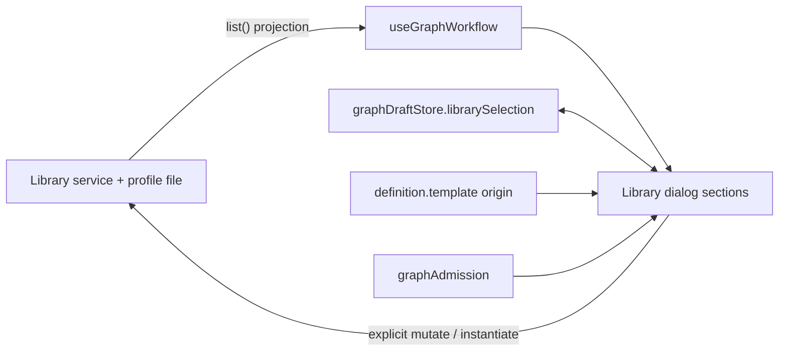

# UX-M3 specification

Contracts for [UX_M3_MILESTONE.md](UX_M3_MILESTONE.md). Each checkpoint's section is written and committed **before** its behavior. Section numbers match the checkpoints. Vocabulary follows `PRODUCT.md`: a **workflow** is a reusable, versioned definition; a **run** is one immutable execution.

## 0. Shared ownership and vocabulary

| Fact                                   | Owner                                                                                          | Renderer may                                       |
| -------------------------------------- | ---------------------------------------------------------------------------------------------- | -------------------------------------------------- |
| Library entries, versions, digests     | `IGraphWorkflowService` + the profile file `workflow-library.json` (atomic, locked, revisioned) | read a projection (`useGraphWorkflow`); never edit |
| Built-in versions                      | Repository (`builtinTemplates`), published by the service as `BUILTIN_TEMPLATE_VERSION`        | show only what `list()` returns                    |
| Which version the next instance uses   | `graphDraftStore.librarySelection` (renderer, per workspace, unchanged)                        | write on explicit user selection                   |
| Origin of the current design           | `definition.template` (`id`, `name`, `version`, `digest`), a fact of the saved design          | read only                                          |
| Occupied workspace                     | `graphAdmission(view.runs)` (renderer view of the Host's one-unresolved-run rule)              | read only                                          |

Terms used in the UI. **Version N**: the library version number of one workflow (integer, immutable). **Latest**: the highest compatible non-archived version the Host currently offers, shown only when the workflow offers more than one. **Used by current design**: the design's `template` matches the row's workflow id, version **and** digest. There is no generic "Current version". The digest, library revision and raw JSON are technical identities and live under **Advanced**; the definition revision and the portable-format/graph-schema versions are not user vocabulary.

## 1. UX-M3.1 — one library surface, clear version semantics

### 1.1 Structure

One dialog, opened from **Workflow library** on Workflows (`graph-library-open`), with the sections **Workflow**, **Versions**, **Use**, **Share**, **Advanced** in that order. The nested "Manage versions and transfer" modal is removed (`graph-library-manage` no longer exists). Share and Advanced are disclosures; both are always present and reachable. In the New-run pane the same Workflow and Use content is shown inline (no dialog, no Versions/Share/Advanced), plus the version line of 1.3.

### 1.2 Workflow and Versions

- Every workflow shows **Built-in** or **Yours**. Archived workflows are marked **Archived** and cannot be used or given new versions.
- Versions are rows, one per version the Host returned: **Version N**; **Latest** on the highest compatible version when the workflow offers more than one; **Used by current design** on the row that matches the design's pin (id, version and digest); a creation date only for user-created versions with a valid `createdAt` (built-ins store 0 and show no date). Selecting a row writes `librarySelection`; every user-created version is individually selectable.
- A built-in lists only the versions `list()` returned (today exactly one). A selection that names a version the Host does not offer is **not** changed by this checkpoint; M3.3 owns that case.
- Metadata for the selected version (workflow name, description, Built-in/Yours, version, date) is visible; digest and library revision are under Advanced.
- Duplicate and Archive/Restore stay, in the Versions section. For a built-in the duplicate action reads **Duplicate to edit** and Archive is disabled with the reason "Built-in workflows cannot be archived. Duplicate to edit."

### 1.3 Use, and the version a run will instantiate

- The Use section is the existing binding form and its actions (labels: dialog action **Load into design**, formerly "Create workflow"; New run keeps **Review and run** and **Save as workflow only**).
- New run shows, above the form, `Using <workflow> · Version N` with Built-in/Yours, from the same resolution that instantiates. When the workflow offers more than one version a compact **Version** selector is shown so the choice is explicit.
- **Workflows** shows, above the library button, the origin of the current design when `definition.template` exists: `Started from <name> · Version N`. It states nothing when the design has no template. It does not claim the version is still offered (that needs the library and is shown inside the dialog).

### 1.4 Read-only during an active run

| Action                                                                         | Occupied workspace                                                             |
| ------------------------------------------------------------------------------ | ------------------------------------------------------------------------------ |
| Browse workflows, select versions, read metadata and Advanced facts, Refresh   | **allowed** (`list()` is pure)                                                 |
| Capture / export / import **preview** (`preview()` is pure), choose an import file to read | **allowed**                                                        |
| Edit the Use form (as on New run)                                              | allowed; nothing is admitted                                                   |
| Load into design (instantiate/replace), Review and run, Save as workflow only  | **blocked**, reason + **View current run** (UX-M1, unchanged)                  |
| Create workflow, save new version, duplicate, archive, import-and-save         | **blocked**, reason                                                            |
| Export to disk                                                                 | **blocked**: the OS save dialog cannot be constrained away from the workspace |

The reason is one sentence beside the blocked group, with **View current run**, and is linked by `aria-describedby` from every disabled button. Blocked paths are refused in the handler, not only by `disabled`. Host read-only mode blocks library mutations too. A design revision conflict blocks Load into design and saving the design as a workflow, not browsing.

### 1.5 Not changed

Service, store, digests, portable schema and limits, the replace dialog, the UX-M1 admission rules, the draft store shape, and `GraphTemplateBindings`' form behavior.

### 1.6 Acceptance (Cloud)

Real `GraphWorkflowService` with an in-memory store behind the fixture Host. Browsing and previewing with a run waiting; every mutation refused (Host call log shows no `wf.mutate`, `wf.instantiate`, `graph.saveDefinition`); Built-in/Yours; version rows and labels including no date for built-ins; Used-by from actual facts; New-run version line; Workflows origin line; Advanced holds digest and revision; English/Chinese; light/dark; 1280x720 and 1920x1080; keyboard focus.
