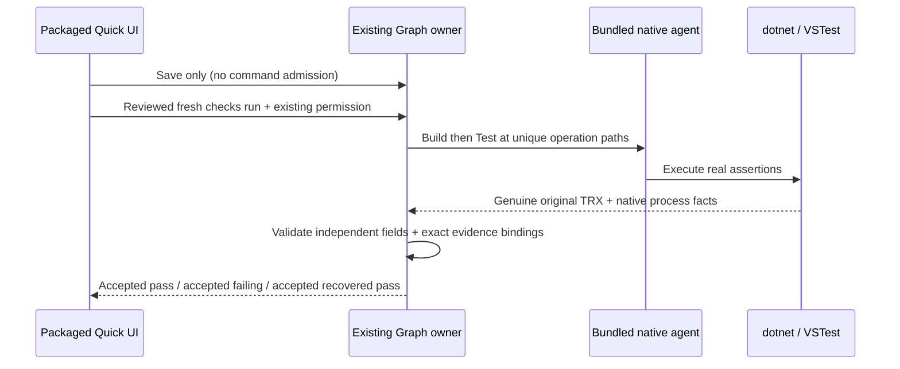

# Z8.5-B1-F1 contract: independent TRX timing and controlled .305 preparation

B1 history and .304 bytes remain immutable. This explicitly authorized follow-up continues draft PR #20.

## Parser owner and correction

The pure domain parser validates observations; existing capture and Graph Host owners validate native execution, source/Build/operation binding and immutable receipts. Duration is an independently populated elapsed value. It must satisfy unchanged trxDuration syntax/range validation but must not equal endTime minus startTime. Both timestamps remain valid, ordered and inside the unchanged report/native windows. No tolerance, timestamp synthesis, adapter upgrade or report rewriting.

Producer references verified for this supported path:

- [xUnit VS adapter 2.5.3 MakeVsTestResult](https://github.com/xunit/visualstudio.xunit/blob/2.5.3/src/xunit.runner.visualstudio/Sinks/VsExecutionSink.cs): Duration comes from ExecutionTime (zero replaced with 1 ms); timestamps are not assigned.
- [VSTest 17.11.1 TestResult constructor](https://github.com/microsoft/vstest/blob/58dbd027217ac035a4e9114c9213b11dc0e988bd/src/Microsoft.TestPlatform.ObjectModel/TestResult.cs): StartTime and EndTime default to separate UtcNow reads.
- [TRX logger Converter.ToTestResult](https://github.com/microsoft/vstest/blob/58dbd027217ac035a4e9114c9213b11dc0e988bd/src/Microsoft.TestPlatform.Extensions.TrxLogger/Utility/Converter.cs): copies StartTime, EndTime and Duration independently.

Retain dotnet-vstest-trx-v1: this corrects an over-restrictive validation bug in the existing supported format, without changing normalized fields, deterministic names or receipt structure. Existing immutable receipts remain authoritative through their original correlated artifacts; no read-path reparsing, migration or historical renormalization is added. Original .304 invalid results remain invalid.

## Regression acceptance

Add a portable, sanitized report-derived fixture to an already selected app test suite. Preserve original report/test/execution joins, counters and all timing values; replace only machine/user/absolute workspace metadata. Original TRX SHA-256 remains 535dd4c20bea3ee2b7bc09705370200c9a7e4879edb4ba7244e38eb22ccccc8b; record the distinct derived-file digest. Parse three passing observations. Negative duration syntax, negative/oversized values, invalid timestamp order, stale windows, identity/assembly/counters and all existing capture/provenance/zero/skipped/required-test tests remain. Reinstating the old equality guard must fail the positive regression, then restore the fix. Replay unchanged original bytes using actual captured scope/window locally.

## Build and scan

Separate meaningful parser and build/scanner commits. Fresh dedicated build checkout at clean committed source; pinned Node 24.14.0/pnpm 10.33.2; frozen install with --ignore-scripts, explicit Electron install, existing runtime preparation. No copied node_modules/generated native directories. A read-only preflight rejects the six exact ssh2 MSBuild metadata classes before the existing build entry packages anything; no deletion/exclusion unless clean preparation proves necessary.

The existing English/Chinese ssh.hostPlaceholder literals each contain 192.168.1.100. An exact asset-path/rule/text/count exception may classify only these two reviewed placeholders. Other addresses, extra occurrences and seeded checkout/user paths still fail. No wildcard or rule-level exception. Report raw, explained and unresolved counts independently.

## Native order and immutable history

New immutable .305 only after regressions/preflight. Q1, Q2, Q3 fail/recovery, representative U1/Chat and complete post-test hashes are required. Each source mutation gets fresh Build/Test; no prior report borrowing. Human approval remains pending. Stage only exact tested installer/checksum/draft notes if all gates pass. No tag, upload, release, merge, installer execution or .303 replacement.

Derived fixture: packages/services/src/graph-engineering/app/fixtures/b1-xunit-derived.trx, canonical UTF-8/LF SHA-256 c446411e249290c99559674701d8046c0b32ba18fff0b5d1ddba1139f1ba4e60. This is distinct from the original native report. Focused parser/capture/evidence tests: 109 passed, 2 optional manifest-dependent skips, zero failures. New portable regression: 10 passed, zero skips; reinstated old guard fails the positive case; restored fix passes. Original-byte replay with captured scope/window yields three passed observations without changing history.
