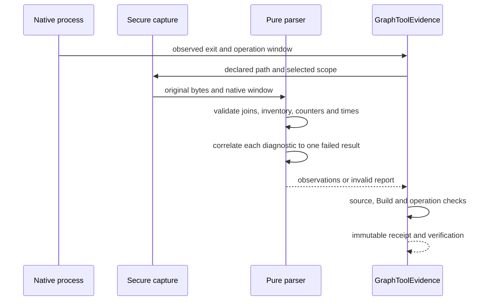

# Z8.5-B1-F2: bounded xUnit RunInfo reconciliation

Status: authorized implementation. Packaging .306 requires successful prebuild proofs.

## Product rule and authority

The pure TRX parser validates observations. GraphToolEvidence remains the sole owner of native operation, source fingerprint, Build binding, immutable normalization receipt and acceptance. No schema/history migration or UI change.

Only an exact Error RunInfo echo from the pinned xUnit assertion-failure reporter may be reconciled. First validate complete result/definition/entry joins, assembly, inventory, counters, summary, duration format/range and timestamps. A diagnostic never creates a test.

visualstudio.xunit 2.5.3 references runner-reporters 2.5.2. DefaultRunnerReporterWithTypesMessageHandler emits four spaces + Escape(DisplayName) + " [FAIL]"; LoggerHelper adds "[xUnit.net hh:mm:ss.ff] " (one space). Escape replaces CR/LF/TAB/NUL with literal backslash sequences. VsExecutionSink records the display name. VSTest 17.11.1 converts the Error message to timestamped RunInfo separately from counters.

After XML decoding, require exact full text/case, valid two-digit elapsed clock, five spaces after closing bracket, and exactly one matching escaped name across ALL validated results (including passed/skipped and escaping collisions). The result must be Failed and its joined definition must use executor://xunit/VsTestRunner2/netcoreapp. Reject duplicate echoes for a result. Validate RunInfo timestamp within report/native windows. Do not compare elapsed prefix to wall clock.

No trimming, substring/prefix matching, extra-text tolerance, exception-text/stdout/counter inference or blanket diagnostic ignoring. Other diagnostics/severities/producers, missing/unmatched/ambiguous names and mixed assertion/infrastructure errors invalidate the report. Absence of an echo remains valid. Existing zero-result Warning observations stay empty and cannot satisfy downstream acceptance.

## Producer sources

- https://github.com/xunit/visualstudio.xunit/blob/2.5.3/Versions.props
- https://github.com/xunit/xunit/blob/v2-2.5.2/src/xunit.runner.utility/Reporters/DefaultRunnerReporterWithTypesMessageHandler.cs
- https://github.com/xunit/visualstudio.xunit/blob/2.5.3/src/xunit.runner.visualstudio/Utility/LoggerHelper.cs
- https://github.com/xunit/visualstudio.xunit/blob/2.5.3/src/xunit.runner.visualstudio/Utility/VisualStudioRunnerLogger.cs
- https://github.com/xunit/visualstudio.xunit/blob/2.5.3/src/xunit.runner.visualstudio/Sinks/VsExecutionSink.cs
- https://github.com/microsoft/vstest/blob/58dbd027217ac035a4e9114c9213b11dc0e988bd/src/Microsoft.TestPlatform.Extensions.TrxLogger/TrxLogger.cs

## Owner and event order

Native process exit/window -> secure original-byte capture -> pure parser validates joins/counters/times -> exact diagnostic reconciliation -> GraphToolEvidence checks source/Build/operation -> immutable receipt and verification -> UI projection.

Valid failed assertion means observationValid=true, outcome=fail, acceptancePassed=false. Unexplained diagnostics mean invalid evidence. No additional state owner/cache/retry/execution path or remote delivery change. Cold reads consume receipts; historical rejection records remain immutable. Recovery requires new run, operations, report path and identity.

## Acceptance and sequencing

1. Metadata-sanitized derived F1 failed fixture with distinct original/derived hashes; preserve old passing fixture.
2. Parser and real capture-to-GraphToolEvidence regressions: pass, accepted failed observation, both original F1 failures unchanged with their own captured scope/window, new recovery identity.
3. Negatives: known echo plus testhost/adapter/cleanup error, unmatched/ambiguous/malformed/partial/extra/duplicate echoes, timestamp/counter/join/assembly failures. Preserve native/source/Build/zero/skipped protections. Old blanket rejection and blanket ignore mutations must fail.
4. Explicit mutually exclusive --source mode in existing isolated B1 native harness/development bootstrap; compile corrected source and prove actual native pass -> accepted failed assertion -> fresh recovery BEFORE packaging. No forged reports, receipts or process evidence.
5. Focused/integrated/build-harness tests, typecheck/lint/format/architecture/pre-push, then commit. Build .306 once from committed clean source with new controlled dependencies using existing Windows entry.
6. Detached .306 Q1/Q2/Q3/recovery, U1 view, Chat, integrity/content checks. Preserve .304/.305 history/binaries. Stage installer/checksum/notes locally only if all succeeds. No installation/merge/tag/publish/upload.

