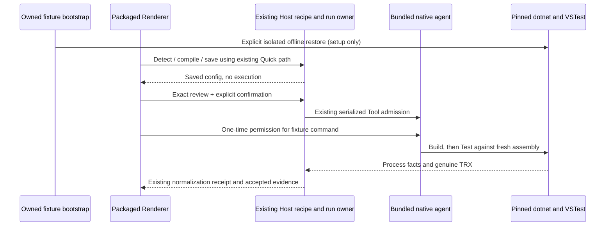

# Z8.5-B1 targeted packaged verification

Integration base: 3591c5824dbede731917869341ecdd36693e3b02.
Candidate: 3.14.3-z8.304. No product changes are authorized.

## Cases and owners

- B1-Q1: fresh synthetic profile, literal SDK solution/library/VSTest project; Detect and Save through Quick UI; no execution/model evidence; retain request/context and sole check bindings; reopen.
- B1-Q2: second fresh profile; Quick Save and run, exact command/environment review, individual native permissions; genuine Build then three real xUnit assertions; correlate original TRX, accepted normalization receipt, source/build and visible Test evidence.
- B1-Q3: change exactly one assertion; reuse saved checks through a fresh review; require genuine failed assertion and visible failing Test evidence; restore and require a fresh accepted pass.
- B1-U1: same immutable detached package; actual run graph at 1600x900 and 1093x614; Fit, Focus, selection, history and details navigation; no execution from viewing. Leave the final workflow approval pending.

Harness reuses createIsolation, configureDotnetEnvironment, native permission,
record readers and TRX observer. Profiles and raw logs remain local. Bootstrap
uses pinned public packages from cache with empty feed configuration where possible;
any explicit network restore is recorded separately. No recipe injection, product
entry replacement, verifier relaxation, model-generated test evidence or package
patching. Fixture source/global SDK declaration are literal; no directory-wide
MSBuild customizations. SDK.Web/MTP/custom projects remain out of scope.

Commit and format harness before candidate build and final runs. Preserve failed
attempts. Source/type/lint/architecture checks precede serialized packaging. Freeze
installer/package identity and verify detached-copy hashes before and after tests.
Any supported-project product defect stops release preparation. Only reviewed
synthetic receipts may enter the draft PR. No installer execution, installed-pilot
replacement, Sandbox audit, release/tag creation, upload or merge.
