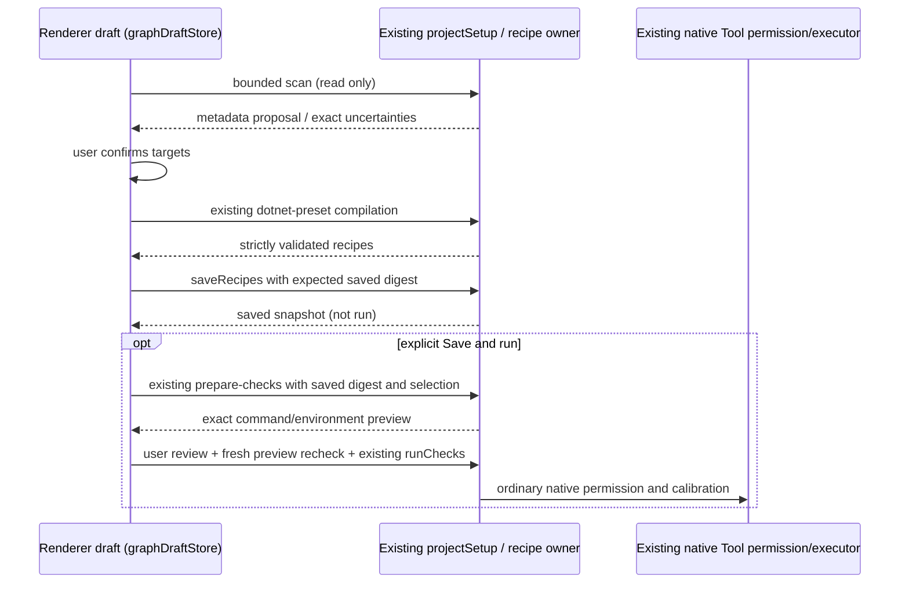

# Z8.5-U2 Quick .NET checks

Base: `dbe6c51ca0ea54f3afa92867b66a1fd2aeb6f045`.

## Implementation decision (before behavior changes)

Discovery already supplies bounded workspace-relative targets, literal frameworks,
explicit VSTest hints, project references and source inventory. The existing preset
compiler supplies exact no-restore commands, operation-owned TRX paths, conservative
minimumTests=1, strict validation and stable recipe IDs. It cannot currently infer
assembly/output paths: those facts are absent from its public discovery response.

Add optional read-only Quick metadata to the existing discovery response. Use the
existing restricted XML parser (no resolver/evaluation), accept only a narrow static
Microsoft.NET.Sdk property/item allowlist, and derive Debug framework assembly paths.
Unknown properties/items, custom output/runtime/import/conditional declarations,
directory-wide build/package metadata, incomplete scans and unsupported dependencies
refuse Quick with specific reasons. This is a proposal, never execution evidence.
No runtime/protocol, saved schema, migration or verifier changes are needed.

Validation note: reverse-dependency architecture checking includes the unchanged
sequencer, which starts at 403 physical lines against the existing 400-line cap.
Remove only its three blank method-separator lines (consistent with its adjacent
constructor/observe methods); verify the TypeScript token stream is identical.
No statement, comment, runtime behavior, policy or architecture baseline changes.

Users confirm a Build target and ordered Test scopes. One solution covering all
discovered projects is a unique aggregate Build target; otherwise show explicit
choices. A single compatible Test scope is proposed; multiple scopes require selection.
Only scopes reachable from the selected Build can be saved. Unknown/unsupported test
runners and metadata remain visible with the Advanced recovery path.

## Ownership and ordering

The recipe JSON buffer remains the sole editable saved-config representation.
Quick target choices are unsaved presentation state, not a second check format.
Generation never replaces existing checks: it appends uniquely identified checks
only after an explicit Add action when checks already exist. Viewing Quick or
Advanced does not rewrite custom/unknown fields. Advanced retains the existing
manual editor, preset, raw JSON, availability, selection and calibration controls.
Async replies are scoped to workspace, exact draft and lifecycle; edits, cancellation,
navigation or conflicts invalidate pending continuations. No timeout synchronization.
Save and run uses the same review component and execution owner as manual calibration.
Desktop/mobile delivery semantics remain untouched; remote setup remains unsupported.

New-run bindings are owned by the existing draft store. Only never-selected slots
(absent key, not an explicitly cleared key) receive a sole compatible saved recipe.
Missing/incompatible or explicitly selected IDs survive refresh unchanged. The
existing workflow Build declaration supplies an unambiguous Test relationship;
manual remapping remains available when unresolved or under details. Draft request,
references and workflow survive Checks navigation; saving never starts a workflow.

## Acceptance and validation

- Simple solution/single supported scope: scan, targets, Save or Save and run.
- Multiple Build targets and ordered scopes: explicit chooser, no heuristic guess.
- Incomplete/unknown/custom metadata: exact reason, Advanced fallback.
- Custom saved checks round-trip, cancel/back retains saved data and New-run draft.
- Save has no preview, permission, run, restore, feed or package operation.
- Save and run opens exact existing preview; confirmation still rechecks freshness.
- Sole Build/Test defaults; multiple choices stay empty; stale IDs stay unresolved.
- Zero/all-skipped/missing-required/stale/corrupt/unreceipted/unbound Test evidence
  retains all existing conservative tests and unchanged acceptance code.
- Render actual components before/after at 1366x768, 1600x900 and 1093x614 CSS
  (125% scaling representative); include ambiguity, custom Advanced and return flow.
- Focused unit/browser/service regression tests, typecheck, lint, changed-file
  formatting, architecture and verify:pre-push; draft PR and all four required CI
  jobs on final head. No merge, auto-merge, tag, installer or release.
