# U1 final operator-view cleanup: paired rendered evidence

Before UI: `65ca1b6b04d2dd1f8e98c7b4c769e1b893d50802` (the previous PR head).
After UI: the bounded cleanup accompanying this gallery. Both sides use the
same five synthetic captured run records, selected task, Steps tab and viewport.
This is a new, bounded set of **12 PNGs**; the original graph-width gallery is
unchanged. The graph width/focus work was accepted by the user and was not redesigned.

Rendered with real React components/hooks in the existing Vite/Playwright harness,
Windows Chrome 154.0.8037.95, 1600 × 1080 CSS pixels, DPR 1, browser zoom 100%,
268px synthetic application sidebar. The fixture has several runs, so the existing
workspace Needs-you banner can name another waiting run; it remains actionable.
This is synthetic rendered-component evidence, not packaged Electron execution,
company-PC validation or operator acceptance. The displayed `C:/synthetic` path
is inert fixture data. No installation or pilot rebuild was performed.

| State                                            | Before                                                            | After                                                           | Operator relevance                                                                                                                                                            |
| ------------------------------------------------ | ----------------------------------------------------------------- | --------------------------------------------------------------- | ----------------------------------------------------------------------------------------------------------------------------------------------------------------------------- |
| Ordinary running sequential run                  | 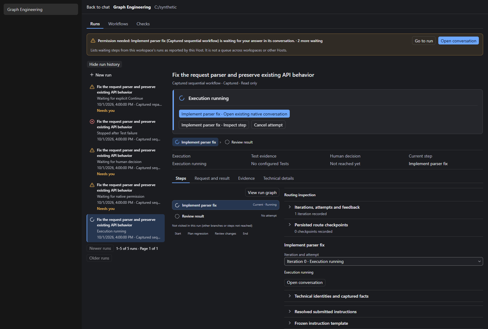       | 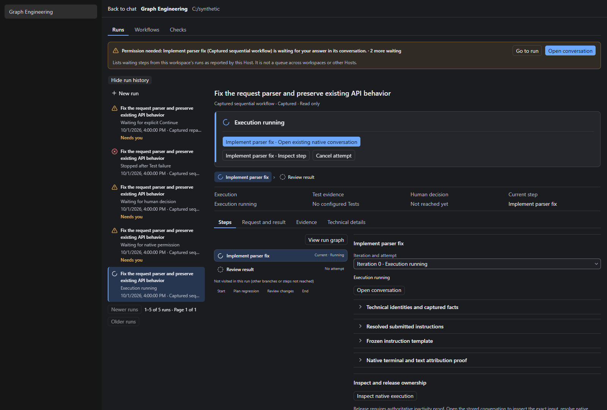       | Task, execution, current step, native conversation action and absence of configured Tests stay visible. Routine routing and empty checkpoint/artifact sections leave Steps.   |
| Native permission waiting                        | 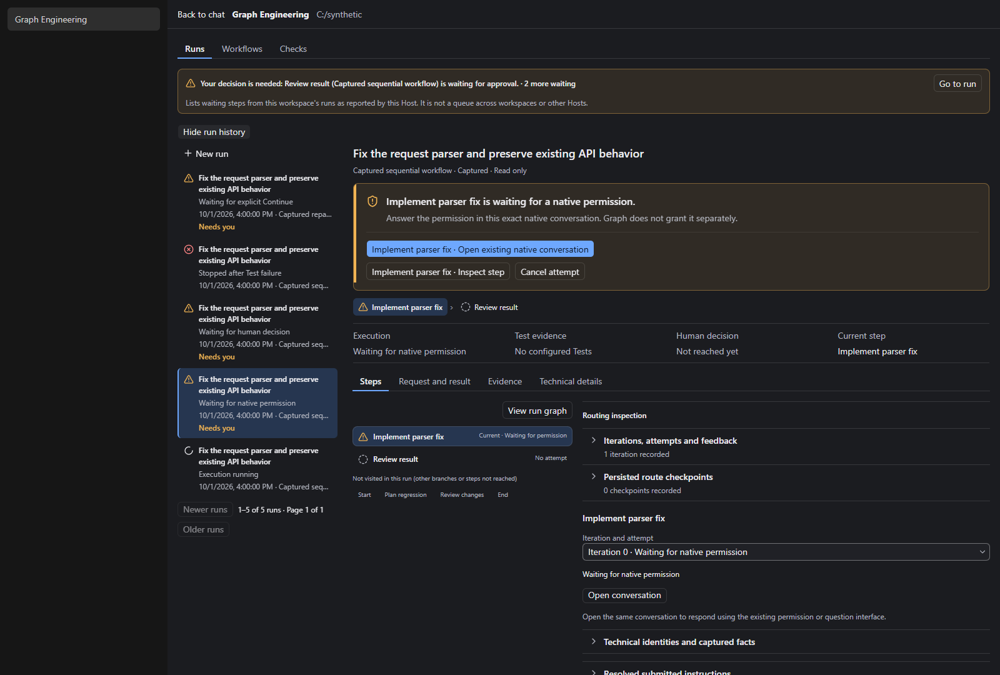 | 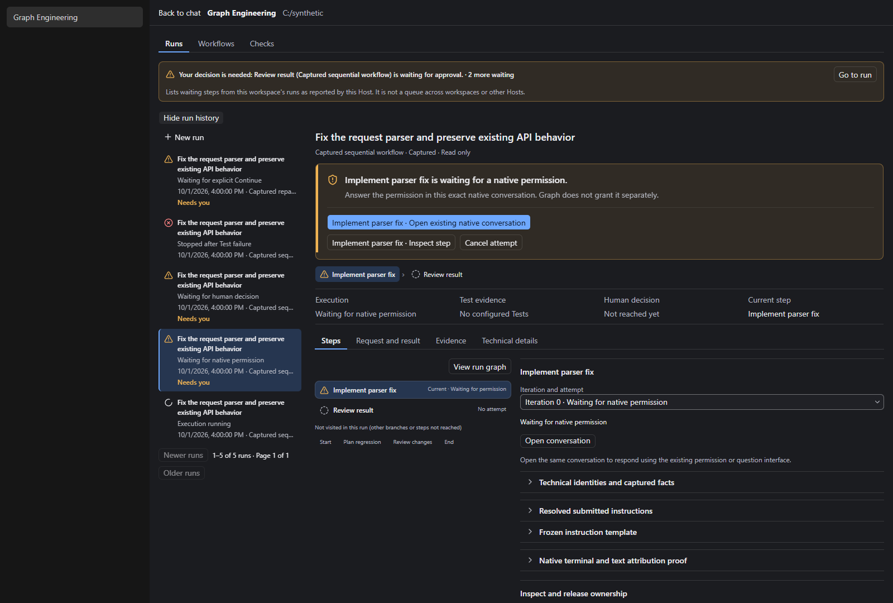 | Native permission explanation and conversation action remain explicit; no permission is granted by inspecting the run.                                                        |
| Final human approval                             | 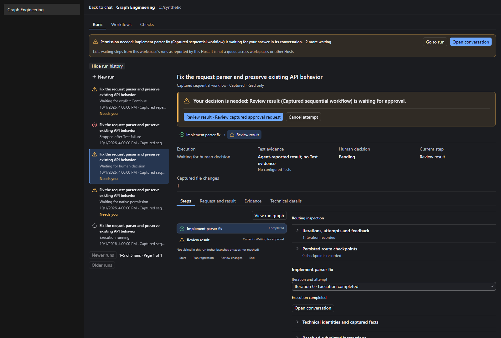     | 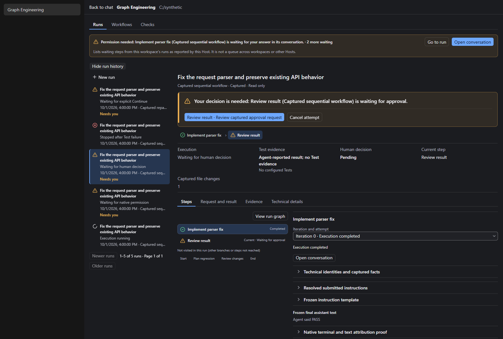     | Pending approval and Review captured approval request stay visible. Agent-reported output is still explicitly not Test evidence.                                              |
| Failed Test                                      | 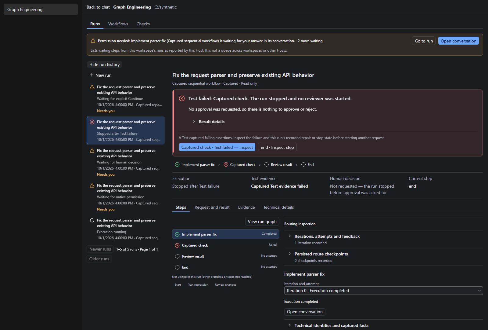    | 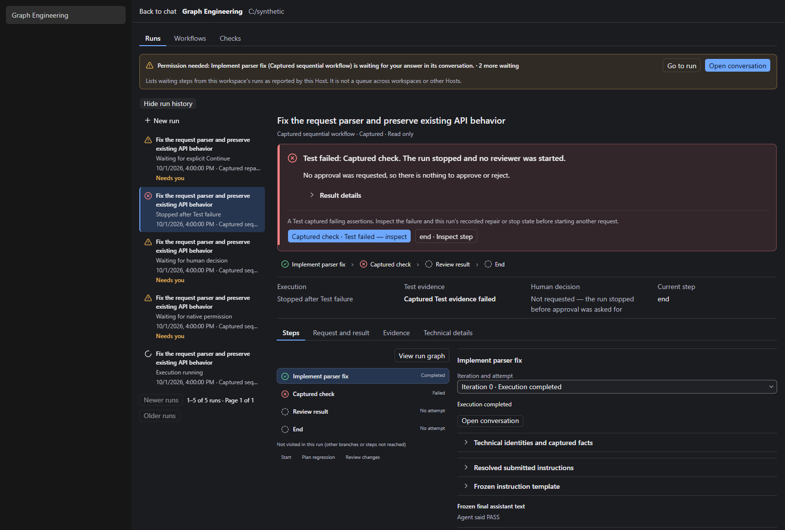    | Test failure, failure-inspection action and the fact that no reviewer/approval was reached stay prominent.                                                                    |
| Repair with two iterations and resume checkpoint | 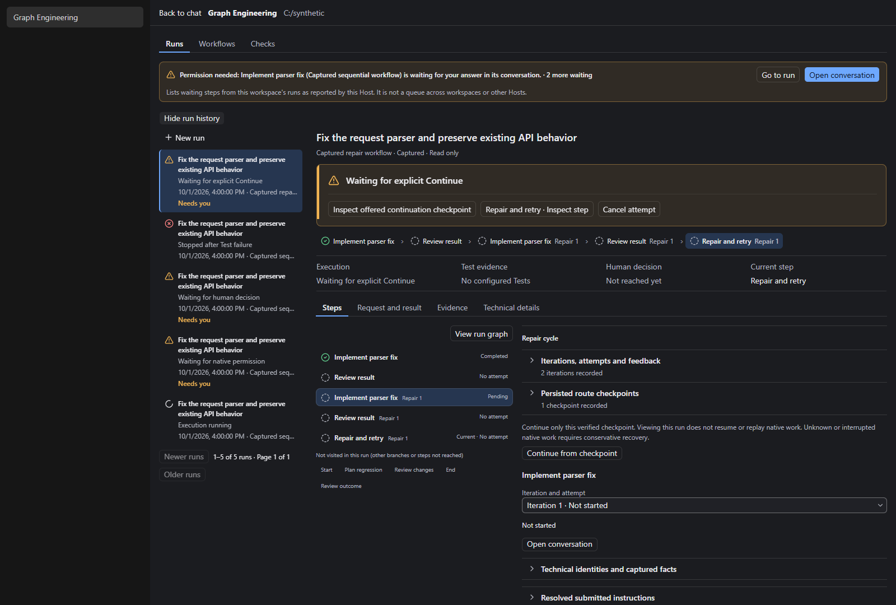            | 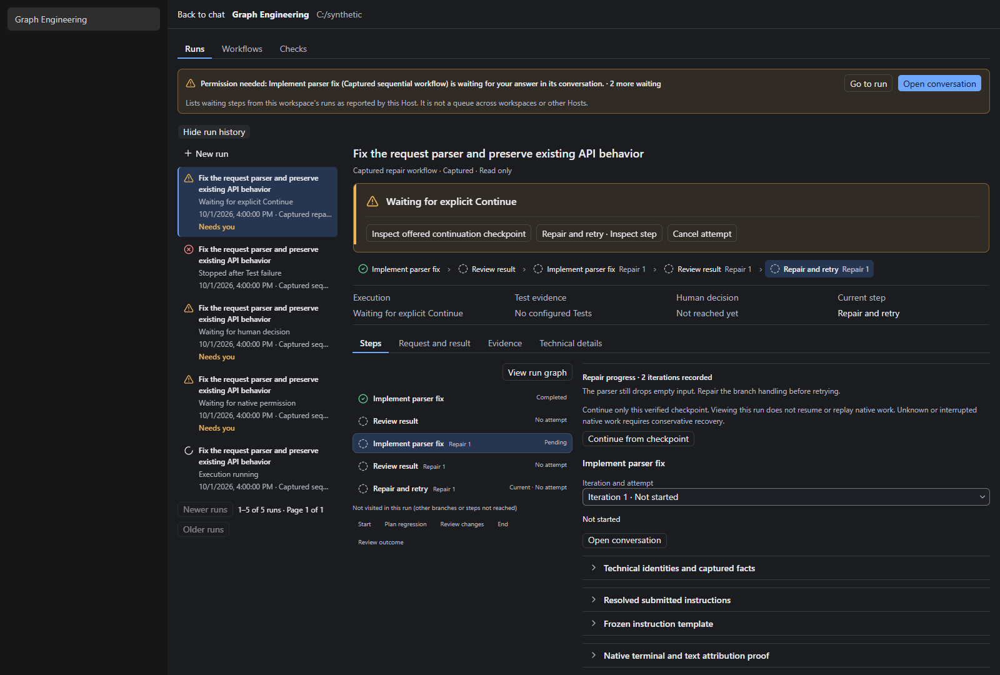            | Compact repair progress, literal feedback and enabled Continue from checkpoint replace routine record headings. Raw iteration/checkpoint records remain in Technical details. |
| Running step footer                              | 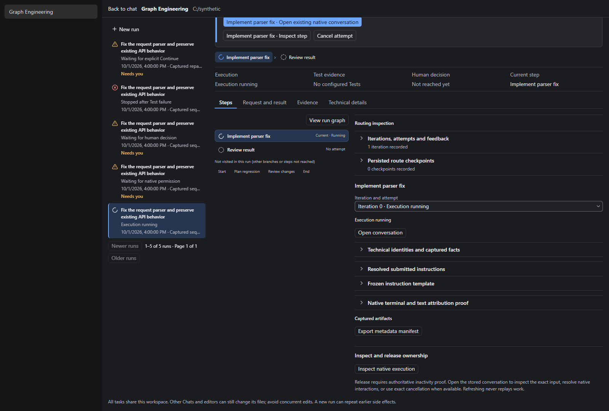     | 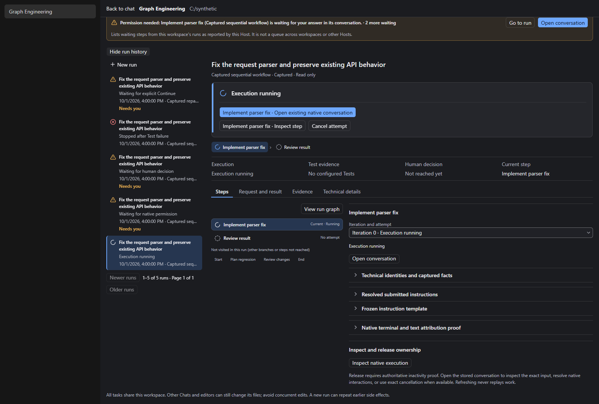     | Confirms the entire default step content omits empty Captured artifacts and Export metadata manifest, including below the initial viewport.                                   |

Each PNG has a same-name JSON recording viewport, DPR, CSS zoom, shell/sidebar,
content geometry, selected run and visible text. Word counts are not an acceptance
criterion. Inspect whether the default items answer what is happening, whether
verification passed, and which action is needed.

The rendered test additionally exercises the details paths without creating more
screenshots: keyboard-open iteration facts, exact checkpoint identity, zero empty
checkpoint sections, read-only manifest export even for zero artifacts, a collapsed
nonempty artifact count and retained content inspection, Approve/Reject availability,
stop reasons, native questions, unknown/stale execution, missing/invalid Test evidence,
malformed reviewer output and reviewer rejection. It runs in English/dark and
Chinese/light at 1600 × 1080 and 1093 × 768. The latter is a CSS viewport test,
not a Windows display-scaling claim.

See the [implementation and validation report](../../Z8_5_U1_DENSITY_REPORT.md)
and the [operator-view contract](../../Z8_5_U1_SPEC.md).
