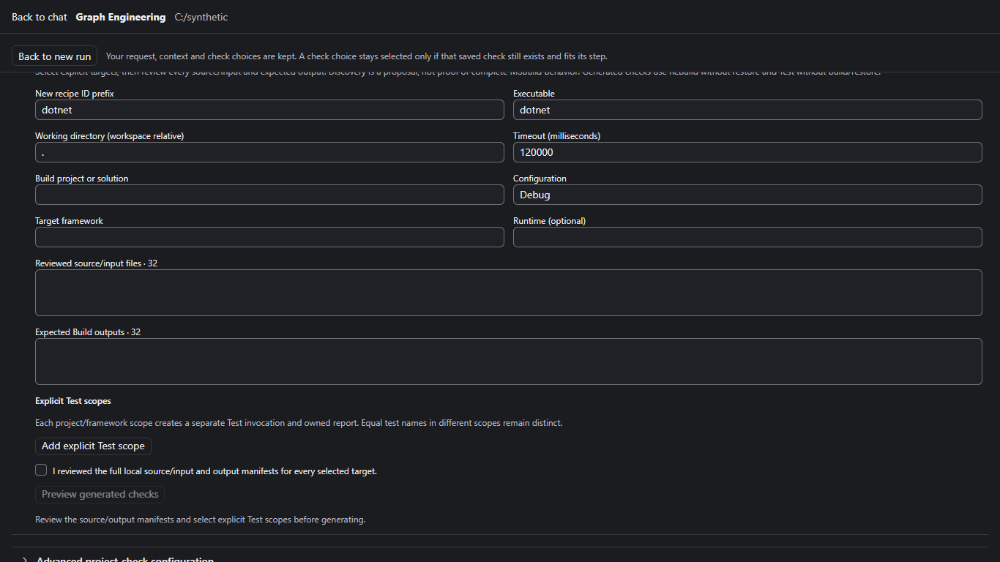
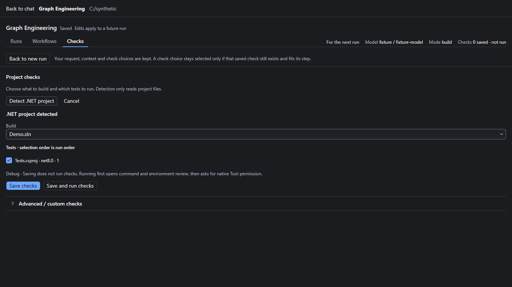
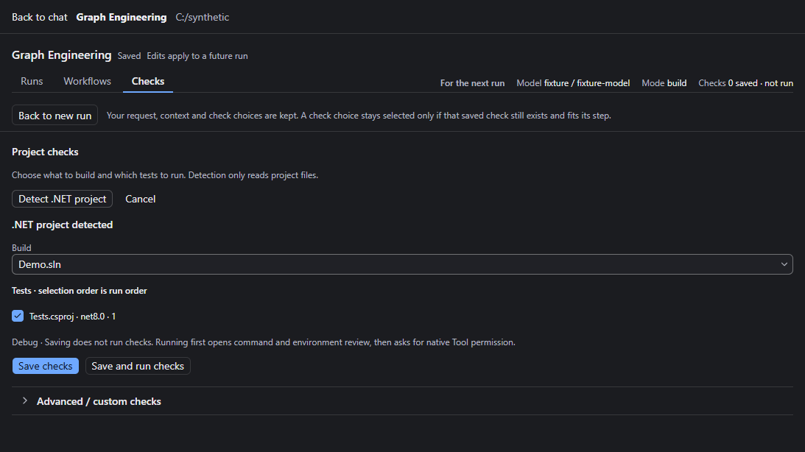
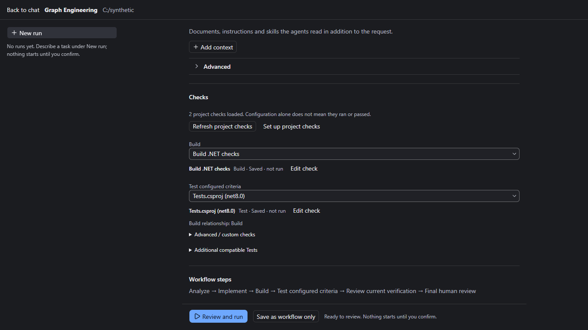

# Z8.5-U2 rendered evidence

Real component harness; real discovery/compiler/store/preview; synthetic native
environment and run admission. No screenshot is evidence that native checks passed.
Baseline UI: `dbe6c51ca0ea54f3afa92867b66a1fd2aeb6f045`.

| Surface | 1366x768 | 1600x900 | 1093x614 (125% representative) |
| --- | --- | --- | --- |
| Before: existing preset | [View](before/preset-before-1366x768.png) | [View](before/preset-before-1600x900.png) | [View](before/preset-before-1093x614.png) |
| After: Quick proposal | [View](after/quick-proposal-1366x768.png) | [View](after/quick-proposal-1600x900.png) | [View](after/quick-proposal-1093x614.png) |
| Ambiguous target chooser | [View](after/ambiguous-1366x768.png) | [View](after/ambiguous-1600x900.png) | [View](after/ambiguous-1093x614.png) |
| Custom configuration: concise default | [View](after/custom-default-1366x768.png) | [View](after/custom-default-1600x900.png) | [View](after/custom-default-1093x614.png) |
| Custom configuration: retained JSON | [View](after/custom-advanced-1366x768.png) | [View](after/custom-advanced-1600x900.png) | [View](after/custom-advanced-1093x614.png) |
| New run: no saved checks | [View](after/new-run-empty-1366x768.png) | [View](after/new-run-empty-1600x900.png) | [View](after/new-run-empty-1093x614.png) |
| New run: sole Build/Test selected | [View](after/new-run-selected-1366x768.png) | [View](after/new-run-selected-1600x900.png) | [View](after/new-run-selected-1093x614.png) |
| Existing exact calibration review | [View](after/exact-preview-1366x768.png) | [View](after/exact-preview-1600x900.png) | [View](after/exact-preview-1093x614.png) |
| Unsupported MTP / Advanced fallback | [View](after/unsupported-1366x768.png) | [View](after/unsupported-1600x900.png) | [View](after/unsupported-1093x614.png) |
| Chinese / light theme | [View](after/quick-chinese-light-1366x768.png) | [View](after/quick-chinese-light-1600x900.png) | [View](after/quick-chinese-light-1093x614.png) |

## Before

## After

## Reduced CSS viewport

## Return to New run

